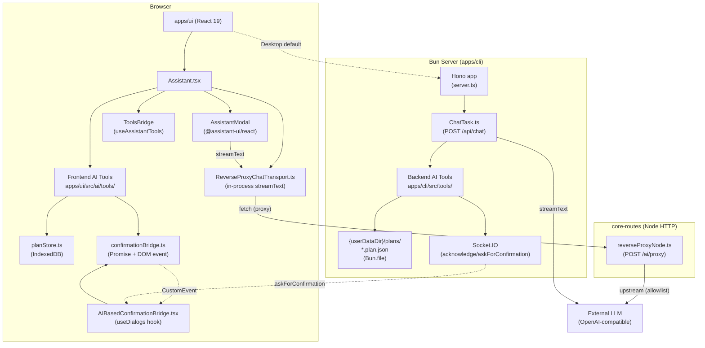
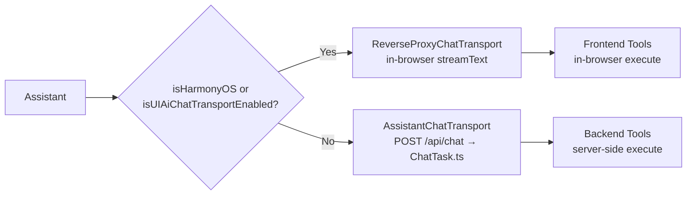
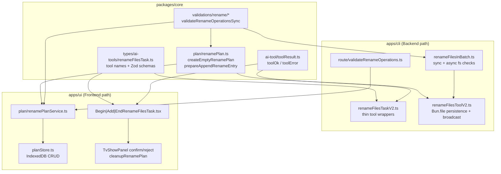
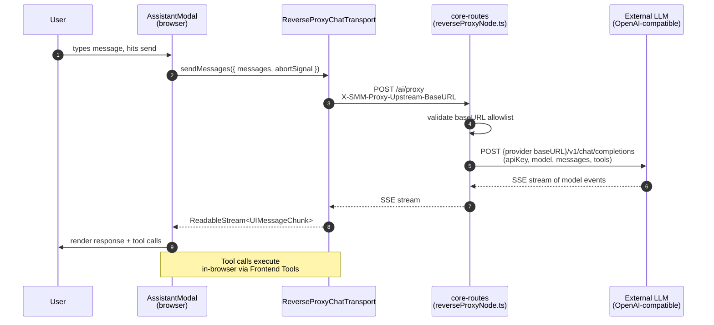
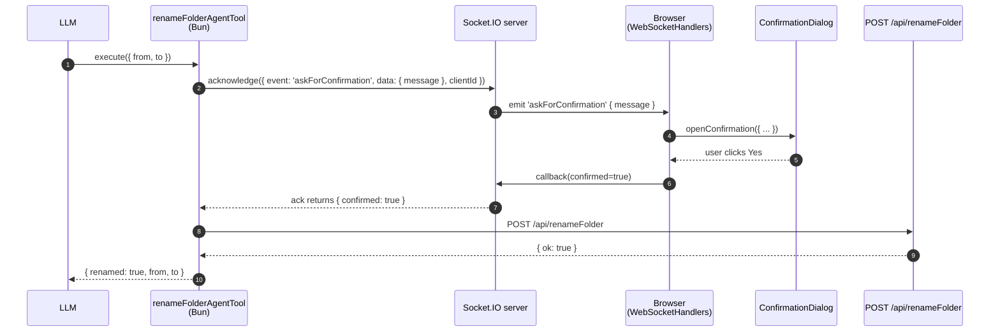
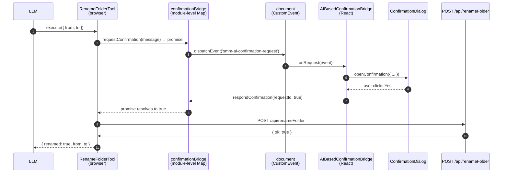
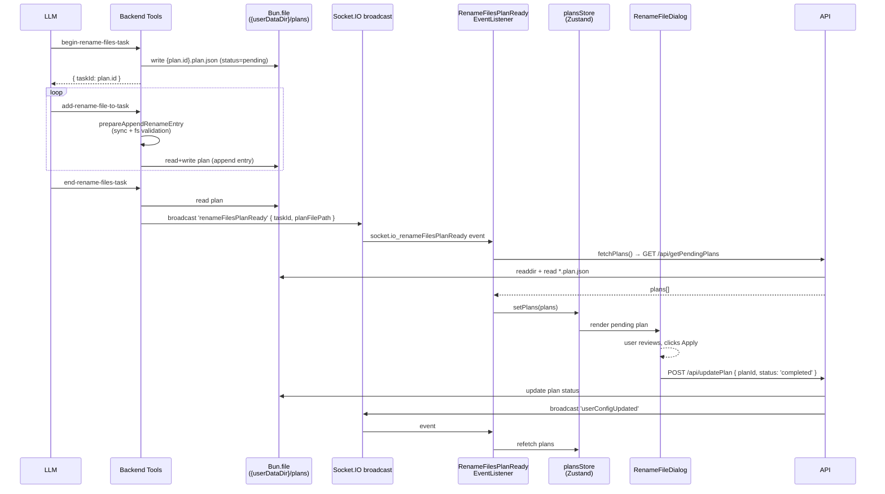
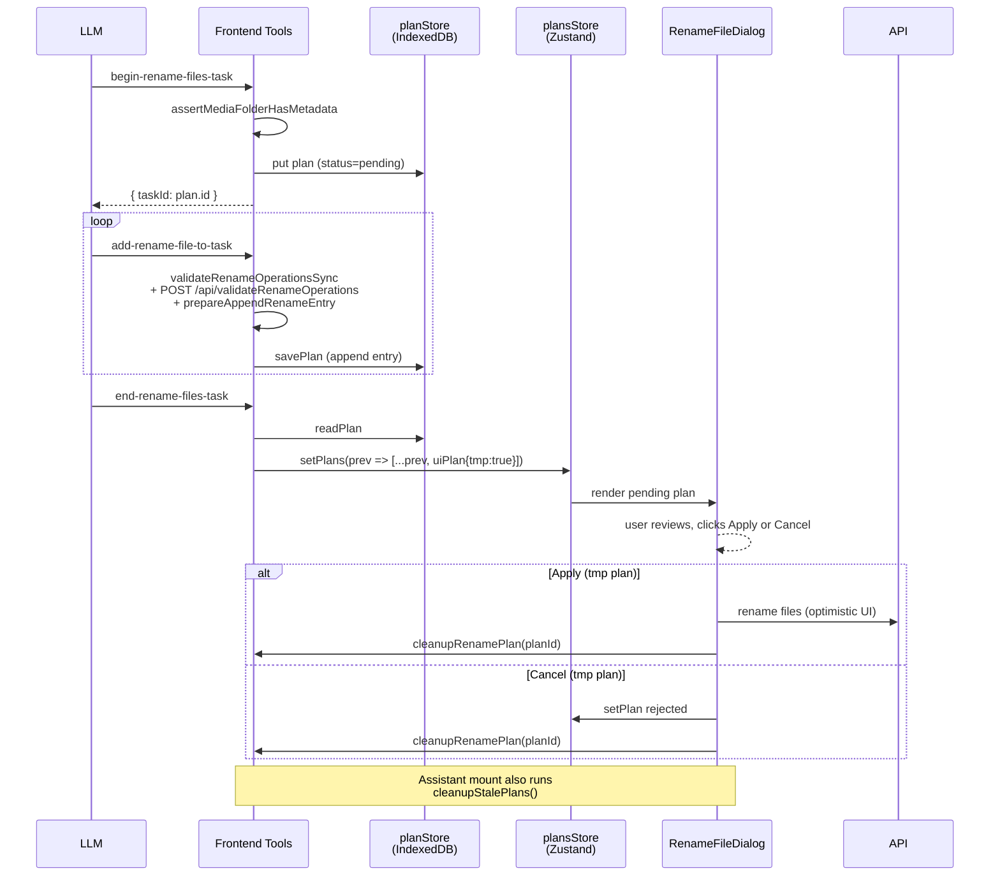

# AI Assistant Architecture

SMM 提供两套**并行**的 AI Assistant 实现 — 一套在 Bun 后端运行，一套在浏览器中运行。两套实现共享同一个 LLM provider 配置和 prompt 系统，但使用不同的 transport、不同的工具执行环境。

## 1. Overview

| 维度 | Backend (Bun) | Frontend (Browser) |
|---|---|---|
| Transport | `AssistantChatTransport` (Hono) | `ReverseProxyChatTransport` (in-process) |
| LLM 调用位置 | `apps/cli` (Bun) | `apps/ui` (renderer) |
| 工具执行位置 | Bun 服务器 (Node fs, Socket.IO) | Browser (fetch, IndexedDB) |
| 工具来源 | `apps/cli/src/tools/*` (server-only) | `apps/ui/src/ai/tools/*` (React components) |
| Plan 存储 | `Bun.file` 写入 `{userDataDir}/plans/*.plan.json` | IndexedDB (`planStore.ts`) |
| 确认弹窗 | Socket.IO `askForConfirmation` + `acknowledge()` | In-process `requestConfirmation` + custom DOM event |
| 触发条件 | 桌面默认 | HarmonyOS / 桌面 `isUIAiChatTransportEnabled` flag |

**关键设计原则：两套实现互为补充，不互相替代。** 选择 backend 还是 frontend 取决于 transport，而不是业务逻辑。两条路径上的工具集最终对齐：同样的 `toolName`（kebab-case）、同样的 Zod schema（来自 `packages/core`）、语义一致的返回（`toolOk` / `toolError`）。

## 2. Component Overview



## 3. Assistant Wiring (apps/ui/src/ai/Assistant.tsx)

`<Assistant />` 是整个 AI Assistant 的入口点。它根据当前环境选择 transport:



**关键点**：
- `ToolsBridge` (`apps/ui/src/ai/hooks/useAssistantTools.ts`) 监听 assistant-ui runtime 的工具注册变化，把工具列表通过 `transport.setTools(...)` 注入 `ReverseProxyChatTransport`。下一次 `sendMessages` 会读取最新的工具定义。
- `<AIBasedConfirmationBridge />` 在 `AssistantRuntimeProvider` 内挂载，监听 `smm-ai-confirmation-request` DOM 事件，调用 `useDialogs().openConfirmation()` 显示弹窗。

## 4. Tool Registration (Two Paths)

### 4.1 Backend Path — `ChatTask.ts`

```typescript
// apps/cli/tasks/ChatTask.ts (excerpt)
const result = streamText({
  model: aiProvider.chatModel(model || defaultModel),
  messages: modelMessages,
  system,
  tools: {
    ...frontendTools(tools),              // ← schemas sent by browser
    getApplicationContext: agentTools.getApplicationContext(clientId),
    'is-folder-exist': agentTools.isFolderExist(clientId),
    'get-media-metadata': agentTools.getMediaMetadata(clientId, abortSignal),
    'get-episodes': getEpisodesAgentTool(clientId, abortSignal),
    'get-media-folders': agentTools.getMediaFolders(clientId),
    'list-files-in-media-folder': agentTools.listFiles(clientId),
    'rename-folder': agentTools.renameFolder(clientId, abortSignal),
    'begin-rename-files-task': createBeginRenameFilesTaskTool(clientId, abortSignal),
    'add-rename-file-to-task': createAddRenameFileToTaskTool(clientId, abortSignal),
    'end-rename-files-task': createEndRenameFilesTaskTool(clientId, abortSignal),
    'begin-recognize-task': createBeginRecognizeTaskTool(clientId, abortSignal),
    'add-recognized-media-file': createAddRecognizedMediaFileTool(clientId, abortSignal),
    'end-recognize-task': createEndRecognizeTaskTool(clientId, abortSignal),
  },
  stopWhen: stepCountIs(100),
})
```

工具来源：
1. **`agentTools`** (in `apps/cli/src/tools/index.ts`) — 14 个 server-side 工具。注册了 LLM 的 `toolName`、Zod `inputSchema`、`execute` 实现。`execute` 在 Bun 中运行。
2. **`frontendTools(tools)`** — 桥接来自浏览器的工具 schema。当 desktop 默认 `AssistantChatTransport` 走此路径时，浏览器通过 `body.tools` 把工具的 description + Zod schema 发过来；`frontendTools()` 把它们转换成 AI SDK `Tool` 形状。**Tool key precedence**：server-side `agentTools.getApplicationContext(clientId)` 在 `...frontendTools(tools)` 之后，所以同名工具 server 版胜出。
3. **`createXxxTaskTool(clientId, abortSignal)`** — 工厂函数返回的工厂实例，每次 `streamText` 调用都会重新创建，绑定 `clientId` (用于 Socket.IO 确认) 和 `abortSignal`。

### 4.2 Frontend Path — ReverseProxyChatTransport

```typescript
// apps/ui/src/ai/transport/reverseProxyChatTransport.ts (excerpt)
const result = streamText({
  model: provider.chatModel(this.config.model as string),
  messages: await convertToModelMessages(finalMessages),
  system: prompts.system,
  ...(aiTools ? { tools: aiTools } : {}),
  stopWhen: stepCountIs(100),
  abortSignal,
})
return result.toUIMessageStream()
```

工具来源：
1. **`useAssistantTools()`** — `ToolsBridge` 读取 `api.modelContext().register({ tools: {...} })` 中注册的所有工具（由 `makeAssistantTool(...)` 暴露的 React 组件挂载到 `AssistantRuntimeProvider` 中产生）。
2. **`toStreamTextTools(tools)`** — 把 assistant-ui 的 `Tool` (`{ description, parameters, execute }`) 转换为 AI SDK 的 `Tool` (`{ description, inputSchema, execute }`)。`parameters` → `inputSchema` 是字段重命名，本质结构相同。

**关键差异**：backend 路径的 `tools` 对象在 server 端静态构建；frontend 路径的 `tools` 是**动态**的，由 React 组件树中的 `<XxxTool />` 元素通过 `useAssistantTools()` 收集而来。

## 5. Tool Inventory (Backend ∥ Frontend)

| Tool | Backend (`apps/cli/src/tools/`) | Frontend (`apps/ui/src/ai/tools/`) | Data Source (frontend) |
|---|---|---|---|
| `getApplicationContext` | `getApplicationContext.ts` (Socket.IO) | `GetApplicationContext.tsx` | Zustand `useUIMediaFolderStore` + `useConfig` + `useHelloQuery` |
| `is-folder-exist` | `isFolderExist.ts` → `resolveFolderExistence` (core-routes) | `IsFolderExist.tsx` | `POST /api/isFolderAvailable` (`available` + `reason?`) |
| `get-media-metadata` | `getMediaMetadata.ts` → `fillMediaMetadataResponseData` (core) | `GetMediaMetadata.tsx` | TanStack Query cache via `mediaMetadataToolBridge` |
| `get-episodes` | `getEpisodes.ts` → `buildGetEpisodesResponse` (core) | `GetEpisodes.tsx` | `POST /api/getEpisodes` |
| `get-media-folders` | `getMediaFolders.ts` → `buildGetMediaFoldersResponse` (core) | `GetMediaFolders.tsx` | `readUserConfig()` → `smm.json` |
| `list-files-in-media-folder` | `listFilesInMediaFolder.ts` → `doListFiles` (core-routes) | `ListFilesInMediaFolder.tsx` | `POST /api/listFilesInMediaFolder` |
| `rename-folder` | `renameFolder.ts` (Socket.IO confirm → `doRenameFolder`) | `RenameFolder.tsx` | `requestConfirmation` + `POST /api/renameFolder` |
| `begin-rename-files-task` | `renameFilesTaskV2.ts` (Bun.file plan) | `BeginRenameFilesTask.tsx` | `planStore.createRenamePlan` (IndexedDB) |
| `add-rename-file-to-task` | `renameFilesTaskV2.ts` | `AddRenameFileToTask.tsx` | `renamePlanService` + `POST /api/validateRenameOperations` |
| `end-rename-files-task` | `renameFilesTaskV2.ts` (broadcast) | `EndRenameFilesTask.tsx` | `planStore.readPlan` + `usePlansStore.setPlans` |
| `begin-recognize-task` | `recognizeMediaFilesTask.ts` (Bun.file plan) | `BeginRecognizeTask.tsx` | `planStore.createRecognizePlan` (IndexedDB) |
| `add-recognized-media-file` | `recognizeMediaFilesTask.ts` | `AddRecognizedMediaFile.tsx` | `planStore.addRecognizedFileToPlan` (IndexedDB) |
| `end-recognize-task` | `recognizeMediaFilesTask.ts` (broadcast) | `EndRecognizeTask.tsx` | `planStore.readPlan` + `usePlansStore.setPlans` |

**未移植到 frontend**（保持 backend-only）：
- `getEpisode` (MCP), `matchEpisode`, `matchEpisodesInBatch`, `renameFilesInBatch`, `howToRenameEpisodeVideoFiles`, `howToRecognizeEpisodeVideoFiles`, `readme`, `askForConfirmation`, `getSelectedMediaMetadata` — 这些是 MCP 工具或桌面专用 workflow 工具，frontend 不需要。

## 6. Rename File Task Architecture

Rename file task 是 backend / frontend 双路径对齐的参考实现：**契约、校验、plan 业务逻辑** 下沉到 `packages/core`，cli 与 ui 各自保留薄 storage adapter。

### 6.1 Layered Design



| 层 | 职责 | 关键文件 |
|---|---|---|
| **Contract** | kebab-case tool 名、Zod input schema、description 常量 | `packages/core/types/ai-tools/renameFilesTask.ts` |
| **Tool result** | 统一 `{ error }` / `{ ...data, error: undefined }` 形状 | `packages/core/ai-tool/toolResult.ts` |
| **Domain** | 创建 plan、追加 entry、metadata / episode 断言 | `packages/core/plan/renamePlan.ts` |
| **Sync validation** | 路径、重复、链式冲突等纯函数校验 | `packages/core/validations/rename/*` |
| **CLI storage** | 读写 `{userDataDir}/plans/{id}.plan.json`，Socket.IO broadcast | `apps/cli/src/tools/renameFilesToolV2.ts` |
| **CLI async validation** | 源文件存在、目标不存在（需 fs） | `apps/cli/src/tools/renameFilesInBatch.ts` |
| **UI storage** | IndexedDB CRUD，委托 core 生成/更新 plan 对象 | `apps/ui/src/ai/planStore.ts` |
| **UI orchestration** | 浏览器 sync 校验 + 调 validate API + 写 IDB | `apps/ui/src/ai/plan/renamePlanService.ts` |

### 6.2 Plan ID Model

```
taskId === plan.id === {id}.plan.json   (backend 文件名 key)
taskId === plan.id                      (frontend IndexedDB keyPath)
```

Backend 不再生成双 UUID；`begin-rename-files-task` 返回的 `taskId` 即为 plan 对象的 `id`，也是磁盘文件名 stem。

### 6.3 Tool Contract (packages/core)

| 常量 | toolName | 用途 |
|---|---|---|
| `BEGIN_RENAME_FILES_TASK` | `begin-rename-files-task` | 创建空 plan |
| `ADD_RENAME_FILE_TO_TASK` | `add-rename-file-to-task` | 校验并追加 `{ from, to }` |
| `END_RENAME_FILES_TASK` | `end-rename-files-task` | 结束 task，触发 UI 审阅 |

`apps/ui/src/ai/prompts.ts` 与两端 tool 实现均 import 上述常量，避免硬编码字符串漂移。

### 6.4 Begin — 创建 Plan

两端流程一致：

1. 校验 `mediaFolderPath` 非空（`requireNonEmptyString`）
2. 校验 media folder 已在 SMM 中打开（`assertMediaFolderHasMetadata`）
3. `createEmptyRenamePlan(mediaFolderPath)` 生成 plan
4. 持久化（backend: `Bun.write`；frontend: `planStore.put`）
5. 返回 `{ taskId: plan.id }`

| 路径 | metadata 来源 |
|---|---|
| Backend | `Bun.file(metadataCacheFilePath(...)).exists()` |
| Frontend | TanStack Query cache（`resolveMediaMetadataForFolderPath`） |

### 6.5 Add — 校验并追加 Entry

核心逻辑在 `prepareAppendRenameEntry(plan, entry, deps)`：

1. 将 candidate entry 合并到 `plan.files`
2. 调用 `deps.validateOperations(candidateFiles, mediaFolderPath)`
3. 调用 `deps.getMediaMetadata` + `assertEpisodeVideoFile`（源路径必须是已识别的 episode 视频）
4. 成功则返回更新后的 plan；失败则 `{ error: "Error Reason: ..." }`

**校验分层：**

| 阶段 | 运行环境 | 内容 |
|---|---|---|
| Sync | browser 或 Bun | `validateRenameOperationsSync` — 重复路径、链式冲突、路径在 media folder 内、异常路径 |
| Async (fs) | Bun only | `validateSourceFileExist` / `validateDestFileNotExist` |

Frontend add 路径：

```
validateRenameOperationsSync (browser, 快速失败)
  → POST /api/validateRenameOperations (filesystemCheck: true)
  → prepareAppendRenameEntry 内 episode 检查
  → planStore.savePlan(updatedPlan)
```

`POST /api/validateRenameOperations` 请求体：

```json
{
  "mediaFolderPath": "/media/show",
  "files": [{ "from": "...", "to": "..." }],
  "filesystemCheck": true
}
```

响应遵循 SMM RPC 惯例：`{ data: RenameValidationResult, error: string | null }`。

> **HarmonyOS 注意**：若 frontend transport 下 `/api/validateRenameOperations` 不可用，add 工具仅能完成 sync 校验；fs 相关错误需 backend 路由可用或在文档/错误信息中明确提示。

### 6.6 End — 触发 UI 审阅

| 路径 | end 行为 |
|---|---|
| Backend | 读取 plan → Socket.IO broadcast `renameFilesPlanReady` → listener `fetchPlans()` pull 到 `plansStore` |
| Frontend | 读取 IndexedDB plan → `toUIRenameFilesPlanPaths` → 带 `tmp: true` push 到 `plansStore` |

用户在 `RenameFileDialog` / `TvShowPanel` 审阅后 Apply 或 Cancel。

### 6.7 IndexedDB Housekeeping (Frontend)

| 时机 | 动作 |
|---|---|
| `Assistant` mount | `cleanupStalePlans()` — 删除 `status !== 'pending'` 的 stale entries |
| Rename confirm（tmp plan） | `cleanupRenamePlan(planId)` — Apply 成功后删 IDB entry |
| Rename cancel（tmp plan） | `cleanupRenamePlan(planId)` — reject 后删 IDB entry |
| Recognize confirm/cancel | `cleanupRecognizePlan(planId)` — 同上（recognize task 同步接入） |

Backend plan 文件仍通过 `POST /api/updatePlan` 更新 status；frontend tmp plan 不调用 updatePlan API。

### 6.8 Scope 外（本次重构未改）

- MCP server 内部 rename tool 名（独立协议）
- Legacy in-memory `renameFilesTool.ts`
- Debug HTTP 路由（`apps/e2e/test/lib/debugRenameTool.ts`）函数名
- Recognize task 的 `packages/core/plan/recognizePlan.ts`（后续可复用同一模式）

### 6.9 Rename Folder Tool（对齐说明）

与 rename file task 类似，契约与样板已下沉到 `packages/core`：

| 模块 | 内容 |
|------|------|
| `types/ai-tools/renameFolder.ts` | `RENAME_FOLDER`、`renameFolderInputSchema`、description |
| `ai-tool/renameFolderConfirm.ts` | `buildRenameFolderConfirmationMessage` |
| `ai-tool/renameFolderResult.ts` | `renameFolderSucceeded` / `Failed` / `Cancelled` |
| `route/RenameFolder.ts` | `doRenameFolder` — 唯一 server 业务实现；成功时 broadcast `userConfigFolderRenamed` + `userConfigUpdated` |
| `lib/refreshUiAfterFolderRename.ts` | Dialog mutation 用的 client refresh（AI tool 依赖 socket broadcast） |

MCP `rename-folder` 仍无用户确认（直接 `executeRenameFolder`）；ChatTask / frontend 路径需确认后执行。

### 6.10 Is Folder Exist Tool（对齐说明）

| 模块 | 内容 |
|------|------|
| `types/ai-tools/isFolderExist.ts` | `IS_FOLDER_EXIST`、input/output schema |
| `ai-tool/isFolderExistResult.ts` | 统一 `{ exists, path, reason? }` 构造 |
| `core-routes/isFolderAvailable.ts` | `resolveFolderExistence` — AI tool 与 HTTP API 共用 |
| `POST /api/isFolderAvailable` | `{ available, reason? }`（UI 仍只读 `available`） |

Backend agent 与 frontend AI 均返回扁平 `IsFolderExistOutput`；MCP 仍包装为 `createSuccessResponse`。

### 6.11 Get Media Metadata Tool（对齐说明）

| 模块 | 内容 |
|------|------|
| `types/ai-tools/getMediaMetadata.ts` | `GET_MEDIA_METADATA`、input/output schema、错误常量 |
| `ai-tool/getMediaMetadataResponse.ts` | `createBaseGetMediaMetadataData`、`fillMediaMetadataResponseData` — backend / frontend 共用 slim DTO |
| `apps/ui/src/ai/mediaMetadataToolBridge.ts` | `useMediaMetadataToolBridge`、`resolveMediaMetadataForFolderPath`（内部仍返回完整 `MediaMetadata`） |
| `apps/cli/src/tools/getMediaMetadata.ts` | `executeGetMediaMetadata` — 校验 managed folder、stat、cache；agent 返回扁平 output |

**对齐要点**：
- ChatTask / frontend 工具名均为 `get-media-metadata`；参数统一 `mediaFolderPath`（不再使用 `path`）。
- Agent / frontend 返回扁平 `GetMediaMetadataToolOutput`（slim DTO + 可选 `error`）；MCP 仍包装为 `createSuccessResponse({ data, error? })`。
- Backend 与 frontend 均校验路径属于 SMM 管理的 media folder；无 cache 时返回 `GET_MEDIA_METADATA_NO_CACHE`。
- `renamePlanService` 等内部逻辑仍通过 `resolveMediaMetadataForFolderPath` 读取完整 `MediaMetadata`。

### 6.12 Get Episodes Tool（对齐说明）

| 模块 | 内容 |
|------|------|
| `types/ai-tools/getEpisodes.ts` | `GET_EPISODES`、input/output schema、错误常量 |
| `ai-tool/buildGetEpisodesResponse.ts` | 从 `MediaMetadata` 构建 `{ episodes, totalCount, showName, numberOfSeasons }` |
| `apps/cli/src/tools/getEpisodes.ts` | `executeGetEpisodes` — managed 校验、读 cache、agent 扁平 output |
| `POST /api/getEpisodes` | Frontend HTTP 薄包装（browser 无法读 metadata cache 文件） |

**对齐要点**：
- ChatTask / frontend 工具名均为 `get-episodes`；参数 `mediaFolderPath`。
- Agent / HTTP 返回扁平 `GetEpisodesToolOutput`（成功字段 + 可选 `error`）；MCP 错误仍用 `createErrorResponse`（`isError: true`）。
- Episode 列表构建逻辑在 core；backend 与 HTTP 路径共用 `executeGetEpisodes`。
- 校验文件夹属于 SMM 管理的 media folder（与 `get-media-metadata` 一致）。

### 6.13 Get Media Folders Tool（对齐说明）

| 模块 | 内容 |
|------|------|
| `types/ai-tools/getMediaFolders.ts` | `GET_MEDIA_FOLDERS`、input/output schema |
| `ai-tool/buildGetMediaFoldersResponse.ts` | 从 `UserConfig.folders` 构建 `{ folders }` |
| `apps/cli/src/tools/getMediaFolders.ts` | `executeGetMediaFolders` — `getUserConfig()`；agent 扁平 output |
| `apps/ui/src/ai/tools/GetMediaFolders.tsx` | `readUserConfig()`；返回 `{ folders, error? }` |

**对齐要点**：
- ChatTask / frontend 工具名均为 `get-media-folders`；无入参。
- Agent / frontend 返回扁平 `GetMediaFoldersToolOutput`；MCP 错误仍用 `createErrorResponse`（`isError: true`）。
- 与 `get-application-context` 不同：本工具返回**全部** managed folder 路径列表。
- `GetMediaFoldersTool` 已在 `Assistant.tsx` 挂载（ReverseProxy 与 ChatTask 双路径可用）。

### 6.14 List Files In Media Folder Tool（对齐说明）

| 模块 | 内容 |
|------|------|
| `types/ai-tools/listFilesInMediaFolder.ts` | `LIST_FILES_IN_MEDIA_FOLDER`、input/output schema |
| `ai-tool/buildListFilesInMediaFolderResponse.ts` | 从路径列表构建 `{ files, count }`，支持 `videoFileOnly` |
| `apps/cli/src/tools/listFilesInMediaFolder.ts` | `executeListFilesInMediaFolder` — managed 校验 + `doListFiles` |
| `POST /api/listFilesInMediaFolder` | Frontend HTTP 薄包装 |
| `apps/cli/src/tools/listFiles.ts` | MCP-only **`list-files`**（generic，`folderPath`，无 managed 校验） |

**对齐要点**：
- ChatTask / frontend / prompts 工具名均为 `list-files-in-media-folder`；参数 `mediaFolderPath`、`recursively?`、`videoFileOnly?`。
- Agent / HTTP 返回扁平 `{ files, count, error? }`；通过 **filesystem 扫描**（非 metadata 缓存）。
- MCP 保留独立 `list-files` 供外部/通用目录 listing；AI Assistant 主路径用 `list-files-in-media-folder`。

## 7. Reverse Proxy & LLM Routing

`ReverseProxyChatTransport` 调 LLM 时不直接连外部 provider — 而是把请求发到 backend 的 reverse proxy:



**关键点**：
- `X-SMM-Proxy-Upstream-BaseURL` header 告诉 proxy 把请求转发到哪里。proxy 校验此 header 在 allowlist 中（防止 SSRF），然后**剥掉**该 header 后转发给真正的 LLM provider。
- `apiKey` 始终在 proxy 端解析（来自 `userConfig.aiProviders`），不暴露给浏览器直接调用 — 这是 SMM 提供的安全网。
- 当 `reverseProxyUrl` 不可用时（HarmonyOS 上的特殊情况），transport 不会抛错，而是 `describeMissingConfig()` 返回一段用户可见的提示消息作为 assistant response（"Open Settings → AI to configure"）。

## 8. Confirmation Flow (Two Mechanisms)

两个 transport 都需要在 `renameFolder` 等破坏性操作前向用户确认。两个实现：

### 7.1 Backend Path (Socket.IO)



### 7.2 Frontend Path (in-process bridge)



**为什么两套机制**：
- Backend 工具运行在 Bun 中，没有 React context 可用 → 必须通过 Socket.IO 与浏览器对话。
- Frontend 工具运行在浏览器中（但仍然在 React 树外），没有 Socket.IO round-trip 必要 — 同一进程内通过 `document.dispatchEvent` + 监听即可。

## 9. Plan Lifecycle (Two Storage Layers)

Rename file task 的共享 domain 逻辑见 [§6 Rename File Task Architecture](#6-rename-file-task-architecture)。本节描述 backend / frontend 各自的存储与 event 差异。

### 9.1 Backend Path — Filesystem



### 9.2 Frontend Path — IndexedDB



**关键差异**：
- Backend 路径: `end-rename-files-task` 不直接 push 到 plansStore；它 broadcast 一个 event，让 listener 调 `fetchPlans()` 重新拉取（**pull 模型**）。
- Frontend 路径: `end-rename-files-task` 直接把 plan push 到 `plansStore.setPlans()`（**push 模型**）— 因为 IndexedDB 在同一浏览器，没有网络 round-trip 必要。
- **Plan ID**：`taskId === plan.id === {id}.plan.json`（backend 与 frontend 统一）。
- **共享代码**：tool schema 在 `packages/core/types/ai-tools/`；plan 逻辑在 `packages/core/plan/renamePlan.ts`；sync 校验在 `packages/core/validations/rename/`。

## 10. File Map

### Shared (packages/core)

```
packages/core/
├── types/ai-tools/
│   ├── renameFilesTask.ts
│   ├── recognizeMediaFileTask.ts
│   ├── renameFolder.ts
│   ├── isFolderExist.ts             ← is-folder-exist tool contract
│   ├── getMediaMetadata.ts          ← get-media-metadata tool contract
│   ├── getEpisodes.ts               ← get-episodes tool contract
│   ├── getMediaFolders.ts           ← get-media-folders tool contract
│   └── listFilesInMediaFolder.ts    ← list-files-in-media-folder tool contract
├── ai-tool/
│   ├── toolResult.ts
│   ├── renameFolderConfirm.ts
│   ├── renameFolderResult.ts
│   ├── isFolderExistResult.ts
│   ├── getMediaMetadataResponse.ts
│   ├── buildGetEpisodesResponse.ts
│   ├── buildGetMediaFoldersResponse.ts
│   └── buildListFilesInMediaFolderResponse.ts
├── plan/
│   └── renamePlan.ts                  ← createEmptyRenamePlan, prepareAppendRenameEntry
└── validations/rename/
    ├── validateRenameOperationsSync.ts
    └── ... (sync validators)
```

### Backend (apps/cli)

```
apps/cli/
├── server.ts                          ← registers /api/chat, /api/validateRenameOperations
├── tasks/
│   └── ChatTask.ts                    ← POST /api/chat (kebab-case task tool keys)
└── src/
    ├── tools/
    │   ├── renameFilesTaskV2.ts       ← thin wrappers → core schemas + toolResult
    │   ├── renameFilesToolV2.ts       ← Bun.file persistence; calls core plan logic
    │   ├── renameFilesInBatch.ts      ← sync (core) + async fs validation
    │   ├── renameFolder.ts            ← executeRenameFolder; agent + MCP wrappers
    │   ├── recognizeMediaFilesTask.ts
    │   ├── recognizeMediaFilesTool.ts
    │   └── ... (other agent/MCP tools)
    ├── route/
    │   ├── validateRenameOperations.ts ← POST /api/validateRenameOperations
    │   ├── getEpisodes.ts
    │   └── debug/
    └── validations/                   ← re-export from @core/validations/rename/*
```

### Frontend (apps/ui)

```
apps/ui/src/ai/
├── Assistant.tsx                      ← entry; cleanupStalePlans() on mount
├── mediaMetadataToolBridge.ts         ← shared TanStack Query bridge for metadata tools
├── prompts.ts                         ← imports tool name constants from @core
├── planStore.ts                       ← IndexedDB; createRenamePlan → createEmptyRenamePlan
├── plan/
│   └── renamePlanService.ts           ← appendRenameEntryWithValidation (sync + API)
├── confirmationBridge.ts
├── AIBasedConfirmationBridge.tsx
├── transport/
│   └── reverseProxyChatTransport.ts
└── tools/
    ├── BeginRenameFilesTask.tsx       ← core schema + assertRenameMediaFolderOpened
    ├── AddRenameFileToTask.tsx        ← renamePlanService.appendRenameEntryWithValidation
    ├── EndRenameFilesTask.tsx         ← push tmp plan; cleanupRenamePlan export
    └── ... (other frontend tools)

apps/ui/src/lib/
└── refreshUiAfterFolderRename.ts      ← Dialog mutation client refresh
```

## 11. Adding a New Tool (Checklist)

1. **Define contract in core** (if backend ∥ frontend aligned): add `packages/core/types/ai-tools/<task>.ts` with tool name constants, Zod schemas, descriptions.
2. **Implement server-side tool** in `apps/cli/src/tools/<name>.ts`. Use `@core/ai-tool/toolResult` helpers. Register in `ChatTask.ts` with quoted kebab-case key if needed.
3. **Implement frontend tool** in `apps/ui/src/ai/tools/<Name>.tsx` (`makeAssistantTool`). Import schemas from core.
4. **Mount in Assistant.tsx** — add `<XxxTool />` inside `<AssistantRuntimeProvider>`.
5. **If tool needs HTTP API**: add `apps/ui/src/api/<name>.ts` + `apps/cli/src/route/<name>.ts` + register in `server.ts`.
6. **If tool needs plan lifecycle**: put domain logic in `packages/core/plan/`; cli/ui keep thin storage adapters (`renameFilesToolV2.ts` / `planStore.ts` + optional `plan/*Service.ts`).
7. **If tool needs confirmation**: use `requestConfirmation()` from `confirmationBridge.ts`.
8. **Housekeeping**: wire `cleanupXxxPlan` on TvShowPanel confirm/reject for tmp plans.

## 12. Open Questions / Future Work

- **HarmonyOS validate API**: `/api/validateRenameOperations` 需确认 ohos 是否复用 cli 路由；若否，frontend add 在 offline 时仅 sync 校验并返回明确 error。
- **Recognize plan 共享 domain**：可新增 `packages/core/plan/recognizePlan.ts`，复用 rename 的 core + thin adapter 模式。
- **MCP tools on frontend**: 9 tools (e.g. `getEpisode`, `matchEpisode`) are MCP-only today.
- **Parallel tool execution**: Multi-step rename/recognize tasks are I/O-bound — could parallelize agent loop steps.
- **Reverse proxy on HarmonyOS**: Some backend APIs live in `apps/cli` rather than `core-routes` — verify HarmonyOS coverage.
