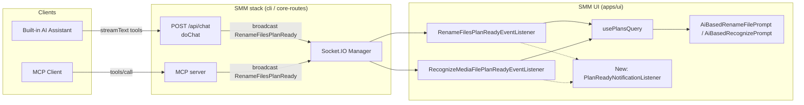

# AI / MCP Plan-Ready Browser Notification

## Background

SMM exposes two AI-driven flows that create rename / recognize plans:
- **Built-in AI Assistant** (`/api/chat` desktop path or in-process `ReverseProxyChatTransport` for HarmonyOS / flag).
- **External MCP server** (Streamable HTTP / stdio).

Both flows use the kebab-case task tools (`begin-rename-files-task`, `add-rename-file-to-task`, `end-rename-files-task`, and the recognize counterparts). The terminal `end-*-task` call flips the plan from `preparing` → `pending` and emits a Socket.IO event so the UI can pick it up.

Today the UI just invalidates the plans query — there is **no explicit in-page notification**. If the user is on another browser tab, has minimised the window, or is on a different desktop app, they have no immediate signal that SMM needs their attention. The plan itself only becomes visible when they navigate back to a panel that consumes it (`TvShowPanel` / `MoviePanel` / `MusicPanel`), which may be far away.

## Goal

When an AI Assistant turn or an MCP client completes a `end-rename-files-task` or `end-recognize-task` call, the SMM page should pop up a notification that the user has a pending plan to review. The notification must work in:

1. The browser-only SMM web UI (CLI served as HTTP, opened in a real browser).
2. The Electron desktop renderer (`apps/electron`).
3. The HarmonyOS Electron renderer (`apps/ohos`).

The reminder is **best-effort**: if the browser/renderer is suspended, hidden, or the user has denied notifications, missing the reminder is acceptable.

## Codebase Analysis

### Architecture

### Code flow

The unified terminal step for both `end-*-task` variants is in `packages/core-routes/src/tools/renameFilesTask.ts` (line 234) and `…/recognizeMediaFilesTask.ts` (line 221). Both call `emit({event: RenameFilesPlanReady.event, data})` / `RecognizeMediaFilePlanReady.event`. `emit` is `config.broadcast ?? defaultBroadcast` — broadcast routes through the Socket.IO manager (apps/cli) into the renderer.

The frontend path (`ReverseProxyChatTransport`, used for HarmonyOS / flag) does **not** emit a broadcast — `EndRenameFilesTask.tsx` / `EndRecognizeTask.tsx` call `updatePlan({status:'pending'})` and invalidate `['plans']` directly inside the same renderer. The notification must therefore listen to **either**:

- A Socket.IO `*PlanReady` event from the Socket.IO manager (covers `/api/chat` desktop + MCP server paths).
- The TanStack Query cache: when a plan transitions `preparing → pending` and the UI was not previously on the affected panel.

Existing UI listeners in `apps/ui/src/components/eventlisteners/*PlanReadyEventListener.tsx` only invalidate the plans query. There is no toast, no native `Notification`, and no Electron-specific signal today.

### Platform differences

| Platform | Window | Best notification mechanism |
|----------|--------|------------------------------|
| Browser (web) | Any tab, may be hidden | `Notification` API + in-page sonner toast |
| Electron renderer | `BrowserWindow` with `mainWindow` handle | `Notification` API (renders through OS), plus optional `mainWindow.flashFrame(true)` + `show()` to pull attention |
| OHOS Electron | Electron `BrowserWindow` inside HarmonyOS | Same as Electron — `Notification` + `flashFrame`/activate window |

OHOS renderer is Electron-based, so it shares the `isElectron()` path. The web-Notification API works in Electron renderer too. No platform-specific bridge is needed for basic OS notifications, but on Electron we should also flash / focus the window when the renderer is backgrounded.

## References

- `.agents/docs/design/episode-rename-recognize.md` — Plan lifecycle and the four flows (rule-based UI, AI chat desktop, AI chat frontend, MCP).
- `.agents/docs/design/ai-assistant.md` — Dual transport and the per-tool path rules.
- `.agents/docs/design/mcp-server.md` — MCP tool execution and broadcast wiring.
- `apps/ui/src/components/eventlisteners/RenameFilesPlanReadyEventListener.tsx` and `RecognizeMediaFilePlanReadyEventListener.tsx` — current listeners.
- `packages/core-routes/src/tools/renameFilesTask.ts` lines 226-238 and `recognizeMediaFilesTask.ts` lines 215-225 — broadcast call sites.
- `apps/ui/src/lib/isElectron.ts`, `apps/ui/src/lib/isHarmonyOS.ts` — platform detection helpers.
- `apps/ui/src/hooks/useFeatures.ts` — feature flag toggle.
