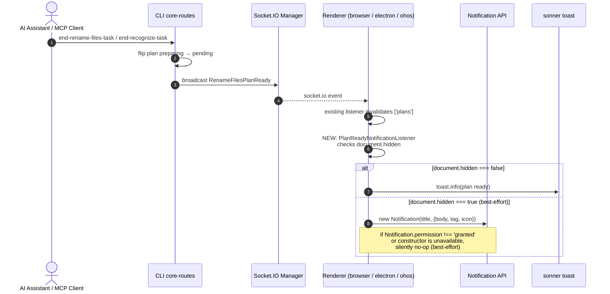
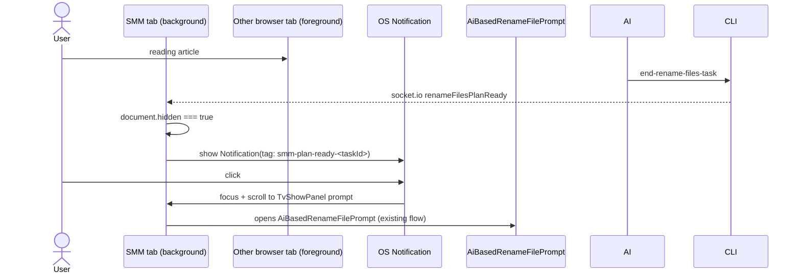

# AI / MCP Plan-Ready Browser Notification

When an AI Assistant turn or an MCP client completes an `end-rename-files-task` or `end-recognize-task` call, the SMM page pops a notification reminding the user that a pending plan is waiting for review. Covers web UI (`apps/cli` HTTP), Electron renderer (`apps/electron`), and OHOS Electron renderer (`apps/ohos`).

[ ] New UI component - yes (single new listener + helper hook)
[ ] New user config - no
[ ] Electron only - no
[ ] User document - no (in-app feature; no docs/ updates needed)

## 1. Background

The existing `RenameFilesPlanReadyEventListener` / `RecognizeMediaFilePlanReadyEventListener` only invalidate the `['plans']` TanStack Query. They do not raise any visible signal. If the user is on another browser tab, has minimised the window, or is in another app, they have no immediate signal that SMM is waiting for input. The plan only becomes visible when the user manually navigates back to the relevant panel.

Per the project's "best-effort" guidance for this feature, missing the notification because the browser/renderer is suspended is acceptable — we only need to raise a signal when the renderer is alive and listening.

## 2. Architecture

### 2.1 Project Level Architecture

none — no new server endpoints, no new event types, no schema changes. All wiring happens in `apps/ui` (with one optional best-effort fan-out into `apps/electron` main for window activation, gated behind the existing IPC layer — see §2.3).

### 2.2 App Level Architecture

### 2.3 Key Points

- **Single source of truth — Socket.IO events.** Trigger is the existing `renameFilesPlanReady` and `recognizeMediaFilePlanReady` events. No plans-query watch, no extra core event, no MCP server changes. Frontend-transport (`ReverseProxyChatTransport`) path is intentionally out of scope — it already invalidates `['plans']` and the prompt opens immediately because the same renderer just executed the tool.
- **Three platforms, one renderer-side listener.** The browser `Notification` constructor exists in:
  - Plain browser (`apps/ui` loaded via `http://localhost:port` from `apps/cli`).
  - Electron renderer (`apps/electron` loads the same UI inside a `BrowserWindow`; Chromium's web Notification renders through the OS).
  - OHOS Electron renderer (same Electron stack inside HarmonyOS).
  No platform-specific branch for the notification itself — only a tiny `try/catch` around the constructor so unsupported contexts degrade silently.
- **Visibility-based split.** When `document.hidden === false` we show a sonner toast (the existing UI feedback channel); when `document.hidden === true` we use the OS Notification API. This matches the user's "best-effort" requirement — if the renderer is hidden and notifications are blocked, nothing fires, and that is fine.
- **Dedupe via the `tag` option.** Both events carry a `taskId` (plan id) in `data`. We pass `tag: "smm-plan-ready-<taskId>"` so the OS Notification API replaces a previous notification for the same plan instead of stacking duplicates. The toast uses sonner's built-in `id` de-duplication.
- **i18n.** Title/body strings live under a new `planReady.*` namespace in all four locale files (`en`, `zh-CN`, `zh-HK`, `zh-TW`). The plan `type` (`rename-files` / `recognize`) maps to a fixed string per language; folder paths are only included when the payload exposes one (today the Socket.IO payload is `{taskId, planFilePath}`, so we do **not** include a path in v1).
- **No Electron IPC, no main-process flash.** Per user decision, we do not bridge into `apps/electron` main to flash / focus the window. The OS Notification is enough — clicking it brings the renderer to focus through the OS, not via custom IPC.

## 3. User Stories

### 3.1 Desktop AI Chat Creates a Rename Plan While User Is on Another Tab

* **Given** the user has the SMM page open in a tab but is currently looking at a different browser tab
* **When** the AI Assistant finishes a `end-rename-files-task` call and the Socket.IO `renameFilesPlanReady` event arrives
* **Then** an OS-level Notification appears with title "SMM has a plan to confirm" and body "AI prepared a rename plan"
* **And** clicking the notification focuses the SMM tab
* **And** if the user is already on the SMM tab, no OS Notification fires (document is visible) — instead a sonner toast shows the same message

### 3.2 MCP Client (Claude Desktop) Calls End-Rename-Task

* **Given** SMM is open in the renderer; Claude Desktop is the MCP client
* **When** Claude calls `end-rename-files-task` via the Streamable HTTP MCP transport
* **Then** the MCP server tool broadcasts `renameFilesPlanReady` over Socket.IO
* **And** the renderer shows the same notification as 3.1 (OS notification when hidden, toast when visible)

### 3.3 Frontend AI Transport Path (HarmonyOS / Flag)

* **Given** `isHarmonyOS() || isUIAiChatTransportEnabled` is true; `ReverseProxyChatTransport` is active
* **When** `EndRenameFilesTask.tsx` runs in the renderer, calls `/api/updatePlan`, and invalidates `['plans']`
* **Then** no OS Notification / toast is fired by this feature — the prompt opens immediately in the same renderer (acceptable per "best-effort" requirement; this path is documented as out of scope)

### 3.4 Permission Denied or Notifications Blocked

* **Given** the user has denied `Notification.requestPermission` (or it is unsupported)
* **When** a plan-ready event arrives while the tab is hidden
* **Then** no OS notification is shown — silent no-op. When the user returns to the tab, no toast either (tab was hidden at the time of the event; we do not replay). This is the documented "best-effort" degradation.

## 4. Tasks

### 4.1 New UI Component

[ ] Create `apps/ui/src/components/eventlisteners/PlanReadyNotificationListener.tsx`
    - Listens for `socket.io_renameFilesPlanReady` and `socket.io_recognizeMediaFilePlanReady` on `document`.
    - On event, captures `document.hidden` at the moment of the event (snapshotted, not later).
    - Calls `showPlanReadyNotification(planType)` from a new helper module (see 4.2).
    - Mounted from `apps/ui/src/main.tsx` alongside the existing listeners.
[ ] Create `apps/ui/src/components/eventlisteners/PlanReadyNotificationListener.test.tsx`
    - Mock the `Notification` constructor and sonner `toast` to assert each branch.
    - Cases: hidden + permission granted → `new Notification(...)` called with expected title/body/tag; visible → `toast.info(...)` called; hidden + permission denied → nothing called; no `Notification` global → fallback to toast even when hidden.
    - No Socket.IO mock required — fire the synthetic `document` event directly.

### 4.2 New helper hook

[ ] Create `apps/ui/src/lib/planReadyNotification.ts`
    - Exports `showPlanReadyNotification(kind: "rename-files" | "recognize"): void`.
    - Reads i18n strings via `t(...)` from a new `planReady.*` namespace.
    - Inside:
      - If `typeof document !== "undefined" && document.hidden === false` → `toast.info(title, { description: body, duration: 8000 })`.
      - Else if `typeof window !== "undefined" && typeof window.Notification === "function"`:
        - Wrap in try/catch.
        - If `Notification.permission === "granted"` → `new Notification(title, { body, tag: "smm-plan-ready", icon: undefined })` (the shared `tag` is intentionally fixed; one OS-level notification per app session, since the click target is the same SMM tab).
        - Else → silent no-op (best-effort).
      - Else → silent no-op.
    - No `requestPermission` call — we do not prompt the user. If permission has not been requested, `permission` is `"default"` and we silently drop (best-effort).

### 4.3 Locale strings

[ ] Add to `apps/ui/public/locales/en/translation.json` (and `zh-CN`, `zh-HK`, `zh-TW`):
    - `planReady.notification.title`: `"SMM has a plan to confirm"`.
    - `planReady.notification.body.rename`: `"AI prepared a rename plan"`.
    - `planReady.notification.body.recognize`: `"AI prepared a recognition plan"`.
    - `planReady.toast.title`: `"Plan ready"` (used by sonner).
[ ] zh-CN: `AI 准备了一个重命名计划` / `AI 准备了一个识别计划`.
[ ] zh-HK / zh-TW: traditional Chinese variants of the same.

### 4.4 Mount new listener

[ ] Edit `apps/ui/src/main.tsx`: import and render `<PlanReadyNotificationListener />` next to the existing two listeners. Keep it inside the existing provider tree.

### 4.5 Post-check

[ ] Verify no platform-specific code is needed: the listener calls no Electron IPC, no OHOS bridge, no service worker. The `Notification` constructor is the same API in all three targets.
[ ] Verify the existing two listeners are untouched (they still invalidate `['plans']`).

## 5. Backward Compatibility

none.

- No API changes.
- No config changes.
- No new events on the wire.
- The new listener is purely additive in the renderer.
- Frontend-transport path is unchanged. It already shows the prompt in the same renderer, so the absence of an OS-level notification there is acceptable per the "best-effort" requirement.

## 6. Documents

none. This is an in-app UX feature; no public API or user-facing documentation changes.

## 7. Post Verification

[ ] Type check
    Run `pnpm typecheck` and expect no errors.
[ ] Unit tests
    Run `pnpm --filter smm-ui test -- PlanReadyNotificationListener planReadyNotification` and expect all new tests passing. Also run `pnpm --filter smm-ui test` for the full ui suite to confirm nothing else broke.
[ ] Build
    Run `pnpm --filter smm-ui build` and expect build succeeded.
[ ] Manual smoke (best-effort, document in commit message)
    - Start `pnpm dev:cli` and `pnpm dev:ui`, open the page, switch to another browser tab, run an MCP / chat `end-rename-files-task`, confirm OS notification appears and brings the tab to front.
    - Repeat with the page foregrounded; confirm sonner toast appears and no OS notification.
    - Repeat with notifications blocked; confirm no console errors and graceful degradation.
