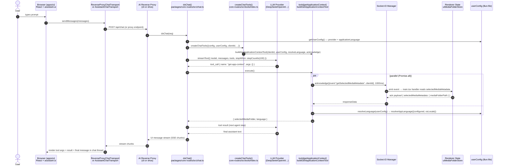

# AI Tool Calling Flows

SMM 暴露 `get-app-context` 等 AI 工具给两类调用方:

| 调用方 | 入口 | 工具实现 | 文档位置 |
|---|---|---|---|
| **AI Assistant** (LLM chat) | `doChat` → `streamText` 工具循环 | `packages/core-routes/src/tools/getApplicationContext.ts` `buildGetApplicationContextTool` | §1 |
| **MCP Server** (外部 MCP 客户端) | Streamable HTTP JSON-RPC | `packages/core-routes/src/mcp/toolHandlers/getApplicationContext.ts` `registerGetApplicationContextTool` | §2 |

两个流程都返回相同的输出 `{ selectedMediaFolder, language }`,但调用栈、传输层、生命周期完全不同。本文以 `get-app-context` 为例拆解两端实现。

> 通用前置知识 (kebab-case 工具名常量、Zod schema、Socket.IO `acknowledge`) 见 `.agents/docs/design/ai-assistant.md` 和 `.agents/docs/design/mcp-server.md`。本文仅聚焦工具调用流程本身。

## 1. AI Assistant Tool Call Flow

### 1.1 双 transport 架构

SMM 提供两套 AI Assistant transport, 服务端工具在桌面默认路径上执行; 浏览器侧 schema 仅用于协议合规 (LLM 看到工具签名)。

| 维度 | Backend (桌面默认) | Frontend (HarmonyOS / `isUIAiChatTransportEnabled`) |
|---|---|---|
| Transport | `AssistantChatTransport` → `POST /api/chat` | `ReverseProxyChatTransport` → in-process `streamText` |
| LLM 调用位置 | `packages/core-routes` `doChat` | `apps/ui` renderer (via reverse proxy) |
| `get-app-context` 执行位置 | **服务端** `core-routes/src/tools/getApplicationContext.ts` | 浏览器 `apps/ui/src/ai/tools/GetApplicationContext.tsx` (读 `useAiContextStore`) |
| `clientId` 来源 | `body.clientId` (chat request) | `getOrCreateClientId()` (localStorage) |

参见 `apps/ui/src/ai/Assistant.tsx:184-285` — `useFrontendTransport = isHarmony || isUIAiChatTransportEnabled` 同时选择 transport 与执行位置。

### 1.2 服务端流程 (`streamText` 工具循环)



**关键代码锚点**:

| 步骤 | 文件:行 | 说明 |
|---|---|---|
| UI 工具挂载 | `apps/ui/src/ai/Assistant.tsx:309` | `<GetApplicationContextTool />` 在 provider 内挂载 |
| 浏览器侧 `makeAssistantTool` 定义 | `apps/ui/src/ai/tools/GetApplicationContext.tsx:42-45` | `toolName: GET_APPLICATION_CONTEXT` |
| Renderer state 镜像 | `apps/ui/src/ai/tools/GetApplicationContext.tsx:58-74` | `useEffect` 把 `uiMediaFolderStore.selectedFolder` + `userConfig.applicationLanguage` + `helloData.osLocale` 写入 `useAiContextStore` |
| Transport 选择 | `apps/ui/src/ai/Assistant.tsx:189-285` | 根据 `useFrontendTransport` 选择 `ReverseProxyChatTransport` 或 `AssistantChatTransport` |
| Socket.IO 响应 | `apps/ui/src/main.tsx:47-61` | `useWebSocketEvent` 处理 `getSelectedMediaMetadata` 并 ack |
| 服务端 chat 入口 | `apps/cli/src/route/chatRoute.ts:1-25` | Hono shell → `doChat(req)` |
| `streamText` 工具循环 | `packages/core-routes/src/chat.ts:118-144` | `tools: { ..., [GET_APPLICATION_CONTEXT]: tools[GET_APPLICATION_CONTEXT], ... }` |
| Per-request tool 工厂 | `packages/core-routes/src/tools/index.ts:124-133` | `createChatTools` 把 `clientId` + `userConfig` + `acknowledge` 绑定到工具 |
| `buildGetApplicationContextTool` | `packages/core-routes/src/tools/getApplicationContext.ts:37-70` | `execute()` 内部 `Promise.all([acknowledge, resolveLanguage])` |
| `acknowledge` impl | `apps/cli/src/utils/socketIO.ts:51-56` | `getSocketIOManager().acknowledge(message, timeoutMs)` |

### 1.3 浏览器侧流程 (HarmonyOS / flag)

`ReverseProxyChatTransport` 在 renderer 内直接调用 `streamText`, 工具由 `useAssistantTools()` 提供。`get-app-context` 走 `apps/ui/src/ai/tools/GetApplicationContext.tsx` 的浏览器实现:

```ts
const snapshot = useAiContextStore.getState()
const language = resolveAppLanguage({
  configured: snapshot.applicationLanguage,
  osLocale: snapshot.osLocale,
})
return {
  selectedMediaFolder: snapshot.selectedMediaFolder,  // ← Zustand mirror of uiMediaFolderStore
  language,
}
```

不需要 Socket.IO `acknowledge`: `uiMediaFolderStore` 已经在浏览器内存中, `useEffect` (line 63-71) 实时同步到 `aiContextStore`。

`ToolsBridge` (`apps/ui/src/ai/Assistant.tsx:172-182` + `apps/ui/src/ai/hooks/useAssistantTools.ts`) 仅在 `ReverseProxyChatTransport` 路径下挂载浏览器侧工具到 transport。

### 1.4 Server-side tool wins by key precedence

`Assistant.tsx:242-250` 注释明确说明: 桌面默认 transport 下, 服务端 `tools` 对象把 `agentTools.getApplicationContext(clientId)` 放在 `...frontendTools(tools)` 之后 — 相同 key, 后者覆盖前者, **LLM 实际调用的是服务端版本**。这是为了保持 pre-migration 行为不变 (旧 `ChatTask` 服务端执行)。

### 1.5 失败模式

`buildGetApplicationContextTool.execute` (`packages/core-routes/src/tools/getApplicationContext.ts:60-67`) 捕获所有异常, 返回:
```ts
{ selectedMediaFolder: "", language: "en", error: "..." }
```

不向 LLM 抛出, 保证 agent loop 继续。`acknowledge` 超时 (1000ms) 或无 socket 连接时同样返回空字符串, 仅 `language` 字段有效。

---

## 2. MCP Server Tool Call Flow

### 2.1 启动期: 注册 `get-app-context`

```mermaid
flowchart TD
    A["Bun.serve / Node http<br/>apps/cli/src/mcp/mcp.ts"] -->|"getMcpStreamableHttpHandler()"| B["buildMcpConfig()<br/>inject getUserConfig, appDataDir,<br/>acknowledge, broadcast,<br/>toolDescriptions, logger"]
    B -->|"loadLocalizedToolDescriptions"| C["getLocalizedToolDescription<br/>apps/cli/src/i18n/helpers.ts<br/>(per-tool i18n from<br/>public/locales/&#123;en,zh-CN,...&#125;/tools.json)"]
    B -->|"createMcpStreamableHttpHandler(config)"| D["packages/core-routes/src/mcp/createServer.ts:62-123"]
    D --> E["new McpServer(name, version,<br/>capabilities.tools)"]
    D --> F["registerGetApplicationContextTool(server, config)"]
    F --> G["server.registerTool('get-app-context',<br/>&#123;description, inputSchema, outputSchema&#125;,<br/>handler)"]
    D --> H["server.connect(<br/>WebStandardStreamableHTTPServerTransport)"]
    D -->|"returns"| I["McpRequestHandler (req → Response)"]
    A -->|"mounts"| I
```



**关键代码锚点**:

| 步骤 | 文件:行 | 说明 |
|---|---|---|
| `buildMcpConfig` | `apps/cli/src/mcp/mcp.ts:119-136` | 注入 `getUserConfig`, `appDataDir`, `acknowledge`, `broadcast`, `toolDescriptions`, `logger` |
| 本地化描述加载 | `apps/cli/src/mcp/mcp.ts:78-108` | `loadLocalizedToolDescriptions()` 遍历 `TOOL_NAME_KEYS` |
| `getMcpStreamableHttpHandler` | `apps/cli/src/mcp/mcp.ts:146-167` | 单例 `handlerPromise` + 诊断 log wrapper |
| Shared MCP factory | `packages/core-routes/src/mcp/createServer.ts:62-123` | 注册全部 tool, 返回 stateless handler |
| `registerGetApplicationContextTool` | `packages/core-routes/src/mcp/toolHandlers/getApplicationContext.ts:24-76` | 优先用 `config.toolDescriptions[GET_APPLICATION_CONTEXT]`, fallback `GET_APPLICATION_CONTEXT_DESCRIPTION` |
| 本地化描述查询 | `apps/cli/src/i18n/helpers.ts:46-54` | `getLocalizedToolDescription('get-app-context')` |
| 描述源 | `apps/cli/public/locales/en/tools.json:2` | `"get-app-context": { "description": "Get SMM context..." }` |

### 2.2 请求期: `tools/call get-app-context`

MCP server 处于 **stateless mode**: 每个 HTTP 请求都重建一个 `WebStandardStreamableHTTPServerTransport` (`createServer.ts:113-122`), 通过 `server.close()` + `server.connect(newTransport)` + `transport.handleRequest(req)` 处理。这样长连接的 Bun / Node HTTP server 安全。

```mermaid
sequenceDiagram
    autonumber
    actor Client as MCP Client<br/>(Claude Desktop, Cursor,<br/>test harness, e2e mcpClient)
    participant HTTP as MCP HTTP Endpoint<br/>(cli Bun.serve / ohos Node)
    participant Handler as McpRequestHandler<br/>createServer.ts:113-122
    participant Srv as McpServer<br/>(@modelcontextprotocol/sdk)
    participant Transport as WebStandardStreamableHTTPServerTransport
    participant Reg as registerGetApplicationContextTool<br/>(toolHandlers/getApplicationContext.ts)
    participant Exec as executeGetApplicationContext()<br/>(tools/getApplicationContext.ts)
    participant SIO as Socket.IO Manager
    participant RendererUI as Renderer State<br/>uiMediaFolderStore
    participant UConf as userConfig (Bun.file)

    Client->>HTTP: POST /mcp<br/>JSON-RPC tools/call<br/>&#123;name: "get-app-context", arguments: &#123;&#125;&#125;
    HTTP->>Handler: handler(req)
    Handler->>Srv: server.close()
    Handler->>Transport: new WebStandardStreamableHTTPServerTransport()
    Handler->>Srv: server.connect(transport)
    Handler->>Transport: transport.handleRequest(req)
    Transport-->>Srv: routes JSON-RPC method to registered tool
    Srv-->>Reg: invoke handler()
    par parallel
        Reg->>SIO: config.acknowledge(&#123;event:"getSelectedMediaMetadata"&#125;, 1000ms)
        SIO->>RendererUI: emit event → main.tsx handler
        RendererUI-->>SIO: ack payload
        SIO-->>Reg: responseData
    and
        Reg->>UConf: getUserConfig() → userConfig.applicationLanguage
        Reg->>Reg: resolveAppLanguage(&#123;configured, osLocale: detectOsLocale()&#125;)
    end
    Reg->>Exec: executeGetApplicationContext(&#123;selectedMediaFolder, language&#125;)
    Exec-->>Reg: &#123; selectedMediaFolder, language &#125;
    Reg-->>Srv: createSuccessResponse(result)
    Srv-->>Transport: JSON-RPC result
    Transport-->>Handler: Response
    Handler-->>HTTP: Response
    HTTP-->>Client: 200 OK, JSON-RPC result payload
```



**关键代码锚点**:

| 步骤 | 文件:行 | 说明 |
|---|---|---|
| Stateless handler | `packages/core-routes/src/mcp/createServer.ts:113-122` | 每个请求重建 transport |
| MCP tool handler | `packages/core-routes/src/mcp/toolHandlers/getApplicationContext.ts:39-75` | 内部 try/catch + parallel resolve |
| 纯执行函数 | `packages/core-routes/src/tools/getApplicationContext.ts:16-26` | `executeGetApplicationContext({selectedMediaFolder, language}) → {selectedMediaFolder, language}` |
| 成功响应 | `packages/core-routes/src/mcp/toolHandlers/getApplicationContext.ts:68` | `createSuccessResponse(result)` |
| 错误响应 | `packages/core-routes/src/mcp/toolHandlers/getApplicationContext.ts:70-72` | `createErrorResponse(error.message)` |
| CLI 侧 mirror | `apps/cli/src/tools/getApplicationContext.ts:78-100` | `getApplicationContextMcpTool()` (legacy `apps/cli` MCP server, 现在被 `createServer.ts` 取代) |
| CLI 侧 `agentTools` (debug 路由用) | `apps/cli/src/tools/index.ts:59-66` | `agentTools.getApplicationContext(clientId)` — 由 `debugGetApplicationContext.ts` 调用 |
| Debug API 调用样例 | `apps/cli/src/route/debug/debugGetApplicationContext.ts:31-34` | `agentTools.getApplicationContext(clientId).execute()` |
| Live 验证 | `apps/cli/test/test-mcp.test.ts:34-62` | `@modelcontextprotocol/Client` 连接 + `client.tools()['get-app-context'].execute()` |
| E2E 验证 | `apps/e2e/test/specs/mcp/McpAppData-GetApplicationContextTool.e2e.ts:9-13` | `mcpClient.getAppContext(ctx.clientCwd, ctx.mcpAddress)` |

### 2.3 失败模式

`registerGetApplicationContextTool` handler (`getApplicationContext.ts:39-75`):
- `acknowledge` 抛出 / 超时 / 无 socket → catch 块吞掉, `selectedMediaFolder` 保持空字符串, **继续返回有效 `language`** (line 47-62)
- `executeGetApplicationContext` 抛出 → 整个 try/catch 进 `createErrorResponse(error.message)` 返回 JSON-RPC error (line 70-72)

`acknowledge` 软失败策略与 AI Assistant 流程保持一致 — 优先返回部分有效 context, 而不是整体失败。

---

## 3. Two-Flow Comparison

| 维度 | AI Assistant (§1) | MCP Server (§2) |
|---|---|---|
| 调用方 | LLM (经 `streamText` agent loop) | 外部 MCP 客户端 (Claude Desktop, Cursor, ...) |
| 传输层 | HTTP SSE (chat) + Socket.IO (state) | Streamable HTTP JSON-RPC |
| 工具注册位置 | `streamText({ tools: {...} })` per-request | `server.registerTool(name, schema, handler)` 启动期 |
| `clientId` 来源 | `body.clientId` (chat request) | 无 — MCP 直接复用 socket manager 的 `getFirstAvailableSocket()` 语义 (见 `apps/cli/src/tools/getApplicationContext.ts:30-32`) |
| Tool 返回 → 上层 | SSE chunk (`tool-result` UI message) | JSON-RPC result |
| LLM/Client 看到工具签名 | Zod schema via `inputSchema`/`outputSchema` | MCP `inputSchema` (Zod-derived JSON Schema) |
| 本地化描述 | UI prompt (server-side `agentTools` 使用 `GET_APPLICATION_CONTEXT_DESCRIPTION` 常量) | `config.toolDescriptions[GET_APPLICATION_CONTEXT]` (来自 `loadLocalizedToolDescriptions`) |
| 浏览器侧 fallback | 是 (`useAiContextStore` Zustand 镜像) | 否 (MCP server 不在浏览器运行) |
| 测试覆盖 | `apps/cli/test/test-mcp.test.ts` (MCP 路径), `apps/e2e/test/specs/ai/AiTool-GetApplicationContextTool.e2e.ts` (AI 路径), `apps/e2e/test/specs/mcp/McpAppData-GetApplicationContextTool.e2e.ts` (MCP 路径) |

## 4. Shared Invariants

两端共享以下不变量, 由 `packages/core-routes` 的 `executeGetApplicationContext` 和 `GET_APPLICATION_CONTEXT` 常量保证:

1. **Tool name**: `GET_APPLICATION_CONTEXT = "get-app-context"` (`packages/core/types/ai-tools/getApplicationContext`)
2. **Output shape**: `{ selectedMediaFolder: string, language: string, error?: string }`
3. **`selectedMediaFolder` 来源**: Socket.IO `acknowledge({event: "getSelectedMediaMetadata"}, 1000ms)` → renderer 读取 `uiMediaFolderStore` → 返回 `mediaFolderPath`
4. **`language` 来源**: `resolveAppLanguage({configured: userConfig.applicationLanguage, osLocale: detectOsLocale()})`
5. **超时**: `acknowledge` 统一 1000ms
6. **失败策略**: 软失败优先, 返回空 `selectedMediaFolder` + 默认 `language: "en"`, 仅在无法解析时返回 `error` 字段 (AI 流) 或 JSON-RPC error (MCP 流)
7. **Per-request binding**: `clientId` 和 `userConfig` 在每次调用时绑定 (`createChatTools` / `getUserConfig()` per call)

## 5. Related Docs

- `.agents/docs/design/ai-assistant.md` — Dual transport 架构, tool wiring, reverse proxy
- `.agents/docs/design/mcp-server.md` — MCP 生命周期, stdio/HTTP transport
- `.agents/docs/design/mcp-lifecycle-api-core-routes.md` — `createMcpStreamableHttpHandler` 设计
- `.agents/docs/design/mcp-server-migration-to-ohos.md` — OHOS Node http 适配
- `.agents/docs/design/SocketIO.md` — `acknowledge` / `broadcast` 语义
- `.agents/docs/design/migrate-chat-to-core-routes.md` — `doChat` 迁移历史