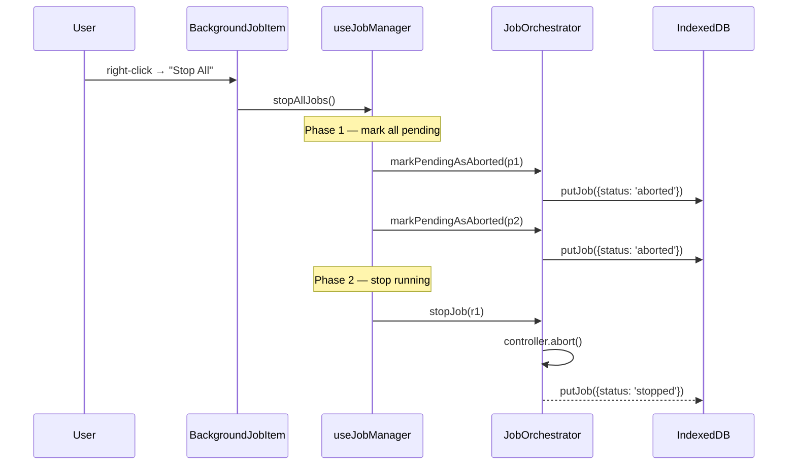

# Background Jobs Popover — Stop All

Right-click any background job in the status-bar popover and choose **Stop All** to halt every pending and running job in the queue. Pending jobs are converted to `aborted` (preserved in the popover for history), running jobs are stopped via the existing pipeline.

[x] New UI component - check this if new UI component added
[ ] New user config - check this if new user config introduced
[ ] Electron only - check this if new feature only work in Electron env.
[ ] User document - check this if this change requires to add/update/delete user documents in `docs` folder

## 1. Background

The `BackgroundJobsPopover` exposes per-job controls (abort button, Delete context-menu item) but has no bulk operation. Users running a long download batch or a multi-step transcribe/translate pipeline must right-click each row individually. There is no way to abort the whole queue at once.

Additionally, the `JobOrchestratorProvider` has an auto-chain feature: when a job finishes, the `executeJob` `finally` block looks for the next `pending` job of the same type+folder and starts it (`src/components/JobOrchestratorProvider.tsx`, lines around `tryAutoStartAll`). A naïve "stop running first, pending next" would simply trigger the next pending job immediately.

This change introduces a single context-menu entry that halts every active job while preserving the orchestrator's invariants.

## 2. Project Level Architecture

None. The change is contained to `apps/ui`.

## 3. App Level Architecture

```
BackgroundJobsPopover (status bar trigger)
  └─ PopoverContent
       └─ BackgroundJobsPopoverList
            └─ BackgroundJobItem              ← adds "Stop All" context menu
                 └─ useJobManager.stopAllJobs  ← new bulk operation
                      │
                      ├── Phase 1: mark pending → aborted
                      │   ├── generic  → store.abortJob
                      │   ├── test-delay → stopTestDelayJob (handles both states)
                      │   └── persisted  → orchestrator.markPendingAsAborted  ← new
                      │
                      └── Phase 2: stop running (existing)
                          ├── generic  → store.abortJob
                          ├── test-delay → stopTestDelayJob
                          └── persisted  → orchestrator.stopJob
```

The `JobOrchestratorProvider` exposes a new imperative method `markPendingAsAborted(id)` that writes `aborted` status to the IDB record for a pending job. The `backgroundJobsStore` `abortJob` is extended to also accept `pending` jobs (mirroring the test-delay behavior, which already handled both).

`useJobManager` exposes a new facade method `stopAllJobs()` that partitions the current job list and runs Phase 1 (await all) → Phase 2 (fire-and-forget) sequentially.

## 4. User Stories

### 4.1 Stop All Halts the Entire Queue

**Given** the popover shows 2 pending and 1 running job
**When** the user right-clicks any job and selects "Stop All"
**Then** all 3 jobs become `aborted` in the popover; no new jobs are auto-started afterward



### 4.2 Order Matters — Pending Before Running

**Given** a running transcribe job plus a pending transcribe job in the same folder
**When** the user invokes "Stop All"
**Then** the pending job is marked `aborted` BEFORE the running job is stopped, so the orchestrator's auto-chain `finally` block finds no pending siblings to start

**Verification:** the test "stops pending jobs before running jobs" asserts that all `markPendingAsAborted` calls have completed (IDB records updated) before any `stopJob` is invoked on a running job.

### 4.3 Stop All Is a No-op When Nothing Is Active

**Given** only `succeeded` / `failed` / `aborted` jobs in the popover
**When** the user invokes "Stop All"
**Then** no IDB writes occur and no aborts are sent; the menu still shows (per the design decision) but is a no-op

## 5. Tasks

### 5.1 Orchestrator: markPendingAsAborted

[x] Add `markPendingAsAborted(id)` to the context value type in `JobOrchestratorProvider.tsx`
[x] Implement the method: look up the record via `jobRecordsRef`, bail if not found or not `pending`, set `status = 'aborted'`, `updatedAt = Date.now()`, `await putJob(record)`, then `await syncFromIndexedDB('markPendingAsAborted')`
[x] Expose on `window.__jobOrchestrator` bridge
[ ] Add unit test in `JobOrchestratorProvider.test.tsx` (or new file) covering: marks pending → aborted, no-op for running/succeeded/missing

### 5.2 backgroundJobsStore: extend abortJob for pending

[x] Update `abortJob` reducer in `backgroundJobsStore.ts` so it transitions both `running` and `pending` to `aborted` (the existing `running` check is replaced with `(job.status === 'running' || job.status === 'pending')`)
[x] Add unit test in `backgroundJobsStore.test.ts` covering: pending → aborted, running → aborted, succeeded untouched

### 5.3 useJobManager: stopAllJobs

[x] Extend `UseJobManagerResult` interface with `stopAllJobs: () => Promise<void>`
[x] Implement: read `useBackgroundJobsStore.getState().jobs` once, partition into pending/running, await `Promise.all` of pending-job operations (generic → `store.abortJob`; test-delay → `stopTestDelayJob`; persisted → `orchestrator.markPendingAsAborted`), then iterate running jobs calling `stopJob` (fire-and-forget)
[x] Update `useJobManager.test.ts` with a test "stopAllJobs marks pending before stopping running" — assert call order using a vi.mocked sequence

### 5.4 UI: context-menu "Stop All"

[x] Extend `BackgroundJobItem` to accept a new `stopAllJobs` prop and add a `ContextMenuItem` above the existing Delete item, separated by a `ContextMenuSeparator`
[x] Extend `BackgroundJobsPopoverList` to forward the new prop through
[x] In `BackgroundJobsPopoverContent`, pass `stopAllJobs` from `useJobManager` down to the list
[x] The menu item is always visible; behavior is no-op when no pending/running jobs exist (per design choice)
[x] Use `data-testid="background-job-${job.id}-stop-all-menu"` for tests

### 5.5 i18n

[x] Add `statusBar.backgroundJobs.stopAll` key to all four locales
  * `en`: "Stop All"
  * `zh-CN`: "停止全部"
  * `zh-HK`: "停止全部"
  * `zh-TW`: "停止全部"
[x] Update test mocks that enumerate translation keys (e.g. `BackgroundJobsPopoverContent.test.tsx`, `BackgroundJobsPopoverList.test.tsx`) to include the new key

### 5.6 Tests

[x] Add `BackgroundJobItem.test.tsx` covering: menu renders both items, Stop All calls `stopAllJobs`, Delete still works as before
[x] Extend `BackgroundJobsPopoverContent.test.tsx` with an integration test that asserts the menu item reaches `useJobManager.stopAllJobs`
[x] Update `useJobManager.test.ts` with the "stops pending before running" order test

## 6. Backward Compatibility

- The change is purely additive: a new context-menu item, a new orchestrator method, a new `useJobManager` method.
- The `abortJob` store reducer now also matches `pending`; existing callers only ever pass running job IDs (single abort button is rendered for `running` only) so behavior for them is unchanged.
- The new `markPendingAsAborted` orchestrator method is a no-op for non-pending records, so existing IDB records are unaffected.
- `window.__jobOrchestrator` gains a method but does not change the signature of any existing method.

## 7. Documents

[ ] `docs/design/background-jobs-v2.md` — append a "Stop All" subsection under "Reactive hooks" / "Adding a new job type" that documents the user-facing flow and the new method on `useJobManager`.
[x] `apps/ui/public/locales/{en,zh-CN,zh-HK,zh-TW}/components.json` — add `stopAll` translation key.

## 8. Post Verification

[x] Unit tests
    Run `pnpm test:ui` and expect all unit tests to succeed — **1127 passed, 23 skipped**
[x] Type check
    Run `pnpm typecheck` and expect success — **passed**
[x] Build
    Run `pnpm build:ui` and expect build succeeded — **built in 24.88s** (pre-existing chunk-size warning, unrelated)
[x] Manual smoke — **completed by user**
    1. Create 2 pending + 1 running job (e.g. enqueue 3 transcribe tasks and abort the 1st manually after it starts; or use the test-delay job dialog to seed multiple jobs)
    2. Right-click any job → "Stop All"
    3. Verify all 3 jobs become `aborted` and the running one's progress stops advancing
    4. Verify no new auto-start fires after the operation
