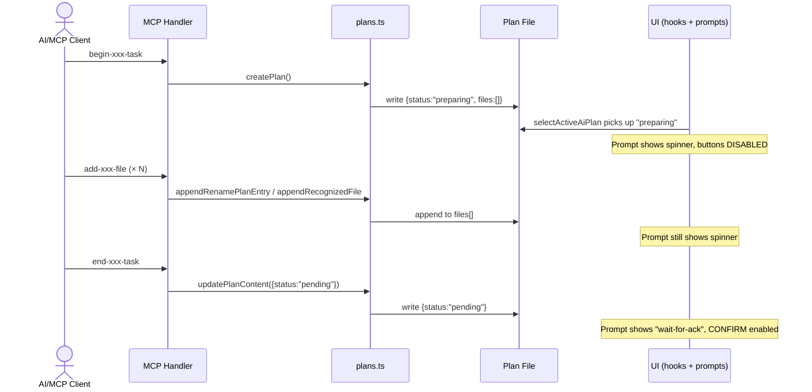

# Cancel Preparing Plan

## Background

AI creates rename/recognize plans via MCP tools using a three-step workflow:

1. `begin-xxx-task` → calls `createPlan()` → plan stored with `status: "preparing"`
2. `add-xxx-file` → calls `appendRenamePlanEntry()` / `appendRecognizedFile()` → appends entries to plan JSON
3. `end-xxx-task` → calls `updatePlanContent({status: "pending"})` → flips `preparing → pending`, broadcasts Socket.IO event

The UI detects plans via `selectActiveAiPlan()` which filters for `creator: "ai"` and `status: "preparing" | "pending"`. During "preparing", the UI renders `AiBasedRenameFilesPrompt` / `AiBasedRecognizePrompt` with a spinner and BOTH confirm and cancel buttons DISABLED. If the AI hangs or encounters an error mid-workflow, the plan is stuck in "preparing" forever, and the prompt cannot be dismissed.

## Goal

Enable the user to manually cancel a plan stuck in "preparing" status by clicking the Cancel button on the AI prompt. When the user cancels, the plan is marked as "rejected" via `updatePlan` API. When subsequent MCP `add-xxx-file` or `end-xxx-task` calls arrive for a rejected plan, they return a clear cancellation message so the AI stops.

## Codebase Analysis

### Architecture

```
┌─────────────────────────────────────────────────────────────┐
│                       AI / MCP Client                        │
│                                                              │
│  begin-xxx-task → add-xxx-file → add-xxx-file → end-xxx-task │
└──────────────┬──────────────────────────────────────────────┘
               │ MCP Streamable HTTP
               ▼
┌─────────────────────────────────────────────────────────────┐
│               packages/core-routes                            │
│                                                              │
│  mcp/toolHandlers/          tools/                           │
│  ├─ beginRenameTask.ts  →   renameFilesTask.ts               │
│  ├─ addRenameFile.ts    →   (build*Tool factories)           │
│  ├─ endRenameTask.ts    →       │                           │
│  ├─ beginRecognizeTask… →       ▼                           │
│  ├─ addRecognizedFile.t…→   tools/plans.ts                   │
│  └─ endRecognizeTask.ts →   (plan CRUD: create, append,      │
│                              read, update, delete)            │
└──────────────────────────┬──────────────────────────────────┘
                           │ POST /api/updatePlan
                           ▼
┌─────────────────────────────────────────────────────────────┐
│                       apps/ui                                 │
│                                                              │
│  AI prompts:                                                 │
│  ├─ AiBasedRecognizePrompt  (status: "generating"|"wait")    │
│  └─ AiBasedRenameFilePrompt (status: "generating"|"wait")    │
│                                                              │
│  Hooks:                                                      │
│  ├─ useAiBasedRecognizeFlow                                  │
│  │   └─ onCancel: updatePlan({status:"rejected"})            │
│  └─ useAiBasedRenameFilesFlow                                │
│      └─ onCancel: updatePlan({status:"rejected"})            │
└─────────────────────────────────────────────────────────────┘
```

### Code flow — plan lifecycle



### Key observations

1. **Cancel button is disabled during "generating"**:
   - `AiBasedRecognizePrompt` sets `isConfirmDisabledFinal = isConfirmDisabled || status === "generating"`
   - `FloatingPrompt` maps `isConfirmDisabled` → Cancel button's `disabled` prop
   - Result: during "generating" (preparing), BOTH confirm AND cancel are disabled

2. **`onCancel` handlers already exist and work**:
   - `useAiBasedRecognizeFlow.onCancel`: calls `updatePlanMutation({status:"rejected"})` + `cleanupRecognizePlan`
   - `useAiBasedRenameFilesFlow.onCancel`: same pattern
   - These just need the button to be enabled

3. **Plan file is deleted on "rejected"**:
   - `updatePlanContent()` calls `deletePlan()` for ALL terminal statuses (completed + rejected)
   - After user cancels, plan file is gone → add/end tools get "not found" instead of "rejected"

4. **MCP add/end tools don't check for rejected status**:
   - `appendRenamePlanEntry` / `appendRecognizedFile` only check for plan existence
   - `buildEndRenameFilesTaskTool` / `buildEndRecognizeTaskTool` only check for plan existence and empty files

## References

- `packages/core/types/planCommon.ts` — PlanStatus type, isTerminalPlanStatus
- `packages/core-routes/src/tools/plans.ts` — Plan CRUD operations
- `packages/core-routes/src/tools/renameFilesTask.ts` — Rename task tool builders
- `packages/core-routes/src/tools/recognizeMediaFilesTask.ts` — Recognize task tool builders
- `packages/core-routes/src/mcp/toolHandlers/` — MCP handler registrations
- `apps/ui/src/components/tv/AiBasedRecognizePrompt.tsx` — Recognize prompt
- `apps/ui/src/components/tv/AiBasedRenameFilePrompt.tsx` — Rename prompt
- `apps/ui/src/hooks/tv/useAiBasedRecognizeFlow.ts` — Recognize flow hook
- `apps/ui/src/hooks/tv/useAiBasedRenameFilesFlow.ts` — Rename flow hook
