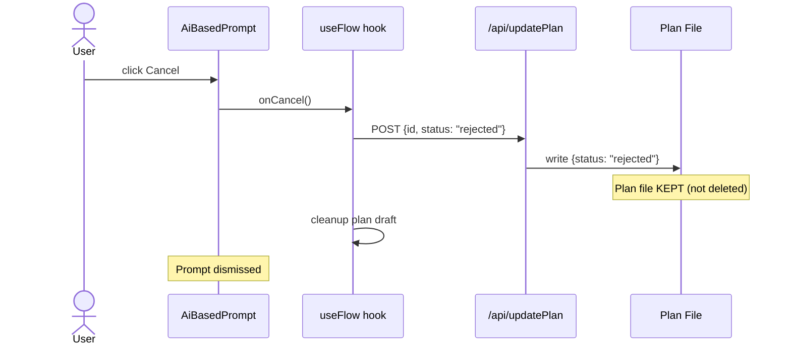
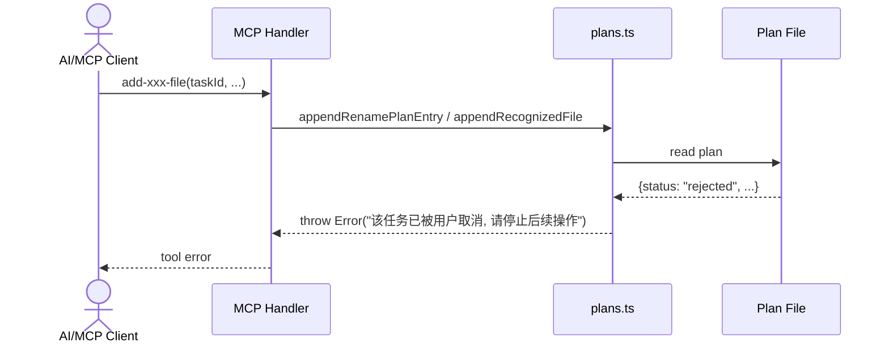
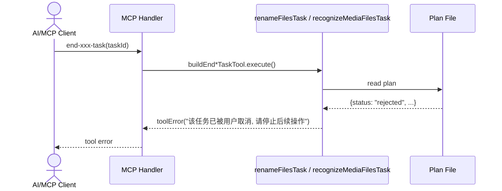

# Cancel Preparing Plan

支持用户在 plan 处于 preparing 状态时, 点击 prompt 的取消按钮取消计划.
后端 MCP add/end 工具检测到 plan 已被取消后, 返回明确消息通知 AI 停止操作.

[ ] New UI component - no
[ ] New user config - no
[ ] Electron only - no
[ ] User document - no

Refer to [context.md](context.md) for detail context.

## 1. Background

AI 通过 MCP 工具创建 plan 时采用三步流程: `begin-xxx-task`(创建 preparing plan) → `add-xxx-file`(逐个添加文件) → `end-xxx-task`(翻转为 pending).

在 preparing 阶段, UI 弹出 `AiBasedRenameFilesPrompt` / `AiBasedRecognizePrompt` 显示加载动画. 当前 Cancel 按钮在 generating 状态被禁用, 用户无法终止. 若 AI 端出现问题, plan 永久停留在 preparing 状态, prompt 无法关闭.

## 2. Architecture

### 2.1 Project Level Architecture

none — changes are contained within existing packages and apps.

### 2.2 App Level Architecture

none — no new wiring, APIs, or packages.

### 2.3 Key Points

**UI 侧**: 解除 generating 状态下 Cancel 按钮的禁用.

**后端 plans.ts**: `appendRenamePlanEntry` 和 `appendRecognizedFile` 在读取 plan 后检查 `status === "rejected"`, 若已取消则抛错. `updatePlanContent` 对 "rejected" 状态不删除 plan 文件 (仅 "completed" 删除), 使 add/end 工具能检测到已取消状态.

**后端 tool builders**: `buildEndRenameFilesTaskTool` 和 `buildEndRecognizeTaskTool` 在读取 plan 后检查 `status === "rejected"`, 若已取消返回 toolError.

## 3. User Stories

### 3.1 User Cancels Preparing Plan From Prompt

* **Given** AI 正在准备 plan (plan status = "preparing"), UI 显示 prompt 和加载动画
* **When** 用户点击 prompt 上的 Cancel 按钮
* **Then** plan 的 status 被设置为 "rejected", prompt 消失, plan 文件保留 (不被删除) 以便后续工具检测

### 3.2 AI Calls add-xxx-file After User Cancelled

* **Given** 用户已取消 plan (plan status = "rejected")
* **When** AI 调用 `add-rename-file-to-task` 或 `add-recognized-media-file`
* **Then** 工具返回错误消息 "该任务已被用户取消, 请停止后续操作"

### 3.3 AI Calls end-xxx-task After User Cancelled

* **Given** 用户已取消 plan (plan status = "rejected")
* **When** AI 调用 `end-rename-files-task` 或 `end-recognize-task`
* **Then** 工具返回错误消息 "该任务已被用户取消, 请停止后续操作"

## 4. Tasks

### 4.1 UI: Enable Cancel Button During Generating

[x] Task 1: `AiBasedRecognizePrompt.tsx` — 将 `isConfirmDisabledFinal` 的计算修改为不因 `generating` 状态禁用 Cancel 按钮
[x] Task 2: `AiBasedRenameFilePrompt.tsx` — 同上

### 4.2 Backend: Rejected Plan Detection in Add/End Tools

[x] Task 3: `plans.ts` `appendRenamePlanEntry` — 读取 plan 后检查 `status === "rejected"`, 若已取消抛错
[x] Task 4: `plans.ts` `appendRecognizedFile` — 同上
[x] Task 5: `plans.ts` `updatePlanContent` — 修改终端状态删除逻辑: 仅 "completed" 删除文件, "rejected" 保留
[x] Task 6: `renameFilesTask.ts` `buildEndRenameFilesTaskTool` — 读取 plan 后检查 `status === "rejected"`, 返回 toolError
[x] Task 7: `recognizeMediaFilesTask.ts` `buildEndRecognizeTaskTool` — 同上

### 4.3 Cancellation Message Constant

[x] Task 8: `planTaskMessages.ts` — 添加 `PLAN_CANCELLED_BY_USER_MESSAGE` 常量, 所有 rejected 检查统一使用

## 5. Backward Compatibility

1. **Plan file no longer deleted on "rejected"**: 之前 rejected 的 plan 文件会被删除, 现在保留. `getActivePlansForFolder` 只返回 `["preparing", "pending"]`, 不影响 UI. 积累的 rejected plan 文件可通过后续清理机制处理.
2. **Cancel button now enabled during generating**: 之前 disabled, 现在 enabled. `onCancel` handler 已存在且功能正确, 无破坏性变更.

## 6. Documents

none — 无需更新用户文档.

## 7. Post Verification

[x] Unit tests
    Run `pnpm run test` and expect all unit tests succeeded
    - core: 302 passed
    - core-routes: 221 passed (4 new for cancellation)
    - UI: 1438 passed
    - CLI: 253 passed
[x] Build
    Run `pnpm run build` and expect build succeeded
    - core-routes built successfully
    - UI built successfully
    - CLI built successfully
[x] Type check
    Run `pnpm run typecheck` and expect no new errors
    - No new errors introduced; all errors present in the typecheck output were pre-existing in unrelated files (verified via `git stash`).
