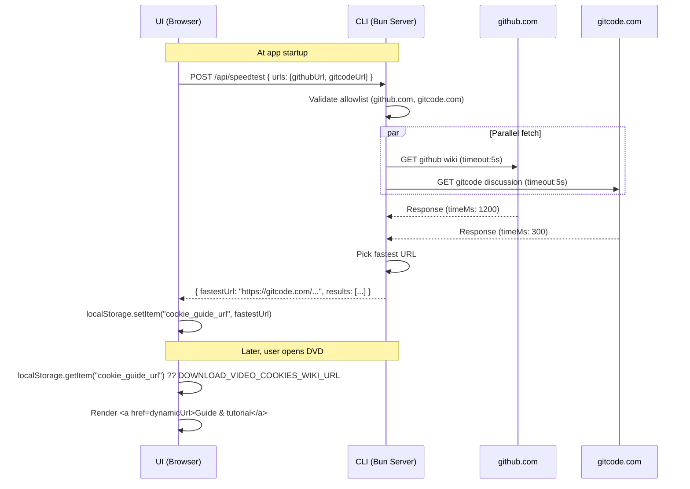

# Cookie Guide URL Speedtest

Add network-speed-aware URL selection for the DVD "Guide & tutorial" link so Chinese users can be redirected to the faster mirror (GitCode vs GitHub).

[ ] New UI component - no
[ ] New user config - no
[ ] Electron only - no
[ ] User document - no

## 1. Background

The Download Video Dialog (DVD) has a "Guide & tutorial" link that opens a wiki page explaining how to set cookies for downloading. Currently it points to a static GitHub URL:
`https://github.com/lawrenceching/SMM/wiki/How-to-login(set-cookies)-before-downloading`

For Chinese mainland users, GitHub can be slow or unreachable. A GitCode mirror exists at:
`https://gitcode.com/lawrenceching/simple-media-manager/discussions/3`

The system should dynamically pick the faster URL at app startup.

## 2. Project Level Architecture

None. The change spans `apps/cli` (new API endpoint + allowlist validation), `apps/ui` (startup logic + localStorage + DVD component update), and `packages/core` (new URL constant).

## 3. App Level Architecture

### apps/cli

New route file `src/route/speedtest.ts`:
- Registers `POST /api/speedtest`
- Accepts JSON body `{ urls: string[] }` (the two URLs to test)
- **Allowlist validation**: Rejects any URL whose hostname is not `github.com` or `gitcode.com` (or their subdomains). Returns 400 if invalid URLs are provided.
- Tests all URLs with `fetch()` + `AbortController` (timeout = 5s each), measures response time (TTFB or full download).
- Returns `{ fastestUrl: string, results: Array<{ url: string, timeMs: number, error?: string }> }`
- Registered in `server.ts` `setupRoutes()`.

### apps/ui

1. New API function `src/api/speedtest.ts` calling `POST /api/speedtest`.
2. New component `src/components/initialization/DvdGuideUrlInitializer.tsx` that:
   - On mount, calls the speedtest API with the two URLs
   - Stores the fastest URL in `localStorage` with key `cookie_guide_url`
   - On error (network failure, API error), silently falls back without writing to localStorage (existing default will be used)
3. `AppInitializer.tsx` mounts `<DvdGuideUrlInitializer />` so the test runs at app startup.
4. `cookies-section.tsx` reads from `localStorage.getItem("cookie_guide_url")` on render and uses it as the href. Falls back to `DOWNLOAD_VIDEO_COOKIES_WIKI_URL` if not found.

### packages/core

Add a new constant `DOWNLOAD_VIDEO_COOKIES_GITCODE_URL` next to `DOWNLOAD_VIDEO_COOKIES_WIKI_URL` in `download-video-cookie-platform.ts`.

## 4. User Stories

### 4.1 Speed-aware guide link

* **Given** - A user in mainland China opens the Download Video Dialog
* **When** - The app has already tested both GitHub and GitCode URLs at startup
* **Then** - The "Guide & tutorial" link points to whichever URL responded faster

## 5. Tasks

### 5.1 packages/core - Add GitCode URL constant

[x] Add `DOWNLOAD_VIDEO_COOKIES_GITCODE_URL` to `download-video-cookie-platform.ts`
[x] Add unit test for the new constant

### 5.2 apps/cli - Speedtest API endpoint

[x] Create `src/route/speedtest.ts` with `handleSpeedtest` handler
  - Allowlist validation (only github.com, gitcode.com)
  - Parallel fetch with timeout measurement
  - Return fastest URL + results
[x] Register route in `server.ts` (`handleSpeedtest(this.app)`)
[x] Write unit tests for speedtest handler (allowlist, timeout, success cases)

### 5.3 apps/ui - API layer

[x] Create `src/api/speedtest.ts` with `speedtest(urls: string[])` function
[x] Write unit test for the API function

### 5.4 apps/ui - Startup initializer

[x] Create `src/components/initialization/DvdGuideUrlInitializer.tsx`
  - Calls speedtest API on mount
  - Stores result in localStorage
  - Silently handles errors
[x] Mount `<DvdGuideUrlInitializer />` inside `AppInitializer.tsx`

### 5.5 apps/ui - DVD component update

[x] Update `cookies-section.tsx` to read from localStorage and fall back to `DOWNLOAD_VIDEO_COOKIES_WIKI_URL`

## 6. Backward Compatibility

None. The static `DOWNLOAD_VIDEO_COOKIES_WIKI_URL` remains as the default fallback — when localStorage has no value (first run before test completes, or if the API call fails), the existing behavior is preserved.

## 7. Documents

No user-facing docs changes needed. The feature is transparent.

## 8. Post Verification

[x] Unit tests
    - Core: 9 files / 214 passed
    - CLI: 18 files / 200 passed (incl. 12 speedtest tests)
    - UI: 112 files / 1024 passed (incl. 4 speedtest API tests)
[x] Build
    - UI: `vite build` succeeded
    - CLI: `bun run scripts/build.ts` succeeded
