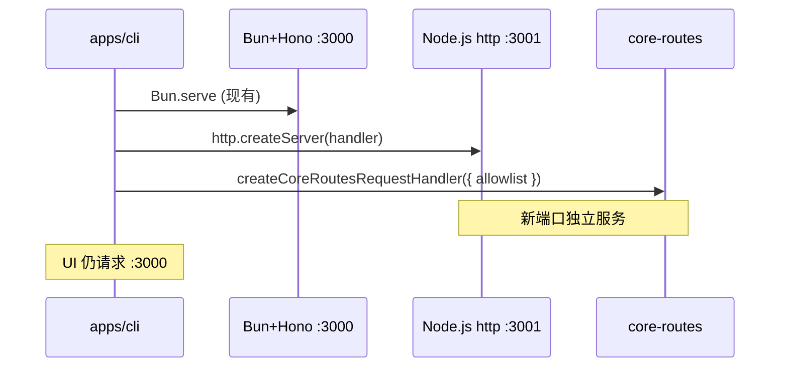

# packages/core-routes

将通用 HTTP 接口逻辑从 `apps/cli` 抽离为独立包，基于 Node.js 原生 `node:http` 提供路由 handler。本阶段实现 `listFiles` 与 `writeFile`，并在 `apps/cli` 中启动独立的 Node.js HTTP 服务器注册这些接口。现有 Hono/Bun 路由保留，UI 仍走原服务器。

[ ] New UI component
[ ] New user config
[ ] Electron only
[ ] User document

## 1. Background

当前所有 HTTP API 均实现在 `apps/cli` 内，通过 Hono + Bun.serve 提供服务。为支持未来在非 Bun 环境（如 HarmonyOS、纯 Node.js 运行时）复用接口逻辑，需要抽离与框架无关的路由实现。

**目标**：
- 新建 `packages/core-routes`，只负责接口逻辑，不启动 HTTP server
- 使用 Node.js 原生 `IncomingMessage` / `ServerResponse` 作为 handler 签名
- 导出单独的路由 handler，并提供一次性注册全部路由的方法
- `apps/cli` 额外启动一个 Node.js HTTP 服务器（新端口），注册 core-routes 接口
- 保留现有 Hono 路由，此阶段 UI 不切换

## 2. Project Level Architecture

```
┌─────────────────────────────────────────────────────────────┐
│                      apps/electron                           │
│  BrowserWindow → http://localhost:{cliPort} (现有 Bun 服务)   │
└─────────────────────────────────────────────────────────────┘
                              │
                              ▼
┌─────────────────────────────────────────────────────────────┐
│                        apps/cli                              │
│                                                              │
│  ┌──────────────────────┐   ┌─────────────────────────────┐ │
│  │ Bun + Hono (现有)     │   │ Node.js http (新增)          │ │
│  │ PORT (默认 3000)      │   │ CORE_ROUTES_PORT (默认 3001) │ │
│  │ /api/listFiles        │   │ /api/listFiles               │ │
│  │ /api/writeFile        │   │ /api/writeFile               │ │
│  │ ... 其他 API          │   │                              │ │
│  └──────────┬───────────┘   └──────────────┬──────────────┘ │
│             │                                │                 │
│             └────────────┬───────────────────┘                 │
│                          ▼                                     │
│              packages/core-routes (共享业务逻辑)                 │
│                          │                                     │
│                          ▼                                     │
│              packages/core (类型、Path、errors)                  │
└─────────────────────────────────────────────────────────────┘
```

新增 monorepo 包：

| 包名 | 描述 |
|------|------|
| **packages/core-routes** | 框架无关的 HTTP 路由 handler 与业务逻辑 |

## 3. App Level Architecture

### packages/core-routes

```
packages/core-routes/
├── package.json          # name: @smm/core-routes
├── tsconfig.json
└── src/
    ├── index.ts          # 公共导出
    ├── types.ts          # CoreRoutesConfig, RouteContext, Logger
    ├── http.ts           # readJsonBody, sendJson, createUrl
    ├── allowlist.ts      # validatePathIsInAllowlist(posixPath, allowlist)
    ├── listFiles.ts      # doListFiles()
    ├── writeFile.ts      # doWriteFile() — 使用 node:fs，不用 Bun API
    ├── routes/
    │   ├── listFilesRoute.ts   # handleListFilesGet, handleListFilesPost
    │   └── writeFileRoute.ts   # handleWriteFilePost
    └── register.ts       # createCoreRoutesRequestHandler, registerCoreRoutes
```

**依赖**：
- `@smm/core` — 类型（`ListFilesRequestBody` 等）、`Path`、`existedFileError`
- `zod` — 请求校验（与 cli 保持一致）
- 仅使用 Node.js 内置模块（`node:http`, `node:fs/promises`, `node:path`, `node:os`）

**Handler 签名**：

```typescript
import type { IncomingMessage, ServerResponse } from "node:http";

export interface CoreRoutesConfig {
  /** POSIX 格式路径列表，用于 writeFile allowlist 校验 */
  allowlist: string[];
  /** 可选日志接口，不传则静默 */
  logger?: CoreRoutesLogger;
  /** 可选；设置后 POST /api/hello 通过 doHello 返回 bootstrap 握手数据 */
  hello?: HelloOptions;
}

export interface RouteContext {
  config: CoreRoutesConfig;
  url: URL;
}

export type RouteHandler = (
  req: IncomingMessage,
  res: ServerResponse,
  ctx: RouteContext,
) => Promise<boolean>; // true = 已处理该请求
```

**公共导出**：

| 导出 | 用途 |
|------|------|
| `doListFiles(body)` | 纯业务逻辑，可被 Hono handler 复用 |
| `doWriteFile(body, config)` | 纯业务逻辑，含 allowlist 校验 |
| `doHello(options)` | bootstrap 握手纯函数（无 I/O） |
| `validatePathIsInAllowlist(path, allowlist)` | 路径校验工具 |
| `handleListFilesGet` / `handleListFilesPost` | 单独 Node.js 路由 handler |
| `handleWriteFilePost` | 单独 Node.js 路由 handler |
| `handleHelloPost` | 单独 Node.js 路由 handler |
| `createCoreRoutesRequestHandler(config)` | 返回 `(req, res) => void`，供 `http.createServer` 使用 |
| `registerCoreRoutes(server, config)` | 在已有 `http.Server` 上挂载 request 监听器 |

**路由表**（与现有 API 保持一致）：

| Method | Path | Handler |
|--------|------|---------|
| GET | `/api/listFiles` | `handleListFilesGet` |
| POST | `/api/listFiles` | `handleListFilesPost` |
| POST | `/api/writeFile` | `handleWriteFilePost` |
| POST | `/api/hello` | `handleHelloPost` |

**writeFile 改造要点**：
- 将 `Bun.file` / `Bun.write` 替换为 `node:fs/promises` 的 `writeFile`
- allowlist 逻辑移入 `allowlist.ts`，通过 `CoreRoutesConfig.allowlist` 传入
- 保留 per-file lock 机制

**listFiles 改造要点**：
- 业务逻辑原样移植，logger 改为可选 inject
- 不依赖 Hono

### apps/cli

新增 `apps/cli/src/coreRoutesServer.ts`：

```typescript
// 伪代码
import http from "node:http";
import { createCoreRoutesRequestHandler } from "@smm/core-routes";
import { buildAllowlist } from "./utils/buildAllowlist"; // 从现有 path-validator 逻辑提取

export async function startCoreRoutesServer(): Promise<http.Server> {
  const port = parseInt(process.env.CORE_ROUTES_PORT ?? "3001", 10);
  const allowlist = await buildAllowlist();
  const handler = createCoreRoutesRequestHandler({ allowlist, logger });
  const server = http.createServer(handler);
  await new Promise<void>((resolve) => server.listen(port, resolve));
  return server;
}
```

**allowlist 构建**：从现有 `path-validator.ts` 提取 `buildAllowlist()` 函数（读取 userDataDir、appDataDir、tmpDir、userConfig.folders），返回 POSIX 路径数组。`validatePathIsInAllowlist` 调用 `@smm/core-routes` 的实现。

**现有 Hono 路由**（保留，不删除）：
- `ListFiles.ts` / `WriteFile.ts` 的 `handleListFiles` / `handleWriteFile` 保留
- 可选重构：`doListFiles` / `doWriteFile` 改为从 `@smm/core-routes` import，消除重复逻辑（路由注册代码不动）

**启动流程**（`server.ts`）：
- CLI 启动时，在 Bun server 启动后并行启动 core-routes Node.js server
- shutdown 时关闭两个 server

## 4. User Stories

### 4.1 CLI 启动 Node.js core-routes 服务器

* **Given** - CLI 进程启动，`CORE_ROUTES_PORT=3001`
* **When** - Server 初始化完成
* **Then** - Node.js HTTP 服务器在 3001 端口监听，`GET /api/listFiles?path=~` 返回与 Hono 路由相同格式的 JSON



### 4.2 writeFile allowlist 校验

* **Given** - allowlist 包含 `/home/user/media`
* **When** - POST `/api/writeFile` 写入 `/home/user/media/test.txt`
* **Then** - 写入成功；若路径不在 allowlist 则返回 400 错误

## 5. Tasks

### 5.1 创建 packages/core-routes

- [x] 创建 `package.json`（name: `@smm/core-routes`，workspace 依赖 `@smm/core`）
- [x] 创建 `tsconfig.json`（对齐 packages/core 配置）
- [x] 实现 `http.ts` 工具函数
- [x] 实现 `allowlist.ts`
- [x] 移植 `doListFiles` 到 `listFiles.ts`
- [x] 移植 `doWriteFile` 到 `writeFile.ts`（Node.js fs 替代 Bun）
- [x] 实现单独 route handlers（`routes/*.ts`）
- [x] 实现 `createCoreRoutesRequestHandler` 和 `registerCoreRoutes`
- [x] 编写单元测试（listFiles、writeFile、allowlist、路由分发）

### 5.2 apps/cli 集成

- [x] 提取 `buildAllowlist()` 从 `path-validator.ts`
- [x] 重构 `path-validator.ts` 使用 `@smm/core-routes` 的校验函数
- [x] 创建 `coreRoutesServer.ts` 启动 Node.js server
- [x] 在 `index.ts` 启动/关闭 core-routes server
- [x] Hono 路由的 `doListFiles`/`doWriteFile` 改为 import 自 core-routes
- [x] 添加 `@smm/core-routes` 到 cli `package.json` dependencies
- [x] 更新根 `package.json` typecheck 脚本

## 6. Backward Compatibility

- 现有 Hono API 路径、请求/响应格式不变
- UI 仍连接原 CLI 端口，行为无变化
- 新 Node.js 服务器为增量能力，未配置 `CORE_ROUTES_PORT` 时使用默认值 3001
- `writeFile` 从 Bun API 切换到 Node.js fs 在 core-routes 中实现；Hono 路由若复用 `doWriteFile` 则行为一致

## 7. Documents

- [ ] `docs/api/index.md` — 注明 core-routes 服务器端口与接口（可选，此阶段 UI 未切换）

## 8. Post Verification

- [x] 单元测试：`pnpm --filter @smm/core-routes test`
- [x] CLI 测试：`pnpm --filter cli test`
- [x] 类型检查：`pnpm --filter @smm/core-routes typecheck`
- [ ] 手动验证：启动 CLI 后 `curl http://localhost:3001/api/listFiles?path=~` 返回预期 JSON
