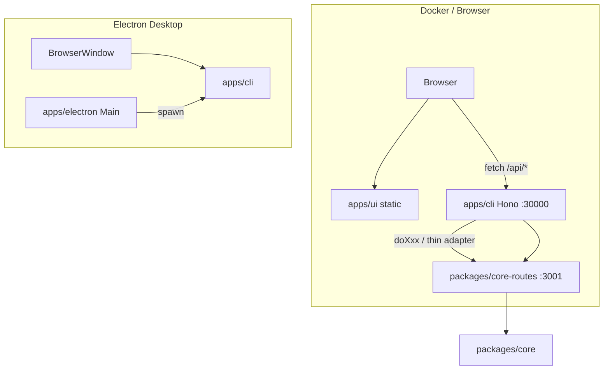
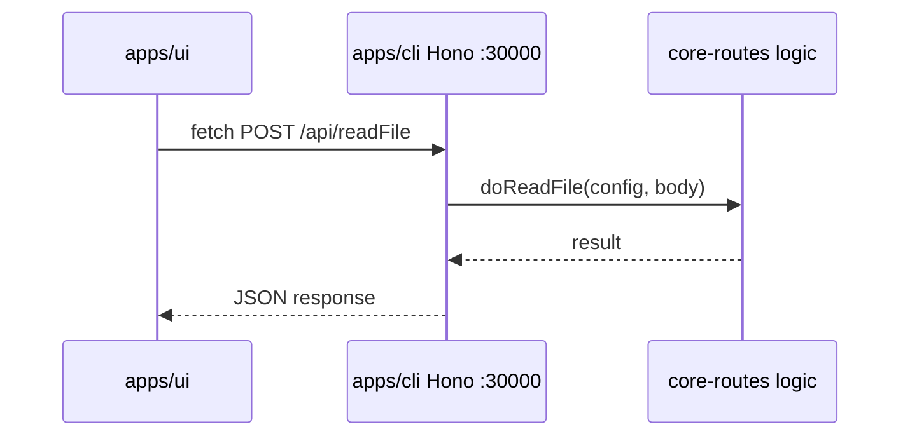
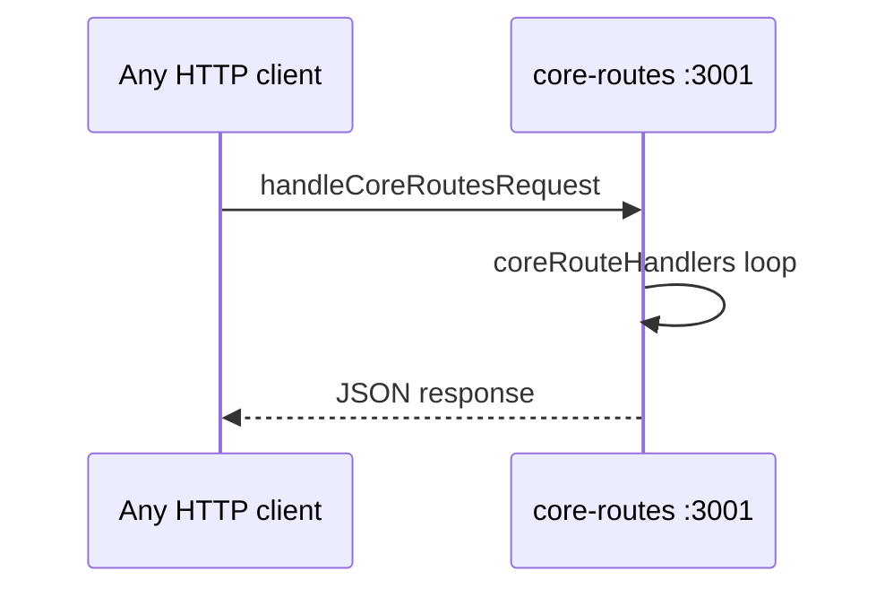
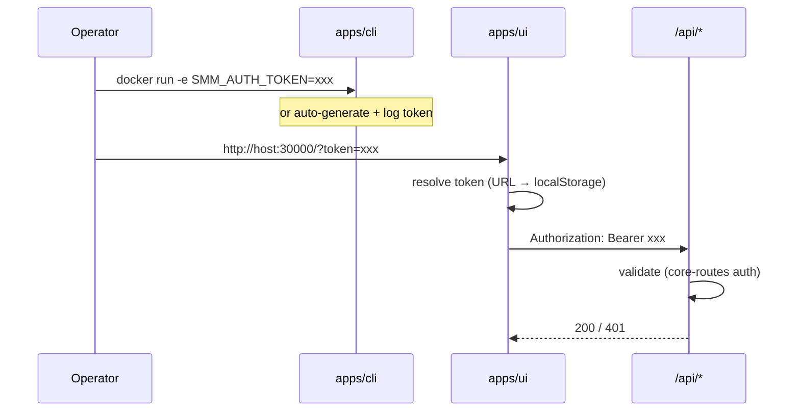

# Docker Authentication

SMM 正在支持 Docker 部署（`apps/docker`）。Docker 模式下 CLI 通过 HTTP 对外暴露 UI 静态资源与 `/api/*` 接口，默认监听 `0.0.0.0:30000`，任何能访问端口的客户端都可调用文件读写、媒体元数据、ffmpeg/yt-dlp 执行等能力。与 Electron 桌面版（localhost + 子进程隔离）不同，Docker 场景需要 API 层认证，防止未授权访问。

## Goal

为 SMM 添加基于 Bearer Token 的 HTTP API 认证，支撑 Docker 安全部署：

1. **CLI 启动**：读取 `SMM_AUTH_TOKEN` 环境变量；若缺失或为空则自动生成 token 并打印到 console log。
2. **API 校验**：所有 CLI 侧 HTTP API 校验 `Authorization: Bearer <token>`；校验逻辑实现在 `packages/core-routes`，并通过配置允许使用方（cli / ohos）开启或关闭。
3. **UI 请求**：HTTP 请求携带 `Authorization` 头；token 来源为 URL query parameter `token` 或 localStorage key `auth-token`。

## Codebase Analysis

### Architecture

- **apps/cli**：主 HTTP 服务（Hono + Bun），对外提供 `/api/*`、静态 UI、`/socket.io/`。内部另启 `core-routes` 独立端口（默认 3001），供部分路由或 MCP 等使用。
- **packages/core-routes**：与框架无关的 `node:http` 路由 handler（`handleCoreRoutesRequest`）及共享业务逻辑（`doXxx`）。cli 的 Hono 路由多为 thin adapter，调用 `doXxx`。
- **apps/ui**：约 40+ 个 `apps/ui/src/api/*.ts` 模块直接调用 `fetch('/api/...')`，无统一 HTTP 客户端；Socket.IO 通过 `useWebSocket` 连接同源 host。
- **apps/ohos**：Electron Main 进程内嵌 `core-routes`（`apps/ohos/src/http/server.ts`），不 spawn cli；同样消费 `CoreRoutesConfig`。
- **apps/docker**：镜像运行 `/app/cli --staticDir /app/public --port 30000`，尚未设置 `SMM_AUTH_TOKEN`。

### Code flow

**当前 HTTP 请求路径（Docker / 浏览器）：**

**core-routes 独立端口（并行存在，UI 通常不直连）：**

**目标认证流程：**

### 相关模块

| 模块 | 路径 | 说明 |
|------|------|------|
| CLI 入口 | `apps/cli/index.ts` | 启动 Hono Server + `startCoreRoutesServer()` |
| Hono 路由注册 | `apps/cli/server.ts` | 全部 `/api/*` Hono handler + CORS |
| core-routes 注册 | `packages/core-routes/src/register.ts` | `handleCoreRoutesRequest` + `coreRouteHandlers` |
| CoreRoutesConfig | `packages/core-routes/src/types.ts` | 平台注入 allowlist、logger、hello、chat、mcp 等 |
| UI API 层 | `apps/ui/src/api/*.ts` | 分散的 `fetch` 调用 |
| Socket.IO | `apps/ui/src/hooks/useWebSocket.ts` | 同源连接，当前无 auth |
| Docker | `apps/docker/Dockerfile` | 暴露 30000，无 auth 环境变量 |

### 与现有 API 设计的关系

项目 API 约定：业务成功/失败由响应体 `data` / `error` 字段表达；HTTP 状态码用于 HTTP 层。认证失败属于 HTTP 层，适合返回 **401 Unauthorized**（需在 design 中确认是否与部分路由的 200+error 风格统一）。

CORS 当前 `allowHeaders` 含 `Content-Type, X-Timeout, ...`，未包含 `Authorization`，启用 auth 后需扩展。

## References

- [Architecture](../../../architecture.md) — Docker / Browser 部署拓扑
- [core-routes-migration](../core-routes-migration.md) — core-routes 与 cli Hono 分层
- [apps/docker/docs/development-plan.md](../../../../apps/docker/docs/development-plan.md) — Docker 打包与运行
- [apps/docker/README.md](../../../../apps/docker/README.md) — 构建与访问方式
