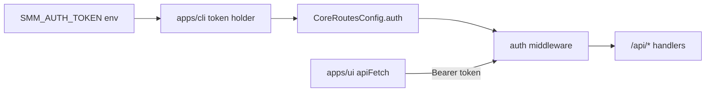
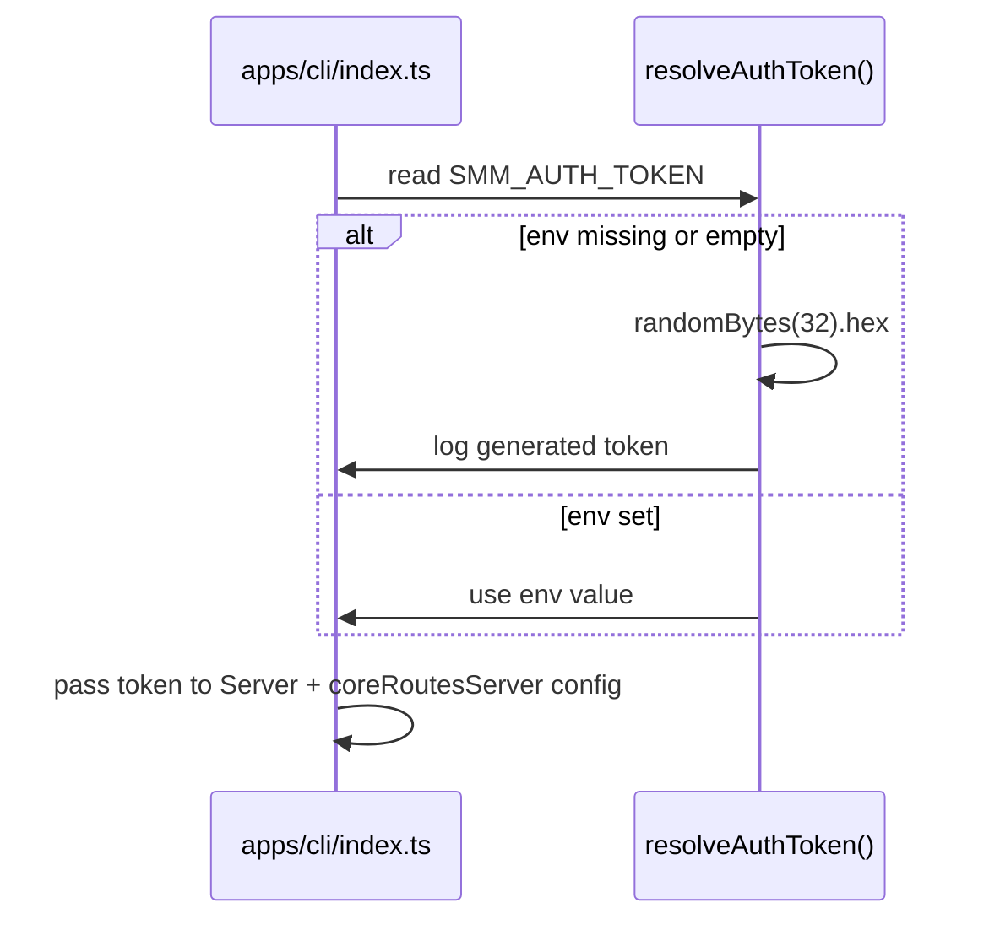
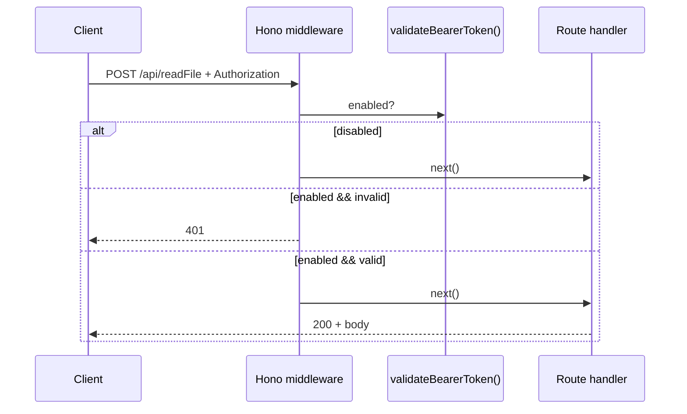
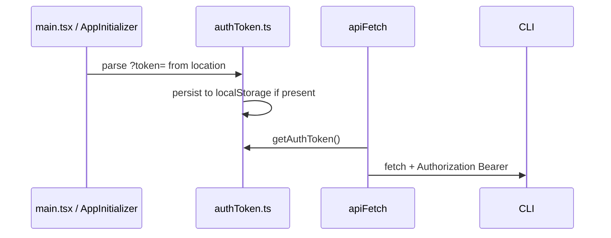

# Docker Authentication

为 Docker 部署添加 Bearer Token HTTP API 认证：CLI 管理 token，core-routes 提供可开关的校验逻辑，UI 统一注入 `Authorization` 头。

[ ] New UI component
[ ] New user config
[ ] Electron only
[x] User document — Docker 运行说明需补充 token 用法

## 1. Background

Docker 模式下 SMM CLI 对外暴露完整媒体管理能力，缺少认证时任意访问者均可读写允许目录内的文件。Electron 桌面版依赖 localhost 信任边界，通常不需要 token。

详见 [context.md](./context.md)。

## 2. Architecture

### 2.1 Project Level Architecture

在现有「UI → CLI Hono → core-routes 业务逻辑」链路上增加 **Auth 层**：

- **Token 生命周期**：由 `apps/cli` 在启动时从 `SMM_AUTH_TOKEN` 读取或生成，持有在进程内存中。
- **校验逻辑**：实现在 `packages/core-routes`（可复用函数 + `handleCoreRoutesRequest` 前置校验），通过 `CoreRoutesConfig.auth` 开关。
- **CLI Hono 层**：复用 core-routes 导出的校验函数，对 `/api/*` 统一 middleware（与 core-routes 开关一致）。
- **UI 层**：新增共享 `apiFetch`（或等价模块），所有对 SMM 后端的 `fetch('/api/...')` 经此注入 `Authorization`；token 从 URL `?token=` 或 `localStorage['auth-token']` 解析。



### 2.2 App Level Architecture

| App / Package | 变更 |
|---------------|------|
| `packages/core-routes` | 新增 `auth.ts`（解析 Bearer、校验 token）、扩展 `CoreRoutesConfig`、在 `handleCoreRoutesRequest` 入口校验 |
| `apps/cli` | 启动时 resolve token；构建 config 时注入 auth；Hono `/api/*` middleware；core-routes server config 同步 |
| `apps/ui` | `lib/authToken.ts` + `lib/apiFetch.ts`；迁移 `apps/ui/src/api/*`；bootstrap 时解析 URL token；CORS 相关无需 UI 改动 |
| `apps/ohos` | 通过 `CoreRoutesConfig.auth.enabled: false` 保持现状（本地 Electron Main） |
| `apps/docker` | 文档补充 `SMM_AUTH_TOKEN`；可选 Dockerfile `ENV` 示例 |

### 2.3 Key Points

| 项 | 方案 |
|----|------|
| Token 生成 | `crypto.randomBytes(32).toString('hex')`（64 字符 hex） |
| Token 存储（服务端） | 进程内存；来源 `process.env.SMM_AUTH_TOKEN` 或启动时生成 |
| 启用条件 | `CoreRoutesConfig.auth.enabled === true` 时校验；为 `false` 或未配置时跳过（桌面 / OHOS 默认） |
| CLI 如何决定 enabled | 新增环境变量 `SMM_AUTH_ENABLED=true` 时启用；Docker 文档建议与 `SMM_AUTH_TOKEN` 一并设置。若仅设置 `SMM_AUTH_TOKEN` 而未设置 `SMM_AUTH_ENABLED`，**默认仍关闭校验**（避免破坏现有 Electron 开发体验）；Docker 启动脚本显式开启。 |
| Header 格式 | `Authorization: Bearer <token>`（大小写不敏感 scheme，trim token） |
| 失败响应 | HTTP **401**，body `{ "error": "Unauthorized: invalid or missing token" }`（HTTP 层错误，不设 `data`） |
| 豁免路径 | 静态资源 `/*`（非 `/api`）；**不豁免** `/api/hello`（UI 须先取得 token 再 bootstrap） |
| UI token 优先级 | URL query `token` **高于** `localStorage['auth-token']`；若 URL 有 token 则写入 localStorage 以便刷新后保留 |
| Socket.IO | **本阶段不纳入** Bearer 校验（用户未要求）；design 留后续项；Docker 若需完整隔离需单独设计 |

## 3. User Stories

### 3.1 CLI 启动时 resolve token

* **Given** CLI 进程启动
* **When** 读取 `SMM_AUTH_TOKEN`
* **Then** 若变量存在且非空则使用该值；否则生成新 token 并 `logger.info` 打印（含明确文案，便于 operator 复制）



### 3.2 Docker 部署启用 API 认证

* **Given** `SMM_AUTH_ENABLED=true` 且 token 已 resolve
* **When** 客户端请求 `/api/*` 且 `Authorization` 不匹配
* **Then** 返回 401，不执行业务逻辑

* **Given** 请求携带正确 `Authorization: Bearer <token>`
* **When** 调用任意 `/api/*`
* **Then** 正常进入现有 handler



### 3.3 UI 携带 token 访问

* **Given** 用户打开 `http://host:30000/?token=abc`
* **When** UI 发起 API 请求
* **Then** `Authorization: Bearer abc`；且 `localStorage.setItem('auth-token', 'abc')`

* **Given** 无 URL token，localStorage 存有 `auth-token`
* **When** UI 发起 API 请求
* **Then** 使用 localStorage 值作为 Bearer token

* **Given** auth 已启用但 UI 无 token
* **When** 调用 `/api/hello`
* **Then** 401；UI 应展示可理解的错误（如提示在 URL 添加 `?token=`）



### 3.4 桌面 Electron 默认行为不变

* **Given** 未设置 `SMM_AUTH_ENABLED`
* **When** Electron 本地开发或打包运行
* **Then** 所有 API 无需 `Authorization`，与当前行为一致

## 4. Tasks

### 4.1 packages/core-routes

[x] **T1** 新增 `src/auth.ts`
  - `parseBearerToken(authorizationHeader: string | undefined): string | null`
  - `validateBearerToken(header, expectedToken): boolean`
  - `createAuthMiddleware(config):` 返回 `(req, res) => boolean`（已响应 401 则 true）

[x] **T2** 扩展 `CoreRoutesConfig`（`types.ts`）
  ```ts
  auth?: {
    enabled: boolean;
    token: string;
  };
  ```

[x] **T3** 在 `handleCoreRoutesRequest`（`register.ts`）中，在 `coreRouteHandlers` 循环之前调用 auth 校验（`config.auth?.enabled` 时）

[x] **T4** 导出 auth 工具与类型（`index.ts`）

[x] **T5** 单元测试（`auth.test.ts`）
  - 合法 / 非法 Bearer
  - enabled false 时跳过
  - 缺失 header 返回 401

### 4.2 apps/cli

[x] **T6** 新增 `src/utils/authToken.ts`（或 `lib/authToken.ts`）
  - `resolveAuthToken(): string` — 读 env / 生成 / log
  - `isAuthEnabled(): boolean` — 读 `SMM_AUTH_ENABLED`

[x] **T7** `index.ts` 启动早期调用 `resolveAuthToken()`，将 token 传入 `Server` 与 `startCoreRoutesServer`

[x] **T8** `coreRoutesServer.ts` — `CoreRoutesConfig` 注入 `auth: { enabled, token }`

[x] **T9** `server.ts` — Hono middleware：`/api/*` 在 auth enabled 时校验；扩展 CORS `allowHeaders` 加入 `Authorization`

[x] **T10** 可选：导出 Hono 复用 helper `createHonoAuthMiddleware(token, enabled)` 放在 core-routes 或 cli 本地 thin wrapper — 使用 `isRequestAuthorized` 代替

[ ] **T11** CLI 单元/集成测试：enabled 时无 token 401；disabled 时不影响现有测试

### 4.3 apps/ui

[x] **T12** 新增 `src/lib/authToken.ts`
  - `AUTH_TOKEN_STORAGE_KEY = 'auth-token'`
  - `initAuthTokenFromUrl(): void` — 启动时从 `URLSearchParams` 读取 `token` 并持久化
  - `getAuthToken(): string | null` — URL 优先，其次 localStorage

[x] **T13** 新增 `src/lib/apiFetch.ts`
  - `apiFetch(input, init?)` — 包装 `fetch`，合并 headers，有 token 时设置 `Authorization: Bearer ...`
  - 无 token 时不设 header（兼容 desktop）

[x] **T14** 在 `main.tsx` 或 `AppInitializer` 最早阶段调用 `initAuthTokenFromUrl()`

[x] **T15** 迁移 `apps/ui/src/api/*.ts` 中所有 `fetch('/api/...')` → `apiFetch`（约 40 文件）

[x] **T16** 处理非 `api/` 模块中的后端 fetch — `installAuthenticatedFetch()` 全局拦截同源 `/api/*`（含 AssistantChatTransport）

[x] **T17** UI 测试：`authToken.test.ts`

[ ] **T18** auth 失败 UX：401 时 toast 或 inline 提示（i18n key）

### 4.4 apps/ohos

[x] **T19** 确认 `apps/ohos/src/http/server.ts` 构建 `CoreRoutesConfig` 时不设置 `auth`（或 `enabled: false`），行为不变

### 4.5 Docker & 文档

[x] **T20** 更新 `apps/docker/README.md`：说明 `SMM_AUTH_TOKEN`、`SMM_AUTH_ENABLED`、访问 URL `?token=`

[ ] **T21** 更新 `docs/api/index.md`（若存在 Authentication 章节）描述 401 与 Header 要求

## 5. Backward Compatibility

| 场景 | 影响 |
|------|------|
| Electron / 本地 dev | 默认 `SMM_AUTH_ENABLED` 未设置 → 校验关闭，**无破坏性** |
| 已有 UI 直接 fetch | 迁移到 `apiFetch` 后 desktop 无 token 时不发 Authorization，行为不变 |
| OHOS | auth 关闭，无影响 |
| Docker 未配置 auth | 与当前相同（token 可能生成并 log，但不校验）— operator 需主动 `SMM_AUTH_ENABLED=true` |
| `/api/hello` 不再无 auth 可用 | 仅影响启用 auth 的部署；需在文档说明先带 `?token=` 打开 UI |

**风险**：启用 auth 后 Socket.IO 仍无认证，Realtime 通道可被未授权连接。本阶段接受；后续可扩展 handshake auth。

## 6. Documents

[ ] `apps/docker/README.md` — 环境变量与访问示例
[ ] `docs/api/index.md` — Authentication 小节（401、Bearer header）
[ ] `AGENTS.md` — 可选补充 `SMM_AUTH_TOKEN` / `SMM_AUTH_ENABLED` 术语

## 7. Post Verification

[ ] Unit tests — `pnpm test:core`（core-routes auth）、`pnpm test:cli`、`pnpm test:ui`
[ ] Manual — Docker：`SMM_AUTH_ENABLED=true SMM_AUTH_TOKEN=testtoken docker run ...`，无 header 401，带 `?token=testtoken` 可正常使用
[ ] Manual — 本地 `pnpm dev` 无 env，API 正常无 Authorization
[ ] Build — `pnpm run build` 成功

## 8. Open Questions（请 review 时确认）

1. **`SMM_AUTH_ENABLED` 默认值**：本设计建议默认 **关闭**，Docker 显式开启。是否改为「只要设置了 `SMM_AUTH_TOKEN` 就自动启用校验」？
2. **Socket.IO**：是否在下一阶段对 Socket.IO connection 做相同 token 校验？
3. **`/api/hello` 豁免**：是否允许无 token 调用 hello（返回 public bootstrap 信息），仅 mutating 路由需 auth？
4. **AssistantChatTransport / 第三方 fetch**：除 `apiFetch` 外，是否接受在 `window.fetch` 层做 `/api/` 前缀拦截注入（减少遗漏）？
