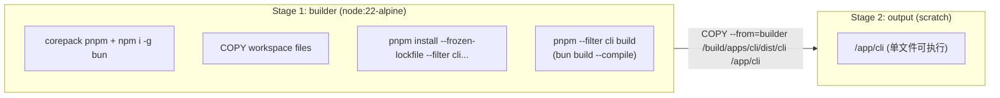

# Docker CLI Build

创建 `apps/docker/cli.Dockerfile`，**仅构建 `apps/cli`**，产物为单文件可执行 `dist/cli`，作为下游 Docker build 的中间镜像使用。

[Complete the checklist below]
[ ] New UI component - check this if new UI component added
[ ] New user config - check this if new user config introduced
[ ] Electron only - check this if new feature only work in Electron env.
[ ] User document - check this if this change requires to add/update/delete user documents in `docs` folder

## 1. Background

`apps/docker/Dockerfile` 把 CLI + UI + 第三方二进制打包成完整可运行镜像。一些 Docker 流水线（例：Electron 打包容器、CI 验证、E2E 镜像）只想要 CLI 的 Linux 可执行文件，**不需要 UI、不需要 ffmpeg / yt-dlp**。

参考姊妹设计 [docker-ui-build](../docker-ui-build/design.md) 提供的 UI-only 中间镜像模式，本设计提供对应的 CLI-only 中间镜像，让下游能按需拉取。

详见 [context.md](./context.md)。

## 2. Architecture

### 2.1 Project Level Architecture

无。Docker 构建产物层面的解耦，不影响项目运行时架构。

### 2.2 App Level Architecture

新增 `apps/docker/cli.Dockerfile`：



| Stage | Base Image | 用途 |
|---|---|---|
| `builder` | `node:22-alpine` | 安装 pnpm + bun，编译 CLI |
| `output` | `scratch` | 最小化最终镜像，仅含 `/app/cli` 一个文件 |

### 2.3 Key Points

| 项 | 方案 | 理由 |
|---|---|---|
| Base image (builder) | `node:22-alpine` | 与现有 `Dockerfile` 和 `ui.Dockerfile` 一致 |
| Base image (output) | `scratch` | 中间镜像，最小化，零运行时 |
| pnpm | `corepack prepare pnpm@10.29.3 --activate` | 与现有 `Dockerfile` 锁定同一版本 |
| Bun | `npm install -g bun` | 与现有 `Dockerfile` 一致；`bun build --compile` 需要 bun 运行时 |
| 依赖安装范围 | `--filter cli...` | 拉入 cli + 全部 workspace 依赖 |
| 构建命令 | `pnpm --filter cli build` | 复用 `apps/cli/scripts/build.ts`（生成 `version.ts` + `bun build --compile`） |
| Output 路径 | `/build/apps/cli/dist/cli` → `/app/cli` | 与现有 `Dockerfile` 下一致，下游可直接 `COPY --from=smm-cli-build /app/cli /app/cli` |
| 镜像标签 | `smm-cli-build:latest` | 默认标签 |
| 多架构 | 单架构（`linux/amd64`）；`linux/arm64` 走 buildx QEMU 或后续在 build arg 中传 `CLI_COMPILE_TARGET` | 与现有 `Dockerfile` 的 arm64 处理节奏一致——v1 不内置，CI 验证后再迭代 |
| Stub 占位 | 复用 `ci/docker/pnpm-stubs/` | workspace 解析要求所有成员有 `package.json` |

### 2.4 工作区成员清单

`pnpm-workspace.yaml` 声明的成员 = `packages/*` + `apps/*`。参与 CLI 构建：

- `apps/cli` — 构建目标
- `packages/core` — 间接（`packages/core-routes` 的依赖）
- `packages/core-routes` — CLI 直接依赖
- `packages/tvdb4` — CLI 直接依赖

占位 stub（不参与构建，仅满足 pnpm workspace 解析）：

- `apps/ohos`, `apps/electron`, `apps/e2e`, `apps/convex`, `apps/docker`（`apps/ui` 见 §4.1 / §3 — 不入 stub，从真实路径 `COPY package.json`）
- `packages/test`, `packages/electron-common`, `packages/utils`

## 3. Dockerfile Specification

```dockerfile
# SMM CLI Build — intermediate image with Linux single-file CLI executable
# Build context: repository root (e.g. docker build -f apps/docker/cli.Dockerfile .)
# This image is meant to be used as a base in multi-stage Docker builds.
# The final image is a scratch image containing only the CLI executable at /app/cli.

# Stage 1: Build CLI
FROM node:22-alpine AS builder

RUN corepack enable && corepack prepare pnpm@10.29.3 --activate
# node-pty@1.1.0 falls back to node-gyp rebuild when prebuilt binaries are missing
# in the alpine prebuilds cache. Install build tools so the fallback succeeds.
RUN apk add --no-cache python3 make g++
RUN npm install -g bun
WORKDIR /build

# Copy workspace root configs
COPY package.json pnpm-lock.yaml pnpm-workspace.yaml ./

# Copy source packages needed for cli build
COPY packages/core packages/core
COPY packages/core-routes packages/core-routes
COPY packages/tvdb4 packages/tvdb4
COPY apps/cli apps/cli
# apps/ui is not built, but pnpm-lock.yaml records its full dep list. The
# --frozen-lockfile check needs apps/ui/package.json on disk to match the lockfile.
COPY apps/ui/package.json apps/ui/package.json

# Stub package.json for unused workspace members (required by pnpm workspace resolution)
COPY ci/docker/pnpm-stubs/apps/ohos/package.json apps/ohos/package.json
COPY ci/docker/pnpm-stubs/apps/electron/package.json apps/electron/package.json
COPY ci/docker/pnpm-stubs/apps/e2e/package.json apps/e2e/package.json
COPY ci/docker/pnpm-stubs/apps/convex/package.json apps/convex/package.json
COPY ci/docker/pnpm-stubs/apps/docker/package.json apps/docker/package.json
COPY ci/docker/pnpm-stubs/packages/test/package.json packages/test/package.json
COPY ci/docker/pnpm-stubs/packages/electron-common/package.json packages/electron-common/package.json
COPY ci/docker/pnpm-stubs/packages/utils/package.json packages/utils/package.json

RUN pnpm install --frozen-lockfile --filter cli...
ENV NODE_ENV=production
RUN pnpm --filter cli build

# Stage 2: Output — only the CLI executable
FROM scratch
COPY --from=builder /build/apps/cli/dist/cli /app/cli
```


### 3.1 下游使用模式

```dockerfile
FROM smm-cli-build:latest AS cli
FROM debian:bookworm-slim
COPY --from=cli /app/cli /app/cli
RUN chmod +x /app/cli
ENTRYPOINT ["/app/cli"]
```

## 4. Tasks

### 4.1 前置：满足 pnpm lockfile 完整性

[x] **T0** `apps/ui` package.json 来源策略
  - 最初方案：`ci/docker/pnpm-stubs/apps/ui/package.json` 占位 → **失败**
  - 失败原因：pnpm lockfile 记录了真实 `apps/ui` 的 100+ 依赖；`--frozen-lockfile` 检查发现 stub 缺依赖，触发 `ERR_PNPM_OUTDATED_LOCKFILE`
  - 修正：`cli.Dockerfile` 改为 `COPY apps/ui/package.json apps/ui/package.json`（用真实文件，但仅这一项；不复制 `apps/ui` 源码，所以不会触发 UI 构建）
  - 已删除 `ci/docker/pnpm-stubs/apps/ui/package.json` 占位

### 4.2 创建 Dockerfile

[x] **T1** 创建 `apps/docker/cli.Dockerfile`
  - 按 §3 规格编写
  - Build context = 仓库根目录
  - 两阶段：`builder` (node:22-alpine) + `output` (scratch)
  - 复用 `ci/docker/pnpm-stubs/` 全部 stub（apps/ 下五个 apps stub + packages/ 下三个 packages stub）

### 4.3 接入 pnpm 脚本

[x] **T3** 在 `apps/docker/package.json` 的 `scripts` 添加 `build:cli`
  - 命令：`docker buildx build --progress=plain -t smm-cli-build:latest -f cli.Dockerfile ../..`
  - 与现有 `build` / `build:ui` 对齐

### 4.4 验证

[x] **T2** 本地 Docker build 验证（已完成）
  - 命令：`pnpm run build:cli`（在 `apps/docker/` 下）— 成功
  - 产物验证：`docker create` + `docker cp` 取出 `/app/cli`，`file` 报告 `ELF 64-bit LSB executable, x86-64, dynamically linked, interpreter /lib/ld-musl-x86_64.so.1`（~94MB）
  - 修过的两个 build 失败：①lockfile 完整性 → `COPY apps/ui/package.json`；②node-pty 缺 Python → `apk add --no-cache python3 make g++`

## 5. Backward Compatibility

无影响。新增独立的 `cli.Dockerfile` 和 `build:cli` pnpm 脚本，不动现有 `Dockerfile` 和 `ui.Dockerfile`。

## 6. Documents
无（不属于用户文档范畴；属于构建基础设施）。如果后续需要把 `cli.Dockerfile` 的使用方式记入团队内 wiki，再追加 `apps/docker/README.md` 的"其他 Dockerfile"小节。

## 7. Post Verification

[x] Build
    在 `apps/docker` 下执行 `pnpm run build:cli` 成功
[x] 产物验证
    从镜像 `docker create` + `docker cp` 取出 `/app/cli`，`file` 报告 Linux ELF 可执行（已验证：ELF 64-bit LSB, x86-64, musl, ~94MB）

