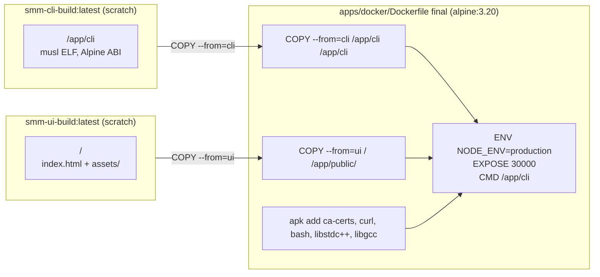
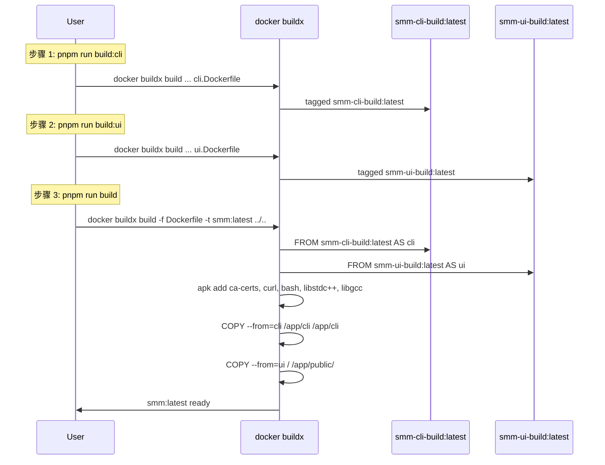

# Docker Final Image

改造 `apps/docker/Dockerfile`，复用 `smm-cli-build:latest` 与 `smm-ui-build:latest` 两个中间镜像作为构建源，移除原 Dockerfile 中重复的 `node:22-alpine` 构建阶段。最终镜像**只拉取两个中间镜像的产物**，不构建任何东西、不下载任何东西。

[Complete the checklist below]
[ ] New UI component
[ ] New user config
[ ] Electron only
[x] User document — `apps/docker/README.md` 已更新

## 1. Background

`apps/docker/Dockerfile`（旧版）在一个 builder 阶段里同时跑 `pnpm install`（cli + ui）+ `pnpm --filter cli build` + `pnpm --filter ui build`，再用一份 `debian:bookworm-slim` 完成最终组装（下载 3pp、装 nodejs / tini、设 `SMM_RESOURCES_PATH`）。

已完成两份姊妹设计 [docker-cli-build](../docker-cli-build/design.md) 与 [docker-ui-build](../docker-ui-build/design.md)，分别提供：

- `smm-cli-build:latest`：根路径 `/app/cli`（单文件 Bun 编译产物，musl 链接，Alpine ABI）
- `smm-ui-build:latest`：根路径 `/`（Vite dist）

最终 Dockerfile 只需 `COPY --from=cli /app/cli /app/cli` 与 `COPY --from=ui / /app/public/`，**不再重复构建 CLI / UI**，**不再下载 3pp**。下游任意镜像（生产 E2E、CI 验证、镜像变体）也可复用两个中间镜像。

详见 [context.md](./context.md)。

## 2. Architecture

### 2.1 Project Level Architecture

无。Docker 构建产物层面的解耦（与姊妹设计保持一致）。

### 2.2 App Level Architecture

新 `apps/docker/Dockerfile` 结构（两个 source + 一个 final）：

| Stage | Base Image | 来源 | 职责 |
|---|---|---|---|
| `cli` | `smm-cli-build:latest` | 外部构建 | 提供 `/app/cli`（musl） |
| `ui` | `smm-ui-build:latest` | 外部构建 | 提供 `/` 下的 UI 静态资源 |
| final | `alpine:3.20` | Docker Hub | 安装 ca-certs / libstdc++ / libgcc，COPY 两个中间产物，启 CLI |

### 2.3 Key Points

| 项 | 方案 | 理由 |
|---|---|---|
| 引用中间镜像方式 | `FROM smm-cli-build:latest AS cli` / `FROM smm-ui-build:latest AS ui`，然后 `COPY --from=cli` / `COPY --from=ui` | 与姊妹设计 §3 对齐；多阶段语义清晰 |
| 中间镜像标签 | 固定 `latest` | 与 `apps/docker/package.json` 的 `build:cli` / `build:ui` 默认标签一致 |
| 构建顺序 | 用户手动：`pnpm run build:cli` → `pnpm run build:ui` → `pnpm run build` | 显式依赖；本设计不在 pnpm 脚本中串联 |
| 最终 base | `alpine:3.20` | CLI 是 musl 链接；debian-slim（glibc）运行会报 "no such file or directory"（动态链接器不匹配） |
| 最终包依赖 | `apk add --no-cache ca-certificates curl bash libstdc++ libgcc` | `libstdc++` / `libgcc` 是 CLI 运行时需要的 C++ 运行时（即便 `cli` 本身是 Bun 编译产物，Bun 仍链入部分 libstdc++ 符号） |
| 3pp 二进制 | **不在 final 镜像中** | 由后续改动提供（独立中间镜像 / 运行时挂载 / 不在 Docker 提供） |
| UI 复制路径 | `COPY --from=ui / /app/public/` | UI 中间镜像根目录为 Vite dist |
| CLI 复制路径 | `COPY --from=cli /app/cli /app/cli` + `chmod +x` | scratch 镜像里的权限可能丢失 |
| 端口 / 入口 | `EXPOSE 30000`；`CMD ["/app/cli", "--staticDir", "/app/public", "--port", "30000"]` | 与原 Dockerfile 等价（去掉了 `tini` PID 1 与 nodejs；`SMM_RESOURCES_PATH` 也不再设置） |
| tini | **不在 final 镜像中** | 与用户决策一致：final 镜像"什么也不下载"；tini 原本是为了转发信号，未来若需可加回（独立改动） |

### 2.4 与原 Dockerfile 的差异

| 项 | 原 Dockerfile | 新 Dockerfile |
|---|---|---|
| Builder 阶段 | `node:22-alpine` 自建，跑 pnpm + bun + 双 app 构建 | 无（直接复用 `smm-cli-build` / `smm-ui-build`） |
| `apps/cli` 构建 | 在 final 镜像同一次 build 中执行 | 提前到 `pnpm run build:cli` 阶段，输出独立镜像 |
| `apps/ui` 构建 | 同上 | 提前到 `pnpm run build:ui` 阶段，输出独立镜像 |
| 最终 base | `debian:bookworm-slim`（glibc） | `alpine:3.20`（musl，与 cli 编译环境一致） |
| nodejs / tini | 安装 | 不安装 |
| 3pp 下载 | `ci/download-3pp-binary.sh` + `mv bin /app/resources/` | **不做** |
| 第三方二进制布局 | `/app/resources/bin/{ffmpeg,yt-dlp,videocaptioner,quickjs}/` | **不包含** |
| `SMM_RESOURCES_PATH` | `ENV SMM_RESOURCES_PATH=/app/resources` | 不设置（CLI 在没有 3pp 时不需要此变量） |
| 镜像大小 | ~250MB（粗估） | **162MB**（实际） |
| 端到端运行可启动 | 否（旧版 CLI 是 musl，跑在 glibc 上会动态链接器失败） | **是**（实测 CLI 在 alpine 容器内成功启动 Hono / Socket.IO / MCP / Reverse Proxy） |

## 3. User Stories

### 3.1 构建最终镜像

* **Given** 已构建 `smm-cli-build:latest` 与 `smm-ui-build:latest`
* **When** 在 `apps/docker/` 下执行 `pnpm run build`
* **Then** `docker buildx build -f Dockerfile -t smm:latest ../..` 引用两个中间镜像组装最终镜像
* **And** 最终镜像仅含 `/app/cli`（musl CLI）+ `/app/public/index.html` + `/app/public/assets/`
* **And** 启动后 `/app/cli --staticDir /app/public --port 30000` 监听 30000

### 3.2 运行镜像

* **Given** 已构建 `smm:latest`
* **When** 执行 `docker run --rm -p 30000:30000 smm:latest`
* **Then** 容器监听 30000，浏览器 `http://localhost:30000/` 加载 UI

## 4. Tasks

### 4.1 重写 Dockerfile

[x] **T1** 重写 `apps/docker/Dockerfile`
  - 删除 `node:22-alpine AS builder` 阶段（CLI / UI 构建已迁移到 `cli.Dockerfile` / `ui.Dockerfile`）
  - 新增 `FROM smm-cli-build:latest AS cli` 与 `FROM smm-ui-build:latest AS ui`
  - final stage 改为 `FROM alpine:3.20`（musl，与 cli 编译环境一致）
  - final 阶段仅 `apk add --no-cache ca-certificates curl bash libstdc++ libgcc`（无 wget / tar / nodejs / tini / 3pp 下载）
  - `COPY --from=cli /app/cli /app/cli` + `chmod +x`
  - `COPY --from=ui / /app/public/`
  - `WORKDIR /app`；`ENV NODE_ENV=production`；`EXPOSE 30000`；`CMD ["/app/cli", "--staticDir", "/app/public", "--port", "30000"]`
  - **不**设置 `SMM_RESOURCES_PATH`（无 3pp 时不需要）

### 4.2 不调整 pnpm 脚本

[x] **T2** `apps/docker/package.json` 保持不变
  - `scripts.build` / `scripts.build:cli` / `scripts.build:ui` 维持现状
  - 用户需自行按顺序执行 `pnpm run build:cli` → `pnpm run build:ui` → `pnpm run build`

### 4.3 文档同步

[x] **T3** 更新 `apps/docker/README.md`
  - 「构建与运行」小节明确写出顺序依赖
  - 标注 3pp 当前不在 `smm:latest` 中
  - 标注 final base 改为 alpine
  - 「与 Electron 打包的对应关系」改为说明：当前镜像不包含 3pp

### 4.4 验证

[x] **T4** 端到端验证
  - `pnpm run build:cli` 成功 → `smm-cli-build:latest`
  - `pnpm run build:ui` 成功 → `smm-ui-build:latest`
  - `pnpm run build` 成功 → `smm:latest`（162MB）
  - 镜像内容检查：`/app/cli`（musl ELF）、`/app/public/index.html` + `/app/public/assets/` 全部存在
  - 容器启动：CLI 成功启动 Hono server (3001)、Socket.IO、Static server (30000)、MCP、Reverse Proxy

## 5. Backward Compatibility

| 场景 | 影响 |
|------|------|
| 已有 `docker build -f apps/docker/Dockerfile -t smm:latest .` 命令 | 用户需先准备好 `smm-cli-build:latest` 与 `smm-ui-build:latest`；本设计不在 pnpm 脚本中自动串联 |
| 已有 `docker run -p 30000:30000 smm:latest` 命令 | 端口与 `CMD` 不变；final base 从 glibc 切到 musl（无业务影响，因 CLI 也是 musl） |
| 已有镜像 `smm:latest` 的二次构建（CI 缓存层） | builder 层不再出现；首次构建时间略增（多两个 image build），增量构建显著更快（CLI / UI 命中缓存） |
| 未先构建 `smm-cli-build` / `smm-ui-build` | `docker buildx` 会因找不到本地 tag 而失败——文档告知顺序 |
| 3pp 二进制（ffmpeg / yt-dlp / videocaptioner / quickjs） | **不在 `smm:latest` 中**；CLI 调用相关功能会失败。由后续改动提供 |
| `tini` PID 1 | **不在**；如需信号转发可后续加回 |
| 镜像层大小 | 旧版 ~250MB → 新版 162MB |

## 6. Documents

[x] `apps/docker/README.md` — 「构建与运行」小节已补充 `build:cli` / `build:ui` 前置依赖说明 + alpine final base 标注
[ ] `apps/docker/docs/development-plan.md` — 任务拆解表可标注"已迁移到 `cli.Dockerfile` / `ui.Dockerfile`，final Dockerfile 仅做组装"（可选，非必需）

## 7. Post Verification

[x] Build
    `pnpm run build` 成功生成 `smm-cli-build:latest` / `smm-ui-build:latest` / `smm:latest`
[x] Runtime
    `docker run --rm smm:latest`，CLI 成功启动（输出包含 `Static file server running on http://localhost:30000`、`Socket.IO server available` 等）
[x] Layout
    容器内 `/app/cli` 与 `/app/public/index.html` + `/app/public/assets/` 全部存在
[ ] 3pp layout —— 暂不适用（按用户决策不在本改动内）

## 8. Open Questions（followup）

1. **3pp 二进制来源**：未来如何提供？三种候选方案：
   - 新增 `bin.Dockerfile` 中间镜像，调用 `ci/download-3pp-binary.sh` 输出 `/app/resources` → final `COPY --from=bin`
   - 主机/CI 预下载到 `bin/`，Dockerfile `COPY` 进来（`.dockerignore` 当前排除 `bin/`，需调整）
   - 运行时由 `apps/cli` 自取（CLI 内部已有 `SMM_RESOURCES_PATH` 逻辑）
2. **tini 回归**：是否需要 PID 1 信号转发？若需要可加回 `tini-static` 包（Alpine 上有）
3. **多架构支持**：`cli.Dockerfile` 当前是单架构（`linux/amd64`）；`linux/arm64` 需要在 cli builder 阶段或 final 阶段适配
