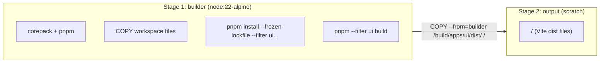

# Docker UI Build

创建 `apps/docker/ui.Dockerfile`，仅构建 `apps/ui` 前端，产物置于镜像根目录，作为下游 Docker build 的中间镜像。
[x] 创建 `apps/docker/ui.Dockerfile`
[ ] 验证 Docker build 成功（本地 Docker 环境无响应，需在 CI 或正常 Docker 环境中验证）


现有 `apps/docker/Dockerfile` 构建 CLI + UI + 第三方二进制的完整可运行镜像。下游场景（如 E2E 测试镜像）仅需前端静态文件，不需要完整 CLI 运行时。

详见 [context.md](./context.md)。

## 2. Architecture

### 2.1 Dockerfile 结构

采用两阶段构建：



| Stage | Base Image | 用途 |
|---|---|---|
| `builder` | `node:22-alpine` | pnpm 安装依赖 + 构建 `apps/ui` |
| `output` | `scratch` | 最小化最终镜像，仅含 `/` 下的静态文件 |

### 2.2 构建上下文与依赖

- **构建上下文**：仓库根目录（`docker build -f apps/docker/ui.Dockerfile .`）
- **需要的 workspace 成员**：
  - `packages/core` — `apps/ui` 通过 tsconfig paths alias 导入
  - `packages/tvdb4` — `apps/ui` 的 workspace dependency
  - `apps/ui` — 构建目标
- **Stub 占位**：其他 workspace 成员只需 stub `package.json`（复用 `ci/docker/pnpm-stubs/`）
- **`.dockerignore`** 已排除 `node_modules/`、`dist/`、平台无关应用等

### 2.3 镜像标签

| 标签 | 用途 |
|---|---|
| `smm-ui-build:latest` | 默认标签，下游 `COPY --from=smm-ui-build` |

### 2.4 Key Points

| 项 | 方案 |
|---|---|
| Base image (builder) | `node:22-alpine`，与现有 Dockerfile 一致 |
| Base image (output) | `scratch` — 最小化，仅存放文件，不可运行 |
| pnpm 安装 | `corepack enable && corepack prepare pnpm@latest --activate` |
| 依赖安装范围 | `--filter ui...` 包含 ui 及其 workspace 依赖 |
| 构建命令 | `pnpm --filter ui build`（执行 `tsc -b && vite build`） |
| 产物路径 | `/build/apps/ui/dist/` → `/`（根目录直接存放 index.html, assets/ 等） |
| 环境 | `NODE_ENV=production`（生产构建） |

## 3. Dockerfile Specification

```dockerfile
# SMM UI Build — intermediate image with Vite dist output
# Build context: repository root (e.g. docker build -f apps/docker/ui.Dockerfile .)

# Stage 1: Build UI
FROM node:22-alpine AS builder

RUN corepack enable && corepack prepare pnpm@latest --activate

WORKDIR /build

# Copy workspace root configs
COPY package.json pnpm-lock.yaml pnpm-workspace.yaml ./

# Copy source packages needed for ui build
COPY packages/core packages/core
COPY packages/tvdb4 packages/tvdb4
COPY apps/ui apps/ui

# Stub package.json for unused workspace members
COPY ci/docker/pnpm-stubs/apps/ohos/package.json apps/ohos/package.json
COPY ci/docker/pnpm-stubs/apps/electron/package.json apps/electron/package.json
COPY ci/docker/pnpm-stubs/apps/e2e/package.json apps/e2e/package.json
COPY ci/docker/pnpm-stubs/apps/convex/package.json apps/convex/package.json
COPY ci/docker/pnpm-stubs/apps/docker/package.json apps/docker/package.json
COPY ci/docker/pnpm-stubs/packages/test/package.json packages/test/package.json
COPY ci/docker/pnpm-stubs/packages/electron-common/package.json packages/electron-common/package.json
COPY ci/docker/pnpm-stubs/packages/utils/package.json packages/utils/package.json

RUN pnpm install --frozen-lockfile --filter ui...
ENV NODE_ENV=production
RUN pnpm --filter ui build

# Stage 2: Output — only the dist files at root
FROM scratch
COPY --from=builder /build/apps/ui/dist/ /
```

## 4. Tasks

### 4.1 创建 Dockerfile

[x] **T1** 创建 `apps/docker/ui.Dockerfile`
  - 按 Section 3 规格编写
  - Build context 根目录
  - 两阶段：`builder` (node:22-alpine) + `output` (scratch)

[ ] **T2** 执行 Docker build 验证（本地 Docker 环境不可用，需在 CI / 正常 Docker Desktop 环境运行）
  - 命令：`docker build -f apps/docker/ui.Dockerfile -t smm-ui-build:latest .`
  - 验证产物结构正确：`docker create` + `docker cp` 镜像到本地，预期 `index.html` 与 `assets/` 目录存在


## 5. Build Verification

[ ] `docker build -f apps/docker/ui.Dockerfile -t smm-ui-build:latest .` 成功
[ ] 验证镜像层包含 `/index.html` 及 `/assets/` 目录
