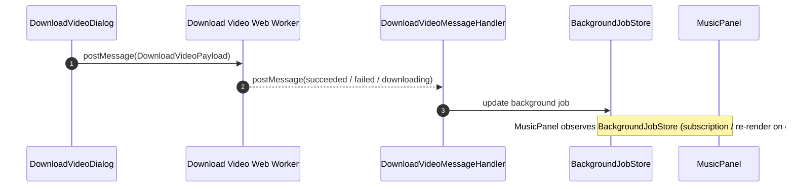

# Download Bilibili Videos

This document describe the requirement and implementation of Download Bilibili Videos feature.

This feature invokes DownloadVideoDialog and MusicPanel components and backgroundJobStore Zuzstand store.

## Tasks

### Get Metadata

Given user has input the bilibili URL
And user check the "download playlist" checkbox
Then UI call HTTP API "/api/ytdlp/bilibili/episodes" to get the Bilibili episode metadatas
And UI display the playlist in DownloadVideoDialog

### Download Video in playlist/collection

This task require 5 components:
- DownloadVideoDialog (existing)
- MusicPanel (existing)
- BackgroundJobStore (existing): Zustand store that manage UI state for various type of BackgrounbJob
- Download Video Web Worker (need to create): Web worker to download video
- DownloadVideoMessageHandler (need to create): A empty React component to handle event message posted by Download Video Web Worker, and update BackgroundJobStore accordingly


#### Sequence



#### Start Download
Given the playlist display in DownloadVideoDialog
Given user checked the "download playlist" checkbox
And user check and uncheck videos in the playlist
When user click the start button
Then Create DownloadVideoBackgroundJob in BackgroundJobStore
Then DownloadVideoDialog create Download Video web Worker and DownloadVideoMessageHandler
Then DownloadVideoDialog post message to downloadVideo.worker.ts
Then DownloadVideoDialog dismiss

#### Download Video Web Worker

web worker accepts message with Payload:

```
interface DownloadVideoMessagePayload {
    folder: string; // the destination folder
    urls: string[]; // the video urls to download
    jobId: string; // the background job id
}
```

Web worker starts download by iterating urls one by one, by calling
HTTP API `POST /api/ytdlp/download`.
This API is implemented in `apps\ui\src\api\ytdlp.ts`.

Web worker post message back with download results: succeeded, failed, downloading

#### MusicPanel

MusicPanel observes states in BackgroundJobStore.

MusicPanel find jobs in BackgroundJobStore by "type" and "folder" props:
1. Call `getJobsByType` with type "download-video"
2. Filter all DownloadVideoBackgroundJobs by `selectedFolder`

#### DownloadVideoBackgroundJob
DownloadVideoBackgroundJob represent the UI states.
It carries data props in below structure:

```typescript
interface DownloadVideoBackgroundJobData {
    folder: string; // the destination folder
    videos: {
        url: string;
        artist: string;
        title: string;
        status: "pending" | "downloading" | "succeeded" | "failed"
    }[];
}
```
