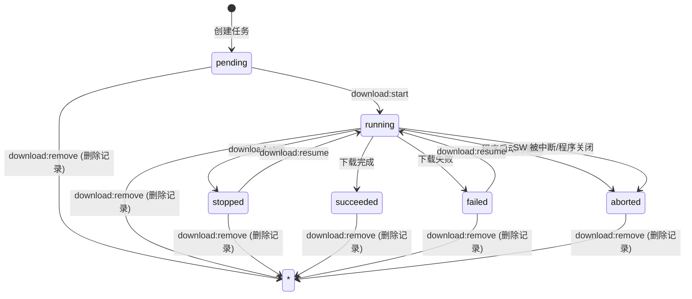
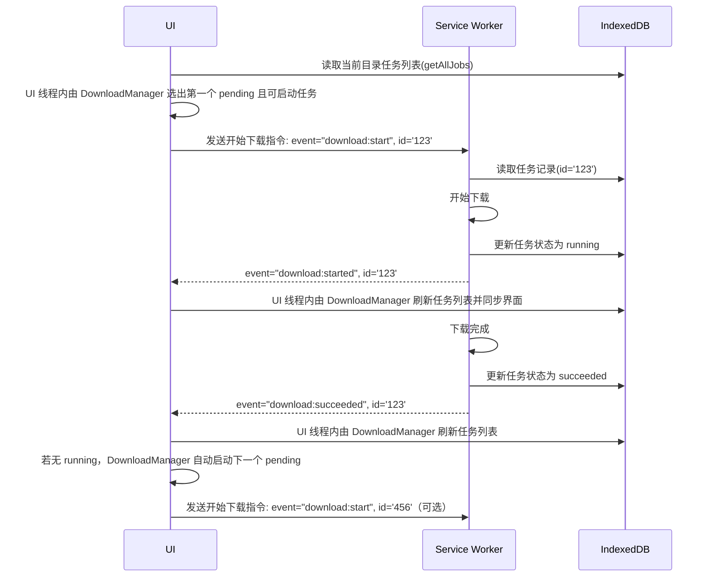
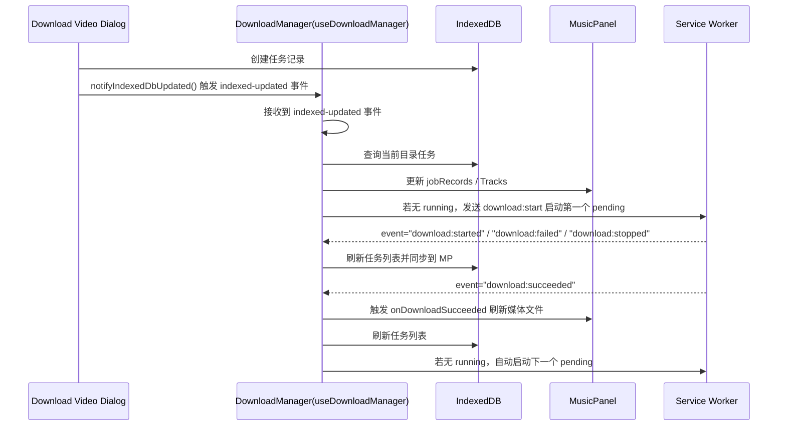
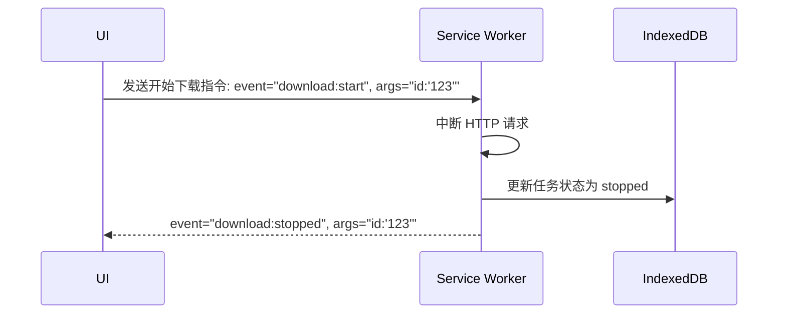
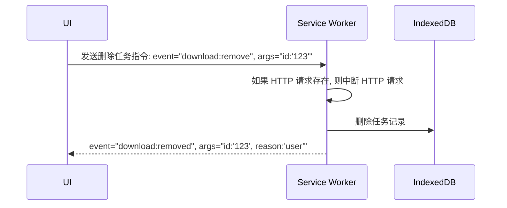
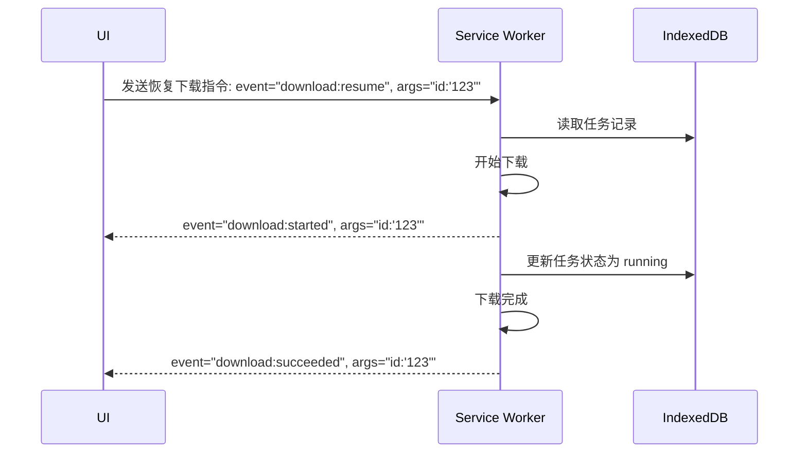

# Download Video Feature Phase 2

This is phase 2 for download video feature.
The phase 1 was described in "download-video-design.md".

phase 2 完全重写下载逻辑, 不需要考虑 phase1 的兼容性. phase1 的部分代码会完全废弃

**Goal**

* Support download in background
  Allow continue to download in background even user close the electron window and keep the app icon in OS task bar or menu

* Support start, stop, remove download tasks
* Support resume download if app restart

**Solution**

* Migrate download execution from Dedicated Web Worker to **Web Service Worker** (standard Service Worker API), so downloads can survive page navigation and window close
* Use IndexedDB to persist task data in Service Worker scope
* On app restart (page reopen), Service Worker reads pending/running tasks from IndexedDB and resumes

**约束**

* 本应用同时支持 **Electron 桌面应用**和 **Docker Web GUI** 两种部署场景
* 不使用 Electron 主进程 IPC，所有下载逻辑基于标准 Web API（Service Worker + IndexedDB + fetch），确保两种场景均可运行

---

## Phase 1 现状分析

Phase 1 的下载链路为：

```
DownloadVideoDialog
  → backgroundJobsStore (Zustand, 内存)
  → DownloadVideoWorker.ts (主线程编排)
    → downloadVideo.worker.ts (Dedicated Web Worker, fetch /api/ytdlp/download)
  → handleDownloadVideoSwMessage → patchDownloadVideoJob → backgroundJobsStore
  → MusicPanel 从 backgroundJobsStore 读取并展示临时 Track
```

**Phase 1 的局限**：

| 问题 | 原因 |
|------|------|
| 关闭窗口后下载中断 | Dedicated Web Worker 随渲染进程销毁 |
| 刷新页面后下载丢失 | `backgroundJobsStore` 是纯内存 Zustand store |
| 无法停止正在进行的下载 | Web Worker 内的 `fetch` 没有 `AbortController` |
| 无法删除已完成的任务 | 无持久层，刷新即丢失，无需删除 |

---


## IndexedDB Database Design

### 数据库名

`DownloadTaskDatabase`

### 版本

`1`

### Object Store

#### `jobs` store

主存储，keyPath 为 `id`。

| 字段 | 类型 | 说明 |
|------|------|------|
| `id` | `string` | 主键, UUID |
| `filename` | `string` | 任务显示名称, 可以为空, 因为某些任务无法预先知道文件名 |
| `status` | `string` | 任务级状态：`pending` \| `running` \| `succeeded` \| `failed` \| `aborted` \| `stopped` |
| `type` | `string` | `"ytdlp-video-download"` |
| `folder` | `string` | 下载目标目录（平台路径） |
| `createdAt` | `number` | 创建时间戳 `Date.now()` |
| `updatedAt` | `number` | 最后更新时间戳 |
| `data` | `string` | 不同类型任务的额外数据，JSON 字符串格式 |

### Schema TypeScript 定义

```typescript
type JobStatus = 'pending' | 'running' | 'succeeded' | 'failed' | 'stopped'

interface DownloadJobRecord {
  id: string
  name: string
  status: JobStatus
  progress: number
  type: 'download-video'
  folder: string
  data?: string
  createdAt: number
  updatedAt: number
}

```


### 为什么选择 Service Worker

| 特性 | Dedicated Web Worker (Phase 1) | Service Worker (Phase 2) |
|------|-------------------------------|--------------------------|
| 页面关闭后存活 | ❌ 随渲染进程销毁 | ✅ 独立生命周期，可后台运行 |
| 页面刷新后存活 | ❌ | ✅ |
| 多标签页共享 | ❌ 每个页面独立实例 | ✅ 单例，所有标签页共享 |
| 后台 fetch | ✅ | ✅ |
| IndexedDB 访问 | ✅ | ✅ |
| BroadcastChannel | ✅ | ✅ |
| Electron 兼容 | ✅ | ✅ |
| Docker Web GUI 兼容 | ✅ | ✅ |
| 需要注册 + HTTPS | ❌ | ✅ (开发环境 localhost 也可注册) |

### Service Worker 生命周期与下载的关系

```
                    页面注册 SW
                        │
                        ▼
                   ┌─────────┐
                   │  parsed  │
                   └────┬────┘
                        │
                        ▼
                   ┌──────────┐
         ┌────────│ installing │─────────┐
         │        └──────────┘          │
         │ (skipWaiting)                │ (wait)
         ▼                              ▼
   ┌──────────┐                   ┌──────────┐
   │ installed │                   │  waiting  │
   └────┬─────┘                   └────┬─────┘
        │                              │ (clients.claim)
        ▼                              ▼
   ┌──────────┐                   ┌──────────┐
   │ activating│◄──────────────────│          │
   └────┬─────┘                   └──────────┘
        │
        ▼
   ┌─────────┐     页面关闭
   │  active  │─────────────── SW 保持活跃 (受浏览器 lifecycle 管理)
   └────┬────┘
        │
        │  SW 被 browser 终止 (idle timeout)
        ▼
   ┌──────────┐
   │  stopped  │ ← 下载中断，IndexedDB 中保留 running 状态
   └──────────┘ ← 下次 SW 激活时，从 IndexedDB 恢复
```

**关键限制**：Service Worker 在没有活跃的 fetch/message 事件时，会被浏览器在几十秒到几分钟内终止。这意味着：
- 短期下载（几秒到几分钟）：SW 可以完成
- 长时间下载：SW 可能在下载过程中被终止
- **解决方案**：SW 在执行下载任务时，通过定时 `self.setInterval()` 发送心跳，延长活跃时间；同时在每次 item 完成后将状态写入 IndexedDB，即使 SW 被终止，下次页面打开时也能从断点恢复

### 核心模块

#### 1. Download Service Worker

文件位置：`apps/ui/public/download-service-worker.js`（静态文件，由 Vite 直接复制到输出目录）

> 注意：Service Worker 脚本必须放在 `public/` 目录下，使其在应用根路径可访问（`/download-service-worker.js`）。SW 的 scope 限制要求其 URL 必须在应用路径内。

#### 2. MusicPanel

MusicPanel 需要支持开始,停止和删除下载任务的功能
* 开始,停止和删除右键菜单. 该菜单只适用于从 IndexedDB 读取的任务构成的 Tracks , 其他 Tracks 不需要显示该右键菜单
* 程序只支持逐个任务下载, 如果已经有 running 状态的任务, 禁用"开始"菜单项
* 对 stopped, failed, aborted, pending 的状态显示"开始"菜单项, 其他状态的任务不显示"开始"菜单项
* 对 running 状态的任务显示"停止"菜单项, 其他状态的任务不显示"停止"菜单项
* 对所有状态的任务显示"删除"菜单项. 如果被删除的任务状态是 running, 你需要发送 download:stop 指令停止该任务


#### 3. IndexedDbObserver（渲染进程）

IndexedDbObserver（渲染进程）是一个空的 React 组件
在程序启动时挂载并监听来自 Download Service Worker 的事件

文件位置：`apps/ui/src/components/IndexedDbObserver.ts`

**职责**：

当程序启动时(组件完成挂载后)
1. 遍历 IndexedDB 所有记录
   当该记录的创建时间是一小时以内时, 同步该记录到 backgroundJobsStore, 包括已完成或被中断的任务
2. 重置 running 的任务为 aborted 状态

当 IndexedDbObserver 接收到 `indexed-updated` 事件, 或来自 Download Service Worker 的事件时
1. 遍历 IndexedDB 中的所有任务记录
2. 当该记录的创建时间是一小时以内时, 同步该记录到 backgroundJobsStore, 包括已完成或被中断的任务
   

#### 4. DownloadManager

DownloadManager 用于在 UI 线程操作 IndexedDB 和 与 SW 互相通信.
它为 React 组件屏蔽了下载功能的底层实现.


### Service Worker 心跳与防终止策略

Service Worker 在空闲时会被浏览器终止。下载任务执行期间，SW 通过以下机制延长存活时间：

1. **`setInterval` 心跳**：每 20 秒向页面发送 `download:heartbeat` 消息。只要 SW 在处理事件（包括定时器回调），浏览器不会终止它。
2. **IndexedDB 断点写入**：每个 item 完成后立即写入 IndexedDB。即使 SW 意外终止，下次恢复时能从断点继续。
3. **`handleSwReactivate`**：SW 重新激活时（`activate` 事件），自动将 `running` jobs 降级为 `stopped`，将 `downloading` items 回退为 `pending`，等待页面发送恢复指令。

### Electron 场景的补充说明

在 Electron 桌面应用中：
- Service Worker 由 Chromium 内核管理，行为与 Chrome 浏览器一致
- 关闭窗口后 SW 仍可能被终止（取决于 Chromium 的 SW 生命周期管理）
- 如需真正的「关闭窗口后继续下载」，未来可考虑 Electron 主进程 IPC 补充方案（Phase 3）
- Phase 2 的 SW + IndexedDB 方案保证了「页面刷新后恢复」和「重新打开窗口后恢复」两个核心场景

---

## 状态机



## 用户场景

### 开始下载 



UI的时序图



(1): DownloadManager 只处理当前 mediaFolder 对应的任务, 且按任务列表顺序启动
     当上一个任务结束后(例如 stopped、succeeded、failed), 若没有 running 任务则自动启动下一个 pending 任务

### 停止下载



### 删除任务


### 恢复下载

当应用被意外关闭, SW被意外停止或者其他原因导致下载任务中断时, 可以通过发送 `download:resume` 指令来恢复下载。




