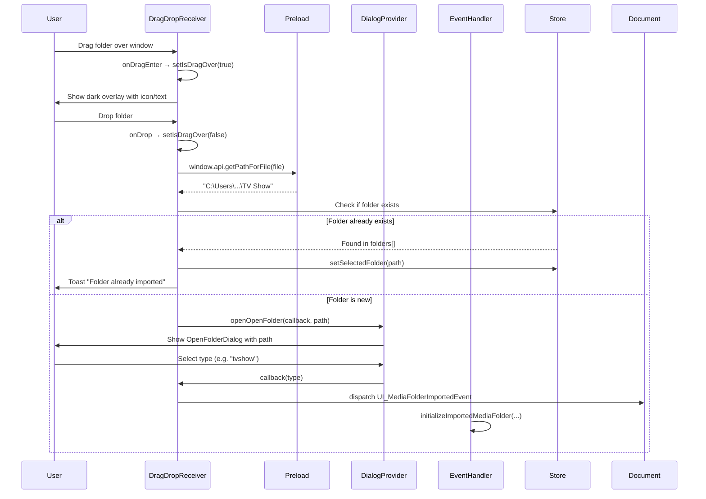

# Drag-Drop Folder Import

Re-implement the drag-and-drop folder import feature lost during the App.tsx → AppV2.tsx refactoring.  
Create a self-contained `DragDropReceiver` component that listens for HTML5 drag-and-drop events,
extracts folder paths via Electron's `webUtils.getPathForFile()`, and integrates into the existing
import pipeline via `UI_MediaFolderImportedEvent`.

[x] New UI component - `DragDropReceiver`
[ ] New user config
[x] Electron only - only works in Electron environment
[ ] User document

## 1. Background

The drag-and-drop folder import feature was originally implemented in commits `dce5dad` (preload API) and
`e0e744d` (UI handlers in `ui/src/App.tsx`). During the refactoring from `App.tsx` to `AppV2.tsx`
(commits `5035f06`, `8ced034`), the drag-and-drop event handlers were not ported over. The preload API
(`window.api.getPathForFile()`) still exists but is never called from the UI.

This change re-implements the feature as a standalone, self-contained component to minimize coupling
with existing UI code.

## 2. Project Level Architecture

None. No changes to preload, main process, or other apps.

## 3. App Level Architecture

Add a new `DragDropReceiver` component in the UI component tree, wrapping the main `<AppSwitcher>`:

```
...existing providers...
    <DialogProvider>
        <AppLanguageSync />
        <UIMediaFolderStoreInitializer />
        <AppInitializer />
        <DragDropReceiver>          ← NEW: wraps the whole app
            <AppSwitcher />
        </DragDropReceiver>
    </DialogProvider>
...existing providers...
```

`DragDropReceiver` is a self-contained wrapper component (a thin `<div>` with drag handlers).  
It only depends on:
- `useDialogs()` from `DialogProvider` (needed for `openOpenFolder` dialog)
- `useUIMediaFolderStore` from Zustand (to check duplicates and select folder)
- `UI_MediaFolderImportedEvent` event type (to dispatch import)
- `sonner` toast (for duplicate notification)
- Electron's `window.api.getPathForFile()` (to extract paths)

It does NOT modify any existing component. It adds no new props or interfaces to existing modules.

## 4. User Stories

### 4.1 Drag a media folder into the app to import it

**Given** I am in the Electron desktop app  
**When** I drag a folder from the file system over the window  
**Then** I see a dark overlay with a folder icon and "Drop Folder Here" text  
**When** I release the folder  
**Then** the folder type selection dialog (OpenFolderDialog) appears with the folder path shown  
**When** I select the folder type (TV Show / Movie / Music)  
**Then** the folder is imported, media metadata is initialized, and the folder becomes selected in the sidebar  



### 4.2 Drag a folder that is already imported

**Given** I have already imported a media folder  
**When** I drag the same folder onto the window again  
**Then** the folder is selected in the sidebar  
**And** a toast notification appears saying "Folder already imported"  

### 4.3 Running in browser (non-Electron)

**Given** I am running the app in a web browser (dev mode or non-Electron)  
**When** I drag a folder over the window  
**Then** no overlay appears and the drag is ignored  
**(No-op — the component renders nothing and attaches no handlers)**

## 5. Tasks

### 5.1 New UI Component

**Directory**: `apps/ui/src/components/dragdrop/`

[x] **Task 1**: Create `DragDropReceiver.tsx` — the main wrapper component
  - Renders a wrapper `<div>` with `onDragOver`, `onDragEnter`, `onDragLeave`, `onDrop` handlers
  - Manages `isDragOver` state and `dragDepthRef` (to handle nested dragEnter/dragLeave correctly)
  - Shows the dark semi-transparent overlay when `isDragOver` is true
  - On drop: calls `(window as any).api.getPathForFile(file)` to extract the real path
  - Fallback: tries `(file as any).path` for compatibility
  - Checks `useUIMediaFolderStore` for duplicates → toast + select if exists
  - Otherwise opens `OpenFolderDialog` via `useDialogs()`
  - On folder type selected: dispatches `UI_MediaFolderImportedEvent`
  - Guards: only activates in Electron environment (`typeof window !== 'undefined' && (window as any).electron`)

[x] **Task 2**: Integrate `DragDropReceiver` into the app tree
  - Edit `apps/ui/src/main.tsx` to wrap `<AppSwitcher />` with `<DragDropReceiver>`
  - The component must be inside `<DialogProvider>` (needs `useDialogs()`)

### 5.2 No HTTP interface changes

No new HTTP endpoints or CLI changes needed — the existing import pipeline handles everything.

## 6. Backward Compatibility

- The component is self-contained and does not modify any existing component
- The preload API (`getPathForFile`) already exists and is unchanged
- The existing button-based import flow (`openNativeFileDialog` + `openOpenFolder`) is unchanged
- If `window.api` is not available (browser), the component is a no-op

## 7. Documents

None. User-facing behavior is restored to match previous functionality; no new user docs needed.

## 8. Post Verification

[x] Unit tests
    Run `pnpm run test` — 112 test files passed, 1024 tests passed, 0 failures
[x] Build
    Run `pnpm run build` — CLI + UI build succeeded
[ ] Manual test in Electron
    - Start Electron dev mode
    - Drag a folder from file explorer onto the window
    - Verify overlay appears, folder type dialog opens, import completes
    - Drag the same folder again — verify toast + auto-select
[ ] Manual test in browser (non-Electron)
    - Start `pnpm dev:ui` (Vite dev server)
    - Drag a folder — verify no overlay, no crash
