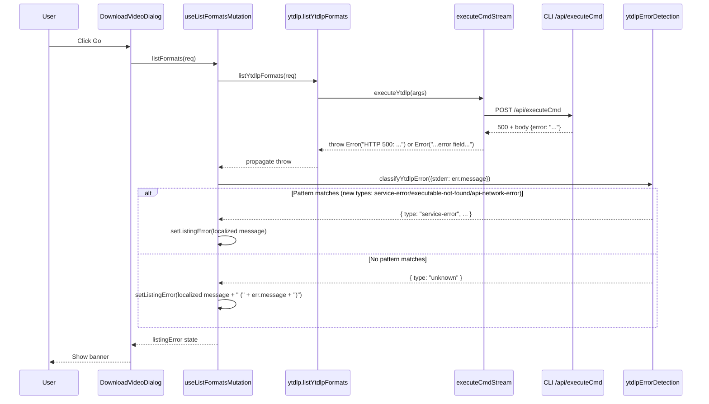

# DVD executeCmd HTTP Error Handling

## 1. Background

The Download Video Dialog (DVD) calls the CLI's `/api/executeCmd` endpoint to run `yt-dlp -J`
(format listing on "Go") and `yt-dlp --print after_move:filepath` (download on "Start").

When the CLI server returns a **non-success HTTP status code** (e.g. 400, 404, 500, 502, 503),
the fetch wrapper throws an `Error` that is then routed through `classifyYtdlpError` (via
`useListFormatsMutation.catch` and `JobOrchestratorProvider.executeJob`'s download catch
block).

`classifyYtdlpError` was designed for **yt-dlp's own stderr/stdout patterns**:

| yt-dlp pattern | Maps to |
|---|---|
| `HTTP Error 403: Forbidden` | `http-403` |
| `HTTP Error 404: Not Found` | `http-404` |
| `HTTP Error 5xx: Server Error` | `http-5xx` |

But the CLI's fetch wrappers produce different message formats:

| Source | Example message | Initially classified as |
|---|---|---|
| `executeCmdStream` (no JSON body) | `HTTP 500: Internal Server Error` | `unknown` ❌ |
| `executeCmdToCompletionWithHeaders` (no JSON body) | `HTTP 500` | `unknown` ❌ |
| CLI 400 (validation) | `command must be one of: ffmpeg, ffprobe, yt-dlp, videocaptioner` | `unknown` ❌ |
| CLI 404 (executable missing) | `yt-dlp executable not found` | `unknown` ❌ |
| Browser fetch (network down) | `TypeError: Failed to fetch` | `unknown` ❌ |

When classification falls through to `unknown`, the user sees the generic
"未知错误, 请从状态栏任务列表中查看详细日志" — which gives no actionable information and
hides the real cause. In particular, when the CLI returns a custom JSON error body
(e.g. `400 {error: "test"}`), the fetch wrapper was dropping the HTTP status code entirely,
producing just `Error("test")` — the user has no idea the failure is a 400 and the generic
"Unknown error (test)" message is unhelpful.

This applies to **both** the listing-error banner in the DVD (probe path) and the background-
job toast on download failure (download path).

## 2. Project Level Architecture

None. All changes are local to the UI error-classification helpers and the DVD's
call-site error handling.

## 3. App Level Architecture

None. No provider/store/hook topology changes.

## 4. User Stories

### 4.1 Listing error banner shows the actual CLI error

* **Given** the user clicks "Go" with a valid URL and the CLI `/api/executeCmd` returns
  HTTP 500 with body `{"error": "Failed to process execute command request"}`
* **When** the listing mutation rejects
* **Then** the listing-error banner shows a localized message like
  "服务暂时不可用, 请稍后重试 (Failed to process execute command request)"
  instead of the generic "未知错误, 请从状态栏任务列表中查看详细日志"

### 4.2 Listing error banner shows "executable not found" with guidance

* **Given** the user clicks "Go" but `yt-dlp` is not installed
* **When** the CLI returns HTTP 404 with body `{"error": "yt-dlp executable not found"}`
* **Then** the listing-error banner shows a localized message that says
  `yt-dlp 未安装或未找到, 请检查安装` instead of `unknown`

### 4.3 Listing error banner shows network error clearly

* **Given** the user clicks "Go" but the CLI server is unreachable (browser fetch fails)
* **When** the listing mutation rejects with `TypeError: Failed to fetch`
* **Then** the listing-error banner shows a localized network-error message
  instead of `unknown`

### 4.4 Download failure toast shows the actual CLI error

* **Given** the user clicks "Start" and the download executeCmd returns HTTP 500
* **When** the background job marks the video as `failed`
* **Then** the toast shows the CLI's actual error message
  (with optional "日志" action) instead of the generic "下载失败"

## 5. Tasks

### 5.1 Add new error types to `ytdlpErrorDetection`

* [x] Add `http-error` (CLI returned HTTP 4xx or 5xx, e.g. `HTTP 400: test`,
      `HTTP 500: Internal Server Error`, `HTTP 502`). The status code is
      extracted as `context` so the i18n template can interpolate it.
* [x] Add `executable-not-found` (CLI 404 when binary is missing, e.g. `yt-dlp executable not found`)
* [x] Add `api-network-error` (browser fetch failure, e.g. `Failed to fetch`, `NetworkError`,
      `Load failed`)
* [x] Order new patterns **after** existing yt-dlp patterns so specific matches win
* [x] Add i18n key + fallback for each new type in the i18n map
* [x] `getYtdlpErrorMessage` passes `status: ctx` as an i18n interpolation variable
      alongside `host` (for `connection-timeout`)

### 5.2 Make error messages user-friendly in fallback

* [x] When classification is `unknown` **and** the original error message is non-empty,
      surface it alongside the localized fallback so the user can see the real cause
* [x] Apply this in both `useListFormatsMutation.catch` and
      `JobOrchestratorProvider.executeJob`'s download catch block

### 5.3 Unify executeCmd error message format

* [x] In **both** `executeCmdStream` and `executeCmdToCompletionWithHeaders`, the
      error message is **always** prefixed with `HTTP <status>` regardless of
      whether the server provides a JSON `error` body. The body (if present) is
      appended after the status. This ensures the DVD's classifier can always
      extract the HTTP status code.
* [x] Both wrappers now produce messages in the same shape:
  * `HTTP 400` (no body)
  * `HTTP 400: Bad Request` (statusText fallback)
  * `HTTP 400: test` (JSON body)

### 5.4 i18n

* [x] Replace `downloadVideo.errors.serviceError` with `downloadVideo.errors.httpError`
      (covers both 4xx and 5xx) in all 4 locale files with the template
      `未知错误(HTTP {{status}}), 请尝试重启本应用. 如果问题持续, 请联系开发者修复.`
* [x] Add `downloadVideo.errors.executableNotFound` to all 4 locale files
* [x] Add `downloadVideo.errors.apiNetworkError` to all 4 locale files

### 5.5 Refactor to shared `resolveYtdlpError` (architectural hardening)

* [x] Add `resolveYtdlpError` in `ytdlpErrorDetection.ts` — single entry point
      that takes error source + t-function, returns `{ type, message }`.
      Encapsulates `classifyYtdlpError` + `getYtdlpErrorMessage` + unknown
      fallback logic.
* [x] Refactor `useListFormatsMutation.ts` to call `resolveYtdlpError`
* [x] Refactor `JobOrchestratorProvider.tsx` to call `resolveYtdlpError` in both
      the `result.success === false` branch and the exception `catch` branch
* [x] Fix download toast: remove `ytdlpErrorType !== 'unknown'` guard so unknown
      errors also get their resolved message (which now includes the raw cause)
* [x] All 3 call sites now share identical error-presentation behaviour

### 5.6 Tests

* [x] Unit tests in `ytdlpErrorDetection.test.ts`:
  * HTTP 4xx / 5xx messages from the CLI → `http-error` with `context` set
  * `HTTP 400: test` (the user's test scenario) → `http-error` with context `"400"`
  * `yt-dlp executable not found` (no HTTP prefix) → `executable-not-found`
  * `Failed to fetch` / `NetworkError` / `Load failed` → `api-network-error`
  * yt-dlp's `HTTP Error 4xx` / `HTTP Error 5xx` still maps to `http-4xx` / `http-5xx`
    (regression)
  * `getYtdlpErrorMessage` interpolates `{{status}}` correctly with both `t` and the
    no-`t` fallback path
  * Unknown with non-empty message → unknown (no regression)
* [x] Extend `download-video-dialog.executeCmd.test.tsx`:
  * `HTTP 500: Internal Server Error` → banner shows "Unknown error (HTTP 500)..."
  * `HTTP 400: test` (the user's test scenario) → banner shows
    "Unknown error (HTTP 400)..." with the restart hint

## 6. Backward Compatibility

* All new error types are **additive** — no existing classification paths are changed.
* Existing tests that rely on `unknown` (e.g. `classify("some unexpected failure")`)
  continue to pass.
* `executeCmdToCompletionWithHeaders`'s error-message format becomes more verbose, but
  no consumer depends on the exact text.

## 7. Documents

* [ ] `.agents/docs/design/dvd-executeCmd-http-error-handling.md` (this file)

## 8. Post Verification

* [x] Unit tests — `pnpm test:ui` (ytdlpErrorDetection, download-video-dialog)
      * `ytdlpErrorDetection.test.ts`: 55 tests pass (12 new)
      * `download-video-dialog.executeCmd.test.tsx`: 5 tests pass (4 new)
      * Full UI suite: 1163 tests pass
* [x] Typecheck — `pnpm typecheck:ui` (clean)
</content>
</invoke>