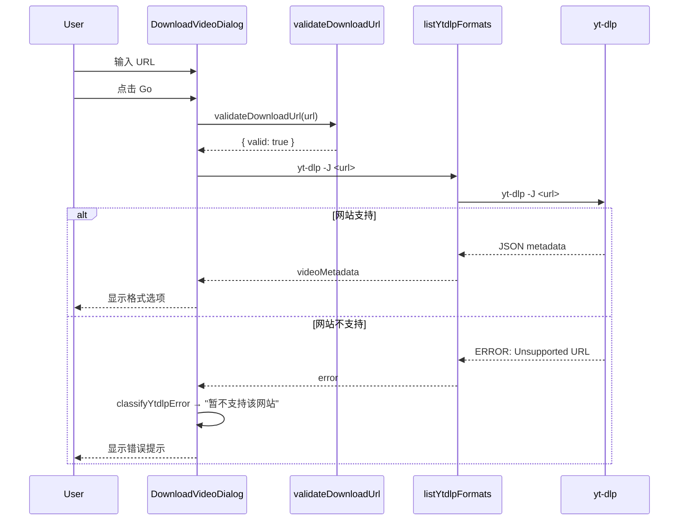

# DVD 开放所有 yt-dlp 支持网站

## 背景

当前 DVD (Download Video Dialog) 只能下载 YouTube 和 Bilibili 的视频, URL 白名单定义在 `packages/core/download-video-validators.ts` 的 `ALLOWED_HOSTNAMES`.

但实际上 yt-dlp 支持数百个网站, 用户希望 DVD 能下载所有 yt-dlp 支持的网站, 对于确实不支持的网站, 显示友好提示.

## 设计思路

核心思路:
1. **替换白名单机制** - 移除 `ALLOWED_HOSTNAMES` 硬编码白名单, 改用 yt-dlp 自身的 extractor 匹配机制作为白名单
2. **URL 格式校验** - `validateDownloadUrl` 仅校验 URL 格式 (有效 http/https), 不再检查 hostname
3. **将网站支持检测交给 yt-dlp** - 用户点击 "Go" 按钮时, 依赖 yt-dlp 的 `-J` (dump JSON) 命令来判断网站是否支持
4. **识别 yt-dlp 不支持网站的错误** - 在 `ytdlpErrorDetection.ts` 中增加 "不支持网站" 的错误类型, 显示友好提示

这样, "白名单" 实际上是 yt-dlp 内部维护的支持网站列表, 无需 SMM 手动维护.

## 改动清单

### 1. packages/core/download-video-validators.ts

- 移除 `ALLOWED_HOSTNAMES` 常量
- `validateDownloadUrl` 不再检查 hostname, 只校验 URL 格式 (protocol 为 http/https, 解析成功)
- 移除 `URL_PLATFORM_NOT_ALLOWED` 导出

### 2. packages/core/download-video-validators.test.ts

- 移除所有 `URL_PLATFORM_NOT_ALLOWED` 相关的测试用例
- 移除 `ALLOWED_HOSTNAMES` 的测试用例
- 保留格式校验测试 (empty, invalid, wrong protocol)
- 验证任意 http/https URL 均通过

### 3. packages/core/download-video-cookie-platform.ts

- `getDownloadVideoCookiePlatformDisplayName`: 当 hostname 是 YouTube 相关时返回 "Youtube", 是 Bilibili 相关时返回 "Bilibili", 其余返回空字符串 (逻辑不变)
- `isYoutubeDownloadUrl`: 逻辑不变

**说明**: 这个函数用于 cookies 提示文案 (显示平台名), 非 YouTube/Bilibili 的网站不需要 cookies, 返回空字符串即可.

### 4. apps/ui/src/lib/ytdlpErrorDetection.ts

新增"不支持网站"错误类型:

```typescript
export type YtdlpErrorType = "cookie-expired" | "format-unavailable" | "connection-timeout" | "unsupported-site" | "unknown"
```

在 `classifyYtdlpError` 中增加检测:

- 当错误文本包含 `Unsupported URL` (不区分大小写) 时, 返回 `{ type: "unsupported-site", message: "暂不支持该网站" }`

**注意**: yt-dlp 对不支持的 URL 输出的错误格式为:
```
ERROR: Unsupported URL: https://example.com/video
```
或
```
ERROR: [site_name] Unsupported URL: ...
```

### 5. i18n 翻译文件

更新 `apps/ui/public/locales/{en,zh-CN,zh-HK,zh-TW}/dialogs.json`

- `downloadVideo.validation.URL_PLATFORM_NOT_ALLOWED` 保留(向后兼容), 但值更新为通用提示
- 新增 `downloadVideo.validation.URL_UNSUPPORTED_SITE` 字段

各语言文案:

| 语言 | URL_PLATFORM_NOT_ALLOWED | URL_UNSUPPORTED_SITE |
|------|--------------------------|---------------------|
| zh-CN | 暂不支持该网站 | 暂不支持该网站 |
| en | This website is not supported by yt-dlp | This website is not supported by yt-dlp |
| zh-HK | 暫不支援該網站 | 暫不支援該網站 |
| zh-TW | 暫不支援該網站 | 暫不支援該網站 |

### 6. apps/ui 中引用 `URL_PLATFORM_NOT_ALLOWED` 的地方

在 `apps/ui/src/components/dialogs/hooks/use-download-video-form.ts` 中, `validateDownloadUrl` 不会再返回 `URL_PLATFORM_NOT_ALLOWED`, 但仍需保留 `t()` 调用逻辑以避免翻译 key 缺失异常. 对应代码无需改动.

### 7. 错误展示

当前 `listingError` 已经通过 `classifyYtdlpError` 处理后展示在 dialog 中:

```tsx
{listingError && (
  <p className="text-sm text-destructive" data-testid="download-video-dialog-listing-error">
    {classifyYtdlpError(listingError).message}
  </p>
)}
```

当 yt-dlp 返回不支持的 URL 错误时, `classifyYtdlpError` 会返回 `{ type: "unsupported-site", message: "暂不支持该网站" }`, 自动显示在 dialog 中. 无需修改 UI 组件.

## 用户场景

### 场景 1: 用户输入 yt-dlp 支持的网站 URL (如 Vimeo)

* **Given** - DVD 已打开
* **When** - 用户输入 `https://vimeo.com/123456` 并点击 "Go"
* **Then** - `validateDownloadUrl` 格式校验通过, `listYtdlpFormats` 调用 yt-dlp `-J` 成功 (yt-dlp 白名单匹配), 正常显示格式选项

### 场景 2: 用户输入 yt-dlp 不支持的网站 URL

* **Given** - DVD 已打开
* **When** - 用户输入 `https://unsupported-site.com/video` 并点击 "Go"
* **Then** - `validateDownloadUrl` 格式校验通过, `listYtdlpFormats` 调用 yt-dlp `-J` 失败 (yt-dlp 白名单无匹配), `listingError` 显示 "暂不支持该网站"

## E2E 测试覆盖

基于现有 `MusicPanel-Download-UrlProbing.e2e.ts` 的测试模式, 新增以下端到端测试到该文件中:

### TC-E2E-SUPPORTED-01: yt-dlp 支持的非 YouTube/Bilibili 网站 URL 通过校验

* **前置条件**: 已创建 music 类型的媒体目录, DVD 已打开, 已同意协议
* **测试URL**: `https://vimeo.com/903128322` (或其他已知 yt-dlp 支持的网站视频)
* **操作**: 输入 URL → 点击 Go
* **验证**:
  - formatModePresetRadio 在 60s 内出现 (yt-dlp 成功提取格式)
  - Go 按钮重新启用
  - listingError 未出现

### TC-E2E-UNSUPPORTED-01: yt-dlp 不支持的网站 URL 显示错误提示

* **前置条件**: 已创建 music 类型的媒体目录, DVD 已打开, 已同意协议
* **测试URL**: `https://example.com/nonexistent` (example.com 是 RFC 保留域名, yt-dlp 无法识别)
* **操作**: 输入 URL → 点击 Go
* **验证**:
  - listingError 在 30s 内出现
  - listingError 文本包含 "不支持" 或 "not supported" (中英文均可)
  - formatModePresetRadio 未出现

**说明**:
- yt-dlp 对 example.com 返回类似 `ERROR: Unsupported URL: https://example.com/nonexistent`
- 断言中使用正则 `expect(errorText).toMatch(/不支持|not supported/i)` 兼容中英文环境



## 任务清单

[ ] New UI component - 
[ ] New user config - 
[ ] Electron only - 
[ ] User document - 

### 5.1 packages/core 修改

[x] 1. 修改 `download-video-validators.ts`: 移除 ALLOWED_HOSTNAMES 和 URL_PLATFORM_NOT_ALLOWED
[x] 2. 修改 `download-video-validators.test.ts`: 更新测试用例

### 5.2 apps/ui 修改

[x] 3. 修改 `ytdlpErrorDetection.ts`: 增加 unsupported-site 错误类型检测
[x] 4. 修改 i18n 翻译文件 (4 种语言, 含 dist)

### 5.3 apps/e2e 测试

[x] 5. 在 `MusicPanel-Download-UrlProbing.e2e.ts` 中新增:
    - TC-E2E-UNSUPPORTED-01: 不支持的网站显示错误提示

## 向后兼容性

- `URL_PLATFORM_NOT_ALLOWED` 导出移除, 但任何对该导出的引用都会导致编译报错
- `getDownloadVideoCookiePlatformDisplayName` 行为不变
- 所有 UI 接口不变

## 文档

## 验证

[ ] Unit tests: `pnpm run test`
[ ] Build: `pnpm run build`
