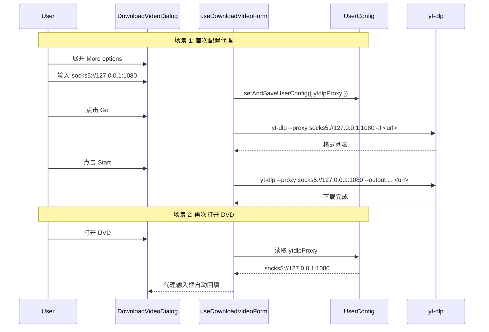

# DVD 代理服务器选项

在 Download Video Dialog (DVD) 的 "More options" 中添加代理服务器输入框, 让用户可以为 yt-dlp 的拉取格式和下载阶段配置 HTTP/HTTPS/SOCKS 代理.

[x] New UI component - no (仅修改已有组件)
[x] New user config - yes, 新增 `ytdlpProxy` 到 `UserConfig`
[ ] Electron only - no
[ ] User document - no

## 1. Background

yt-dlp 通过 `--proxy URL` 支持 HTTP/HTTPS/SOCKS 代理. 用户希望在 DVD 中可以直接配置代理, 无需手动修改 yt-dlp 配置文件. 代理选项放在 "More options" 最底部, 以纯文本输入框形式接受完整的代理 URL. 代理值持久化到 UserConfig, 同时应用于 list-formats 和 download 两个阶段.

**重要**: 拉取视频格式阶段也需要配置代理, 因此 "More options" 必须在拉取格式前和拉取格式后都可见. 拉取格式前的 "More options" 仅显示 JS 运行时 和 代理两项; 拉取格式后的 "More options" 显示完整内容 (JS 运行时, 代理, Cookies, Extra args).

## 2. Project Level Architecture

packages/core:
- `types.ts`: `UserConfig` 新增 `ytdlpProxy?: string`
- `whitelistedCmd/ytdlp.ts`: `YtdlpDownloadRequestInput` 新增 `proxy` 字段, `buildYtdlpDownloadArgs` 在 `--output` 之前插入 `--proxy`

## 3. App Level Architecture

### apps/ui

数据流:

```
UserConfig.ytdlpProxy
       │
       ▼
use-download-video-form.ts (加载 & 管理 proxy 状态)
       │
       ├──► listYtdlpFormats(req.proxy) ──► executeCmd "yt-dlp" ["--proxy", proxy, ...]
       │
       └──► buildDownloadVideoJob(ytdlpProxy) ──► buildYtdlpDownloadArgs(proxy) ──► "--proxy" arg
```

组件层级传递路径:
```
DownloadVideoDialogContent (index.tsx)
  → UIDownloadVideoDialogContent
    → MoreOptionsSection (新增 proxy 输入框)
```

## 4. User Stories

### 4.1 用户通过 DVD 配置代理下载视频

* **Given** - DVD 已打开, 已勾选协议, 已拉取格式
* **When** - 用户展开 "More options", 在 "代理服务器" 输入框输入 `socks5://127.0.0.1:1080` 并点击 Start
* **Then** - yt-dlp 通过该 SOCKS5 代理拉取格式和下载视频, 代理值保存到 UserConfig 下次打开 DVD 自动回填

### 4.2 无代理时行为不变

* **Given** - DVD 已打开
* **When** - 用户不填写代理, 直接下载
* **Then** - yt-dlp 正常直连, 与当前行为完全一致



## 5. Tasks

### 5.1 packages/core - UserConfig 类型 & ytdlp args

[x] 1. `types.ts`: 在 `UserConfig` 中新增 `ytdlpProxy?: string` 字段
[x] 2. `whitelistedCmd/ytdlp.ts`: `YtdlpDownloadRequestInput` 新增 `proxy?: string`, `buildYtdlpDownloadArgs` 增加 `--proxy` 参数 (放在 `--output` 之后, URL 之前)
[x] 3. `whitelistedCmd/ytdlp.test.ts`: 新增 proxy 参数相关测试用例

### 5.2 apps/ui - list-formats API 支持 proxy

[x] 4. `api/ytdlp.ts`: `YtdlpListFormatsRequest` 新增 `proxy?: string`, `listYtdlpFormats` 在 args 中插入 `--proxy` 参数

### 5.3 apps/ui - Job 构建支持 proxy

[x] 5. `lib/downloadVideoJobFactory.ts`: `CreateDownloadVideoJobInput` 新增 `ytdlpProxy?: string`, `DownloadVideoBackgroundJobData` 新增 `ytdlpProxy?: string`
[x] 6. `components/JobOrchestratorProvider.tsx`: 下载时将 `downloadData.ytdlpProxy` 传入 `buildYtdlpDownloadArgs`

### 5.4 apps/ui - Form 状态管理

[x] 7. `hooks/use-download-video-form.ts`:
    - 新增 `proxy` 状态, 从 `appConfig` / `userConfig.ytdlpProxy` 初始化
    - 新增 `setProxy` setter (写入 UserConfig)
    - `handleGo` 中将 proxy 传给 `listFormats`
    - `resetFormState` 中重置 proxy 为 UserConfig 值
    - 返回 `proxy` 和 `setProxy`

### 5.5 apps/ui - 下载流程传递 proxy

[x] 8. `hooks/use-ytdlp-download-flow.ts`:
    - `UseYtdlpDownloadFlowOptions` 新增 `proxy?: string`
    - `buildJobInput` 中将 proxy 传入 `buildDownloadVideoJob`

### 5.6 apps/ui - UI 组件

[x] 9. `download-video-dialog/components/more-options-section.tsx`:
    - `MoreOptionsSectionProps` 新增 `proxy`, `onProxyChange`
    - `MoreOptionsSectionProps` 新增 `showExtraArgs: boolean` 控制是否显示 extra args
    - 在 extra args 之后添加代理输入框 (Input + Label)
    - 输入框 `data-testid="download-video-dialog-proxy-input"`

[x] 10. `UIDownloadVideoDialogContent.tsx`:
    - Props 新增 `proxy`, `onProxyChange`
    - **拉取格式前阶段 (`showCookiesAtTopLevel === true`)**: 在 `CookiesSection` 后渲染 `MoreOptionsSection`, `showExtraArgs={false}`, `showCookiesInMoreOptions={false}` (仅显示 JS 运行时 + 代理)
    - **拉取格式后阶段 (`showCookiesAtTopLevel === false`)**: 原有 `MoreOptionsSection` 渲染, `showExtraArgs={true}`, `showCookiesInMoreOptions={true}` (显示全部内容)

[x] 11. `download-video-dialog/index.tsx`:
    - 从 form 获取 `proxy` / `setProxy`
    - 传递给 `UIDownloadVideoDialogContent`
    - 将 `proxy` 传递给 `useYtdlpDownloadFlow`

### 5.7 i18n 翻译

[x] 12. 在 `apps/ui/public/locales/{en,zh-CN,zh-HK,zh-TW}/dialogs.json` 中各新增:
    - `downloadVideo.proxyLabel`: 代理服务器标签

## 6. Backward Compatibility

- `UserConfig.ytdlpProxy` 为 optional, 旧配置文件无此字段时回退到空字符串 (直连)
- `YtdlpDownloadRequestInput.proxy` 为 optional, 未提供时不添加 `--proxy` 参数
- 所有已有行为完全保留

## 7. Documents

none

## 8. Post Verification

[x] Unit tests
    packages/core: 217 passed (含 3 个新增 proxy 测试用例)
    apps/ui: 1028 passed
[ ] Build
    `pnpm run build` succeeded (UI + CLI)
