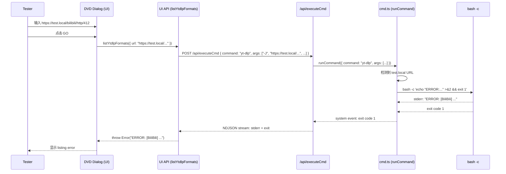

# DVD 添加测试 URL

在 CLI 中添加 `https://test.local` 测试 URL 的拦截机制, 用于手动触发 yt-dlp 错误流程。

[ ] New UI component
[ ] New user config
[ ] Electron only
[ ] User document

## 1. Background

DVD (Download Video Dialog) 中, 当 yt-dlp 执行失败时 (如 HTTP 412 错误), 错误信息需要正确显示在 UI 的 listing error 区域。为了便于手动测试各种错误场景, 需要支持测试 URL——当 CLI 检测到 `https://test.local` 开头的 URL 时, 不调用真实的 yt-dlp, 而是通过 bash 模拟输出指定的错误信息并退出。

## 2. Project Level Architecture

none

## 3. App Level Architecture

### 3.1 修改 `apps/cli/src/utils/cmd.ts`

在 `runCommand()` 函数中, 当 `command === 'yt-dlp'` 且 args 中包含 `https://test.local` URL 时, 拦截正常的 yt-dlp 执行流程, 改为:

1. 解析测试 URL 中的 extractor 名称和 HTTP 状态码
2. 构造模拟的 yt-dlp 错误消息
3. 通过 `bash -c` 内联执行: 将错误消息输出到 stderr, 然后以退出码 1 退出

现有的 `spawnAndPump` → `handleExit` → stderr 路由 → NDJSON 流 → UI 错误展示流程全部保持不变, 确保端到端覆盖。

### 3.2 测试 URL 格式

```
https://test.local/{extractor}/http/{status_code}
```

| 字段 | 说明 | 示例 |
|------|------|------|
| `extractor` | yt-dlp extractor 名称 (小写) | `bilibili` |
| `status_code` | HTTP 状态码 | `412` |

生成的错误消息格式:
```
ERROR: [{Extractor}] {video_id}: Unable to download webpage: HTTP Error {status_code}: {status_text} (caused by <HTTPError {status_code}: {status_text}>)
```

其中 `{Extractor}` 为首字母大写的 extractor 名称, `{video_id}` 为固定测试 ID `1fSV26aE5Q`。

### 3.3 已支持的测试 URL

| 测试 URL | 模拟的错误 |
|----------|-----------|
| `https://test.local/bilibili/http/412` | HTTP 412: Precondition Failed |

> **注意**: 未来可扩展支持更多 extractor 和状态码。

## 4. User Stories

### 4.1 手动测试 DVD HTTP 412 错误

* **Given** DVD 对话框已打开, 用户已勾选协议
* **When** 用户在 URL 输入框输入 `https://test.local/bilibili/http/412` 并点击 GO 按钮
* **Then** DVD 对话框的 listing error 区域显示错误消息: `ERROR: [BiliBili] 1fSV26aE5Q: Unable to download webpage: HTTP Error 412: Precondition Failed (caused by <HTTPError 412: Precondition Failed>)`



## 5. Tasks

### 5.1 CLI: 测试 URL 拦截

[x] 5.1.1 添加 `parseTestYtDlpUrl()` 函数 — 解析 `https://test.local/{extractor}/http/{status}` URL, 提取 extractor 和 HTTP 状态码
[x] 5.1.2 添加 `buildYtDlpSimulatedError()` 函数 — 根据解析结果构造模拟错误消息
[x] 5.1.3 修改 `runCommand()` — 在 `command === 'yt-dlp'` 时检测测试 URL, 拦截并改为 `bash -c` 执行

### 5.2 测试

[x] 5.2.1 为 `parseTestYtDlpUrl()` 和 `buildYtDlpSimulatedError()` 添加单元测试
[x] 5.2.2 为 `runCommand()` 中测试 URL 拦截逻辑添加单元测试

## 6. Backward Compatibility

none — `test.local` 不是真实域名, 不会影响正常使用。

## 7. Documents

none

## 8. Post Verification

[x] Unit tests
    Run `pnpm run test` and expect all unit tests succeeded
[x] Build
    Run `pnpm run build` and expect build succeeded
