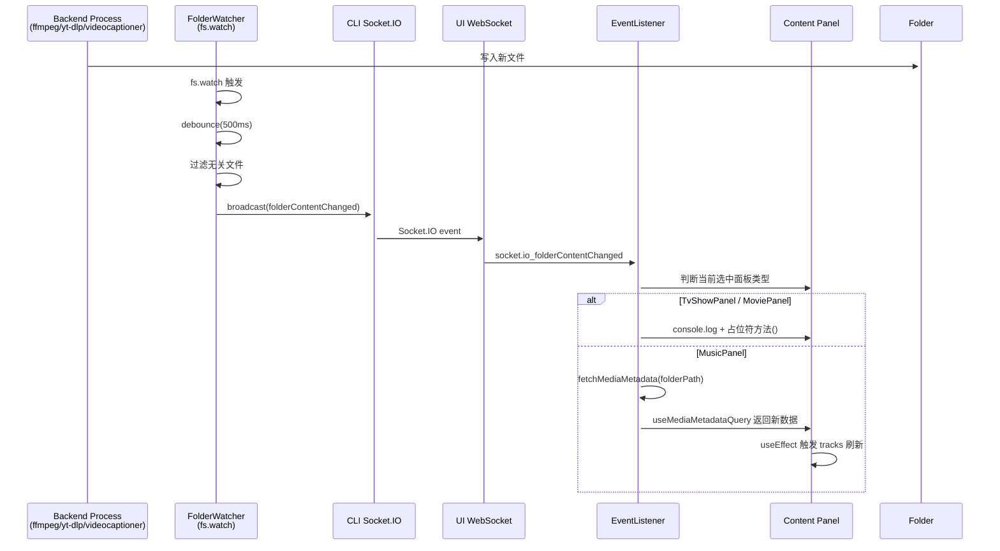

# Folder Content Watcher

Monitor media folders for file changes (additions, deletions, modifications) using `fs.watch` API on the CLI side. When changes are detected, notify the UI panels to refresh their content.

## Checklist

[ ] New UI component - Event Listener for folder content changes
[ ] New backend module - folder watcher service
[ ] New event type - `folderContentChanged` in event-types
[ ] Electron only - No (works in all environments)
[ ] User document - No

## 1. Background

当前当视频格式转换、字幕文件生成、总结文件生成等操作完成后, UI 面板无法自动感知文件变化, 需要用户手动刷新. 
本功能提供一个通用的文件监控方案, 使得任何增删文件的操作都能自动触发 UI 更新, 无需每个功能都主动发送通知.

## 2. Project Level Architecture

No changes required.

## 3. App Level Architecture

### CLI 侧: 新增 `folderWatcher` 服务

```
apps/cli/src/services/folderWatcher.ts
```

- 维护一个被监控文件夹的 Map (`folderPath -> fs.FSWatcher`)
- 支持 `startWatching(folderPath)` / `stopWatching(folderPath)` 
- 使用 debounce (500ms) 聚合短时间内的大量文件变更事件
- 过滤掉无关文件变更 (dotfiles, 临时文件等)
- 检测到相关文件变更后, 通过 Socket.IO 广播 `folderContentChanged` 事件

### CLI 侧: 启动和生命周期管理

```
apps/cli/index.ts 或 apps/cli/server.ts
```

- Server 启动时:
  1. 读取 `userConfig.folders` 中的所有文件夹路径
  2. 对每个文件夹调用 `startWatching()`
- 当用户配置变更时:
  - 监听 `userConfigUpdated` 事件（内部自监听或通过定期检查）
  - 检测新增的文件夹 → `startWatching()`
  - 检测被删除的文件夹 → `stopWatching()`

### CLI 侧: 广播事件

```typescript
// 在 folderWatcher.ts 中
import { broadcast } from "../utils/socketIO";
import { FOLDER_CONTENT_CHANGED_EVENT } from "@core/event-types";

// 当检测到文件变更时
broadcast({
  event: FOLDER_CONTENT_CHANGED_EVENT,
  data: {
    folderPath: mediaFolderPath, // POSIX format
    changeType: "created" | "modified" | "deleted",
    filePath: relativeFilePath, // optional, for future use
  }
});
```

### UI 侧: 新的事件类型

在 `packages/core/event-types.ts` 中新增:

```typescript
export const FOLDER_CONTENT_CHANGED_EVENT = 'folderContentChanged'

export interface FolderContentChangedEventData {
  /** Folder path in POSIX format */
  folderPath: string
  /** Type of change detected */
  changeType: "created" | "modified" | "deleted"
  /** Optional relative file path */
  filePath?: string
}
```

### UI 侧: 新增事件监听器

创建 `apps/ui/src/components/eventlisteners/FolderContentChangedEventListener.tsx`:

```typescript
function FolderContentChangedEventListener() {
  // 监听 socket.io_folderContentChanged 事件
  // 1. 比较 folderPath 与当前选中的文件夹
  // 2. 如果是当前选中的文件夹, 根据类型执行不同操作:
  //    - TvShowPanel/MoviePanel: console.log + 占位符方法
  //    - MusicPanel: 触发 fetchMediaMetadata (从而触发 track 刷新)
}
```

### UI 侧: 注册监听器

在 `main.tsx` 的 `EventListeners` 组件中添加 `<FolderContentChangedEventListener />`

### UI 侧: 复用现有刷新机制

MusicPanel 的 tracks 刷新依赖于 `mediaMetadata` 的变化:

```tsx
// MusicPanel.tsx 已有:
useEffect(() => {
  if (!mediaMetadata?.mediaFolderPath) { ... }
  const musicMediaMetadata = newMusicMediaMetadata(mediaMetadata);
  const newTracks = convertMusicFilesToTracks(musicMediaMetadata.musicFiles);
  setTracks((prev) => { ... });
}, [mediaMetadata, jobTracks]);
```

当 `FolderContentChangedEventListener` 调用 `fetchMediaMetadata` 后, React Query 的缓存更新, `useMediaMetadataQuery` 返回新的数据, 上述 useEffect 自动执行, 完成 tracks 刷新.

## 4. User Stories

### 4.1 视频格式转换后文件自动显示

* **Given** - 用户在 MusicPanel 中查看某个音乐文件夹的音乐文件列表
* **When** - 用户执行格式转换, 转换完成后生成了新的音频文件
* **Then** - MusicPanel 自动显示新增的音频文件, 无需手动刷新

### 4.2 字幕/总结文件生成后 TV/Movie 面板收到通知

* **Given** - 用户在 TvShowPanel/MoviePanel 中查看某个媒体文件夹
* **When** - 后台任务生成字幕文件或总结文件
* **Then** - TvShowPanel/MoviePanel 打印日志, 并在控制台预留占位符方法的调用, 方便日后扩展



### 4.3 通用文件变更通知

* **Given** - 用户打开任意一个媒体文件夹
* **When** - 任何后台进程在该文件夹中增删文件
* **Then** - UI 面板自动感知文件变更, 无需每个功能单独发送通知

## 5. Tasks

### 5.1 核心事件类型

- [x] 在 `packages/core/event-types.ts` 中新增 `FOLDER_CONTENT_CHANGED_EVENT` 常量和 `FolderContentChangedEventData` 接口
  - 文件: `packages/core/event-types.ts`
  - commit: 新增 `FOLDER_CONTENT_CHANGED_EVENT` 常量, `FolderContentChangedEventData` 接口

### 5.2 CLI 端文件夹监控服务

- [x] 创建 `apps/cli/src/services/folderWatcher.ts`
  - `startWatching(folderPath: string)` - 启动监控
  - `stopWatching(folderPath: string)` - 停止监控
  - `stopAllWatching()` - 停止所有监控
  - 内部 debounce(500ms) + 过滤(dotfiles, temp files) + 广播逻辑
- [x] 在 `apps/cli/server.ts` 中初始化 folderWatcher
  - `start()` 方法中读取 userConfig.folders 启动监控
  - `stop()` 方法中调用 `stopAllWatching()` 清理资源

### 5.3 UI 端事件监听器

- [x] 创建 `apps/ui/src/components/eventlisteners/FolderContentChangedEventListener.tsx`
  - 监听 `socket.io_folderContentChanged` DOM 事件
  - 获取当前选中的媒体文件夹
  - 比较事件中的 folderPath 与当前选中
  - 根据面板类型分发处理:
    - TvShowPanel/MoviePanel: 日志 + 占位符方法 `onTvShowPanelFileChange()` / `onMoviePanelFileChange()`
    - MusicPanel: `fetchMediaMetadata` 触发自动刷新
- [x] 在 `main.tsx` 的 `EventListeners` 组件中注册

### 5.4 单元测试

- [ ] 为 `folderWatcher.ts` 编写单元测试
- [ ] 为 `FolderContentChangedEventListener.tsx` 编写单元测试

## 6. Backward Compatibility

无影响. 本功能是纯新增功能, 不修改现有接口或行为. 

现有 `mediaMetadataUpdated` 事件流不受影响, `folderContentChanged` 是一个独立的新事件.

## 7. Documents

无需要更新的文档.

## 8. Post Verification

- [x] 单元测试: `pnpm run test` 全部通过 (core: 217, ui: 953, cli: 188)
- [x] 构建: `pnpm run build` 全部通过

## Debug Log

### 问题: 字幕文件生成后 UI 仍显示 "No associated files found"

**根因 1**: `FolderContentChangedEventListener` 的闭包陷阱
- `useMount` 中创建的事件处理闭包捕获了 `selectedFolder = ""` (初始值)
- 用户点击选中文件夹后, 组件的 `selectedFolder` 更新但闭包中的值不变
- 导致 `eventFolderPosix === selectedFolderPosix` 永远不成立
- **修复**: 使用 `useLatest` 读取最新值

**根因 2**: 即使文件夹匹配, 也没有使 `associatedFiles` 的 TanStack Query 缓存失效
- `useGetAssociatedFiles` 使用 30s staleTime 的缓存
- 新 .srt 文件创建后, 查询仍返回旧的文件列表
- **修复**: 添加 `queryClient.invalidateQueries` 使缓存失效
