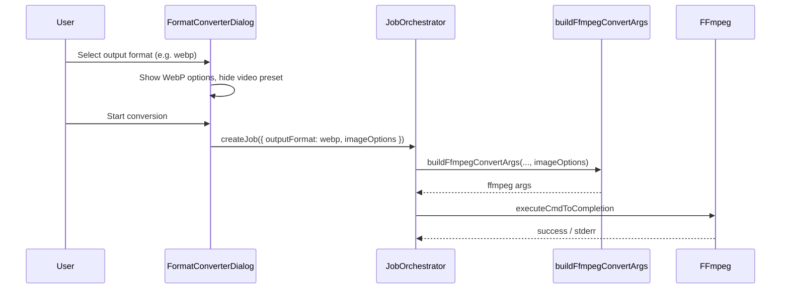

# Format Converter: AVIF / WebP / APNG Output

Extend `FormatConverterDialog` to support converting video to **AVIF**, **WebP**, and **APNG** image formats. Each format exposes its own encoding options in the UI (replacing the generic video preset when an image format is selected).

[ ] New UI component
[ ] New user config
[ ] Electron only
[ ] User document

## 1. Background

Today `FormatConverterDialog` converts video to video containers (MP4 H.264/H.265, WebM VP9, MKV) using a shared **Encoding preset** (`quality` / `balanced` / `speed`). The job pipeline is:

```
FormatConverterDialog
  → buildFfmpegConvertJob()
  → JobOrchestrator (ffmpeg-convert)
  → buildFfmpegConvertArgs()  // packages/core/whitelistedCmd/ffmpeg.ts
  → executeCmdToCompletion({ command: "ffmpeg", args })
```

Bundled ffmpeg (n8.0) supports:

| Format | Encoder | Key encoder options | Muxer options |
|--------|---------|---------------------|---------------|
| **AVIF** | `libaom-av1` (default), `libsvtav1`, `librav1e` | `crf` (0–63), `cpu-used` (0–8, libaom), `preset` (-2–13, svtav1), `still-picture` (single frame) | `loop` (0 = infinite), `movie_timescale` |
| **WebP** | `libwebp` (still), `libwebp_anim` (animated) | `lossless` (0/1), `quality` (0–100), `preset` (default/picture/photo/drawing/icon/text) | `loop` (0 = infinite, default 1) |
| **APNG** | `apng` | `pred` (none/sub/up/avg/paeth/mixed) — lossless, no quality knob | `plays` (0 = infinite loop), `final_delay` |

Video → animated image typically requires **frame-rate reduction** and optional **scaling** in addition to codec options, e.g.:

```bash
ffmpeg -i input.mp4 -vf "fps=10,scale=480:-1:flags=lanczos" \
  -c:v libwebp_anim -quality 80 -loop 0 output.webp
```

### FFmpeg option survey (bundled build)

**libaom-av1** (recommended default for AVIF muxer):

- `-crf` 0–63 (lower = better quality, larger file)
- `-cpu-used` 0–8 (0 = slowest/best, 8 = fastest)
- `-still-picture 1` for single-frame AVIF

**libsvtav1** (faster alternative):

- `-crf` 0–63
- `-preset` -2–13 (higher = faster)

**libwebp / libwebp_anim**:

- `-lossless` 0 or 1
- `-quality` 0–100 (ignored when lossless)
- `-preset` picture / photo / drawing / icon / text / default

**apng**:

- `-pred` paeth (default), mixed, etc.
- Lossless; file size controlled mainly by FPS, resolution, and source content

## 2. Project Level Architecture

None.

## 3. App Level Architecture

### 3.1 Type & data model changes

Extend `FfmpegConvertFormat` in `packages/core/whitelistedCmd/constants.ts`:

```ts
export type FfmpegConvertFormat =
  | "mp4h264" | "mp4h265" | "webm" | "mkv"
  | "avif" | "webp" | "apng"
```

Add format-specific options (stored in job data, passed to arg builder):

```ts
export type FfmpegConvertImageOptions = {
  /** User-selectable: full animation vs single frame */
  mode: "animated" | "still"
  /** Output frames per second (animated) or ignored for still */
  fps: number
  /** Max width in pixels; 0 = keep source width */
  maxWidth: number
  /** AVIF */
  avif?: {
    crf: number
    cpuUsed: number
    loop: "once" | "infinite"
  }
  /** WebP */
  webp?: {
    lossless: boolean
    quality: number
    preset: "default" | "picture" | "photo" | "drawing" | "icon" | "text"
    loop: "once" | "infinite"
  }
  /** APNG */
  apng?: {
    pred: "paeth" | "mixed" | "none" | "sub" | "up" | "avg"
    loop: "once" | "infinite"
  }
}
```

`FfmpegConvertBackgroundJobData` gains optional `imageOptions?: FfmpegConvertImageOptions`. Video formats continue using `preset: FfmpegConvertPreset` only.

### 3.2 UI behaviour (`format-converter-dialog.tsx`)

| Selected format | Show preset (Quality/Balanced/Speed) | Show format-specific panel |
|-----------------|--------------------------------------|----------------------------|
| mp4h264, mp4h265, webm, mkv | Yes | No |
| avif | No | AVIF options |
| webp | No | WebP options |
| apng | No | APNG options |

**Shared image section** (shown for avif / webp / apng):

| Control | Default | Maps to ffmpeg |
|---------|---------|----------------|
| Output mode | `animated` | `-vframes 1` + still encoder vs full stream |
| FPS | `10` | `-vf fps=N` (animated only) |
| Max width | `0` (source) | `-vf scale=W:-2:flags=lanczos` when W > 0 |

**AVIF panel**

| Control | Default | ffmpeg mapping |
|---------|---------|----------------|
| Quality (CRF) | `30` | `-crf 30` |
| Speed (cpu-used) | `4` | `-cpu-used 4` |
| Loop | `once` | `-loop 0` (infinite) or omit / `-loop 1` |

Encoder: fixed `libaom-av1`, muxer `-f avif`.

**WebP panel**

| Control | Default | ffmpeg mapping |
|---------|---------|----------------|
| Lossless | off | `-lossless 0` |
| Quality | `80` | `-quality 80` (disabled when lossless) |
| Content preset | `default` | `-preset default` |
| Loop | `once` | `-loop 0` or default 1 |

Encoder: `libwebp_anim` (animated) / `libwebp` (still).

**APNG panel**

| Control | Default | ffmpeg mapping |
|---------|---------|----------------|
| Compression prediction | `paeth` | `-pred paeth` |
| Loop | `once` | `-plays 0` (infinite) or `-plays 1` |

Encoder: `apng`.

Output filename extension: `.avif`, `.webp`, `.apng`.

### 3.3 Arg builder (`packages/core/whitelistedCmd/ffmpeg.ts`)

Extend `buildFfmpegConvertArgs` signature:

```ts
buildFfmpegConvertArgs(
  inputPath, outputPath, format, preset,
  imageOptions?: FfmpegConvertImageOptions,
)
```

New cases `avif` / `webp` / `apng` build `-vf` filter chain, pick encoder, append muxer flags, `-an` (no audio). Still mode adds `-vframes 1`.

Mirror the same logic in `apps/cli/src/utils/Ffmpeg.ts` if that path is still used (keep in sync).

### 3.4 Sequence diagram



## 4. User Stories

### 4.1 Convert video to animated WebP

* **Given** a video file is selected in MusicPanel
* **When** the user opens Format Converter, chooses WebP, sets quality 80 and FPS 10, and starts
* **Then** a background job runs ffmpeg with `libwebp_anim`, produces `*.webp`, and progress appears in the job list

### 4.2 Format-specific options visibility

* **Given** the user selects MP4 (H.264)
* **When** the dialog renders
* **Then** Encoding preset is shown and WebP/AVIF/APNG options are hidden

* **Given** the user switches format to AVIF
* **When** the dialog updates
* **Then** Encoding preset is hidden and AVIF-specific controls are shown

## 5. Tasks

### 5.1 Core / ffmpeg args

- [x] Add `avif` | `webp` | `apng` to `FfmpegConvertFormat` and `FfmpegConvertImageOptions` type
- [x] Implement `buildFfmpegConvertArgs` cases for three formats + unit tests in `packages/core`
- [x] Sync `apps/cli/src/utils/Ffmpeg.ts` if still referenced — skipped; UI path uses core whitelistedCmd

### 5.2 Job data & orchestrator

- [x] Extend `FfmpegConvertBackgroundJobData` with `imageOptions`
- [x] Update `buildFfmpegConvertJob` to accept/pass `imageOptions`
- [x] Update `JobOrchestratorProvider` ffmpeg-convert case to pass `imageOptions` to arg builder
- [x] Update `apps/ui/src/api/ffmpeg.ts` `convertVideo` if direct API calls need parity

### 5.3 UI

- [x] Add three formats to `OUTPUT_FORMATS` in `format-converter-dialog.tsx`
- [x] Conditional panels: video preset vs format-specific options
- [x] Shared image controls (mode / fps / maxWidth)
- [x] Reset dependent state when switching output format
- [x] i18n keys in en, zh-CN, zh-HK, zh-TW (`dialogs.json` + `i18next.d.ts`)

### 5.4 Tests

- [x] `format-converter-dialog.test.tsx`: format switch shows/hides controls; job payload includes `imageOptions`
- [x] `packages/core/whitelistedCmd/ffmpeg.test.ts`: arg snapshots for avif/webp/apng

## 6. Backward Compatibility

- Existing jobs and API payloads with only `outputFormat` + `preset` remain valid for video formats.
- New fields are optional; no migration required.

## 7. Documents

- [ ] `docs/api/index.md` — only if a REST convert endpoint documents format enum (verify during implementation)

## 8. Post Verification

- [ ] `pnpm test:core` — ffmpeg arg builder tests
- [ ] `pnpm test:ui` — dialog tests
- [ ] Manual: convert short clip to each format; verify playable output in browser / image viewer

## 9. Confirmed requirements

| Decision | Choice |
|----------|--------|
| Output mode | User selects **animated** or **still** (single frame) |
| Shared controls | **FPS + max width** for all three image formats |
| Video preset | **Hidden** when AVIF/WebP/APNG selected; show format-specific options instead |
