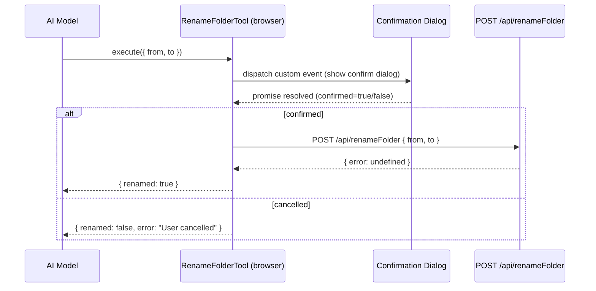
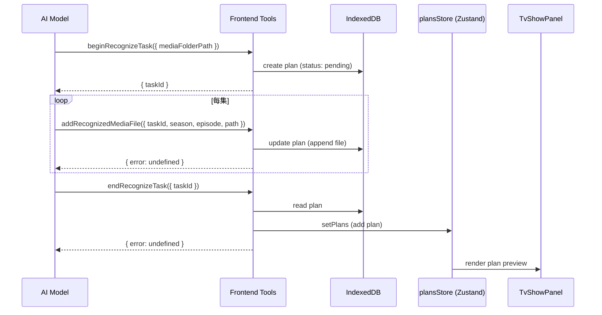

# Frontend AI Tools

实现 `ReverseProxyChatTransport` 前端 AI transport 所缺失的 AI tools，使其与 `ChatTask.ts` 后端版本功能对齐。

[ ] New user config - none
[ ] Electron only - none
[ ] User document - none

## 1. Background

SMM 有两套并行的 AI 工具实现：

| 维度 | 后端版 (ChatTask.ts) | 前端版 (ui/src/ai/tools/) |
|---|---|---|
| Transport | `AssistantChatTransport` → `POST /api/chat` | `ReverseProxyChatTransport` → `streamText` in browser |
| 执行环境 | Bun 服务器端 | 浏览器 |
| 工具注册 | `streamText({ tools: {...} })` | `makeAssistantTool()` React 组件 + `ToolsBridge` |
| 已实现 | 14 个工具全部可用 | 仅 4 个工具 (`getApplicationContext`, `getMediaFolders`, `getMediaMetadata`, `listFilesInMediaFolder`) |
| 目标环境 | 桌面 Electron | HarmonyOS / 桌面 feature flag |

**缺失的前端工具**（9 个）：
- `isFolderExist` — 检查文件夹是否存在
- `getEpisodes` — 获取电视剧季集数据
- `renameFolder` — 重命名媒体文件夹
- `beginRenameFilesTaskV2` / `addRenameFileToTaskV2` / `endRenameFilesTaskV2` — 批量重命名任务
- `beginRecognizeTask` / `addRecognizedMediaFile` / `endRecognizeTask` — 批量识别任务

## 2. Project Level Architecture

none — 不涉及跨 app 的架构变更。

## 3. App Level Architecture

### apps/ui

新增 **IndexedDB Plan Store**，替代后端 `Bun.file` 方案管理 plan 文件：

```
apps/ui/src/ai/
├── planStore.ts                    ← NEW: IndexedDB plan CRUD
├── tools/
│   ├── index.ts                    ← MODIFIED: 导出新工具
│   ├── IsFolderExist.tsx           ← NEW
│   ├── GetEpisodes.tsx             ← NEW
│   ├── RenameFolder.tsx            ← NEW
│   ├── BeginRenameFilesTask.tsx    ← NEW
│   ├── AddRenameFileToTask.tsx     ← NEW
│   ├── EndRenameFilesTask.tsx      ← NEW
│   ├── BeginRecognizeTask.tsx      ← NEW
│   ├── AddRecognizedMediaFile.tsx  ← NEW
│   └── EndRecognizeTask.tsx        ← NEW
├── transport/
│   └── reverseProxyChatTransport.ts ← UNCHANGED (tools 通过 setTools 动态传入)
└── Assistant.tsx                   ← MODIFIED: 注册新工具组件
```

Task 类工具（rename/recognize）使用 IndexedDB 存储 plan 数据，而非后端文件系统。流程：

```
Tool.execute()
  ├── beginXxxTask   → planStore.create({ status: "pending" })
  ├── addXxxToTask   → planStore.update({ files: [...] })
  └── endXxxTask     → planStore.update({ status: "pending" })  → usePlansStore.setPlans()
```

确认机制（`renameFolder`）：
- 工具通过 module-level promise + custom DOM event 触发确认弹窗
- 复用前端已有的确认 UI（ConfirmationDialog）
- 确认后调用 `POST /api/renameFolder`

### apps/cli

新增一个 HTTP endpoint 供前端 `getEpisodes` 工具调用：

```
apps/cli/src/route/
└── getEpisodes.ts                  ← NEW: GET /api/getEpisodes
```

复用已有的 `handleGetEpisodes`（`tools/getEpisodes.ts`）。

## 4. User Stories

### 4.1 AI 助手查询文件夹是否存在

* **Given** - 用户已开启 AI 助手，使用前端 transport
* **When** - AI 调用 `isFolderExist` 工具，传入路径
* **Then** - 工具调用 `POST /api/isFolderAvailable`，返回 `{ exists: true/false }`

### 4.2 AI 助手获取电视剧季集信息

* **Given** - 用户已选中一个电视剧媒体文件夹
* **When** - AI 调用 `getEpisodes` 工具，传入 `mediaFolderPath`
* **Then** - 工具调用 `POST /api/getEpisodes`，返回季集列表（含已匹配的视频文件路径）

### 4.3 AI 助手重命名媒体文件夹

* **Given** - 用户已选中一个媒体文件夹
* **When** - AI 调用 `renameFolder` 工具，传入 `from` 和 `to` 路径
* **Then** - 工具触发确认弹窗 → 用户确认 → 调用 `POST /api/renameFolder`



### 4.4 AI 助手批量识别季集视频文件

* **Given** - 用户已选中电视剧文件夹
* **When** - AI 调用 `beginRecognizeTask` → `addRecognizedMediaFile` (多次) → `endRecognizeTask`
* **Then** - Plan 数据存入 IndexedDB，`endRecognizeTask` 将 plan 加入 `plansStore`，UI 展示识别预览



### 4.5 AI 助手批量重命名视频文件

* **Given** - 用户已选中电视剧文件夹，视频文件已识别
* **When** - AI 调用 `beginRenameFilesTaskV2` → `addRenameFileToTaskV2` (多次) → `endRenameFilesTaskV2`
* **Then** - Plan 数据存入 IndexedDB，`endRenameFilesTaskV2` 将 plan 加入 `plansStore`，UI 展示重命名预览

## 5. Tasks

### 5.1 IndexedDB Plan Store

[x] **Task 1**: 创建 `apps/ui/src/ai/planStore.ts`
  - 封装 IndexedDB `plans` object store
  - 提供 `createRecognizePlan`, `createRenamePlan`, `readPlan`, `addRecognizedFileToPlan`, `addRenameEntryToPlan`, `updatePlanStatus`, `deletePlan`, `listAllPlans` 接口
  - Plan 类型兼容 `RecognizeMediaFilePlan` 和 `RenameFilesPlan`
  - 使用 `crypto.randomUUID()` 生成 id
  - 添加了 17 个单元测试 (`planStore.test.ts`)

### 5.2 HTTP API 封装

[x] **Task 2**: 创建 `apps/ui/src/api/getEpisodes.ts`
  - 封装 `POST /api/getEpisodes` 调用
  - 请求 `{ mediaFolderPath: string }`，返回 `{ episodes, totalCount, showName, numberOfSeasons }`
  - 支持 `AbortSignal` 用于取消请求

[x] **Task 3**: 创建 `apps/cli/src/route/getEpisodes.ts` (后端 endpoint)
  - `POST /api/getEpisodes` 路由
  - 复用 `tools/getEpisodes.ts` 中的 `handleGetEpisodes()`
  - 注册到 Hono app (`apps/cli/server.ts`)

### 5.3 简单工具 (无状态, 单次调用)

[x] **Task 4**: 创建 `IsFolderExist.tsx`
  - 参数: `{ path: string }`
  - 调用 `isFolderAvailable(path)` API
  - 返回 `{ exists, path, reason? }`

[x] **Task 5**: 创建 `GetEpisodes.tsx`
  - 参数: `{ mediaFolderPath: string }`
  - 调用 `POST /api/getEpisodes`
  - 返回 `{ episodes, totalCount, showName, numberOfSeasons, message? }`
  - 错误处理: 返回空 episodes + message

[x] **Task 6**: 创建 `RenameFolder.tsx` + `confirmationBridge.ts` + `AIBasedConfirmationBridge.tsx`
  - 参数: `{ from: string, to: string }`
  - 通过 promise-based 机制 (`requestConfirmation`) 触发确认弹窗
  - `<AIBasedConfirmationBridge />` 监听 `smm-ai-confirmation-request` 自定义事件
  - 确认后调用 `POST /api/renameFolder`
  - 取消时返回 `{ renamed: false, error: "User cancelled" }`
  - 添加了 8 个单元测试 (`confirmationBridge.test.ts`)

### 5.4 识别任务工具 (IndexedDB)

[x] **Task 7**: 创建 `BeginRecognizeTask.tsx`
  - 参数: `{ mediaFolderPath: string }`
  - 生成 `id` (作为 `taskId`)
  - 调用 `planStore.createRecognizePlan` 创建 pending plan
  - 返回 `{ taskId, error? }`

[x] **Task 8**: 创建 `AddRecognizedMediaFile.tsx`
  - 参数: `{ taskId, season, episode, path }`
  - 调用 `planStore.addRecognizedFileToPlan` 追加文件
  - 校验 taskId 存在
  - 返回 `{ error } | { error: undefined }`

[x] **Task 9**: 创建 `EndRecognizeTask.tsx`
  - 参数: `{ taskId }`
  - 调用 `planStore.readPlan` 读取 plan
  - 转换为 `UIRecognizeMediaFilePlan` 并推入 `usePlansStore.setPlans()`
  - 导出 `cleanupRecognizePlan` 供 UI 清理使用

### 5.5 重命名任务工具 (IndexedDB)

[x] **Task 10**: 创建 `BeginRenameFilesTask.tsx`
  - 参数: `{ mediaFolderPath: string }`
  - 生成 `id`
  - 调用 `planStore.createRenamePlan` 创建 pending rename plan
  - 返回 `{ taskId, error? }`

[x] **Task 11**: 创建 `AddRenameFileToTask.tsx`
  - 参数: `{ taskId, from, to }`
  - 调用 `planStore.addRenameEntryToPlan` 追加 rename entry
  - 返回 `{ error } | { error: undefined }`

[x] **Task 12**: 创建 `EndRenameFilesTask.tsx`
  - 参数: `{ taskId }`
  - 调用 `planStore.readPlan` 读取 plan
  - 转换为 `UIRenameFilesPlan` 并推入 `usePlansStore.setPlans()`
  - 导出 `cleanupRenamePlan` 供 UI 清理使用

### 5.6 注册与集成

[x] **Task 13**: 更新 `apps/ui/src/ai/tools/index.ts`
  - 导出所有新工具组件和 cleanup helpers

[x] **Task 14**: 更新 `apps/ui/src/ai/Assistant.tsx`
  - 在 `<AssistantRuntimeProvider>` 内注册新工具组件
  - 在 provider 树中挂载 `<AIBasedConfirmationBridge />` 以处理 in-browser 确认弹窗
  - `ToolsBridge` 通过 `useAssistantTools()` 自动捕获新工具 (无需改动)

### 5.7 后端 endpoint

[x] **Task 15**: 注册 `POST /api/getEpisodes` 到 Hono app
  - 在 `apps/cli/server.ts` 中调用 `handleGetEpisodesRoute(this.app)`

## 6. Backward Compatibility

- 后端 `ChatTask.ts` 不受影响 — 前端工具和后端工具通过不同的 transport 路径使用，不互相替代
- `ReverseProxyChatTransport` 的 `setTools()` 机制无需改动
- `AssistantChatTransport`（桌面默认）的工具调用路径不变
- `plansStore`（Zustand）被前端 plan 工具直接写入是额外操作，不改变后端 plan 文件的现有流程

## 7. Documents

none — 无需更新用户文档，这是内部实现改进。

## 8. Post Verification

[x] Unit tests — UI 全部 1332 测试通过 (含 25 个新测试)
[x] Build — `pnpm build:ui` 和 `pnpm build:cli` 通过
[x] Type check — `pnpm typecheck:ui` 通过 (CLI 仅有预存错误，与本变更无关)
