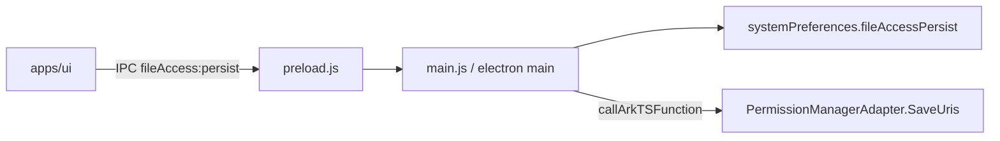
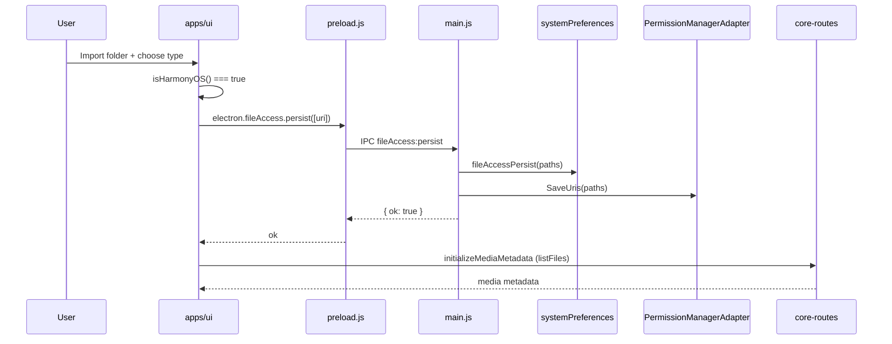

# HarmonyOS File Access Persist

Persist user-granted media folder access on HarmonyOS via `systemPreferences.fileAccessPersist()` before Media Folder Initialization, so `initializeMediaMetadata` can list files inside the folder.

Related: [harmonyos-folder-import.md](./harmonyos-folder-import.md)

[ ] New UI component
[ ] New user config
[x] Electron only — IPC + `systemPreferences.fileAccessPersist` are HarmonyOS Electron APIs
[ ] User document

## 1. Background

On HarmonyOS, apps cannot freely read arbitrary directories. After the user picks a folder via `DocumentViewPicker` (`dialog.showOpenDialog`), the app must call `fileShare.persistPermission()` while the grant is still valid, **before** reading the directory.

**Media Folder Initialization** (`useInitializeImportedMediaFolder`) calls `initializeMediaMetadata`, which lists files in the folder via core-routes. Without persisted access, initialization fails or returns empty results.

### URI vs `smm.json` folders

| Storage | Key / field | Value format | Purpose |
|---------|-------------|--------------|---------|
| `smm.json` | `folders[]` | Folder path/URI from picker (`folderPathInPlatformFormat`) | App config — which media folders are imported |
| ArkTS `preferences` (`myStore`) | `defaultDownloadUri` | Same URI strings via `SaveUris` | Re-activate access on next app launch via `activatePermission` |

On HarmonyOS, `dialog.showOpenDialog` returns **URI strings** (e.g. `file://docs/storage/...`) in `filePaths`. That same string is stored in `smm.json` `folders` and must be passed to `fileAccessPersist`. They are the **same logical identifier**, stored in two places for different roles.

`SaveUris` is **not** redundant with `smm.json`: `initPermissions()` on app start reads `defaultDownloadUri` from ArkTS preferences, not from `smm.json`. The IPC handler should call **both** `fileAccessPersist` and `SaveUris` with the same path array.

### Failure policy

If persist fails → **abort** Media Folder Initialization and show an error toast (user-selected).

## 2. Project Level Architecture

Extend `packages/electron-common` with a new IPC channel for file access persist, shared by `apps/electron` and `apps/ohos` main process.



No change to `packages/core-routes` or `apps/cli`.

## 3. App Level Architecture

### 3.1 packages/electron-common

Add:

```
packages/electron-common/src/
├── channels.ts                    # + FILE_ACCESS_PERSIST_CHANNEL
├── fileAccessPersistIpc.ts        # registerFileAccessPersistIpcHandlers
└── preload/
    ├── fileAccessPersistApi.ts    # createFileAccessPersistPreloadApi
    └── index.ts                   # expose electron.fileAccess.persist
```

**IPC channel:** `fileAccess:persist`

**Request:** `{ paths: string[] }`

**Main-process handler (HarmonyOS):**

1. Validate `paths` is a non-empty `string[]`
2. `systemPreferences.fileAccessPersist(paths)`
3. `systemPreferences.callArkTSFunction('PermissionManagerAdapter.SaveUris', 'void', [paths])`
4. Return `{ ok: true }`

**Non-HarmonyOS (Windows / macOS / Linux):** handler is a no-op returning `{ ok: true, skipped: true }` — desktop does not need `fileShare.persistPermission`.

Detection in main process: `process.platform === 'ohos'` (or check API existence).

**Preload surface:**

```typescript
window.electron.fileAccess.persist(paths: string[]): Promise<{ ok: boolean; skipped?: boolean }>
```

### 3.2 apps/ohos

- Register `registerFileAccessPersistIpcHandlers(ipcMain)` in `main.js` (alongside existing dialog IPC).
- Rebuild `electron-common.cjs` + `preload.js` via `pnpm --filter @smm/electron-common build:ohos`.

### 3.3 apps/electron

- Call `registerFileAccessPersistIpcHandlers(ipcMain)` in `src/main/index.ts` (no-op on non-OHOS).

### 3.4 apps/ui

**HarmonyOS detection** — new `src/lib/isHarmonyOS.ts`:

```typescript
export function isHarmonyOS(): boolean {
  if (typeof navigator === 'undefined') return false
  const v = navigator.appVersion
  return v.includes('OHOS') || v.includes('OpenHarmony')
}
```

**Persist helper** — new `src/lib/persistHarmonyOSFileAccess.ts`:

- Requires `isHarmonyOS()` && `window.electron?.fileAccess?.persist`
- Calls IPC with `[folderPath]`
- Throws on failure (initialization will abort)

**Integration point** — `useInitializeImportedMediaFolder.initializeImportedMediaFolder`:

```typescript
// After parsing event detail, BEFORE onStart / doInitialization:
if (isHarmonyOS()) {
  await persistHarmonyOSFileAccess([folderPathInPlatformFormat])
}
```

This covers all import paths (toolbar, drag-drop, TvShowPanel) because they all dispatch `UI_MediaFolderImportedEvent` → same handler.

## 4. User Stories

### 4.1 Import media folder on HarmonyOS with persisted access

**Given** I run SMM on a HarmonyOS Electron device  
**When** I import a media folder and confirm the folder type  
**Then** the app persists file access for the folder URI before initialization  
**And** Media Folder Initialization can list files inside the folder  
**And** the folder appears in the sidebar with metadata loaded  



### 4.2 Persist fails → initialization aborted

**Given** I import a folder on HarmonyOS  
**When** `fileAccessPersist` fails  
**Then** initialization does not proceed  
**And** I see an error toast explaining persist failed  

### 4.3 Desktop Electron unchanged

**Given** I run SMM on Windows / macOS / Linux  
**When** I import a media folder  
**Then** no persist IPC side-effect runs (skipped)  
**And** initialization proceeds as today  

## 5. Tasks

### 5.1 packages/electron-common

- [x] Add `FILE_ACCESS_PERSIST_CHANNEL` to `channels.ts`
- [x] Implement `registerFileAccessPersistIpcHandlers` in `fileAccessPersistIpc.ts`
- [x] Implement `createFileAccessPersistPreloadApi` + update `exposeDialogPreload` → `createElectronPreloadApi`
- [x] Update `ohos/preload.js` template
- [x] Unit tests: channel registration, preload invoke, ohos preload channel sync

### 5.2 apps/ohos + apps/electron main

- [x] Register handler in `apps/ohos/.../main.js`
- [x] Register handler in `apps/electron/src/main/index.ts`
- [x] Run `pnpm --filter @smm/electron-common build:ohos`

### 5.3 apps/ui

- [x] Add `isHarmonyOS.ts` + unit test
- [x] Add `persistHarmonyOSFileAccess.ts`
- [x] Call persist in `useInitializeImportedMediaFolder` before `onStart`
- [x] Update `useInitializeImportedMediaFolder.test.ts` — OHOS path calls persist; failure aborts init
- [x] Add `isHarmonyOS.test.ts` for HarmonyOS detection

## 6. Backward Compatibility

**None expected.**

- New IPC channel; existing channels unchanged.
- Preload adds `window.electron.fileAccess` — optional, ignored on non-OHOS.
- Desktop main handler no-op; UI only calls persist when `isHarmonyOS()`.

## 7. Documents

- [x] `apps/ohos/README.md` — mention `fileAccess:persist` IPC and rebuild step

## 8. Post Verification

- [x] `pnpm test:electron-common`
- [x] `pnpm test:ui -- src/lib/isHarmonyOS.test.ts src/hooks/initialization/useInitializeImportedMediaFolder.test.ts`
- [x] `pnpm --filter @smm/electron-common build:ohos`
- [ ] Manual: HarmonyOS — import folder → initialization lists files successfully
- [ ] Manual: HarmonyOS — restart app → previously imported folder still accessible
