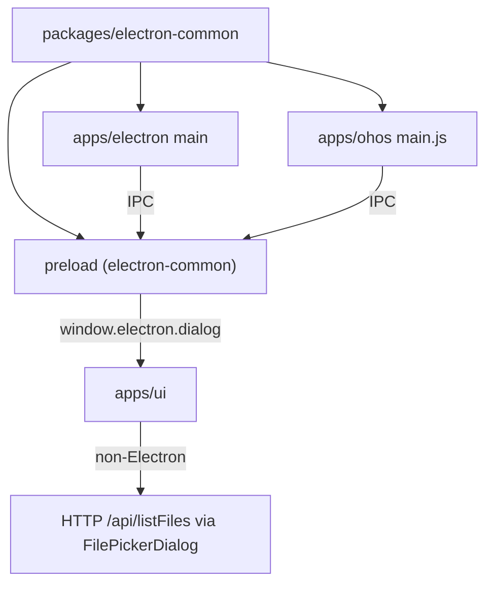
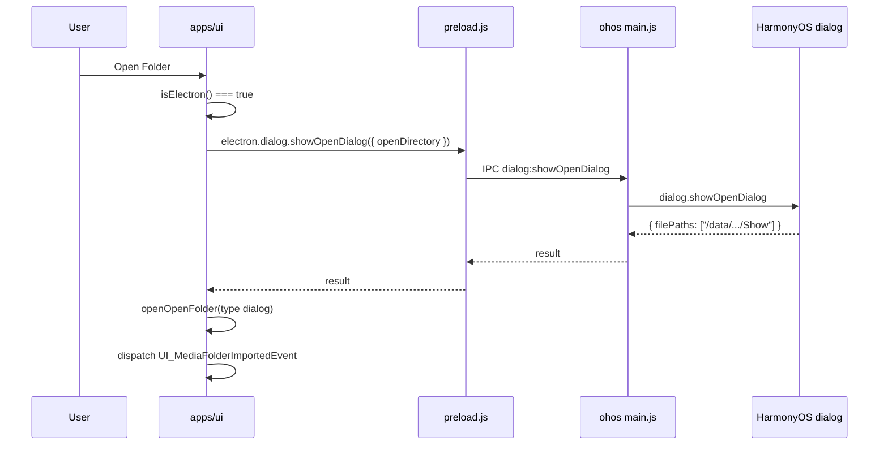

# HarmonyOS Folder Import

Enable folder import on HarmonyOS by sharing Electron dialog IPC between `apps/electron` and `apps/ohos`, so the UI can keep a single runtime branch: **Electron → native dialog via IPC**, **non-Electron → HTTP-backed FilePickerDialog**.

Related: [GitHub Issue #44](https://github.com/lawrenceching/SMM/issues/44)

[ ] New UI component
[ ] New user config
[x] Electron only — native folder picker and drag-drop depend on Electron preload APIs
[ ] User document

## 1. Background

Folder import in the desktop UI follows two paths today:

| Runtime | Detection | Folder picker |
|---------|-----------|---------------|
| Electron (Windows / macOS / Linux) | `window.electron` exists | `window.electron.dialog.showOpenDialog` (IPC) |
| Browser / Docker / CLI-only | no `window.electron` | `FilePickerDialog` → `/api/listFiles` |

HarmonyOS (`apps/ohos`) is also an Electron shell (see [architecture.md](../architecture.md)). Its main process (`main.js`) already registers `dialog:showOpenDialog` and `dialog:showSaveDialog`, but:

1. **No preload** — `main.js` references `preload.js`, which is not present. The renderer never gets `window.electron`, so UI falls through to the HTTP file picker, which cannot browse the device filesystem on HarmonyOS.
2. **Duplicated IPC** — the same dialog handlers exist inline in `apps/ohos/.../main.js` and in `apps/electron/src/main/index.ts`.
3. **Scattered Electron checks** — `isElectron()` is duplicated in `AppV2.tsx`, `DragDropReceiver.tsx`, `openInFileManager.ts`, and `TvShowPanel.tsx`.

**Design principle (from issue):** UI must **not** add HarmonyOS-specific branches. HarmonyOS is treated as Electron because it exposes the same preload contract (`window.electron.dialog.showOpenDialog`).

## 2. Project Level Architecture

Introduce a shared package and wire both Electron apps to it:



New monorepo package:

| Package | Role |
|---------|------|
| **packages/electron-common** | Shared main-process dialog IPC registration + shared preload that exposes `window.electron.dialog` |

No change to `packages/core-routes` or `apps/cli` HTTP APIs for this feature.

## 3. App Level Architecture

### 3.1 packages/electron-common

```
packages/electron-common/
├── package.json                 # name: @smm/electron-common
├── tsconfig.json
├── src/
│   ├── index.ts                 # registerDialogIpcHandlers
│   ├── dialogIpc.ts             # ipcMain handlers for open/save dialog
│   └── preload/
│       └── index.ts             # expose window.electron.dialog (+ types)
└── dist/                        # build output
    ├── electron-common.cjs      # for apps/ohos (require)
    └── preload.cjs              # for apps/ohos (BrowserWindow preload path)
```

**Main-process API:**

```typescript
import type { IpcMain, BrowserWindow } from "electron"

export interface RegisterDialogIpcOptions {
  /** Resolve the BrowserWindow to attach the dialog to. Default: BrowserWindow.fromWebContents(event.sender) */
  getWindow?: (event: Electron.IpcMainInvokeEvent) => BrowserWindow | null
}

export function registerDialogIpcHandlers(
  ipcMain: IpcMain,
  options?: RegisterDialogIpcOptions,
): void
```

Registers:

| IPC channel | Handler |
|-------------|---------|
| `dialog:showOpenDialog` | `dialog.showOpenDialog(win, options)` |
| `dialog:showSaveDialog` | `dialog.showSaveDialog(win, options)` |

Behavior aligned with current `apps/ohos/.../main.js`: use parent window when available, otherwise call dialog without parent; log and rethrow on failure.

**Preload API:**

Expose the same contract already used by `apps/ui`:

```typescript
window.electron.dialog.showOpenDialog(options) → Promise<OpenDialogReturnValue>
window.electron.dialog.showSaveDialog(options) → Promise<SaveDialogReturnValue>  // registered for parity; UI does not use it yet
```

**Confirmed:** `packages/electron-common` ships **both** main-process IPC registration **and** shared preload (`preload.js` / `preload.cjs`).

Implementation mirrors `apps/electron/src/preload/index.ts` dialog section. OHOS preload uses a minimal preload (only `contextBridge` + dialog IPC), without `@electron-toolkit/preload`.

**Build scripts** (mirror `@smm/core-routes` pattern):

| Script | Output |
|--------|--------|
| `build` | CJS in `dist/` for TypeScript consumers |
| `build:ohos` | Bundle `electron-common.cjs` to ohos resfile; copy `ohos/preload.js` (plain CJS, runtime `require('electron')`) |

`apps/electron` consumes the package via workspace dependency (`@smm/electron-common`) in dev/build; electron-vite can either import the TS source directly or the built preload entry.

### 3.2 apps/electron

- Replace inline `ipcMain.handle('dialog:showOpenDialog', ...)` in `src/main/index.ts` with `registerDialogIpcHandlers(ipcMain)`.
- Refactor `src/preload/index.ts` to reuse dialog exposure from `@smm/electron-common/preload` (merge with existing `window.api` / `@electron-toolkit/preload` exports).
- Keep existing `ExecuteChannel`, `getPathForFile`, and `@electron-toolkit/preload` — **out of scope** for this change.

### 3.3 apps/ohos

- Remove inline dialog IPC handlers from `main.js`.
- Add `require('./electron-common.cjs')` and call `registerDialogIpcHandlers(ipcMain)`.
- Add `preload.js` (built from electron-common) next to `main.js`.
- Update `apps/ohos/package.json` scripts to build/copy UI + electron-common artifacts (similar to `core-routes` `build:ohos`).

### 3.4 apps/ui

**No HarmonyOS-specific code.** Keep the existing binary branch:

```typescript
if (isElectron()) {
  // window.electron.dialog.showOpenDialog
} else {
  // openFilePicker → FilePickerDialog → /api/listFiles
}
```

**Confirmed:** extract shared helpers (same behavior, less duplication):

| Task | File(s) |
|------|---------|
| Extract shared `isElectron()` | new `apps/ui/src/lib/isElectron.ts`; replace duplicates |
| Extract `openNativeFolderDialog()` helper | new `apps/ui/src/lib/nativeFolderDialog.ts`; used by `AppV2.tsx` and `TvShowPanel.tsx` |
| Remove verbose debug `console.log` in `AppV2` openNativeFileDialog | `AppV2.tsx` |

Import flow (unchanged event pipeline):

```
Toolbar "Open Folder"
  → native dialog (Electron) or FilePickerDialog (HTTP)
  → OpenFolderDialog (type selection)
  → UI_MediaFolderImportedEvent
  → MediaFolderImportedEventHandler
```

## 4. User Stories

### 4.1 Import a media folder on HarmonyOS

**Given** I am running SMM on HarmonyOS with Electron preload enabled  
**When** I tap "Open Folder" in the toolbar  
**Then** the system native folder picker opens  
**When** I select a folder and choose a media type (TV / Movie / Music)  
**Then** the folder is added to the sidebar and media metadata initialization runs  



### 4.2 Docker / CLI still uses HTTP file picker

**Given** I open SMM in a browser against `apps/cli`  
**When** I click "Open Folder"  
**Then** the in-app FilePickerDialog opens (no native OS dialog)  

No code path changes beyond shared helper extraction.

### 4.3 Drag-drop import on HarmonyOS (inherits Electron path)

**Given** HarmonyOS Electron supports HTML5 drop + `webUtils.getPathForFile`  
**When** I drag a folder into the window  
**Then** the same import flow as desktop Electron runs (`DragDropReceiver` already gates on `isElectron()`)

If HarmonyOS drop is unsupported at runtime, behavior degrades gracefully (no overlay / no import) — no UI special case.

## 5. Tasks

### 5.1 packages/electron-common

- [x] Create package scaffold (`package.json`, `tsconfig.json`, workspace entry)
- [x] Implement `registerDialogIpcHandlers` (`dialogIpc.ts`)
- [x] Implement minimal preload (`src/preload/index.ts`) with TypeScript declarations
- [x] Add unit tests for handler registration (mock `ipcMain`, assert channels)
- [x] Add `build` and `build:ohos` scripts (Bun → CJS main bundle + copy ohos preload template)

### 5.2 apps/electron integration

- [x] Add `@smm/electron-common` dependency
- [x] Replace inline dialog IPC in `src/main/index.ts`
- [x] Reuse shared preload dialog API in `src/preload/index.ts`
- [ ] Verify folder import still works on desktop Electron

### 5.3 apps/ohos integration

- [x] Bundle `electron-common.cjs` and `preload.js` into resfile app directory
- [x] Update `main.js` to use `registerDialogIpcHandlers`
- [x] Wire `apps/ohos/package.json` scripts (`build:electron-common`, extend copy-ui workflow)
- [x] Document build steps in `apps/ohos/README.md`

### 5.4 apps/ui refactor

- [x] Extract `isElectron()` to `src/lib/isElectron.ts`
- [x] Extract `openNativeFolderDialog()` helper; simplify `AppV2.tsx` and `TvShowPanel.tsx`
- [x] Replace duplicate checks in `DragDropReceiver`, `openInFileManager.ts`

### 5.5 Verification

- [ ] Manual: HarmonyOS — Open Folder → native picker → folder appears in sidebar
- [ ] Manual: Desktop Electron — regression on Open Folder / Open Media Library
- [ ] Manual: Browser/Docker — FilePickerDialog still works
- [x] `pnpm test:ui` — `src/lib/isElectron.test.ts`
- [x] `pnpm typecheck` — electron-common + electron + ui

## 6. Backward Compatibility

**None expected.**

- IPC channel names (`dialog:showOpenDialog`, `dialog:showSaveDialog`) stay the same.
- Preload surface (`window.electron.dialog.showOpenDialog`) stays the same.
- Non-Electron HTTP file picker unchanged.
- `apps/electron` production builds must include updated preload bundle (electron-vite handles this).

## 7. Documents

- [x] `apps/ohos/README.md` — add electron-common build + copy steps
- [ ] `.agents/docs/architecture.md` — mention `packages/electron-common` in HarmonyOS diagram (optional follow-up)

## 8. Post Verification

- [x] Unit tests — `pnpm test:electron-common`, `pnpm test:ui -- src/lib/isElectron.test.ts`
- [x] Build — `pnpm --filter @smm/electron-common build:ohos`
- [ ] Manual smoke on HarmonyOS device/emulator
