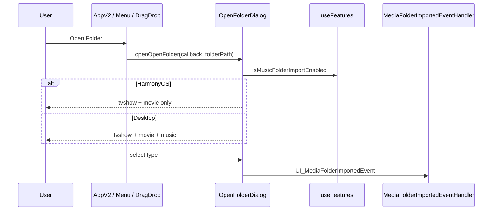

# HarmonyOS Integration

SMM supports HarmonyOS as an Electron shell platform. This document covers folder import, file access persistence, [Open in File Manager](#3-open-in-file-manager), and [Open File](#4-open-file) functionality.

**Design principle**: The UI must **not** add HarmonyOS-specific branches. HarmonyOS is treated as Electron because it exposes the same preload contract.

**Related design documents:**

| Topic | Document |
|-------|----------|
| Open file (`shell.openPath`, fanart / track context menu) | [open-file.md](./open-file.md) |
| MusicPanel features (open file, summary, download jobs) | [music-panel-features.md](./music-panel-features.md) |
| Drag-and-drop folder import | [drag-drop-folder-import.md](./drag-drop-folder-import.md) |

## 1. Folder Import

Enable folder import on HarmonyOS by sharing Electron dialog IPC between `apps/electron` and `apps/ohos` via `packages/electron-common`.

### 1.1 Background

| Runtime | Detection | Folder picker |
|---------|-----------|---------------|
| Electron (Win/Mac/Linux) | `window.electron` exists | `window.electron.dialog.showOpenDialog` (IPC) |
| Browser / Docker | no `window.electron` | `FilePickerDialog` → `/api/listFiles` |
| **HarmonyOS** | Electron shell | Same preload contract as desktop |

HarmonyOS main process already registers dialog IPC handlers, but was missing:
- Preload exposing `window.electron`
- Shared IPC registration (duplicated across apps)

### 1.2 Architecture

```
apps/ui → preload.js → IPC (dialog:showOpenDialog) → main.js → OS dialog
```

**New shared package**: `packages/electron-common` provides:
- `registerDialogIpcHandlers(ipcMain)` — main-process dialog IPC
- Shared preload (`window.electron.dialog.showOpenDialog`)
- Build scripts for both desktop and OHOS

**UI helpers extracted** to eliminate duplication:
- `src/lib/isElectron.ts` — single source of truth
- `src/lib/nativeFolderDialog.ts` — reusable `openNativeFolderDialog()`

### 1.3 Import Flow

```
Toolbar "Open Folder" / Menu / Drag-and-drop
  → native dialog (Electron) or FilePickerDialog (HTTP)
  → OpenFolderDialog (type selection)
  → UI_MediaFolderImportedEvent
  → MediaFolderImportedEventHandler
```

**Entry points** that open `OpenFolderDialog`:

| Entry | File |
|-------|------|
| Toolbar "Open Folder", Open Media Library | `AppV2.tsx` |
| Menu import | `menu.tsx` |
| Electron drag-and-drop | `DragDropReceiver.tsx` |

### 1.4 Hide Music Folder Type on HarmonyOS

Music-related sub-features (download, subtitles, transcode, compression, AI summarize) are already hidden on HarmonyOS (see [§6](#6-disabled-features-harmonyos)). Allowing `music` in the import type dialog let users import music folders without full feature support — inconsistent UX.

**Scope:** UI-only. Does not change `FolderType`, backend APIs, or existing `smm.json` music folders. Programmatic imports (e.g. e2e via `UI_MediaFolderImportedEvent` with `type: "music"`) are not blocked.

**Gating** follows the same pattern as other disabled features: `useFeatures().isMusicFolderImportEnabled` (`false` on HarmonyOS, `true` on desktop). `OpenFolderDialog` conditionally renders the Music button; components do **not** call `isHarmonyOS()` directly.

| Item | Location |
|------|----------|
| Feature flag | `apps/ui/src/hooks/useFeatures.ts` → `isMusicFolderImportEnabled` |
| Feature ID | `apps/ui/src/lib/harmonyOSDisabledFeatures.ts` → `musicFolderImport` |
| UI | `apps/ui/src/components/dialogs/open-folder-dialog.tsx` |
| Dialog host | `apps/ui/src/providers/dialog-provider.tsx` |



## 2. File Access Persist

On HarmonyOS, after the user picks a folder, access must be persisted via `systemPreferences.fileAccessPersist()` before `initializeMediaMetadata` can list files.

### 2.1 URI Storage

| Storage | Field | Purpose |
|---------|-------|---------|
| `smm.json` | `folders[]` | App config — which media folders are imported |
| ArkTS `preferences` | `defaultDownloadUri` | Re-activate access on next launch |

Both use the same URI string from `dialog.showOpenDialog`. `SaveUris` is **not** redundant — `initPermissions()` reads from ArkTS preferences, not `smm.json`.

### 2.2 Architecture

```
apps/ui → persistHarmonyOSFileAccess([uri])
  → IPC (fileAccess:persist) → main.js
  → systemPreferences.fileAccessPersist() + SaveUris()
```

**IPC channel**: `fileAccess:persist` with `{ paths: string[] }` → `{ ok: true }`

**Desktop**: handler is a no-op (`skipped: true`).

**Integration point**: `useInitializeImportedMediaFolder` calls `persistHarmonyOSFileAccess()` before initialization. If persist fails → abort init and show error toast.

## 3. Open in File Manager

Enables "Open in Explorer" on HarmonyOS by wiring `window.api.executeChannel` IPC to `FileManagerAdapter.OpenItemInFolder`.

### 3.1 Entry Points

| Entry | Path source |
|-------|-------------|
| Sidebar context menu | Media folder path from `smm.json` |
| Menu → App data folder | `hello.appDataDir` |
| Menu → Log folder | `hello.logDir` |

### 3.2 Architecture

```
apps/ui → openInFileManagerApi(path)
  → window.api.executeChannel({ name: 'open-in-file-manager', data: path })
  → IPC ExecuteChannel → main.js
  → shell.showItemInFolder(path)
  → (OHOS fallback) FileManagerAdapter.OpenItemInFolder
```

**Fallback**: If `shell.showItemInFolder` fails on HarmonyOS, the main process calls `FileManagerAdapter.OpenItemInFolder` via native binding (`filemanager://openDirectory`).

### 3.3 Path Formats on HarmonyOS

| Path source | Format |
|-------------|--------|
| Sidebar folder | `file://docs/storage/...` URI |
| App data dir | `/data/storage/el2/base/files/...` sandbox path |
| Log dir | App-specific sandbox path |

Pass paths **as stored** — do not rewrite. Only paths the app can access will succeed.

## 4. Open File

Enables "Open" context-menu actions (fanart, episode video, music tracks, etc.) on HarmonyOS and all Electron runtimes via `shell.openPath`.

Full design: [open-file.md](./open-file.md)

### 4.1 Entry Points

| Entry | Example |
|-------|---------|
| TvShowEpisodeTable | Right-click fanart / poster / episode video → Open |
| MusicFileTable / MusicPanel | Open track or associated file |
| AssociatedFileRow / FileExplorer | Double-click or context menu → Open |

### 4.2 Architecture

```
apps/ui → openFile(path)
  → window.api.executeChannel({ name: 'open-file', data: path })
  → IPC ExecuteChannel → main.js
  → shell.openPath(path)
  → (Browser/Docker fallback) POST /api/openFile → apps/cli
```

**No native fallback** on HarmonyOS — relies solely on `shell.openPath`. Empty return means success; non-empty string is the error message.

### 4.3 Path Formats on HarmonyOS

Same as §3.3 — media folder files use persisted `file://docs/storage/...` URIs.

## 5. Shared Package: `packages/electron-common`

```
packages/electron-common/
├── src/
│   ├── channels.ts              # IPC channel name constants
│   ├── dialogIpc.ts             # registerDialogIpcHandlers
│   ├── fileAccessPersistIpc.ts   # registerFileAccessPersistIpcHandlers
│   ├── executeChannelIpc.ts     # registerExecuteChannelIpcHandlers
│   ├── openInFileManagerTask.ts # openInFileManager (shell + OHOS fallback)
│   ├── openFileTask.ts          # openFileWithShell (shell.openPath)
│   └── preload/index.ts         # window.electron.* + window.api.*
├── ohos/
│   ├── preload.js               # Plain CJS preload for OHOS
│   └── main-entry.cjs           # require() for main.js
└── dist/                        # Build outputs
```

**IPC Channels:**

| Channel | Handlers |
|---------|----------|
| `dialog:showOpenDialog` | Native folder picker |
| `dialog:showSaveDialog` | Native save dialog (reserved) |
| `fileAccess:persist` | Persist folder access (OHOS only) |
| `ExecuteChannel` | `open-in-file-manager`, `open-file` tasks |

## 6. Disabled Features (HarmonyOS)

HarmonyOS builds hide features that depend on bundled CLI tools (yt-dlp, FFmpeg, VideoCaptioner) or are not yet validated on the platform. Gating is centralized in `useFeatures()` via `isHarmonyOS()` — UI components read feature flags rather than branching on platform directly.

**Source of truth:** `apps/ui/src/lib/harmonyOSDisabledFeatures.ts` (IDs) and `apps/ui/src/hooks/useFeatures.ts` (runtime flags).

| Feature | ID | `useFeatures` flag | Entry points hidden |
|---------|-----|-------------------|---------------------|
| 字幕 (transcribe / translate / synthesize / process) | `subtitle` | `isSubtitleFeaturesEnabled` | TvShow/Movie/Music header subtitle menus; music row subtitle context submenu; subtitle pipeline dialogs |
| 下载视频 (yt-dlp) | `downloadVideo` | `isDownloadVideoEnabled` | Menu → Download Video; Welcome card; Music panel download button |
| 视频转码 (format converter) | `formatConverter` | `isFormatConverterEnabled` | Menu → Format Conversion; Welcome card; track context menu → Format Convert |
| 视频压缩 (video compression) | `videoCompression` | `isVideoCompressionEnabled` | Menu → Video Compression; TvShow/Movie episode context menu → Compress; music row context menu |
| 导入音乐文件夹 (music folder import) | `musicFolderImport` | `isMusicFolderImportEnabled` | `OpenFolderDialog` Music type button |
| TvShow "preview" layout (large cover + video screenshots) | (inline) | `isHarmonyOS()` direct check in `TvShowHeaderV2` | Header layout-selector icon group + dropdown "Preview layout" item |
| AI 总结 (MusicPanel Summarize) + AI Assistant + AI-based recognize/rename | (master switch) | `isAiFeatureEnabled` | MusicPanel row context menu → Summarize; AI Assistant chat panel; TvShow/Movie AI prompts |

On HarmonyOS all six `useFeatures` flags above default to `false`. The preview layout is hidden on HarmonyOS because its per-row video screenshot pipeline is not validated on that platform — the gating is a single direct call to `isHarmonyOS()` inside `TvShowHeaderV2.tsx` rather than a `useFeatures()` flag, since it is purely a visual layout choice with no user-facing toggle. Desktop and browser dev builds are unchanged.

**Music folder import note:** `isMusicFolderImportEnabled` hides only the Music type button in `OpenFolderDialog` ([§1.4](#14-hide-music-folder-type-on-harmonyos)). It does not remove MusicPanel or block programmatic `type: "music"` imports.

**AI Summary note:** the MusicPanel row right-click "Summarize" item (`apps/ui/src/components/LocalFileRow.tsx`) is gated on `isAiFeatureEnabled`, the same master switch that hides the AI Assistant and AI-based recognize/rename prompts. There is no separate `aiSummary` feature id — flipping the master switch toggles all AI surfaces together.

**Detection:** renderer uses `isHarmonyOS()` (`navigator.appVersion` contains `OHOS` or `OpenHarmony`). See [faq-harmonyos.md](../faq-harmonyos.md).

## 7. User Stories

### Import media folder on HarmonyOS
1. User taps "Open Folder" → native picker opens
2. User selects folder → `OpenFolderDialog` shows **Tv Show / Anime** and **Movie** only (Music hidden; see [§1.4](#14-hide-music-folder-type-on-harmonyos))
3. App persists file access (`fileAccessPersist` + `SaveUris`)
4. Media Folder Initialization lists files via core-routes
5. Folder appears in sidebar with metadata

### Open in File Manager on HarmonyOS
1. User right-clicks folder → "Open in Explorer"
2. `executeChannel` IPC → `shell.showItemInFolder(path)`
3. System file manager opens at folder location

### Open file on HarmonyOS
1. User right-clicks fanart (or other media file) → "Open"
2. `executeChannel` IPC → `shell.openPath(path)`
3. System default app opens the file

### Desktop regression
- All existing Electron behavior (Windows/macOS/Linux) is unchanged
- Non-Electron runtime still uses HTTP fallback (`POST /api/openInFileManager`, `POST /api/openFile`)

## 8. Backward Compatibility

- IPC channel names unchanged
- Preload surface unchanged on desktop
- HTTP `/api/listFiles` + `/api/openInFileManager` + `/api/openFile` (CLI) fallback intact for non-Electron runtimes
- All OHOS-specific logic in main process + `packages/electron-common`; UI gates HarmonyOS via centralized `useFeatures()` flags (see [§6](#6-disabled-features-harmonyos)), not ad-hoc `isHarmonyOS()` branches in feature components
