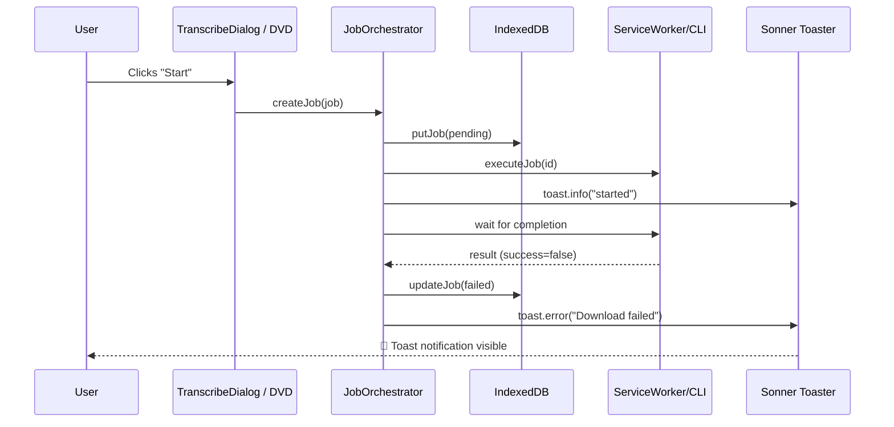

# Job Failure Toast Notification

Add sonner toast notifications when any background job transitions to `'failed'` status.
Currently only `translate`, `synthesize`, and `process` job types have lifecycle toasts configured.
This change adds toasts for `download-video`, `transcribe`, `test-delay`, and a generic fallback.

[ ] New UI component
[ ] New user config
[ ] Electron only
[ ] User document

## 1. Background

The background jobs system in `JobOrchestratorProvider.tsx` already supports optional per-type toast notifications
via `JOB_TYPE_REGISTRY[type].toasts`. When a job fails, `executeJob()` calls `toast.error(config.toasts.failed(t))`
only if `config.toasts.failed` exists — otherwise the failure is silent. Additionally, `test-delay` jobs bypass
the orchestrator entirely (handled in `testDelayJobRunner.ts`), so they never get toasts.

Current toast coverage:

| Job Type        | Registry toasts | Failure toast |
|-----------------|:---------------:|:-------------:|
| download-video  | ❌              | ❌           |
| transcribe      | ❌              | ❌           |
| translate       | ✅              | ✅           |
| synthesize      | ✅              | ✅           |
| process         | ✅              | ✅           |
| test-delay      | (not in reg.)   | ❌           |

## 2. Project Level Architecture

None.

## 3. App Level Architecture

### 3.1 `JOB_TYPE_REGISTRY` — Add toasts for `download-video` and `transcribe`

Add `toasts` property to both entries in `apps/ui/src/lib/jobTypeRegistry.ts`:

```ts
'download-video': {
  // ... existing props
  toasts: {
    started:  (t) => t('downloadVideoDialog.toastStart'),
    succeeded: (t) => t('downloadVideoDialog.toastSucceeded'),
    failed:    (t) => t('downloadVideoDialog.toastFailed'),
  },
},
'transcribe': {
  // ... existing props
  toasts: {
    started:  (t) => t('transcribeDialog.toastStart'),
    succeeded: (t) => t('transcribeDialog.toastSucceeded'),
    failed:    (t) => t('transcribeDialog.toastFailed'),
  },
},
```

### 3.2 `JobOrchestratorProvider.executeJob()` — Generic fallback toast

In the final toast section (~line 520), add a fallback for job types without specific toasts:

```ts
if (wasStopped) {
  // No toast for user-initiated stop
} else if (!success && config.toasts?.failed) {
  toast.error(config.toasts.failed(tRef.current))
} else if (!success) {
  // Generic fallback for types without specific toast messages
  toast.error(tRef.current('statusBar.backgroundJobs.toasts.genericFailed', { name: record.name }))
}
```

### 3.3 `testDelayJobRunner.runTestDelayJob()` — Toast on failure

Since `test-delay` bypasses the orchestrator, add toast directly in the timeout callback:

```ts
import { toast } from 'sonner'

// Inside the completionTimeout callback:
if (data.outcome === 'failed' && traceId !== 'resume') {
  toast.error(`Job failed: ${record.name}`)
}
```

The `traceId !== 'resume'` guard prevents toasts when jobs are auto-resumed on app mount.

### 3.4 i18n Keys

Add new namespace sections to all 4 locale files (`en`, `zh-CN`, `zh-HK`, `zh-TW`):

**`downloadVideoDialog`** section:
```json
"downloadVideoDialog": {
  "toastStart": "Download started",
  "toastSucceeded": "Download finished",
  "toastFailed": "Download failed"
}
```

**`transcribeDialog`** section:
```json
"transcribeDialog": {
  "toastStart": "Transcription started",
  "toastSucceeded": "Transcription finished",
  "toastFailed": "Transcription failed"
}
```

**`statusBar.backgroundJobs`** extension:
```json
"toasts": {
  "genericFailed": "Job \"{{name}}\" failed"
}
```

### 3.5 Mermaid Flow



## 4. User Stories

### 4.1 Download video job fails → toast

* **Given** — A download-video job is running in the background
* **When** — The download fails (network error, invalid URL, etc.)
* **Then** — A red error toast appears with "Download failed"

### 4.2 Transcribe job fails → toast

* **Given** — A transcribe job is running in the background
* **When** — Transcription fails (VideoCaptioner error, etc.)
* **Then** — A red error toast appears with "Transcription failed"

### 4.3 Test delay job fails → toast

* **Given** — A test-delay job with `outcome: 'failed'` is created
* **When** — The job delay elapses and completes as failed
* **Then** — A red error toast appears containing the job name

### 4.4 E2E test verifies toast

* **Given** — A test-delay job is created with `outcome: 'failed'` and delay `1000ms`
* **When** — The job completes
* **Then** — The e2e test verifies `[data-sonner-toast]` element exists with the job name

## 5. Tasks

### 5.1 i18n (4 locale files)

- [x] Add `downloadVideoDialog` toast keys to `apps/ui/public/locales/en/components.json`
- [x] Add `downloadVideoDialog` toast keys to `apps/ui/public/locales/zh-CN/components.json`
- [x] Add `downloadVideoDialog` toast keys to `apps/ui/public/locales/zh-HK/components.json`
- [x] Add `downloadVideoDialog` toast keys to `apps/ui/public/locales/zh-TW/components.json`
- [x] Add `transcribeDialog` toast keys to all 4 locale files
- [x] Add `statusBar.backgroundJobs.toasts.genericFailed` to all 4 locale files

### 5.2 Registry

- [x] Add `toasts` to `download-video` entry in `apps/ui/src/lib/jobTypeRegistry.ts`
- [x] Add `toasts` to `transcribe` entry in `apps/ui/src/lib/jobTypeRegistry.ts`

### 5.3 Orchestrator fallback

- [x] Add generic failure toast fallback in `apps/ui/src/components/JobOrchestratorProvider.tsx`

### 5.4 test-delay runner

- [x] Add failure toast in `apps/ui/src/lib/testDelayJobRunner.ts`

### 5.5 E2E test

- [x] Update `apps/e2e/test/specs/other/BackgroundJob.e2e.ts` — create a failing job and verify toast appears, then delete and verify IDB cleanup

## 6. Backward Compatibility

- Existing per-type toasts (translate, synthesize, process) are preserved — no regression
- `test-delay` toasts are only shown for new jobs (`traceId !== 'resume'`), not on app mount resume
- The generic fallback only fires when no specific toast is configured — no double toasts
- No changes to IDB schema, HTTP API, or user config

## 7. Documents

None required — this is a UX enhancement, no user-facing documentation changes needed.

## 8. Post Verification

- [x] E2E test — Run `pnpm run wdio --spec ./test/specs/other/BackgroundJob.e2e.ts` in apps/e2e ✅
- [x] Unit tests — Run `pnpm run test` in apps/ui
- [x] Build — Run `pnpm run build` in project root

> **Status**: COMPLETED ✅ — 所有后台任务类型失败时均显示 toast 通知
