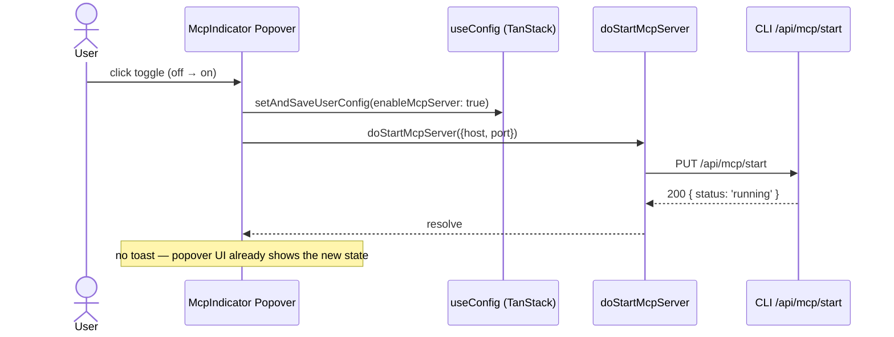

# Remove MCP Start Toast From StatusBar McpIndicator

When the user enables the MCP server via the toggle inside `McpIndicator` (the popover in the StatusBar), a `toast.success(...)` currently fires after the server starts successfully. The success toast is redundant: the toggle, the address line, and the popover body already reflect the running state inline. Remove the toast so the only post-success signal is the popover itself.

[ ] New UI component - no
[ ] New user config - no
[ ] Electron only - no
[ ] User document - no

## 1. Background

`apps/ui/src/components/mcp/McpIndicator.tsx` renders a `<Popover>` in the desktop StatusBar. The popover exposes:
- A switch (`role="switch"`) that toggles `enableMcpServer` and starts/stops the MCP server.
- When enabled, the popover body shows the bound address and protocol inline.

The current `handleMcpToggle` flow on the "Turn ON" branch:
1. Optimistically writes `enableMcpServer: true` to user config.
2. Calls `doStartMcpServer` via TanStack Query mutation.
3. On success, fires `toast.success(t('statusBar.mcp.serverOn'))` — redundant because the popover's switch, address, and protocol chip already visualize the new state.
4. On failure, reverts config and shows a `toast.error(...)` — this path stays; failures are not visible in the popover alone.

The starting-state toast adds noise. Per the project guideline ("UI optimistic update strategy"), the UI is the primary signal for success. Errors must still be surfaced — they are not visible inline.

## 2. Architecture

### 2.1 Project Level Architecture

none — change is contained to one UI component.

### 2.2 App Level Architecture

none — no new wiring, no new hook, no API change.

### 2.3 Key Points

- File: `apps/ui/src/components/mcp/McpIndicator.tsx`.
- The `statusBar.mcp.serverOn` i18n key is **kept** because it is also used as the toggle button's `aria-label` when the server is on (line 103). Only the `toast.success(...)` call is removed.
- The failure path (catch block) keeps its `toast.error(...)` and config revert — this is the only remaining toast call from this component.
- The initial-mount effect (lines 35–55) also fires toasts when the saved `enableMcpServer=true` config cannot start the server; those toasts cover a different scenario (config/server drift on app start, not a user-initiated toggle) and are out of scope.

## 3. User Stories

### 3.1 Toggling MCP Server On From StatusBar Popover

* **Given** the user opens the StatusBar MCP popover and the server is currently off
* **When** the user flips the toggle on and the server starts successfully
* **Then** the popover updates inline (switch on, address visible, protocol chip) — no toast appears

### 3.2 Toggling MCP Server On — Failure Path (Unchanged)

* **Given** the user flips the toggle on
* **When** the start request fails
* **Then** the config is reverted and `toast.error(...)` still fires — error toasts are required because the popover body alone does not show the failure.

## 4. Tasks

### 4.1 Edit McpIndicator.tsx

[x] Delete the `toast.success(t('statusBar.mcp.serverOn'))` call (line 75) inside `handleMcpToggle`'s success branch.
[ ] Leave the surrounding `try/catch` structure intact; only the success toast is removed.
[ ] Leave the failure `toast.error(...)` and config revert in the `catch` block.

### 4.2 Locale Keys

[ ] Keep `statusBar.mcp.serverOn` in all four locale files — still used as the on-state `aria-label` on the popover trigger button.

## 5. Backward Compatibility

none. Only a redundant success notification is removed; no API, config, or persisted state changes.

## 6. Documents

none. No user-facing docs reference this toast.

## 7. Post Verification

[ ] Build
    Run `pnpm --filter smm-ui build` and expect build succeeded
[ ] Unit tests
    Run `pnpm --filter smm-ui test -- McpIndicator` if tests exist; otherwise `pnpm --filter smm-ui test`