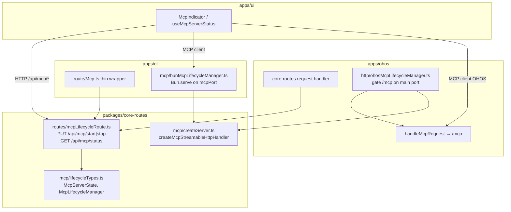
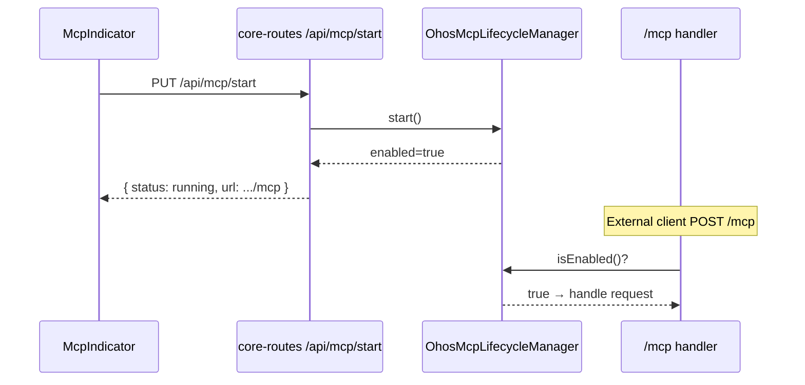

# MCP Lifecycle API Migration to core-routes

将 MCP 服务器生命周期 HTTP API（`/api/mcp/start`、`/api/mcp/stop`、`/api/mcp/status`）迁入 `packages/core-routes`，使 `apps/ohos` 与 `apps/cli` 共用同一套路由实现；各运行时通过注入 `McpLifecycleManager` 提供启停语义。

[ ] New UI component - no（仅可能扩展 `McpServerState.url` 展示）
[ ] New user config - no（复用 `enableMcpServer` / `mcpHost` / `mcpPort`）
[ ] Electron only - no
[ ] User document - yes（OHOS 上 MCP 地址与桌面不同，需更新 API 文档）

## 1. Background

### 已完成（前序变更）

[`mcp-server-migration-to-ohos.md`](./mcp-server-migration-to-ohos.md) 已将 **MCP 协议层**（17 个 tool + `createMcpStreamableHttpHandler`）迁入 `packages/core-routes/src/mcp/`：

| 运行时 | MCP 协议端点 | 生命周期 API |
|--------|-------------|--------------|
| `apps/cli` | 独立端口 `mcpPort`（`Bun.serve`） | `PUT/GET /api/mcp/*`（Hono，`apps/cli/src/route/Mcp.ts`） |
| `apps/ohos` | 主端口 `18081` 路径 `/mcp` | **缺失** — UI `McpIndicator` 无法工作 |

### 问题

1. **OHOS 无 lifecycle API**：`apps/ui` 的 `McpIndicator` / `useMcpServerStatus` 调用 `/api/mcp/start|stop|status`，OHOS 主进程未实现，开关 MCP 无效。
2. **逻辑未共享**：`apps/cli/src/route/Mcp.ts` + `mcpServerManager.ts` 仅在 CLI，违反 core-routes 复用原则。
3. **平台差异**：OHOS **不支持**在 `mcpPort` 上额外监听独立 TCP 端口；MCP 只能挂在主 HTTP 服务 `127.0.0.1:18081/mcp` 上，由 lifecycle API **门控**是否接受请求。

### 目标

- `packages/core-routes` 提供统一的 **路由 handler** + **类型** + **`McpLifecycleManager` 接口**。
- `apps/cli` 保留极薄 Hono 包装，注入 Bun 版 manager（独立端口，行为不变）。
- `apps/ohos` 注册 core-routes 路由，注入 OHOS 版 manager（主端口 `/mcp` 门控）。
- UI 通过 `McpServerState.url` 展示正确的客户端连接地址。

## 2. Project Level Architecture



**变更摘要**：在 core-routes 增加 lifecycle **路由**与 **manager 契约**；协议 factory 已存在，不重复迁移。

## 3. App Level Architecture

### 3.1 新增模块：`packages/core-routes/src/mcp/lifecycle*`

```
packages/core-routes/src/mcp/
├── lifecycleTypes.ts       # McpServerState, McpLifecycleManager, StartMcpOptions
├── lifecycleRoute.ts       # handleMcpStartPut, handleMcpStopPut, handleMcpStatusGet
└── (existing createServer.ts, toolHandlers/, …)
```

#### `McpServerState`（扩展）

```typescript
export type McpServerStatus = "running" | "stopped" | "error";

export interface McpServerState {
  status: McpServerStatus;
  host?: string;
  port?: number;
  /** 供外部 MCP 客户端连接的完整 URL（含 path） */
  url?: string;
  error?: string;
}
```

- **CLI**：`url = http://{mcpHost}:{mcpPort}/mcp`（独立端口）
- **OHOS**：`url = http://127.0.0.1:18081/mcp`（主端口；忽略 userConfig 的 `mcpPort`）

#### `McpLifecycleManager` 接口

```typescript
export interface McpLifecycleManager {
  start(options?: { hostname?: string; port?: number }): Promise<void>;
  stop(): Promise<void>;
  getState(): McpServerState;
}

/** 启动时根据 userConfig.enableMcpServer 同步状态（各 host 在 boot 时调用） */
export async function applyMcpLifecycleFromConfig(
  manager: McpLifecycleManager,
  getUserConfig: () => Promise<UserConfig>,
  logger?: CoreRoutesLogger,
): Promise<void>;
```

`applyMcpLifecycleFromConfig` 放在 core-routes（纯逻辑）：读 config → `enableMcpServer` 则 `start()`，否则 `stop()`；失败时 manager 应写入 `status: 'error'`。

#### `CoreRoutesConfig` 扩展

```typescript
export interface CoreRoutesConfig {
  // …existing fields…
  mcp?: {
    manager: McpLifecycleManager;
  };
}
```

路由 handler 在 `ctx.config.mcp` 未配置时返回 `200` + `{ error: "MCP lifecycle not configured" }`（与 `hello` 未配置模式一致）。

### 3.2 `apps/cli`（薄 Hono 包装）

**保留** `apps/cli/src/route/Mcp.ts`，改为调用 core-routes：

```typescript
import { handleMcpStartPut, handleMcpStopPut, handleMcpStatusGet } from "@smm/core-routes";
import { getBunMcpLifecycleManager } from "@/mcp/bunMcpLifecycleManager";

// Hono 将 c.req.raw 转为 IncomingMessage 较繁琐 → 继续用现有 JSON 解析，
// 但业务逻辑委托 manager + 与 core-routes 相同的响应体形状。
```

**更简方案**（推荐）：Hono 路由仅做 adapter，内部调用与 `lifecycleRoute.ts` 相同的 `doMcpStart` / `doMcpStop` / `doMcpGetStatus` 纯函数（从 route 文件 export），避免重复 JSON 逻辑。

**`apps/cli/src/mcp/bunMcpLifecycleManager.ts`**（自 `mcpServerManager.ts` 提炼）：

| 方法 | 行为 |
|------|------|
| `start` | `resetMcpStreamableHttpHandler()` → `getMcpStreamableHttpHandler()` → `Bun.serve({ hostname, port, fetch })` |
| `stop` | `mcpServer.stop()` + reset handler |
| `getState` | 读 `mcpServer` / `mcpServerError`；`url = http://{host}:{port}/mcp` |

`mcpServerManager.ts` 变为 re-export 或删除，由 `bunMcpLifecycleManager` 单例实现 `McpLifecycleManager`。

**`server.ts`**：`applyMcpConfig()` 改为 `applyMcpLifecycleFromConfig(getBunMcpLifecycleManager(), getUserConfig, logger)`。

**已知约束**：`getRequestListener(..., { overrideGlobalObjects: false })` 必须保留，否则 `Bun.serve` MCP 与 Hono Response polyfill 冲突。

### 3.3 `apps/ohos`（主端口门控）

**`apps/ohos/src/http/ohosMcpLifecycleManager.ts`**：

```typescript
export function createOhosMcpLifecycleManager(options: {
  mainOrigin: string;        // http://127.0.0.1:18081
  resetHandler: () => void;  // resetMcpHandler from mcp.ts
}): McpLifecycleManager
```

| 方法 | 行为 |
|------|------|
| `start` | `enabled = true`（`/mcp` 开始处理 JSON-RPC） |
| `stop` | `enabled = false` + `resetMcpHandler()` |
| `getState` | `running` 当 `enabled`；`url = ${mainOrigin}/mcp`；**不暴露 mcpPort** |

**`handleMcpRequest` 修改**：

```typescript
if (!ohosMcpLifecycleManager.isEnabled()) {
  res.writeHead(503, { "Content-Type": "application/json" });
  res.end(JSON.stringify({ error: "MCP server is stopped" }));
  return true;
}
// …existing handler…
```

**`server.ts`**：

1. `CoreRoutesConfig` 增加 `mcp: { manager: ohosManager }`。
2. 移除 `/api/*` 与 `/mcp` 的分叉矛盾：`/api/mcp/*` 由 `coreRoutesHandler` 处理（已含在 `url.startsWith("/api/")`）。
3. 启动时 `applyMcpLifecycleFromConfig(ohosManager, ohosGetUserConfig, logger)`。

**User config 在 OHOS**：

- `mcpHost` / `mcpPort`：**保存但不用于监听**；UI 设置页可保留字段以与桌面配置同步，但状态 API 返回的 `url` 始终为主端口 `/mcp`。
- 后续可选：OHOS 设置页隐藏 port 字段（非本变更范围）。

### 3.4 `apps/ui`（小改动）

`apps/ui/src/api/mcp.ts`：

- `McpServerState` 增加可选 `url?: string`。
- `McpIndicator` 展示地址：优先 `serverState.url`，回退 `http://${mcpHost}:${mcpPort}/mcp`。

无需改 API 路径；OHOS 与 CLI 均使用相同 `/api/mcp/*`。

## 4. User Stories

### 4.1 OHOS 用户开关 MCP

- **Given** SMM 运行在 HarmonyOS Electron，主 HTTP 为 `127.0.0.1:18081`
- **When** 用户在状态栏打开 MCP 开关
- **Then** UI 调用 `PUT /api/mcp/start` → 返回 `{ status: "running", url: "http://127.0.0.1:18081/mcp" }`；外部客户端可连接该 URL



### 4.2 桌面 CLI 无回归

- **Given** SMM 通过 `apps/cli` 运行，`enableMcpServer: true`
- **When** 用户查询 `GET /api/mcp/status`
- **Then** 返回 `{ status: "running", host: "127.0.0.1", port: 30001, url: "http://127.0.0.1:30001/mcp" }`（与迁移前一致）

### 4.3 MCP 停止后门控

- **Given** MCP 已通过 UI 关闭
- **When** 外部客户端请求 `POST http://127.0.0.1:18081/mcp`（OHOS）
- **Then** 返回 HTTP 503 + JSON 错误，不处理 JSON-RPC

## 5. Tasks

### 5.1 `packages/core-routes`

- [x] **T1** 新增 `mcp/lifecycleTypes.ts`（`McpServerState`, `McpLifecycleManager`, `StartMcpOptions`）
- [x] **T2** 新增 `mcp/lifecycle.ts`：`doMcpStart` / `doMcpStop` / `doMcpGetStatus` 纯函数 + `applyMcpLifecycleFromConfig`
- [x] **T3** 新增 `routes/mcpLifecycleRoute.ts`：`handleMcpStartPut`, `handleMcpStopPut`, `handleMcpStatusGet`
- [x] **T4** 注册到 `coreRouteHandlers`；`CoreRoutesConfig` 增加 `mcp?: { manager }`
- [x] **T5** 从 `index.ts` export 新类型与纯函数
- [x] **T6** 单元测试：`lifecycle.test.ts`（mock manager；验证 JSON 形状、错误路径、未配置 mcp）

### 5.2 `apps/cli`

- [x] **T7** 实现 `bunMcpLifecycleManager.ts`（自 `mcpServerManager.ts` 迁移，实现 `McpLifecycleManager`）
- [x] **T8** 精简 `route/Mcp.ts` 为薄包装（调用 core-routes `doMcp*` 或 node route handler）
- [x] **T9** `server.ts` 使用 `applyMcpLifecycleFromConfig`；确认 `overrideGlobalObjects: false`
- [x] **T10** 删除或 re-export 旧 `mcpServerManager` 公开 API，保持 `getMcpServerState` 等向后兼容别名（如 e2e 直接 import）

### 5.3 `apps/ohos`

- [x] **T11** 实现 `ohosMcpLifecycleManager.ts`
- [x] **T12** `mcp.ts`：`handleMcpRequest` 增加 stopped → 503 门控
- [x] **T13** `server.ts`：`CoreRoutesConfig.mcp` 注入 + 启动时 `applyMcpLifecycleFromConfig`
- [x] **T14** 重建 `core-routes.js` / `main.js`：`pnpm run build:ohos`

### 5.4 `apps/ui`

- [x] **T15** `McpServerState.url` + `McpIndicator` 地址展示优先 `url`

### 5.5 验证

- [x] **T16** `packages/core-routes` 单元测试
- [ ] **T17** `test/mcp-test-client/run-smoke-tests.ts` 对 CLI（30001）与 OHOS（18081/mcp）各跑一遍
- [ ] **T18** 手动：OHOS UI 开关 MCP，`GET /api/mcp/status` 与外部客户端连通性

## 6. Backward Compatibility

| 关切 | 处理 |
|------|------|
| CLI MCP 独立端口 | 不变；仅实现位置迁移到 manager |
| API 路径与 JSON 字段 | 不变；新增可选 `url` 字段 |
| OHOS `mcpPort` 配置项 | 仍可读写在 userConfig，但不用于监听；`url` 指向主端口 |
| `apps/electron` | 无改动（仍 spawn cli） |
| Stdio MCP (`apps/cli/src/mcp/server.ts`) | 不在本变更范围 |

## 7. Documents

- [x] `docs/api/index.md` — 补充 `McpServerState.url`；注明 OHOS 使用主端口 `/mcp`
- [ ] `.agents/docs/design/mcp-server.md` — lifecycle 路由迁至 core-routes；OHOS 门控模式
- [ ] `apps/cli/docs/MCP.md` — OHOS 与桌面地址差异（如需要）

## 8. Post Verification

- [x] `pnpm run test` — core-routes + cli + ohos 相关测试通过
- [ ] `pnpm run typecheck` — 无新增错误
- [x] `pnpm run build:ohos` — core-routes bundle 已重建
- [ ] `bun test/mcp-test-client/run-smoke-tests.ts` — CLI 与 OHOS 各通过
- [ ] UI：McpIndicator 在 OHOS 显示 `http://127.0.0.1:18081/mcp`
