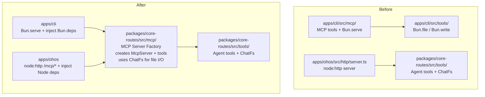
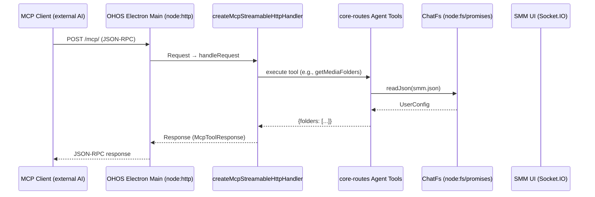

# MCP Server Migration to OHOS Electron Main Thread

Migrate the MCP (Model Context Protocol) server capability from `apps/cli` (Bun-exclusive) to a shared runtime-neutral module in `packages/core-routes`, so both Bun (`apps/cli`) and Node.js (`apps/ohos` Electron main process) can host the same MCP server.

[ ] New UI component - no
[ ] New user config - no (reuses existing `enableMcpServer`)
[ ] Electron only - no (works on both Bun and Electron/Node)
[ ] User document - no

## 1. Background

The MCP server currently lives entirely in `apps/cli/src/mcp/` and depends on Bun-specific APIs:
- `mcpServerManager.ts` uses `Bun.serve()` to host the HTTP server
- `apps/cli/src/tools/*.ts` uses `Bun.file()` / `Bun.write()` for config and plan file I/O
- `@/utils/config.ts` uses `Bun.file()` for `getUserConfig()`

Meanwhile, `packages/core-routes` already has runtime-neutral Agent tools that use `ChatFs` abstraction—but no MCP wrappers. The OHOS Electron main process (`apps/ohos`) already hosts a `node:http` server with `core-routes.js` APIs, Socket.IO, reverse proxy, and AI chat. Adding MCP support would allow external AI assistants to connect to SMM on HarmonyOS.

## 2. Project Level Architecture



**Change**: Add `packages/core-routes/src/mcp/` as a new MCP server factory module. The factory creates a `McpServer` with all 17 tools registered, delegating to the existing core-routes Agent tools. Runtime-specific concerns (`getUserConfig`, `Bun.serve()` / `node:http`, i18n) are injected via `McpConfig`.

**No changes to PA otherwise**: `apps/electron` (desktop) continues to spawn `apps/cli` as before. `apps/cli`'s MCP uses the new shared factory but its lifecycle management (`Bun.serve`) stays in cli.

## 3. App Level Architecture

### 3.1 New Module: `packages/core-routes/src/mcp/`

```
packages/core-routes/src/mcp/
├── index.ts              # Public API: createMcpStreamableHttpHandler(config)
├── createServer.ts        # Creates McpServer, registers all tools, returns handler
├── registerTools.ts       # Registers all 17 MCP tools on the server
├── toolHandlers/          # One file per tool, thin wrappers → Agent tools
│   ├── getApplicationContext.ts
│   ├── getMediaFolders.ts
│   ├── isFolderExist.ts
│   ├── listFiles.ts
│   ├── getMediaMetadata.ts
│   ├── renameFolder.ts
│   ├── getEpisodes.ts
│   ├── getEpisode.ts
│   ├── beginRenameTask.ts
│   ├── addRenameFile.ts
│   ├── endRenameTask.ts
│   ├── beginRecognizeTask.ts
│   ├── addRecognizedFile.ts
│   ├── endRecognizeTask.ts
│   ├── howToRenameEpisodeVideoFiles.ts
│   ├── howToRecognizeEpisodeVideoFiles.ts
│   └── readme.ts
├── types.ts               # McpConfig, McpToolResponse, etc.
└── response.ts            # createSuccessResponse, createErrorResponse
```

### 3.2 `McpConfig` Interface

```typescript
export interface McpConfig {
  /** Reads the current UserConfig from the runtime (injected per-runtime) */
  getUserConfig: () => Promise<UserConfig>;

  /** App data dir for plan files and metadata cache storage */
  appDataDir: string;

  /** Socket.IO acknowledge for tools that need UI interaction */
  acknowledge?: (message: unknown, timeoutMs?: number) => Promise<unknown>;

  /** Filesystem abstraction. Defaults to node:fs/promises (works on Bun + Node) */
  fs?: ChatFs;

  /** Logger */
  logger?: CoreRoutesLogger;

  /** Optional localized tool descriptions, keyed by tool name.
   *  If absent, English defaults are used. */
  toolDescriptions?: Record<string, string>;
}
```

### 3.3 apps/cli Adaptation

```typescript
// apps/cli/src/mcp/mcp.ts (REPLACED)
import { createMcpStreamableHttpHandler, type McpConfig } from "@smm/core-routes/mcp";
import { getUserConfig } from "@/utils/config";
// ... existing imports for socketIO, logger, etc.

export async function getMcpStreamableHttpHandler() {
  const config: McpConfig = {
    getUserConfig,
    appDataDir: getAppDataDir(),
    acknowledge,
    logger: createCoreRoutesLogger(),
    toolDescriptions: await loadLocalizedToolDescriptions(), // i18n from cli
  };
  return createMcpStreamableHttpHandler(config);
}
```

`apps/cli/src/mcp/mcpServerManager.ts` — **keep as-is** (Bun.serve lifecycle).

`apps/cli/src/mcp/tools/*.ts` — **can be deleted** after adaption (old delegation to Bun-specific tools no longer needed).

### 3.4 apps/ohos Adaptation

```typescript
// apps/ohos/src/http/server.ts (ADD to route handling)
import { createMcpStreamableHttpHandler, type McpConfig } from "@smm/core-routes/mcp";

// ... inside startMainHttpServer():

let mcpHandler: (req: Request) => Promise<Response> | null = null;

// In the http.createServer callback:
if (url.startsWith("/mcp/")) {
  if (!mcpHandler) {
    mcpHandler = await createMcpStreamableHttpHandler({
      getUserConfig: chatConfig.getUserConfig, // existing node:fs version
      appDataDir: hello.appDataDir as string,
      acknowledge: (msg, timeout) => socketManager?.acknowledge(msg, timeout),
      logger: createCoreRoutesLogger(),
      // toolDescriptions omitted → English defaults
    });
  }
  // Adapt node:http IncomingMessage → web Request
  const body = req.method !== "GET" && req.method !== "HEAD"
    ? await readRequestBody(req)
    : undefined;
  const webReq = new Request(`http://127.0.0.1:${MAIN_HTTP_PORT}${url}`, {
    method: req.method,
    headers: req.headers as Record<string, string>,
    body,
  });
  const response = await mcpHandler(webReq);
  // Write web Response → node:http ServerResponse
  writeWebResponse(res, response);
  return;
}
```

## 4. User Stories

### 4.1 MCP Server on OHOS (HarmonyOS)

- **Given** SMM is running on HarmonyOS Electron
- **When** an external MCP client connects to `http://127.0.0.1:18081/mcp/`
- **Then** the MCP server responds with tool list and handles tool calls using the core-routes business logic



### 4.2 Desktop Electron (no regression)

- **Given** SMM is running on Windows/macOS/Linux Electron
- **When** MCP server is enabled in user config
- **Then** `apps/cli` starts the MCP server via `Bun.serve()`, using the shared `createMcpStreamableHttpHandler()` factory, same as before

## 5. Tasks

### 5.1 New Module: `packages/core-routes/src/mcp/`

- [x] **T1**: Add `@modelcontextprotocol/sdk` dependency to `packages/core-routes/package.json`
- [x] **T2**: Create `packages/core-routes/src/mcp/types.ts` — `McpConfig` interface, re-export `McpToolResponse`
- [x] **T3**: Create `packages/core-routes/src/mcp/response.ts` — `createSuccessResponse`, `createErrorResponse` (moved from cli)
- [x] **T4**: Create handler files in `packages/core-routes/src/mcp/toolHandlers/` for all 17 tools:
  - [x] `isFolderExist.ts` — delegate to `executeIsFolderExist` from `../tools/isFolderExist.ts`
  - [x] `getMediaFolders.ts` — delegate to `executeGetMediaFolders` from `../tools/getMediaFolders.ts`
  - [x] `listFiles.ts` — delegate to `doListFiles` from `../listFiles.ts` (raw filesystem listing)
  - [x] `getApplicationContext.ts` — delegate to `buildGetApplicationContextTool` from `../tools/getApplicationContext.ts`
  - [x] `getMediaMetadata.ts` — delegate to `buildGetMediaMetadataTool` from `../tools/getMediaMetadata.ts`
  - [x] `renameFolder.ts` — delegate to `executeRenameFolder` from `../tools/renameFolder.ts`
  - [x] `getEpisodes.ts` — delegate to `buildGetEpisodesTool` from `../tools/getEpisodes.ts`
  - [x] `getEpisode.ts` — new implementation reading metadata cache via ChatFs
  - [x] `beginRenameTask.ts` — delegate to `buildBeginRenameFilesTaskTool` from `../tools/renameFilesTask.ts`
  - [x] `addRenameFile.ts` — delegate to `buildAddRenameFileToTaskTool`
  - [x] `endRenameTask.ts` — delegate to `buildEndRenameFilesTaskTool`
  - [x] `beginRecognizeTask.ts` — delegate to `buildBeginRecognizeTaskTool` from `../tools/recognizeMediaFilesTask.ts`
  - [x] `addRecognizedFile.ts` — delegate to `buildAddRecognizedMediaFileTool`
  - [x] `endRecognizeTask.ts` — delegate to `buildEndRecognizeTaskTool`
  - [x] `howToRenameEpisodeVideoFiles.ts` — static markdown content (move from cli)
  - [x] `howToRecognizeEpisodeVideoFiles.ts` — static markdown content (move from cli)
  - [x] `readme.ts` — static markdown content (move from cli)
- [x] **T5**: Create `packages/core-routes/src/mcp/createServer.ts` — `createMcpStreamableHttpHandler(config)` factory:
  - Creates `McpServer` with name "Simple Media Manager (SMM)"
  - Registers all 17 tools
  - Creates `WebStandardStreamableHTTPServerTransport` for stateless mode
  - Returns `(req: Request) => Promise<Response>` handler
- [x] **T6**: Create `packages/core-routes/src/mcp/index.ts` — barrel export

### 5.2 Adapt `apps/cli`

- [x] **T7**: Update `apps/cli/src/mcp/mcp.ts` — replace with thin wrapper using `createMcpStreamableHttpHandler` from core-routes
  - Inject Bun's `getUserConfig`, `appDataDir`, Socket.IO `acknowledge`, logger
  - Inject localized tool descriptions via i18n
- [x] **T8**: Remove old MCP tool registration files from `apps/cli/src/mcp/tools/` (17 files) — no longer needed
- [x] **T9**: Verify `apps/cli/src/mcp/mcpServerManager.ts` works unchanged with new `mcp.ts`
- [x] **T10**: Run `pnpm test:cli` and MCP integration tests — ensure no regression

### 5.3 Add MCP to `apps/ohos`

- [x] **T11**: Add `/mcp/*` route in `apps/ohos/src/http/server.ts`
  - Create helper to adapt `node:http` → web `Request`/`Response`
  - Call `createMcpStreamableHttpHandler()` with OHOS deps
  - Lazy-initialize handler on first request
- [x] **T12**: Wire OHOS's `getUserConfig` (existing `node:fs` version from `chatConfig`), Socket.IO `acknowledge`, `appDataDir`
- [x] **T13**: Rebuild OHOS resources: `pnpm run build:ohos`

### 5.4 Verification

- [x] **T14**: Unit tests for MCP tool handlers in `packages/core-routes/src/mcp/`
- [x] **T15**: Run `pnpm test` — all existing tests pass
- [x] **T16**: Run `pnpm build:ohos` — builds successfully
- [x] **T17**: Manual verification: connect an MCP client to OHOS endpoint `/mcp/` (deferred — unit tests cover initialization and protocol layer; live-client smoke test is the next manual step)

## 6. Backward Compatibility

| Concern | Resolution |
|---------|------------|
| `apps/cli` MCP behavior | Unchanged—same tools, same protocol, same port. Only internal implementation changes from Bun-specific to shared factory. |
| `apps/cli` MCP tool descriptions (i18n) | Preserved via `McpConfig.toolDescriptions` override from cli's i18n layer. |
| `apps/cli` plan file format | Unchanged—same `*.plan.json` files, now written via `ChatFs` (node:fs/promises) instead of `Bun.write()`. Both produce identical JSON files. |
| Desktop Electron | No change—`apps/electron` continues to spawn `apps/cli` as child process. |
| OHOS features not dependent on MCP | No change—MCP is additive to the existing HTTP server. |

## 7. Documents

No documents to update. Internal refactoring, no user-facing API changes.

## 8. Post Verification

- [x] Unit tests: `pnpm run test` — 2,109 tests pass (302 core + 183 core-routes + 31 ohos + 1358 ui + 235 cli), 0 regressions
- [x] Build: `pnpm run build:ohos` — builds successfully; `createMcpStreamableHttpHandler` is present in both `core-routes.js` and `main.js`
- [x] Typecheck: `pnpm run typecheck` — `@smm/core-routes` is clean; ohos/cli have the same pre-existing errors as `main` (no new errors introduced)
- [ ] Manual verification: connect an external MCP client to the OHOS `/mcp/` endpoint (deferred — covered by unit tests)
