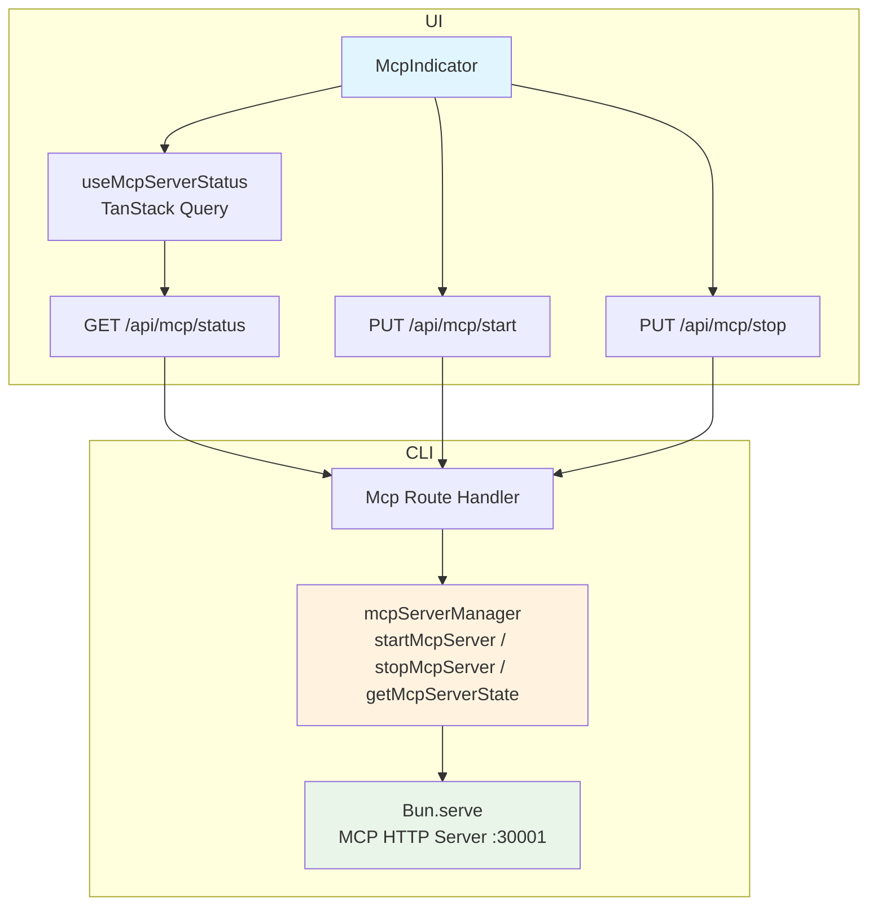
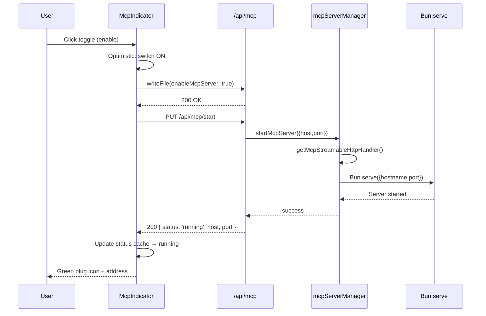
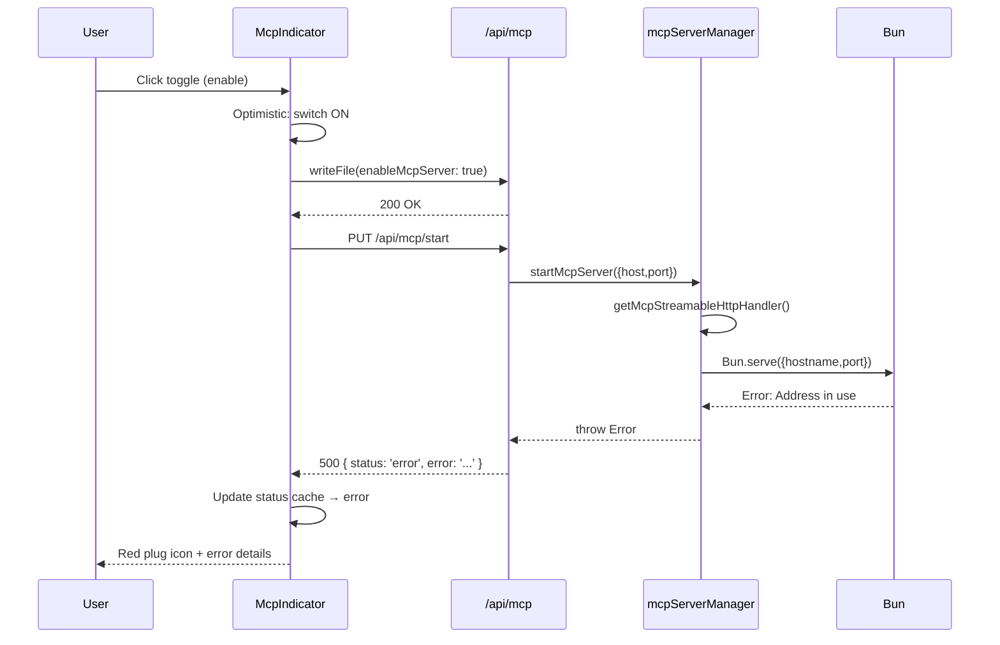
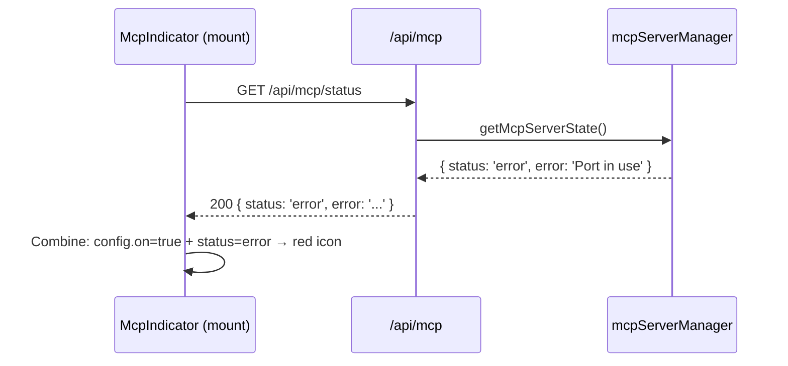
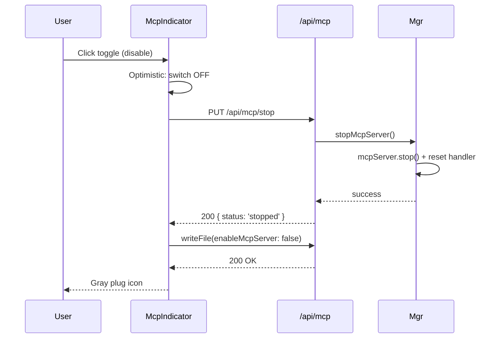

# MCP Server State Sync

将 MCP 服务器启动/停止从 fire-and-forget 模式改造为同步 HTTP API，确保 UI 能感知 MCP 服务器的真实运行状态。

[ ] New UI component - none (仅修改现有 McpIndicator)
[ ] New user config - none
[ ] Electron only - none
[ ] User document - none (API 文档自动从源码生成)

## 1. Background

当前 MCP 服务器启动流程存在 4 层问题导致 UI 与后端状态不一致：

1. **Fire-and-forget**: `WriteFile.ts` 中 `applyMcpConfig()` 不 await，HTTP 响应在 MCP 启动前已发出
2. **错误吞没**: `mcpServerManager.ts` 中 catch 只记日志不 rethrow，外层无法感知失败
3. **无反馈通道**: 没有任何 HTTP API 或 Socket.IO 事件通知 UI 启动结果
4. **Promise 缓存**: `mcp.ts` 中 `handlerPromise` 失败后永不清理，同一会话内无法恢复

本次重构完全废弃现有后端 MCP 管理代码（保留 UI 组件），使用专用 HTTP API 实现同步状态反馈。

## 2. Project Level Architecture

none — 仅涉及 CLI 端 HTTP 路由和 UI 端 API 调用层。

## 3. App Level Architecture

### CLI 端

新增 `apps/cli/src/route/Mcp.ts`，提供 3 个 MCP 管理端点：

```
PUT  /api/mcp/start   → startMcpServer() → { status: 'running', host, port }
PUT  /api/mcp/stop    → stopMcpServer()  → { status: 'stopped' }
GET  /api/mcp/status  → getMcpServerState() → { status: 'running'|'stopped'|'error', ... }
```

重写 `apps/cli/src/mcp/mcpServerManager.ts`：
- 导出 `startMcpServer(opts?)` / `stopMcpServer()` / `getMcpServerState()`
- 追踪运行时错误状态 (`mcpServerError`)
- `startMcpServer` 内部 throw（不再吞错）

修改 `apps/cli/src/mcp/mcp.ts`：
- 增加 `resetMcpStreamableHttpHandler()` 清除缓存的失败 Promise

修改 `apps/cli/src/route/WriteFile.ts`：
- **移除** 配置文件写入后触发 `applyMcpConfig()` 的逻辑

### UI 端

新增 `apps/ui/src/api/mcp.ts` — MCP HTTP API 封装（start/stop/status）

新增 `apps/ui/src/hooks/useMcpServerStatus.ts` — TanStack Query hook 查询 MCP 状态

修改 `apps/ui/src/components/mcp/McpIndicator.tsx`：
- toggle 逻辑改为：先 optimistically 更新 UI → 写配置 → 调 MCP API → 处理失败
- 新增错误状态展示：红色插头图标 + popover 显示错误信息



## 4. User Stories

### 4.1 成功启动 MCP 服务器

* **Given** 用户在 StatusBar 点击 MCP 开关（当前为 OFF）
* **When** 后端在端口 30001 成功创建 Bun HTTP 服务器
* **Then** UI 开关变为 ON，插头图标显示 primary 色，popover 显示地址 `http://127.0.0.1:30001`



### 4.2 MCP 启动失败 — 端口被占

* **Given** 用户在 StatusBar 点击 MCP 开关（当前为 OFF）
* **When** Bun.serve 在端口 30001 失败（地址已在使用）
* **Then** UI 开关保持 ON，插头图标变红（destructive），popover 显示错误信息 "Port 30001 is already in use"



### 4.3 页面初始加载 — 恢复真实状态

* **Given** 上次 MCP 启动失败，但 config 中 `enableMcpServer: true`
* **When** 用户刷新页面 / 重新打开应用
* **Then** UI 调用 `GET /api/mcp/status`，得到 `{ status: 'error', error: '...' }`，插头图标显示红色错误状态



### 4.4 关闭 MCP 服务器

* **Given** MCP 服务器正在运行
* **When** 用户点击 MCP 开关关闭
* **Then** UI 开关变为 OFF，调用 `PUT /api/mcp/stop` 后写配置 `enableMcpServer: false`



## 5. Tasks

### 5.1 Backend — MCP Server Manager 重写

[x] **Task 1**: 重写 `apps/cli/src/mcp/mcpServerManager.ts`
  - 导出 `startMcpServer(opts?: {hostname?, port?})` — 启动 MCP 服务器，内部 throw 错误
  - 导出 `stopMcpServer()` — 停止 MCP 服务器，清理 handler 缓存
  - 导出 `getMcpServerState()` — 返回 `{ status, host?, port?, error? }`
  - 追踪 `mcpServerError` 变量保存错误信息
  - 移除原有的 `applyMcpConfig()` fire-and-forget 模式（或简化为仅启动时调用）

[x] **Task 2**: 修改 `apps/cli/src/mcp/mcp.ts`
  - 导出 `resetMcpStreamableHttpHandler()` 函数清空 `handlerPromise`
  - `stopMcpServer()` 调用时 reset handler 以便下次启动重建

### 5.2 Backend — 新增 HTTP 路由

[x] **Task 3**: 新建 `apps/cli/src/route/Mcp.ts`
  - `PUT /api/mcp/start` — 调用 `startMcpServer()`，成功返回 200 + state，失败返回 500 + error
  - `PUT /api/mcp/stop` — 调用 `stopMcpServer()`，返回 200
  - `GET /api/mcp/status` — 调用 `getMcpServerState()`，返回 200 + state

[x] **Task 4**: 修改 `apps/cli/server.ts`
  - 注册 `handleMcpRoutes(this.app)`
  - 启动时仍调用 `applyMcpConfig()`（读取配置自动启动 MCP 如果已启用）

### 5.3 Backend — 移除 WriteFile 中的 MCP 触发

[x] **Task 5**: 修改 `apps/cli/src/route/WriteFile.ts`
  - 移除 `applyMcpConfig` 的 import 和调用
  - 配置文件写入不再自动触发 MCP 启动/停止（由 UI 显式调用 MCP API）

### 5.4 Frontend — API 层

[x] **Task 6**: 新建 `apps/ui/src/api/mcp.ts`
  - `startMcpServer(opts?: {host?, port?})` → `PUT /api/mcp/start`
  - `stopMcpServer()` → `PUT /api/mcp/stop`
  - `getMcpServerStatus()` → `GET /api/mcp/status`
  - 定义 `McpServerState` 类型

[x] **Task 7**: 新建 `apps/ui/src/hooks/useMcpServerStatus.ts`
  - TanStack Query hook：`useMcpServerStatus()` 基于 `getMcpServerStatus()`
  - Query key: `['mcp', 'serverStatus']`
  - 提供 `invalidateStatus()` 方法供操作后刷新

### 5.5 Frontend — McpIndicator 改造

[x] **Task 8**: 修改 `apps/ui/src/components/mcp/McpIndicator.tsx`
  - 引入 `useMcpServerStatus()` 查询真实状态
  - `handleMcpToggle` 改为 async：
    - **Enable**: optimistic ON → writeFile → PUT start → 成功则 toast.success → 失败则 revert 配置 + toast.error 显示错误
    - **Disable**: PUT stop → writeFile 写配置
  - `useEffect` 初始加载检测：config 说启用但状态非 running → revert 配置 + toast 通知
  - Toggle 的视觉状态完全由 `config.enableMcpServer` 驱动，始终反映真实状态

### 5.6 Frontend — GeneralSettings 适配

[x] **Task 9**: 修改 `apps/ui/src/components/ui/settings/GeneralSettings.tsx`
  - handleSave 中 MCP 配置变更时，先写配置，再根据 `enableMcpServer` 调用 MCP start/stop API
  - MCP host/port 变更时若已启用，需 stop + restart

## 6. Backward Compatibility

- **配置文件格式不变** — `enableMcpServer`, `mcpHost`, `mcpPort` 字段不变
- **服务器启动逻辑** — `applyMcpConfig()` 保留用于 CLI 启动时自动启动
- **WriteFile API** — 行为不变，仅移除 MCP 副作用
- **e2e 测试** — MCP 相关 e2e 测试保持不变（无新增 data-testid）

## 7. Documents

[x] `docs/api/index.md` — 添加 3 个新 API 条目：`PUT /api/mcp/start`, `PUT /api/mcp/stop`, `GET /api/mcp/status`

## 8. Post Verification

[x] Unit tests — `pnpm run test` UI 112 个测试文件 / CLI 17 个测试文件全部通过
[x] Build — `pnpm run build:cli` 和 `pnpm run build:ui` 构建成功
[ ] e2e — MCP 相关 e2e 测试适配新流程（如有需要）
