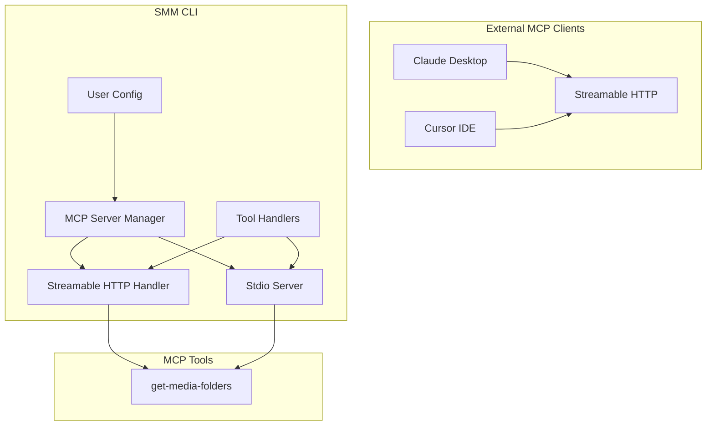

# MCP Server

SMM implements an MCP (Model Context Protocol) server that allows external AI clients (Claude Desktop, Cursor, other MCP-compatible clients) to interact with the application programmatically.

## 1. Overview

The MCP server exposes tools that provide access to SMM's functionality through a standardized protocol.

### Transport Mechanisms

| Transport | Description |
|-----------|-------------|
| **Streamable HTTP** | Primary transport on a separate port, for HTTP-based MCP clients |
| **Stdio** | Standalone server for subprocess-based clients (e.g. Claude Desktop) |

### Directory Structure

```
cli/src/mcp/
├── mcpServerManager.ts      # Server lifecycle management
├── mcp.ts                   # HTTP transport implementation
├── server.ts                # Stdio transport implementation
├── getMediaFoldersTool.ts   # Tool implementation
└── getMediaFoldersTool.test.ts
```

## 2. State Synchronization

MCP 服务器启动/停止使用同步 HTTP API，确保 UI 能感知真实运行状态。

### 2.1 Problem (Legacy)

- **Fire-and-forget**: `WriteFile.ts` 中 `applyMcpConfig()` 不 await，响应在 MCP 启动前已发出
- **Error swallowing**: `mcpServerManager.ts` 中 catch 只记日志不 rethrow
- **No feedback**: 无 HTTP API 或 Socket.IO 事件通知 UI
- **Promise caching**: `handlerPromise` 失败后永不清理

### 2.2 Solution: Synchronous HTTP API

**CLI Routes** (`apps/cli/src/route/Mcp.ts`):

| Method | Endpoint | Purpose |
|--------|----------|---------|
| `PUT` | `/api/mcp/start` | Start MCP server → `{ status: 'running', host, port }` |
| `PUT` | `/api/mcp/stop` | Stop MCP server → `{ status: 'stopped' }` |
| `GET` | `/api/mcp/status` | Query state → `{ status: 'running'|'stopped'|'error', ... }` |

**Server Manager** (`apps/cli/src/mcp/mcpServerManager.ts`):
- `startMcpServer(opts?)` — starts server, throws on error
- `stopMcpServer()` — stops server, resets handler cache
- `getMcpServerState()` — returns `{ status, host?, port?, error? }`
- `resetMcpStreamableHttpHandler()` — clears cached failed Promise

**UI Integration** (`McpIndicator.tsx`):
- Toggle logic: optimistic UI → write config → call MCP API → handle failure
- Uses `useMcpServerStatus()` TanStack Query hook for real-time state
- Error state: red icon + popover with error message

## 3. System Architecture



### Component Responsibilities

| Component | File | Responsibility |
|-----------|------|----------------|
| MCP Server Manager | `mcpServerManager.ts` | Server lifecycle based on user config |
| Streamable HTTP Handler | `mcp.ts` | HTTP-based MCP server creation & config |
| Stdio Server | `server.ts` | Standalone stdio MCP server |
| Tool Handlers | `getMediaFoldersTool.ts` | Individual MCP tool implementations |

### Configuration

| Property | Type | Default | Description |
|----------|------|---------|-------------|
| `enableMcpServer` | boolean | `false` | Enable the MCP server |
| `mcpHost` | string | `"127.0.0.1"` | Network interface to bind |
| `mcpPort` | number | `30001` | TCP port to listen on |

## 4. Code Design

### Streamable HTTP Transport

Key patterns:
- **Lazy Initialization**: HTTP handler created once, reused for all requests
- **Singleton Pattern**: Only one MCP server instance per session
- **Stateless Mode**: No session IDs, each request is independent

```typescript
export async function getMcpStreamableHttpHandler(): Promise<
  (req: Request) => Promise<Response>
> {
  if (handlerPromise) return handlerPromise;
  handlerPromise = (async () => {
    const server = new McpServer({...});
    server.registerTool("get-media-folders", {...}, async () => {...});
    const transport = new WebStandardStreamableHTTPServerTransport({...});
    await server.connect(transport);
    return (req: Request) => transport.handleRequest(req);
  })();
  return handlerPromise;
}
```

### Tool Implementation Pattern

Each MCP tool follows a consistent pattern:
1. **Handler Function** — business logic
2. **Registration** — with metadata and schema
3. **Response Format** — `{ content, isError? }`

```typescript
export async function handleGetMediaFolders(): Promise<{
  content: Array<{ type: "text"; text: string }>;
  isError?: boolean;
}> {
  try {
    const userConfig = await getUserConfig();
    const folders = userConfig.folders ?? [];
    return {
      content: [{ type: "text", text: JSON.stringify(folders) }],
    };
  } catch (err) {
    return {
      content: [{ type: "text", text: `Error: ${err}` }],
      isError: true,
    };
  }
}
```

### Response Format

**Success:**
```json
{
  "content": [{ "type": "text", "text": "[\"C:\\\\Media\\\\TV\"]" }]
}
```

**Error:**
```json
{
  "content": [{ "type": "text", "text": "Error: Config file not found" }],
  "isError": true
}
```

## 5. How to Add New MCP Tools

### 5.1 Create Tool Handler

```typescript
// cli/src/mcp/exampleTool.ts
export async function handleExampleTool(): Promise<ToolResponse> {
  try {
    const result = /* ... */;
    return { content: [{ type: "text", text: JSON.stringify(result) }] };
  } catch (err) {
    return {
      content: [{ type: "text", text: `Error: ${err.message}` }],
      isError: true,
    };
  }
}
```

### 5.2 Register in HTTP Server (`mcp.ts`)

```typescript
server.registerTool("example-tool", {
  description: "What this tool does.",
  inputSchema: {
    type: "object",
    properties: { /* ... */ },
    required: [],
  },
}, async (args) => handleExampleTool(args));
```

### 5.3 Register in Stdio Server (`server.ts`)

Same pattern as HTTP server — register the tool with identical schema and handler.

### 5.4 Write Unit Tests

Follow pattern: mock dependencies → import handler → test success/error paths.

## 6. Best Practices

- **Error Handling**: Always try/catch, convert errors to user-friendly messages
- **Performance**: For long operations, consider timeouts and progress indicators
- **Security**: Validate inputs, use config system for path access, don't expose sensitive data
- **Testing**: Mock external dependencies (config, fs), test both success and error paths

## 7. Related Documentation

- [MCP Specification](https://spec.modelcontextprotocol.io/)
- [MCP SDK Documentation](https://github.com/modelcontextprotocol/sdk)
