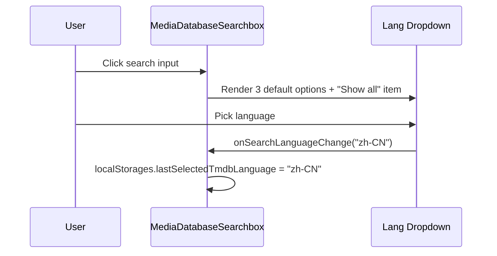
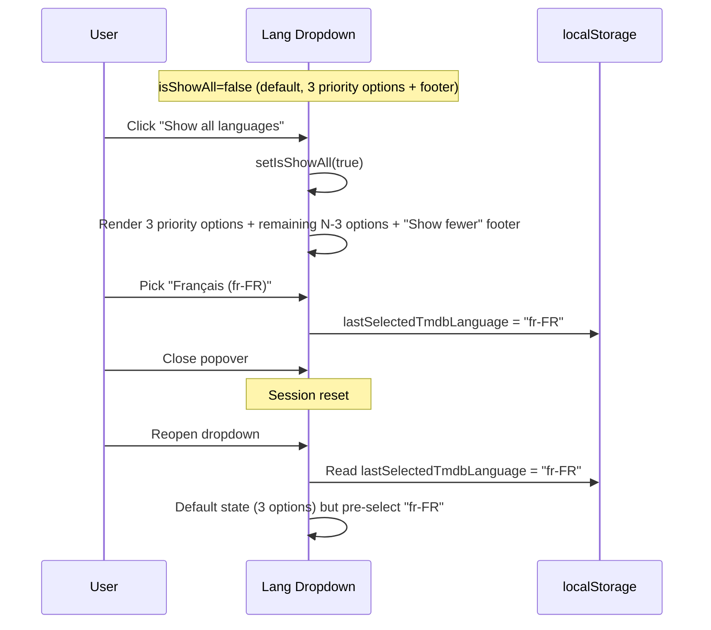

# Media Database Searchbox — All Languages Support

[brief] Allow the `MediaDatabaseSearchbox` language dropdown to offer every language supported by TMDB (144 primary translations) and TVDB (185 ISO 639-3 records), and persist the user's last choice per database in `localStorage`. The two databases use different language code formats and must be handled independently.

> **Scope boundary (clarified after review)**
>
> - **Dropdown value** = the value displayed in the trigger when the dropdown is *collapsed* (i.e. the `SelectValue` children / Radix item-text lookup). This change MUST NOT alter the collapsed-value behavior.
> - **Dropdown options** = the list of `SelectItem`s shown when the dropdown is *expanded*. This is the ONLY thing this change is allowed to alter.

[ ] New UI component
[ ] New user config
[ ] Electron only
[ ] User document

## 1. Background

`MediaDatabaseSearchbox` today exposes only 3 languages — `zh-CN`, `en-US`, `ja-JP` — via the `SUPPORTED_MEDIA_LANGUAGES` constant hard-coded in `apps/ui/src/components/ImmersiveSearchbox.tsx`. Users from other regions cannot pick their preferred language, even though:

- TMDB advertises 144 primary translations (`GET /3/configuration/primary_translations`)
- TVDB lists 185 languages (`GET /v4/languages`)

The two databases use different code formats:
- **TMDB** uses IETF BCP 47 tags: `zh-CN`, `en-US`, `ja-JP`, `fr-FR`, `pt-BR`, ...
- **TVDB** uses ISO 639-3 codes: `zho`, `eng`, `jpn`, `fra`, `por`, ...

`PreferMediaLanguage` (defined in `@core/types`) is currently `'zh-CN' | 'en-US' | 'ja-JP'` and is referenced in 20+ places. It serves two roles: a UserConfig preference for folder recognition, and a search-time language selector. This change decouples the search-time language from `PreferMediaLanguage` and widens the search-time language to a `string`.

## 2. Project Level Architecture

None. `PreferMediaLanguage` stays narrow for `UserConfig`. The new "search language" concept is local to `apps/ui`.

## 3. App Level Architecture

### `apps/ui/src/components/MediaDatabaseSearchbox.tsx`

- Replace the fixed 3-value `searchLanguage` state with a `string`.
- Decide the format at runtime based on `searchDatabase`:
  - When `searchDatabase === "TMDB"`, `searchLanguage` is an IETF tag (e.g. `zh-CN`).
  - When `searchDatabase === "TVDB"`, `searchLanguage` is an ISO 639-3 code (e.g. `zho`).
- Resolve the initial value with this priority:
  1. `localStorage.lastSelectedTmdbLanguage` / `lastSelectedTvdbLanguage` (depending on current `searchDatabase`)
  2. `userConfig.preferMediaLanguage` (mapped to the right format — see helper below)
  3. `en-US` / `eng` (TMDB / TVDB respectively)
- On user change, persist to the matching `localStorage` key.
- Persist nothing to `userConfig.preferMediaLanguage`.

### `apps/ui/src/components/ImmersiveSearchbox.tsx`

- Remove the hard-coded `SUPPORTED_MEDIA_LANGUAGES`.
- Accept a new `searchLanguageOptions: ReadonlyArray<{ code: string; name: string }>` prop.
- Add a new `showAllLanguages?: boolean` and `onShowAllLanguagesChange?: (next: boolean) => void` pair.
- When `showAllLanguages` is `false`, render the first 3 options (the "preferred" subset passed via `searchLanguageOptions.priority` or the first 3 elements) plus a `<SelectItem>`-shaped `<ShowAllLanguagesItem />` at the bottom.
- When `showAllLanguages` is `true`, render all options and a `<ShowFewerLanguagesItem />` at the bottom.
- The "show all / show fewer" item is rendered as a non-selectable footer that toggles the flag.

### `apps/ui/src/data/tmdbLanguages.ts` (new)

- `getTmdbPrimaryTranslations(options)`: `Promise<string[]>` (IETF tags).
- `getTmdbLanguages(options)`: `Promise<Array<{ iso_639_1: string; english_name: string; name: string }>>` (used to derive display names for IETF tags).
- Both use the existing reverse proxy via `TmdbRequestOptions`.

### `apps/ui/src/data/tvdbLanguages.ts` (new)

- `getTvdbLanguages(options)`: `Promise<TVDBv4LanguageRecord[]>` using `TVDBv4.getLanguages()` from `@smm/tvdb4` via `getTVDBv4Client`.

### `apps/ui/src/hooks/useTmdbLanguages.ts` (new)

- `useTmdbPrimaryTranslations()`: TanStack Query hook, `staleTime: 1 day`, `gcTime: 7 days`. Returns `{ data: IetfTag[] | undefined, isLoading, error }`.
- `useTmdbLanguages()`: same shape, returns the language-name list.
- `useTmdbSearchLanguageOptions()`: derived hook that combines both, returns a sorted, deduplicated list of `{ code: string; name: string }` (e.g. `{ code: "zh-CN", name: "Chinese (zh-CN)" }`).

### `apps/ui/src/hooks/useTvdbLanguages.ts` (new)

- `useTvdbLanguages()`: TanStack Query hook, same staleness. Returns `{ data: TVDBv4LanguageRecord[] | undefined, ... }`.
- `useTvdbSearchLanguageOptions()`: derived hook returning `{ code: string; name: string }[]` (e.g. `{ code: "eng", name: "English" }`).

### `apps/ui/src/lib/localStorages.ts`

Add two new entries:

```ts
get lastSelectedTmdbLanguage(): string | null { ... }
set lastSelectedTmdbLanguage(value: string | null) { ... }
get lastSelectedTvdbLanguage(): string | null { ... }
set lastSelectedTvdbLanguage(value: string | null) { ... }
```

### Helper: IETF ↔ ISO 639-3 mapping

`apps/ui/src/lib/searchLanguage.ts` (new):

```ts
/**
 * Map PreferMediaLanguage (IETF) to TVDB ISO 639-3 code.
 * Used as a fallback when localStorage has no value.
 */
export function preferMediaLanguageToTvdbCode(
  lang: PreferMediaLanguage,
): TvdbSearchLanguage {
  switch (lang) {
    case "zh-CN": return "zho"
    case "en-US": return "eng"
    case "ja-JP": return "jpn"
  }
}
```

### Widening of `language` parameter types in search-related functions

The following functions/hooks currently have `language: 'zh-CN' | 'en-US' | 'ja-JP'`. Widen to `language: string` so that any TMDB IETF tag or TVDB ISO 639-3 code can flow through:

- `apps/ui/src/api/tmdb.ts` — `searchTmdb`, `getMovieById`, `getTvShowById`, `getSeasonDetails`, `getMovieDetails` (and the matching `*Direct` variants in `tmdbDirect.ts`).
- `apps/ui/src/hooks/useGetTmdbTvShowMutation.ts`, `useGetTmdbTvShowMutation.ts`, `useGetTvdbTvShowMutation.ts`, `useGetTvdbMovieMutation.ts`, `useGetTmdbMovieMutation.ts`, `useGetTvdbMovieMutation.ts`, `useScrapeFanartMutation.ts`, `useScrapePosterMutation.ts`, `useScrapeNfoMutation.ts`, `useScrapeThumbnailMutation.ts`, `useDownloadThumbnailFromTMDB.ts`, `useDownloadThumbnailFromTVDB.ts`.
- `apps/ui/src/hooks/useSelectTvShowForFolderMutation.ts`, `useSelectMovieForFolderMutation.ts` (the `searchLanguage` field of `SelectTvShowForFolderVariables`).
- `apps/ui/src/hooks/useTvdbQueries.ts`, `useTmdbQueries.ts` (in `TmdbUtils.ts`).
- `apps/ui/src/lib/tryToRecognizeMediaFolderBySearchingFolderNameInTVDB.ts`.

`PreferMediaLanguage` itself **stays unchanged** in `@core/types`. The CLI HTTP body `TmdbSearchRequestBody.language` also stays narrow — the CLI receives the narrow value from `userConfig.preferMediaLanguage` and the new wide value is only used in the UI's direct search/display path.

### `tvdbSearchDisplay.ts` (UI-only change)

The current `tvdbTranslationCodesForMediaLanguage(lang: PreferMediaLanguage)` is no longer sufficient: TVDB search results now receive an ISO 639-3 code (the search language itself). Add a sibling function:

```ts
/**
 * For a TVDB search language that is already an ISO 639-3 code,
 * wrap it as a single-element array so existing picker code can iterate.
 */
export function tvdbTranslationCodeForSearchLanguage(
  lang: TvdbSearchLanguage,
): readonly string[] {
  return [lang]
}
```

The `getTvdbSearchResultName` / `getTvdbSearchResultOverview` helpers already accept `readonly string[]`, so this is a drop-in change at the call site in `MediaDatabaseSearchbox.tsx` (replacing the existing `tvdbTranslationCodesForMediaLanguage(searchLanguage)`).

### i18n keys

Add the following to all 4 locale files under `apps/ui/public/locales/{en,zh-CN,zh-HK,zh-TW}/components.json` under `tmdbSearchbox`:

- `showAllLanguages`: "Show all languages" / "显示全部语言" / "顯示全部語言"
- `showFewerLanguages`: "Show fewer languages" / "收起" / "收起"

## 4. User Stories

### 4.1 Default state shows the 3 common languages, with a "Show all" option

* **Given** - User opens a media folder
* **When** - User focuses the search input and the popover opens
* **Then** - The language dropdown lists 简体中文, English (US), 日本語, and a "Show all languages" footer item
* **And** - The currently selected language is highlighted



### 4.2 Clicking "Show all" appends the other languages below the 3 defaults

* **Given** - The language dropdown is in default (collapsed) state
* **When** - User clicks the "Show all languages" footer item
* **Then** - The 3 default languages stay **pinned at the top** in their priority order, and every other language is **appended below** them (deduped against the priority set)
* **And** - The footer item becomes "Show fewer languages"
* **And** - The expanded state is **session-only** — closing the popover resets it

```
Collapsed                          Expanded
+----------------------+           +--------------------------+
| 简体中文             |           | 简体中文                 |
| English (US)         |           | English (US)             |
| 日本語               |           | 日本語                   |
| 显示全部语言         |           | Français                 |
+----------------------+           | Deutsch                 |
                                   | ...                      |
                                   | 收起                    |
                                   +--------------------------+
```



### 4.3 Persist last selection per database

* **Given** - User has selected `fr-FR` for TMDB, `fra` for TVDB
* **When** - User reloads the page and opens the search box
* **Then** - When `searchDatabase === "TMDB"`, the dropdown shows `fr-FR` (from `lastSelectedTmdbLanguage`)
* **And** - When `searchDatabase === "TVDB"`, the dropdown shows `fra` (from `lastSelectedTvdbLanguage`)
* **And** - On next TMDB search, the request URL contains `language=fr-FR`
* **And** - On next TVDB search, the request URL contains `language=fra`

### 4.4 Fallback chain when localStorage is empty

* **Given** - User has never picked a search language before
* **When** - User opens the search box
* **Then** - The dropdown pre-selects based on `userConfig.preferMediaLanguage` (mapped to the appropriate format per database), or `en-US` / `eng` if not set

Priority order: `localStorage` → `userConfig.preferMediaLanguage` → `en-US` / `eng`

## 5. Tasks

### 5.1 Data layer

[x] Add `getTmdbPrimaryTranslations` and `getTmdbLanguages` to `apps/ui/src/api/tmdb.ts`
[x] Add `useTmdbPrimaryTranslations`, `useTmdbLanguages`, `useTmdbSearchLanguageOptions` to `apps/ui/src/hooks/useTmdbLanguages.ts`
[x] Add `getTvdbLanguages` to `apps/ui/src/lib/TvdbUtils.ts` (re-exports `tvdb.getLanguages()`)
[x] Add `useTvdbLanguages` and `useTvdbSearchLanguageOptions` to `apps/ui/src/hooks/useTvdbLanguages.ts`

### 5.2 Persistence + helpers

[x] Add `lastSelectedTmdbLanguage` / `lastSelectedTvdbLanguage` to `apps/ui/src/lib/localStorages.ts`
[x] Add `preferMediaLanguageToTvdbCode` to `apps/ui/src/lib/searchLanguage.ts` (new file)
[x] Add `tvdbTranslationCodeForSearchLanguage` to `apps/ui/src/lib/tvdbSearchDisplay.ts`

### 5.3 Widen search-related types

[x] Widen `language` param of `searchTmdb`, `searchTmdbDirect`, `getMovieById`, `getTvShowById`, `getSeasonDetails`, `getMovieDetails` in `apps/ui/src/api/tmdb.ts` and `tmdbDirect.ts` from `PreferMediaLanguage` to `string`
[x] Widen `searchLanguage` field in `SelectTvShowForFolderVariables` and `SelectMovieForFolderVariables` to `string`
[x] Widen `language` param in `useGetTmdbTvShowMutation`, `useGetTmdbTvShowMutation`, `useGetTvdbTvShowMutation`, `useGetTvdbMovieMutation`, `useGetTmdbMovieMutation`
[x] Widen `language` param in `useScrapeFanartMutation`, `useScrapePosterMutation`
[ ] Widen `language` param in `useScrapeNfoMutation`, `useScrapeThumbnailMutation` (no-op: doesn't take a language param)
[x] Widen `language` param in `useDownloadThumbnailFromTMDB`, `useDownloadThumbnailFromTVDB` (no-op: hardcodes 'en-US')
[x] Widen `language` param in `tryToRecognizeMediaFolderBySearchingFolderNameInTVDB` (kept as `PreferMediaLanguage` since it consumes the legacy user-config value)
[x] Widen `language` param in `useTvdbQueries` / `useTmdbQueries` (`TmdbUtils.ts`, `TvdbUtils.ts`)
[x] Drop unused `mapToTvdbLangCode` call sites (where the new search language is already ISO 639-3)

### 5.4 UI: `ImmersiveSearchbox` + `MediaDatabaseSearchbox`

[x] Modify `ImmersiveSearchbox`:
  - Remove `SUPPORTED_MEDIA_LANGUAGES` constant
  - Add `searchLanguageOptions: ReadonlyArray<{ code: string; name: string }>` prop
  - Add `showAllLanguages?: boolean` and `onShowAllLanguagesChange?: (next: boolean) => void` props
  - Render whatever options are passed in `searchLanguageOptions`; the toggle footer item only triggers `onShowAllLanguagesChange`
  - Render "Show all / Show fewer" footer item at the bottom of the dropdown
  - **Do NOT** modify the collapsed-value (`<SelectValue />`) behavior — Radix's default item-text lookup must remain as-is. If the trigger value is empty in some scenario, that is a separate bug and out of scope for this change.
[x] Modify `MediaDatabaseSearchbox`:
  - Use `string` for `searchLanguage` state
  - Wire the new `useTmdbSearchLanguageOptions` / `useTvdbSearchLanguageOptions` hooks
  - Compute `displayedLanguageOptions` as: `showAllLanguages ? [priorityList, ...rest] : priorityList` (i.e. 3 defaults always pinned at the top; expanded appends the other languages below them)
  - **Do NOT** special-case the currently selected language (e.g. by always including it in the priority list). That would alter the collapsed-options list and indirectly alter the collapsed-value behavior.
  - Switch options + selection logic based on `searchDatabase`
  - Implement the 3-step fallback (localStorage → userConfig → default)
  - Persist to `localStorage` on every change
  - Pass the resolved options to `ImmersiveSearchbox`
  - Replace the `tvdbTranslationCodesForMediaLanguage(searchLanguage)` call site with the new helper

### 5.5 i18n

[x] Add `tmdbSearchbox.showAllLanguages` and `tmdbSearchbox.showFewerLanguages` to all 4 locale files (`en`, `zh-CN`, `zh-HK`, `zh-TW`)

### 5.6 Tests

[x] Update `apps/ui/src/components/ImmersiveSearchbox.test.tsx` for the new `searchLanguageOptions` prop
[x] Add a test verifying that clicking the "Show all / Show fewer" toggle:
  - Invokes `onShowAllLanguagesChange` with the toggled flag
  - Does NOT invoke `onSearchLanguageChange` (no sentinel value leak)
  - Keeps the dropdown popover open
[x] Update `apps/ui/src/components/MediaDatabaseSearchbox.test.tsx` to cover:
  - `localStorage` value takes precedence over `userConfig.preferMediaLanguage`
  - Selecting a language persists to the correct localStorage key (per database)
  - Fallback to `userConfig.preferMediaLanguage` when localStorage is empty
  - Fallback to `en-US` / `eng` when both are empty
  - The collapsed dropdown only renders the 3 default languages (priority set)
  - The expanded dropdown appends the rest of the languages below the priority set
  - Toggling showAllLanguages via the change handler flips the flag
[x] Add unit test for `useTmdbSearchLanguageOptions` / `useTvdbSearchLanguageOptions` (combining API response into sorted, deduped option list)
[x] Add unit test for `preferMediaLanguageToTvdbCode`
[x] Add unit test for `tvdbTranslationCodeForSearchLanguage`

> **Test boundary (clarified after review)**
>
> Tests for the collapsed-trigger value behavior (e.g. asserting that the trigger shows a specific language name) are **out of scope** for this change. The trigger's value rendering is driven by Radix's `SelectItem`-collection lookup, which is unchanged. If the trigger value is empty in some scenario, fix it in a separate change.

## 6. Backward Compatibility

- `PreferMediaLanguage` (3-value union) is unchanged. `UserConfig.preferMediaLanguage` and CLI HTTP body `TmdbSearchRequestBody.language` still use the narrow type. No CLI or MCP tool signature changes.
- `lastSelectedTmdbLanguage` / `lastSelectedTvdbLanguage` are new keys; no migration needed.
- Users on the current 3-language setup lose nothing — those 3 languages are still pre-selected based on their `userConfig.preferMediaLanguage`, and they can opt into more.
- Downstream code paths that pass `searchLanguage` into mutation hooks receive a wider `string` type. Existing callers passing the narrow 3-value union continue to work (the union is a subset of `string`).

## 7. Documents

[ ] `docs/design.md` — no changes (project-level architecture unaffected)
[ ] `docs/api.md` — no changes (CLI HTTP API unaffected; `language` param in `POST /api/tmdb/search` remains `'zh-CN' | 'en-US' | 'ja-JP'`)
[ ] `docs/user-guide.md` — N/A (this project does not maintain a separate user guide; the in-app "Show all languages" / "Show fewer languages" labels in all 4 locales are the user-facing documentation)

## 8. Post Verification

[x] Unit tests
    Run `pnpm run test` and expect all unit tests succeeded
[x] Build
    Run `pnpm run build` and expect build succeeded
[ ] Manual smoke test
    1. Open a media folder, focus the search input.
    2. Verify the dropdown shows 简体中文 / English (US) / 日本語 + "Show all languages".
    3. Click "Show all languages" — verify the 3 defaults stay pinned at the top, and the other ~141 (TMDB) / ~182 (TVDB) languages are appended below them. The "Show fewer languages" item replaces "Show all languages" at the bottom.
    4. Pick a non-default language (e.g. `fr-FR` for TMDB), close and reopen the popover — verify the selection persists from `localStorage`.
    5. Switch `searchDatabase` to TVDB — verify the dropdown shows TVDB's languages and uses the `lastSelectedTvdbLanguage` value.
    6. Search for a show — verify the network request URL contains the selected language code.
