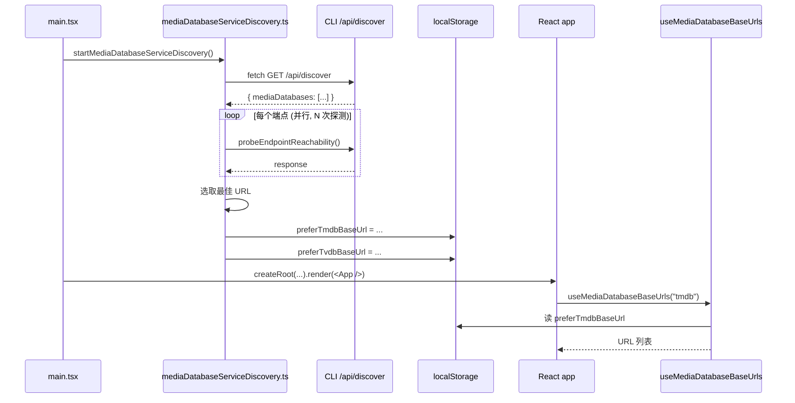

# Decouple Reachability Check from React

让可达性检查 (reachability check) 成为纯粹的 JavaScript 逻辑, React 应用只与 localStorage 交互.

[ ] New UI component
[ ] New user config
[ ] Electron only
[ ] User document

## 1. Background

当前 `MediaDatabaseServiceDiscovery` 是一个 React 组件, 它在 `useEffect` 里调用探测逻辑. 这导致以下问题:

- **与 React 生命周期强耦合**: 必须等待组件挂载才能触发
- **StrictMode 双挂载**: 即使加了 `hasProbedThisSession` 模块级保护, 仍存在 React 相关的不确定性
- **测试复杂**: 需要 `QueryClient` provider, 渲染组件, 等待 effect
- **与 TanStack Query 耦合**: 探测流程依赖 `useDiscoveredMediaDatabaseBaseUrls` 这个 hook
- **职责不清**: "数据获取" (TanStack Query) + "探测" (probe) + "持久化" (localStorage) 混在一个 React 组件里

重构后:
- **可达性检查是普通 JavaScript 函数**, 可在 `main.tsx` 启动时直接调用
- **React 只读 localStorage** (经由 `useMediaDatabaseBaseUrls` 等 hook)
- **探测流程可独立测试**, 无需 React 测试环境

## 2. Project Level Architecture

None. 仅在 apps/ui 内部修改.

## 3. App Level Architecture

### 新的职责划分

```
main.tsx (vanilla JS bootstrap)
│
├─ createRoot(...).render(<App />)
│
└─ startMediaDatabaseServiceDiscovery()         ← 纯 JS, 不依赖 React
   ├─ fetch GET /api/discover                    ← 直接 fetch, 不走 TanStack Query
   ├─ probeEndpointReachability() × N             ← 复用现有逻辑
   ├─ localStorages.preferTmdbBaseUrl = ...       ← 写入 localStorage
   └─ localStorages.preferTvdbBaseUrl = ...

App component (React)
└─ useMediaDatabaseBaseUrls(type)                ← 只读 localStorage + 模块级缓存
```

### React ↔ JavaScript 数据通道

为了让 React 能拿到探测用的端点列表 (不只是 localStorage 的偏好 URL), 需要一个轻量级的模块级缓存:

- `mediaDatabaseServiceDiscovery.ts` 导出 `getDiscoveredEndpoints()`: 返回模块级缓存, 探测完成后已填充
- React 的 `useMediaDatabaseBaseUrls` 调用此函数获取端点列表

这避免了把 discovered endpoints 持久化到 localStorage, 也避免了 React Query.

如果未来需要让其他 React 组件也响应 discovered endpoints 的变化, 可改用发布订阅模式 (`subscribe(callback)` → `notify()`). 但目前 `useMediaDatabaseBaseUrls` 是唯一消费者, 模块级变量足够.

## 4. User Stories

### 4.1 可达性检查在 React 渲染前完成

* **Given** - 应用启动, `main.tsx` 调用 `startMediaDatabaseServiceDiscovery()`
* **When** - 该函数异步执行, 在 React 渲染开始前后进行探测
* **Then** - localStorage 包含最新测量的偏好 URL, `useMediaDatabaseBaseUrls` 可立即读取



### 4.2 React 组件不感知探测流程

* **Given** - React 应用已经挂载, `useMediaDatabaseBaseUrls` 被调用
* **When** - 该 hook 读取 localStorage 偏好和模块级 discovered 缓存
* **Then** - 不发起任何 HTTP 请求, 不与 `/api/discover` 交互, 仅做本地数据合并/去重

## 5. Tasks

### 5.1 新建 `mediaDatabaseServiceDiscovery.ts` 模块

[x] 路径: `apps/ui/src/lib/mediaDatabaseServiceDiscovery.ts`
[x] 导出 `startMediaDatabaseServiceDiscovery(): Promise<void>`:
  - 调用 `fetchDiscoveredMediaDatabases()` 获取端点列表
  - 缓存到模块级变量 `let cachedEndpoints: MediaDatabaseEndpoint[] = []`
  - 对每个 type (tmdb/tvdb) 调用 `probeAndStore()`
  - `probeAndStore` 复用 `mediaDatabaseReachability.ts` 的逻辑 (探测, 选最快, 写 localStorage)
[x] 导出 `getDiscoveredEndpoints(): MediaDatabaseEndpoint[]`: 返回模块级缓存
[x] 导出 `subscribeToDiscovery(callback): () => void`: 简单的发布订阅, 探测完成后通知
[x] 模块级 guard `let hasStartedThisSession = false`, 防止 main.tsx + 任何 HMR 触发重复启动
[x] 导出 `_resetMediaDatabaseServiceDiscoveryForTesting(): void`

### 5.2 修改 `main.tsx`

[x] 在 `bootstrap()` 函数里, 在 `createRoot(...).render(...)` 之前/之后调用 `startMediaDatabaseServiceDiscovery()`
[x] 不 await 它, 让它在后台进行 (React 不应被探测阻塞)
[x] 失败时静默忽略 (与现有 `useDiscoveredMediaDatabaseBaseUrls` 的错误处理一致)

### 5.3 重构 `useMediaDatabaseBaseUrls` hook

[x] 移除对 `useDiscoveredMediaDatabaseBaseUrls` (TanStack Query) 的依赖
[x] 改为调用 `getDiscoveredEndpoints()` 获取端点列表
[x] 保留 `useState` + `useEffect` + `subscribeToDiscovery` 以在探测完成后触发重新计算
[x] localStorage 读取逻辑保持不变

### 5.4 删除 `useDiscoveredMediaDatabaseBaseUrls` hook

[x] 文件 `apps/ui/src/hooks/useDiscoveredMediaDatabaseBaseUrls.ts` 删除
[x] `discoveredMediaDatabasesQueryKey` 常量删除 (无消费者)
[x] `useMediaDatabaseBaseUrls.test.ts` 中相关 mock 删除

### 5.5 删除 React 组件 `MediaDatabaseServiceDiscovery`

[x] 文件 `apps/ui/src/components/initialization/MediaDatabaseServiceDiscovery.tsx` 删除
[x] 文件 `apps/ui/src/components/initialization/MediaDatabaseServiceDiscovery.test.tsx` 删除
[x] `AppInitializer.tsx` 中的 `<MediaDatabaseServiceDiscovery />` 移除

### 5.6 测试

[x] `mediaDatabaseServiceDiscovery.test.ts`: 纯 JS 测试, 覆盖以下场景:
  - `startMediaDatabaseServiceDiscovery()` 调用 `/api/discover` 一次
  - 探测完成后, `getDiscoveredEndpoints()` 返回非空数组
  - 探测完成后, `localStorages.preferTmdbBaseUrl` 和 `preferTvdbBaseUrl` 包含最快 URL
  - 同会话内多次调用 `start()`, 只触发一次探测
  - 探测失败 (e.g. /api/discover 返回 500) 不抛异常
  - 所有端点不可达时不写 localStorage
[x] `useMediaDatabaseBaseUrls.test.ts`: 更新 mock, 改为 mock `getDiscoveredEndpoints`
[x] 旧的 `MediaDatabaseServiceDiscovery.test.tsx` 删除

## 6. Backward Compatibility

- 现有 `preferTmdbBaseUrl` / `preferTvdbBaseUrl` localStorage 字段保留, 无 schema 变更
- 现有 `useMediaDatabaseBaseUrls` hook 的签名和返回值不变
- 现有 `MediaDatabaseSearchbox` 无需修改
- 唯一变化: 探测流程从 React 组件改为 `main.tsx` 直接调用, 调用时机更早

## 7. Documents

[ ] `.agents/docs/design/media-database-service-discovery.md` - 标记旧的 React 组件实现为已废弃, 引用本设计文档
[ ] `docs/api/index.md` - 无变更

## 8. Post Verification

[ ] Unit tests
    Run `pnpm run test` and expect all unit tests succeeded
[ ] Build
    Run `pnpm run build` and expect build succeeded
[ ] 手动验证:
    - 清除 localStorage
    - 启动应用
    - 在 Network 面板验证: `/api/discover` 请求只在 main.tsx bootstrap 时发起一次
    - 验证每个端点的探测请求数 = `REACHABILITY_PROBES_PER_URL` (3), 不再被 React 生命周期放大
    - 验证 localStorage 包含偏好 URL
