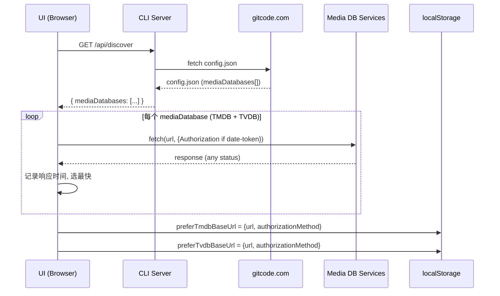
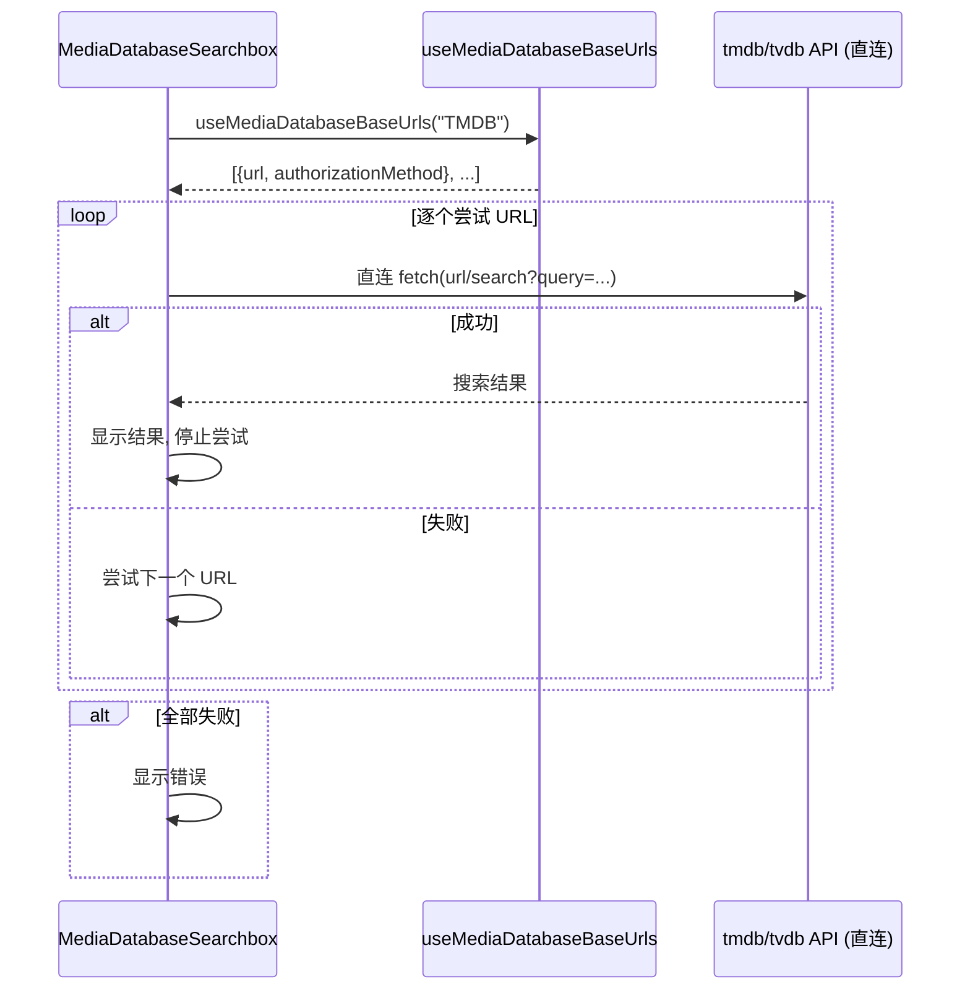

# Media Database Service Auto-Discovery

支持 SMM 从远端配置文件动态发现可用的媒体数据库(TMDB/TVDB)服务地址, 并在启动时通过可达性测试选择最快的地址。

[ ] New UI component
[ ] New user config
[ ] Electron only
[ ] User document

## 1. Background

SMM 目前硬编码 `https://tmdb-mcp-server.imlc.me` 作为 TMDB/TVDB 的唯一搜索服务地址。
需要支持从远端配置文件中发现多个可用地址, 并通过可达性测试选择最快的地址, 提升访问速度和可用性。

## 2. Project Level Architecture

None. 仅在 apps/cli 和 apps/ui 内部修改。

## 3. App Level Architecture

### apps/cli
- 新增 `GET /api/discover` 路由, 从 gitcode 远端获取配置文件

### apps/ui
- 新增 `useDiscoveredMediaDatabaseBaseUrls` hook (TanStack Query, 缓存整个应用生命周期)
- 新增启动时可达性检测逻辑, 选择最快地址写入 localStorage
- 新增 `useMediaDatabaseBaseUrls(type)` hook, 整合三个数据源返回去重后的 URL 列表
- 修改 `MediaDatabaseSearchbox` 逐个尝试 URL 搜索
- 新增 TMDB/TVDB 直连搜索函数 (不经 reverse proxy)

## 4. User Stories

### 4.1 应用启动时自动发现并测试所有可用服务地址

* **Given** - 远端配置文件包含多个 TMDB/TVDB 服务地址
* **When** - 用户启动应用
* **Then** - 应用从 CLI 获取配置文件, 对每个地址做可达性测试, 选择最快响应的地址保存到 localStorage



### 4.2 搜索时优先使用最快的服务地址

* **Given** - localStorage 中已保存最快的 TMDB/TVDB 地址
* **When** - 用户在搜索框中搜索媒体
* **Then** - 优先使用 localStorage 中的地址, 失败时尝试其他地址, 最后回退硬编码默认地址



## 5. Tasks

### 5.1 CLI: New `GET /api/discover` endpoint

[x] CLI 新增 `src/route/discover.ts`, 注册 `GET /api/discover` 路由
[x] 路由处理函数 fetch `https://gitcode.com/lawrenceching/simple-media-manager/raw/main/assets/config.json`
[x] 返回解析后的 JSON (原样返回 `mediaDatabases` 数组)
[x] fetch 失败时返回空数组 + 日志警告 (不阻塞启动)
[x] 可选: 添加简单缓存 (staleTime 控制)

### 5.2 UI: `useDiscoveredMediaDatabaseBaseUrls` hook

[x] 新建 `apps/ui/src/hooks/useDiscoveredMediaDatabaseBaseUrls.ts`
[x] TanStack Query `useQuery`:
  - `queryKey: ["discoveredMediaDatabases"]`
  - `queryFn`: fetch `GET /api/discover` from CLI
  - `staleTime: Infinity` (整个应用生命周期)
  - `gcTime: Infinity`
[x] 返回 `MediaDatabaseEndpoint[]` 其中:
  ```ts
  type MediaDatabaseEndpoint = {
    type: "tmdb" | "tvdb"
    url: string  // baseUrl 或 url 字段
    authorizationMethod?: "date-token" | "none"
  }
  ```
[x] 兼容 config.json 中 `baseUrl` 和 `url` 两种字段名

### 5.3 UI: 启动时可达性检测

[x] 新建 `apps/ui/src/components/initialization/MediaDatabaseServiceDiscovery.tsx`
[x] 在 `AppInitializer.tsx` 中引入该组件
[x] 组件逻辑:
  1. 使用 `useDiscoveredMediaDatabaseBaseUrls()` 获取所有端点
  2. 对每个 `type="tmdb"` 的端点做 `fetch(url)` 可达性检测
     - 使用 `mode: 'cors'` (默认) 发送 **正常格式的请求**, 附带 `Authorization: Bearer yyyy-MM-dd` 头 (如果是 date-token 端点), 避免上游监控看到未认证的探测请求
     - 只要 fetch 未报错就视为可达, 记录响应时间 (`performance.now()` / `Date.now()`)
     - 401/404/500 等任何 HTTP 错误均视为可达 (只关心能否连通, 不关心状态码)
  3. **每个端点探测 N=3 次** (并行), 取 `durationMs` 最低的探测作为该端点的 "最佳时延"
  4. 在最佳时延最低的可达端点中选一个, 写入 localStorage:
     - `preferTmdbBaseUrl` = `JSON.stringify({url, authorizationMethod})`
     - `preferTvdbBaseUrl` = `JSON.stringify({url, authorizationMethod})`
[x] **每次应用启动都重新检测可达性** — 即使 localStorage 中已存有偏好, 仍会重跑探测以选择当前网络下最优的 URL, 并覆盖旧值
[x] 检测时使用 `AbortController` + 超时 (如 10s) 避免长时间阻塞
[x] 检测完成后, 即使全部失败也不报错 (用户仍可搜索, 会用硬编码回退)

### 5.4 UI: `useMediaDatabaseBaseUrls` hook

[x] 新建 `apps/ui/src/hooks/useMediaDatabaseBaseUrls.ts`
[x] 签名: `useMediaDatabaseBaseUrls(type: "tmdb" | "tvdb"): { url: string; authorizationMethod?: "date-token" | "none" }[]`
[x] 数据源整合:
  1. 从 localStorage 读取 `preferTmdbBaseUrl` / `preferTvdbBaseUrl` (优先)
  2. 从 `useDiscoveredMediaDatabaseBaseUrls()` 读取所有匹配 type 的端点
  3. 硬编码默认: `https://tmdb-mcp-server.imlc.me/api/tmdb` (TMDB) / `https://tmdb-mcp-server.imlc.me/api/tvdb` (TVDB)
[x] 按优先级排序: localStorage > discovered others > 硬编码默认
[x] 去重: 基于 `url` 字段去重 (使用 `Map` 或 `Set`)

### 5.5 UI: 新增 TMDB/TVDB 直连搜索函数

[x] `apps/ui/src/api/tmdbDirect.ts` 新增 (独立模块, 不修改 `tmdb.ts`):
  ```ts
  export async function searchTmdbDirect(
    keyword: string, type: "movie" | "tv", language: string,
    options: { baseUrl: string, authorizationMethod?: "date-token" | "none" }
  ): Promise<TmdbSearchResponseBody>
  ```
  - 直接 `fetch(\`${baseUrl}/search/${type}?query=...&language=...\`)` 
  - 如果 `authorizationMethod === "date-token"`, 添加 `Authorization: Bearer yyyy-MM-dd`
  - 不走 reverse proxy

[x] `apps/ui/src/lib/TvdbDirectSearch.ts` 新增:
  ```ts
  export async function searchTvdbDirect(
    params: TVDBv4SearchParams,
    options: { baseUrl: string, authorizationMethod?: "date-token" | "none" }
  ): Promise<TVDBv4SearchResult[] | undefined>
  ```
  - 类似直连逻辑

### 5.6 UI: 修改 `MediaDatabaseSearchbox`

[x] 使用 `useMediaDatabaseBaseUrls(searchDatabase)` 获取排序后的 URL 列表
[x] 修改 `handleSearch`:
  - TMDB 搜索: 遍历 urls, 调用 `searchTmdbDirect()` 
  - TVDB 搜索: 遍历 urls, 调用 `searchTvdbDirect()`
  - 任一成功即停止, 全部失败则回退到硬编码默认再试一次
  - 仍然失败则显示错误
[ ] 搜索期间显示 "尝试连接中..." 等状态提示 (可选优化)

## 6. Backward Compatibility

- 现有硬编码 `https://tmdb-mcp-server.imlc.me` 保留作为最终回退, 不影响现有行为
- 新增的 hooks 和 API 为增量添加, 不影响现有代码路径
- localStorage 中无 `preferTmdbBaseUrl` / `preferTvdbBaseUrl` 时, 自动执行检测并填充

## 7. Documents

[x] `docs/api/index.md` — 添加 `GET /api/discover` API 文档

## 8. Post Verification

[x] Unit tests
    Run `pnpm run test` and expect all unit tests succeeded
[ ] Build
    Run `pnpm run build` and expect build succeeded (NOTE: there are pre-existing build errors unrelated to this change)
[ ] 手动验证:
    - 清除 localStorage `preferTmdbBaseUrl` / `preferTvdbBaseUrl`
    - 启动应用, 在 Network 面板验证 `/api/discover` 被调用
    - 验证 localStorage 被正确写入最快的地址
    - 使用搜索框搜索, 验证优先使用最快的地址
