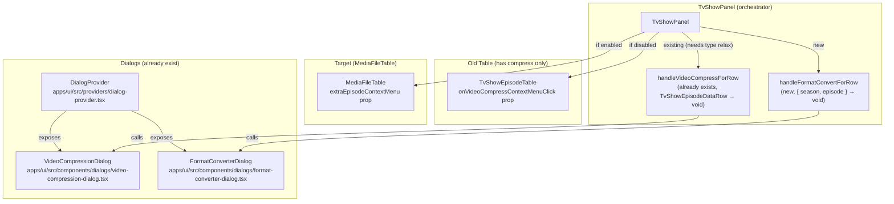
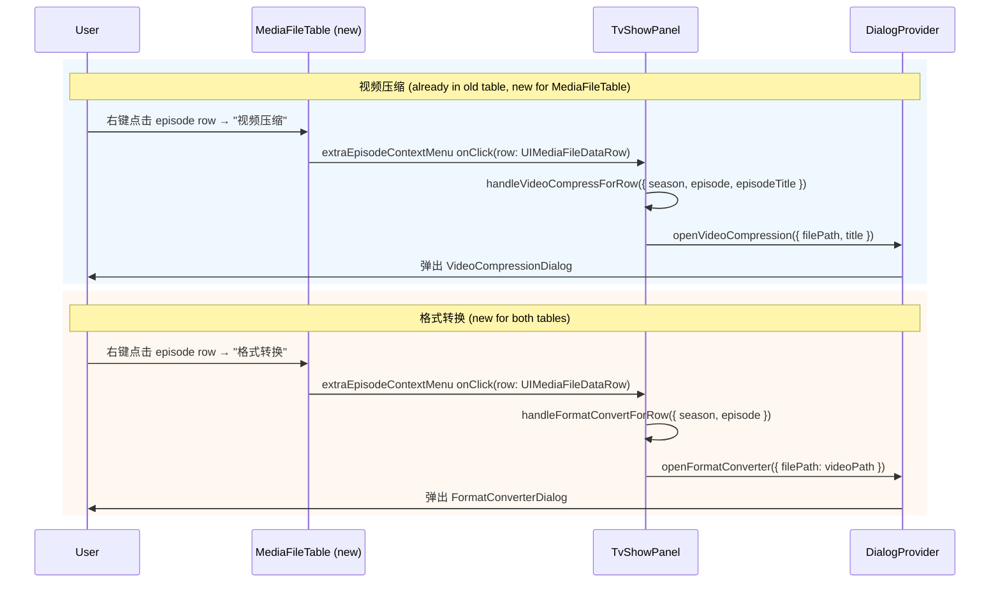

# media-file-table-compress-transcode-context-menu

`isUseMediaFileTableEnabled = true` 时，TvShowPanel 的 `MediaFileTable` data row 缺少"视频压缩"（Video Compression）
和"格式转换"（Format Converter / 视频转码）右击菜单项。旧 `TvShowEpisodeTable` 已有视频压缩菜单项
（通过 `onVideoCompressContextMenuClick` prop），但格式转换菜单项在两种表格中均未实现。

## Goal

当 `isUseMediaFileTableEnabled = true` 时，TvShowPanel 使用的 `MediaFileTable` 应在 data row 的右击菜单中
显示"视频压缩"和"格式转换"两项。格式转换为本次新增功能（旧表也没有），视频压缩为补齐新表功能。

## Codebase Analysis

### Architecture

### Code flow

### Key observations

1. **视频压缩 dialog 已存在**：`VideoCompressionDialog` 通过 `useDialogs().videoCompressionDialog` 调用，
   `openVideoCompression(input?: { filePath?, title?, duration? } | string)`。
   旧表通过 `onVideoCompressContextMenuClick?: (row: TvShowEpisodeDataRow) => void` prop 使用。

2. **格式转换 dialog 已存在**：`FormatConverterDialog` 通过 `useDialogs().formatConverterDialog` 调用，
   `openFormatConverter(track?: TrackProperties | string)`。但旧表和新表均未在 context menu 中使用它。
   此为新增功能。

3. **`TvShowPanel` 已有 `handleVideoCompressForRow`**（line ~273-291），但参数类型为 `TvShowEpisodeDataRow`，
   与 `UIMediaFileDataContextMenuItem.onClick` 的 `(row: UIMediaFileDataRow) => void` 不兼容（contravariant）。

4. **`UIMediaFileDataRow` 有 `episodeTitle?: string`**（line 67），与 `TvShowEpisodeDataRow` 的字段结构兼容。

5. **`extraEpisodeContextMenu` prop 已存在**（为 rename + select/unlink 新增），可以直接复用注入 compress/transcode 菜单项。

6. **Feature flags**：`isVideoCompressionEnabled` 和 `isFormatConverterEnabled` 来自 `useFeatures()`，
   在 HarmonyOS 上为 `false`，其他平台为 `true`。

7. **i18n keys** 均已存在于 4 个 locale：
   - `tvShowEpisodeTable.contextMenu.videoCompress` → "Video Compression" / "视频压缩"
   - `tvShowEpisodeTable.contextMenu.formatConvert` → "Format conversion" / "格式转换"

### Design decision

遵循 select/unlink 的类型放宽模式（[media-file-table-select-unlink-context-menu](../media-file-table-select-unlink-context-menu/context.md)）：

1. **`handleVideoCompressForRow`** 参数类型从 `TvShowEpisodeDataRow` 放宽为
   `{ season: number, episode: number, episodeTitle?: string }`。函数体逻辑完全不变
   （仅使用 `season`、`episode`、`episodeTitle`），结构类型同时满足旧表和新表的 row type。

2. **新增 `handleFormatConvertForRow`** 回调，参数 `{ season: number, episode: number }`，
   在 `mediaMetadata.mediaFiles` 中找到 video path 后调用 `openFormatConverter(videoPath)`。

3. **TvShowPanel 的 `extraEpisodeContextMenu`** 追加 video-compress 和 format-convert 两项，
   受 feature flag 控制：`isVideoCompressionEnabled` / `isFormatConverterEnabled` 为 `false` 时对应菜单项隐藏。

4. **MoviePanel 不修改**（电影没有 per-episode 文件操作，不适用压缩/转码）。

## References

- [MediaFileTable Select/Unlink Context Menu Design](../media-file-table-select-unlink-context-menu/design.md) — 同模式参考
- [MediaFileTable Rename Context Menu Design](../media-file-table-rename-context-menu.md) — 初始 extraEpisodeContextMenu 模式
- `apps/ui/src/components/tv/TvShowPanel.tsx` — 集成点
- `apps/ui/src/providers/dialog-provider.tsx` — 两个 dialog 的 API
- `apps/ui/src/components/dialogs/video-compression-dialog.tsx` — 视频压缩 dialog
- `apps/ui/src/components/dialogs/format-converter-dialog.tsx` — 格式转换 dialog
- `apps/ui/src/hooks/useFeatures.ts` — feature flags
