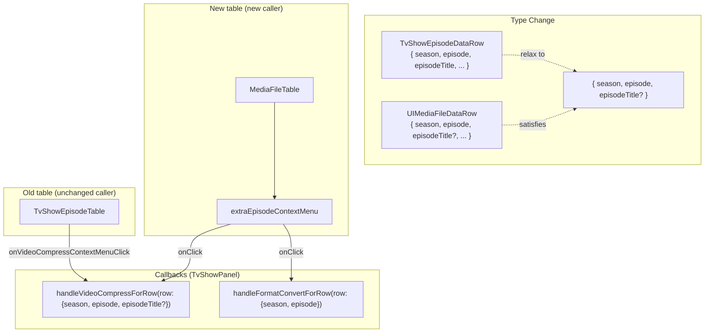
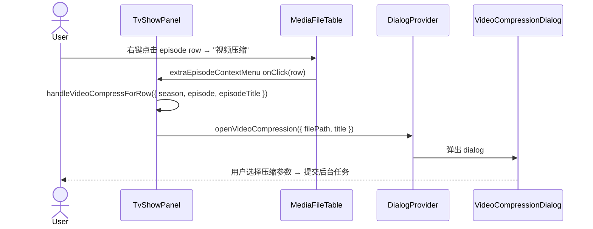
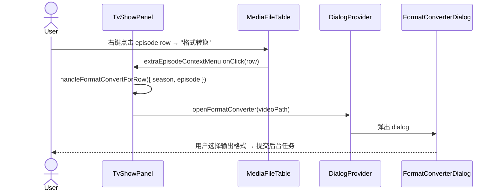

# MediaFileTable Video Compress / Format Convert Context Menu

为 `MediaFileTable` 的 data row（episode）右击菜单追加"视频压缩"和"格式转换"两项，
逻辑由 TvShowPanel 通过 `useDialogs()` 的 `videoCompressionDialog` 和 `formatConverterDialog` 注入。
`MediaFileTable` 本身不引入压缩/转码业务，保持纯 UI + 通用业务的最小契约。

- [ ] New UI component (no — 复用 `MediaFileTable` 的 `extraEpisodeContextMenu`)
- [ ] New user config
- [ ] Electron only
- [ ] User document

## 1. Background

`TvShowEpisodeTable.tsx` 已有 episode 右击菜单的"视频压缩"项
（见 `apps/ui/src/components/tv/TvShowEpisodeTable.tsx:936-942`）：用户选择
"视频压缩"后通过 `onVideoCompressContextMenuClick` prop 调用 TvShowPanel 的
`handleVideoCompressForRow`，该回调在 `mediaMetadata.mediaFiles` 中查找对应 episode
的 video path，然后调用 `openVideoCompression({ filePath, title })` 弹出
`VideoCompressionDialog`。

"格式转换"（Format Converter / 视频转码）功能已存在（`FormatConverterDialog`），
但从未在 context menu 中使用。用户只能通过顶部菜单栏 `menu.videoCompression` 进入。

当前重构后的 `MediaFileTable`（在 `apps/ui/src/components/media/MediaFileTable.tsx`）
已有 `extraEpisodeContextMenu` prop（为 rename / select-file / unlink 新增），
但 TvShowPanel 在 `isUseMediaFileTableEnabled = true` 分支只传了 rename + select-file + unlink
三项，没有把视频压缩和格式转换带进去。

目标：让 `isUseMediaFileTableEnabled` 开启后，TvShowPanel 的新表格 `MediaFileTable`
也能使用"视频压缩"右击菜单，同时新增"格式转换"右击菜单，且不改动
`MediaFileTable` 核心逻辑（通过 `extraEpisodeContextMenu` 注入）。
MoviePanel 不参与本次改动（电影没有 per-episode 文件操作）。

## 2. Project Level Architecture

none — 仅 `apps/ui` 内部 TvShowPanel 回调类型调整。

## 3. App Level Architecture

```
apps/ui/src/
  components/
    tv/
      TvShowPanel.tsx                 ← 修改 handleVideoCompressForRow 类型
                                        新增 handleFormatConvertForRow
                                        extraEpisodeContextMenu 追加 2 项
```

**类型变更细节**：

`handleVideoCompressForRow` 当前参数类型为 `TvShowEpisodeDataRow`，但函数体仅使用
`row.season`、`row.episode`、`row.episodeTitle`（均为可选属性）。放宽为
`{ season: number, episode: number, episodeTitle?: string }` 后，
`UIMediaFileDataRow` 同样满足该结构类型约束（`episodeTitle?: string` 在 line 67）。

`handleFormatConvertForRow` 是全新回调，参数 `{ season: number, episode: number }`，
逻辑：在 `mediaMetadata.mediaFiles` 中按 season/episode 找到 video path，
调用 `openFormatConverter(videoPath)`（支持 string 参数，dialog provider 内部自动
包装为 `TrackProperties`）。



## 4. User Stories

### 4.1 TV 剧集视频压缩（Video Compression）

- **Given** 用户在 TvShowPanel 选中一集且 `isUseMediaFileTableEnabled = true`，
  `isVideoCompressionEnabled = true`
- **When** 用户在该集的 data row 右击，在菜单中选择"视频压缩"
- **Then**
  1. 系统在 `mediaMetadata.mediaFiles` 中按 season/episode 查找 video path
  2. 调用 `openVideoCompression({ filePath, title })` 弹出 VideoCompressionDialog
  3. dialog 内用户可选择预设（speed/balanced/quality/extreme/audioOnly）或自定义参数压缩视频



### 4.2 TV 剧集格式转换（Format Converter / 视频转码）

- **Given** 用户在 TvShowPanel 选中一集且 `isUseMediaFileTableEnabled = true`，
  `isFormatConverterEnabled = true`
- **When** 用户在该集的 data row 右击，在菜单中选择"格式转换"
- **Then**
  1. 系统在 `mediaMetadata.mediaFiles` 中按 season/episode 查找 video path
  2. 调用 `openFormatConverter(videoPath)` 弹出 FormatConverterDialog
  3. dialog 内用户可选择输出格式（mp4h264/mp4h265/mkv/webm 等）和预设转换视频



### 4.3 不可用状态

- **Given** data row 没有 videoFile（`row.videoFile === undefined`）
- **When** 用户在 MediaFileTable 或旧表中右击该行
- **Then** "视频压缩"和"格式转换"菜单项处于 disabled 状态（与旧表 `TvShowEpisodeTable`
  现有 videoCompress 行为一致）

### 4.4 Feature flag 控制

- **Given** `isVideoCompressionEnabled = false`（HarmonyOS）
- **When** 用户右击 episode row
- **Then** "视频压缩"菜单项隐藏（`onClick` 为 falsy → `UIMediaFileTable` 不渲染该项）

- **Given** `isFormatConverterEnabled = false`（HarmonyOS）
- **When** 用户右击 episode row
- **Then** "格式转换"菜单项隐藏

### 4.5 旧表不受影响

- **Given** `isUseMediaFileTableEnabled = false`
- **When** 用户在 TvShowPanel 看到的是 `TvShowEpisodeTable`
- **Then** 旧表的"视频压缩"右击菜单保持现有实现不变（`onVideoCompressContextMenuClick` prop），
  旧表无"格式转换"菜单项（保持现状，不新增）

## 5. Tasks

### 5.1 TvShowPanel — handleVideoCompressForRow 类型放宽

- [x] `apps/ui/src/components/tv/TvShowPanel.tsx`:
  - `handleVideoCompressForRow` 参数类型从 `TvShowEpisodeDataRow` 改为
    `{ season: number, episode: number, episodeTitle?: string }`
  - 函数体逻辑完全不变（仅使用 `season`、`episode`、`episodeTitle`）
  - 旧表调用点 `onVideoCompressContextMenuClick={handleVideoCompressForRow}` 无需改动：
    `TvShowEpisodeDataRow` 满足 `{ season, episode, episodeTitle? }`

### 5.2 TvShowPanel — 新增 handleFormatConvertForRow

- [x] `apps/ui/src/components/tv/TvShowPanel.tsx`:
  - 在 `useFeatures()` destructure 中追加 `isFormatConverterEnabled`
  - 在 `useDialogs()` destructure 中追加 `formatConverterDialog`
  - 新增 `handleFormatConvertForRow` callback

### 5.3 TvShowPanel — extraEpisodeContextMenu 追加两项

- [x] `apps/ui/src/components/tv/TvShowPanel.tsx`:
  - 在 `extraEpisodeContextMenu` 的 `useMemo` 中追加 video-compress 和 format-convert 两项
  - `useMemo` 依赖列表追加 `handleVideoCompressForRow`、`handleFormatConvertForRow`、
    `isVideoCompressionEnabled`、`isFormatConverterEnabled`
  - 菜单项顺序：rename → select-file → unlink → video-compress → format-convert

### 5.4 验证

- [x] `pnpm run typecheck` — 0 errors（初次 typecheck 失败：i18n key `tvShowEpisodeTable.contextMenu.formatConvert` 未注册；修复：在 4 个 locale JSON 和 `i18next.d.ts` 中添加该 key）
- [x] `pnpm run test` — **1424 passed, 23 skipped, 0 failed**（与 baseline 一致）
- [x] 确认旧 `TvShowEpisodeTable` 的 videoCompress 菜单仍正常（类型放宽自动兼容，旧代码零改动）

## 6. Backward Compatibility

- `handleVideoCompressForRow` 参数类型从具体类型改为结构类型 → 所有旧调用方
  （`TvShowEpisodeTable` 的 `onVideoCompressContextMenuClick`）传入的 `TvShowEpisodeDataRow`
  自动兼容 `{ season, episode, episodeTitle? }`
- `handleFormatConvertForRow` 为新增回调，不影响既有代码
- `MediaFileTable` 无 prop 变更（复用已有的 `extraEpisodeContextMenu`）
- `isUseMediaFileTableEnabled = false` 的用户行为完全不变
- `isVideoCompressionEnabled = false`（HarmonyOS）时菜单项隐藏，与旧表行为一致
- `isFormatConverterEnabled = false`（HarmonyOS）时菜单项隐藏

## 7. Documents

- [x] `.agents/docs/design/media-file-table-compress-transcode-context-menu/context.md` — 上下文分析
- [x] `.agents/docs/design/media-file-table-compress-transcode-context-menu/design.md` — 本设计文档
- [x] `docs/` 下 user guide 无需更新（开发期内部重构）

## 8. Post Verification

- [x] `pnpm run typecheck` — 0 errors
- [x] `pnpm run test` — 1424 passed, 23 skipped, 0 failed（无回归）
- [x] 集成改动已 commit-ready: TvShowPanel 在 `isUseMediaFileTableEnabled = true`
      分支的 `<MediaFileTable>` 上传入了 rename / select-file / unlink / video-compress /
      format-convert 五项; 旧表 `TvShowEpisodeTable` 分支保持原样不变
- [ ] 手动 UI 验证（需要在 feature flag 打开时实际右击测试）— 留待 e2e 验证

## 9. Deviations from spec

1. **i18n key 新增**：设计时假设 i18n key `tvShowEpisodeTable.contextMenu.formatConvert`
   已存在（因为 locale JSON 中存在，但在 `mediaPlayer.trackContextMenu` 而非
   `tvShowEpisodeTable.contextMenu`）。实现时发现 `i18next.d.ts` 类型定义中无此 key，
   必须在 4 个 locale JSON 文件中新增 `formatConvert` key 并在 `i18next.d.ts` 中
   注册类型。此项为本次新增功能的必要配套改动。

2. **JSON trailing comma 修复**：zh-CN/zh-HK/zh-TW 的 `tvShowEpisodeTable.contextMenu`
   中 `videoCompress` 原为最后一个 key 无 trailing comma。插入 `formatConvert` 后
   成为倒数第二项，需要加回 comma。初次遗漏导致 JSON parse error（vite:json 插件报错），
   已修正所有 3 个 zh-* locale 文件。

3. **`handleFormatConvertForRow` 直接传 string**：原 spec 提到可能需要包装为
   `TrackProperties`，但 dialog provider 的 `openFormatConverter` 接受
   `TrackProperties | string`，内部自动将 string 包装为 `{ id: 0, path, filePath, title: '' }`。
   直接传 `videoPath` string 即可，无需额外包装。
