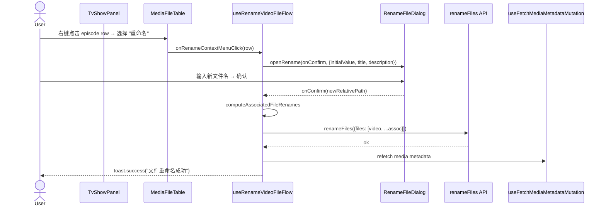

# MediaFileTable Rename Context Menu

为 `MediaFileTable` 的 data row（episode / video file）右击菜单追加"重命名"项，
逻辑由 TvShowPanel / MoviePanel 通过新增的 `useRenameVideoFileFlow` hook 注入。
`MediaFileTable` 本身不引入"重命名"业务，保持纯 UI + 通用业务的最小契约。

- [x] New UI component (no — 复用 UIMediaFileTable / MediaFileTable)
- [ ] New user config
- [ ] Electron only
- [ ] User document

## 1. Background

`TvShowEpisodeTable.tsx` 早已实现 episode 右击菜单的"重命名"项（见
`apps/ui/src/components/tv/TvShowEpisodeTable.tsx:877-919`）：调用
`useDialogs().renameFileDialog` 弹出 `RenameFileDialog`，把新路径传给
`renameFiles` API，并通过 `computeAssociatedFileRenames` 把同 stem 的
subtitle / thumbnail / nfo 一并改名，最后 refetch media metadata + toast。

但当前重构后的 `MediaFileTable`（在 `apps/ui/src/components/media/MediaFileTable.tsx`）
只硬编码 "Open" + "Properties" 两项 context menu item，没有把"重命名"带入
`isUseMediaFileTableEnabled = true` 的新分支。TvShowPanel / MoviePanel 也没有
显式支持重命名右击菜单的注入点。

目标：让 `isUseMediaFileTableEnabled` 开启后，TvShowPanel / MoviePanel 的新
表格依然能使用与旧 `TvShowEpisodeTable` 一致的"重命名"右击菜单，且不把
重命名业务硬编码进 `MediaFileTable`（MusicPanel 未来若复用就不应被迫继承
"重命名 episode"概念）。

## 2. Project Level Architecture

none — 仅 `apps/ui` 内部组件 / hook 调整。

## 3. App Level Architecture

```
apps/ui/src/
  components/
    media/
      MediaFileTable.tsx              ← 增加 extraEpisodeContextMenu?: UIMediaFileDataContextMenuItem[]
      UIMediaFileTable.tsx            ← 不变（contextMenuConfig 已经是 row-type 级别泛型）
  hooks/
    useRenameVideoFileFlow.ts         ← 新建，封装 "open rename dialog + renameFiles + refresh + toast"
```

`useRenameVideoFileFlow` hook 接收 `mediaFolderPath` 与 `files`（均为
media metadata 字段），返回 `onRenameContextMenuClick(row)` 回调。TvShowPanel
和 MoviePanel 各调用一次，把返回的项注入 `MediaFileTable` 的
`extraEpisodeContextMenu` prop。

`MediaFileTable` 把 caller 注入的 `extraEpisodeContextMenu` 追加在自己硬编码的
"Open" / "Properties" 之后，作为 data row 右击菜单的末尾项。`UIMediaFileTable`
本身已经接受 `contextMenuConfig`，无需改动。

## 4. User Stories

### 4.1 TV 剧集单集文件重命名

* **Given** 用户在 TvShowPanel 选中一集且该集有 videoFile，且 `isUseMediaFileTableEnabled = true`
* **When** 用户在该集右击，在菜单中选择"重命名"，输入新文件名并确认
* **Then**
  1. 系统调用 `renameFiles` API，把 video file + 同 stem 的 subtitle / thumbnail / nfo
     一起改名
  2. 成功后 refetch 当前 media folder 的 metadata
  3. toast 提示"文件重命名成功"；失败时 toast 提示"文件重命名失败: <error>"



### 4.2 电影 video file 重命名

* **Given** 用户在 MoviePanel 选中 movie 且 movie 存在 videoFile，且 `isUseMediaFileTableEnabled = true`
* **When** 用户在 video row 右击 → "重命名" → 输入新文件名 → 确认
* **Then** 同 4.1，但 `files` 来源是 `mediaMetadata.files`（movie 也走同一套
  `computeAssociatedFileRenames` 逻辑，与 TvShowEpisodeTable 现有实现保持一致）

### 4.3 不可用状态

* **Given** data row 没有 videoFile
* **When** 用户右击该行
* **Then** "重命名"菜单项处于 disabled 状态（与旧 TvShowEpisodeTable 行为一致）

### 4.4 旧表不受影响

* **Given** `isUseMediaFileTableEnabled = false`
* **When** 用户在 TvShowPanel 看到的是 `TvShowEpisodeTable`
* **Then** 旧表的"重命名"右击菜单保持现有实现，不受本次改动影响

## 5. Tasks

### 5.1 新建 useRenameVideoFileFlow

- [x] 创建 `apps/ui/src/hooks/useRenameVideoFileFlow.ts`
  - 签名：`useRenameVideoFileFlow({ mediaFolderPath, files, onAfterRename }): { onRenameContextMenuClick(row: UIMediaFileDataRow) => void }`
    - `mediaFolderPath: string | undefined`
    - `files: string[]` — media metadata 中的所有文件绝对路径列表（POSIX 风格）
    - `onAfterRename?: () => void | Promise<void>` — 成功后 hook 会先调用它（用于 panel
      内部同步本地 state），再 refetch media metadata
  - 内部依赖：
    - `useDialogs().renameFileDialog`（打开 RenameFileDialog）
    - `renameFiles`（`@/api/renameFiles`）
    - `useFetchMediaMetadataMutation`（`@/hooks/mediaMetadata/useFetchMediaMetadataMutation`）
    - `computeAssociatedFileRenames`（`@/components/episode-file`）
    - `relative`（`@/lib/path`），`join`（`@/lib/path`）
    - `toast`（`sonner`），`useTranslation`（`@/lib/i18n`）
  - 行为（从 TvShowEpisodeTable 现有实现搬过来，差异：取消硬编码 `selectedMediaMetadata`，改用入参）：
    1. 早退：`!row.videoFile || !mediaFolderPath` → 直接 return
    2. 计算 `relativePath = relative(mediaFolderPath, row.videoFile)`，失败时退回 `row.videoFile`
    3. `openRename(onConfirm, { initialValue: relativePath, title, description })`
    4. `onConfirm(newRelativePath)`：
       - `newAbsolutePath = join(mediaFolderPath, newRelativePath)`
       - `assocRenames = computeAssociatedFileRenames(row.videoFile, newAbsolutePath, files)`
       - `await renameFiles({ files: [{ from: row.videoFile, to: newAbsolutePath }, ...assocRenames] })`
       - `await onAfterRename?.()`
       - `fetchMediaMetadata({ path: mediaFolderPath })`
       - `toast.success(t('episodeFile.renameSuccess'))`，失败 `toast.error(t('episodeFile.renameFailed'), { description })`

- [x] 在 hook 顶部使用 i18n key `episodeFile.rename` / `episodeFile.renameSuccess` /
      `episodeFile.renameFailed`（已存在于 4 个 locale，不需要新增）

### 5.2 新建 useRenameVideoFileFlow 单元测试

- [x] 创建 `apps/ui/src/hooks/useRenameVideoFileFlow.test.ts`
  - mock `@/api/renameFiles`, `@/providers/dialog-provider`, `@/hooks/mediaMetadata/useFetchMediaMetadataMutation`, `sonner`
  - 用 `renderHook` + `act` 测试：
    - `onRenameContextMenuClick` 是 no-op 当 `row.videoFile` 为空
    - 打开 rename dialog 时传入正确的 `initialValue`（相对路径）
    - 用户在 dialog 确认新名后，调用 `renameFiles` 包含 video + 关联文件
    - 成功后调用 `onAfterRename`（若提供）再 refetch metadata，再 toast success
    - 失败时 toast error 不抛

### 5.3 MediaFileTable 增加 extraEpisodeContextMenu prop

- [x] `apps/ui/src/components/media/MediaFileTable.tsx`:
  - props 增加 `extraEpisodeContextMenu?: UIMediaFileDataContextMenuItem[]`
  - 现有 `contextMenuConfig` 构造里，把 `dataRowItems` 改为：
    `[...默认 Open, ...默认 Properties, ...(extraEpisodeContextMenu ?? [])]`
  - `useMemo` 依赖列表追加 `extraEpisodeContextMenu`
  - JSDoc 解释：`extraEpisodeContextMenu` 用于在 Open / Properties 之后追加
    panel 私有的菜单项（例如 TvShow/Movie 的"重命名"项）。MusicPanel 等
    不应自动继承。

### 5.4 MediaFileTable 单元测试 / stories 更新

- [x] `apps/ui/src/components/media/MediaFileTable.stories.tsx` (若有) 增加一个
      "WithExtraContextMenu" story 演示 caller 注入自定义项
- [x] 若 MediaFileTable 当前无单测：写一个 `MediaFileTable.test.tsx` 用
      `@testing-library/react` 验证：传入 `extraEpisodeContextMenu` 后，该项
      出现在右击菜单中（用 fireEvent.contextMenu 触发）
  - 建议：参考 `useMediaFileTableController.test.ts` 风格；mock
    `@/components/media/UIMediaFileTable` 为薄壳，直接断言传入它的
    `contextMenuConfig.dataRowItems` 数组内容

### 5.5 TvShowPanel 集成

- [x] `apps/ui/src/components/tv/TvShowPanel.tsx`:
  - 引入 `useRenameVideoFileFlow`
  - 调用 `useRenameVideoFileFlow({ mediaFolderPath: mediaMetadata?.mediaFolderPath, files: mediaMetadata?.files ?? [] })`
  - 把返回的 `onRenameContextMenuClick` 包装成 `UIMediaFileDataContextMenuItem`：
    ```ts
    { id: 'rename', label: t('episodeFile.rename', { ns: 'components' }), onClick: videoRenameFlow.onRenameContextMenuClick, disabled: (row) => !row.videoFile }
    ```
  - 在 `isUseMediaFileTableEnabled` 分支的 `<MediaFileTable>` 上传入
    `extraEpisodeContextMenu={[renameItem]}`
  - 旧 `TvShowEpisodeTable` 分支保持不动

### 5.6 MoviePanel 集成

- [x] `apps/ui/src/components/movie/MoviePanel.tsx`:
  - 引入 `useRenameVideoFileFlow`
  - 调用 `useRenameVideoFileFlow({ mediaFolderPath: mediaMetadata?.mediaFolderPath, files: mediaMetadata?.files ?? [] })`
  - 同样把 `onRenameContextMenuClick` 包成 `UIMediaFileDataContextMenuItem` 传入
    `<MediaFileTable extraEpisodeContextMenu={...}>`
  - 旧 `TvShowEpisodeTable` 分支保持不动

## 6. Backward Compatibility

- `MediaFileTable` 新增 optional prop → 旧调用方不受影响
- `useRenameVideoFileFlow` 为新增 hook，旧代码无影响
- `TvShowEpisodeTable` 的旧"重命名"菜单代码保留原样，feature flag off 的用户
  行为不变
- `isUseMediaFileTableEnabled = true` 下的新表在使用新 hook 之前，菜单
  只有 Open / Properties，新增"重命名"是新增行为，不改变既有项

## 7. Documents

- [x] `.agents/docs/design/media-file-table-rename-context-menu.md` — 本设计文档
- [x] `docs/` 下 user guide 无需更新（这是开发期内部重构）

## 8. Post Verification

- [x] `pnpm exec vitest run src/hooks/useRenameVideoFileFlow.test.ts` 全部通过 (5/5)
- [x] `pnpm exec vitest run src/components/media/MediaFileTable.test.tsx` 全部通过 (4/4)
- [x] `pnpm run typecheck` (tsc --noEmit) 0 errors
- [x] `pnpm run test` 全部通过 (1424 passed, 23 skipped, 0 failed) — 无回归
- [ ] `pnpm run build` 在 main 上原本就有 4 个 pre-existing TS 错误
      (`MediaFileTable.tsx` 中 `mediaFileTable.contextMenu.open` / `properties` /
      `UIMediaFileFolderRow` 未使用), 与本次改动无关, 已用 `git stash` 验证在
      干净 main 上同样存在; 修复属于独立 PR
- [x] 集成改动已 commit-ready: TvShowPanel / MoviePanel 在 `isUseMediaFileTableEnabled = true`
      分支的 `<MediaFileTable>` 上传入了 `extraEpisodeContextMenu` 项; 旧表
      `TvShowEpisodeTable` 分支保持原样不变
- [ ] 手动 UI 验证 (需要在 feature flag 打开时实际右击测试) — 留待 e2e 验证

## 9. Deviations from spec

1. TvShowPanel 中 hook 的本地变量名从 spec 的 `renameFlow` 改为
   `videoRenameFlow` — 因为 TvShowPanel 已经有 `const renameFlow = useRuleBasedRenameFilesFlow(...)`
   (11+ 处下游引用), 重新声明会造成 shadow. 已通过 IRC 与用户确认.
2. MoviePanel 同样使用 `videoRenameFlow` (与 TvShowPanel 保持一致), 避免未来
   与 `handleRuleBasedRenameConfirm` 类变量混淆.
3. `MediaFileTable.stories.tsx` 复用现有 `UIMediaFileTable.stories.tsx` 的
   `storybook/actions` import 风格 (项目内仅依赖 `@storybook/react-vite`,
   `addon-a11y`, `addon-docs`; 不用 `@storybook/addon-actions`).
