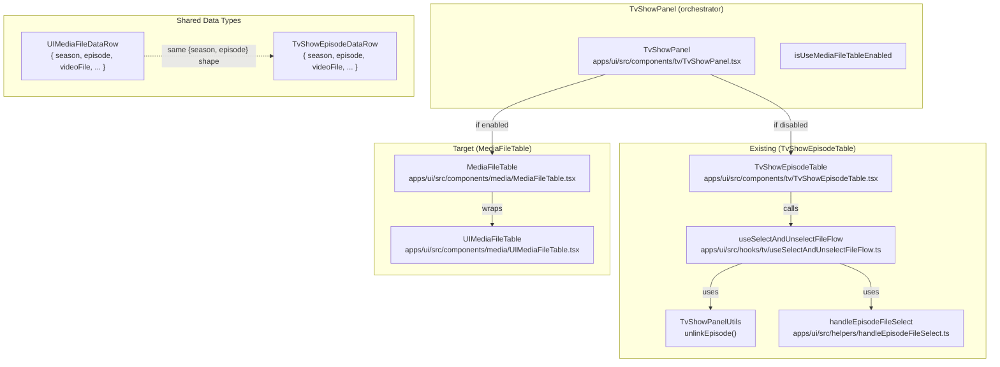
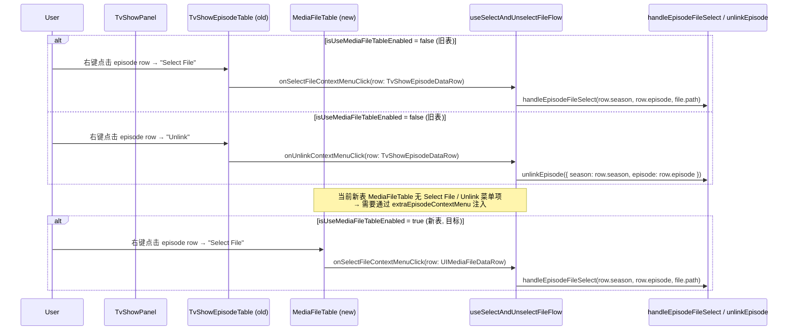

# media-file-table-select-unlink-context-menu

`isUseMediaFileTableEnabled = true` 时，TvShowPanel 的 `MediaFileTable` data row 缺少"Select File"和"Unlink"右击菜单项，
而旧 `TvShowEpisodeTable` 已有此功能。需补齐。

## Goal

当 `isUseMediaFileTableEnabled = true` 时，TvShowPanel 使用的 `MediaFileTable` 应在 data row 的右击菜单中显示
"Select File"（选择视频文件）和"Unlink"（取消链接）两项，与旧 `TvShowEpisodeTable` 的行为一致。

## Codebase Analysis

### Architecture

### Code flow

### Key observations

1. `TvShowEpisodeDataRow` 和 `UIMediaFileDataRow` 都包含 `season: number` / `episode: number` / `videoFile: string | undefined`，字段名完全一致。
2. 现有的 `useSelectAndUnselectFileFlow` hook 的 `onSelectFileContextMenuClick` 和 `onUnlinkContextMenuClick` 仅使用 `row.season` 和 `row.episode`，不依赖 `TvShowEpisodeDataRow` 的其他字段。
3. 两个回调的类型签名都是 `(row: TvShowEpisodeDataRow) => void`。
4. `UIMediaFileDataContextMenuItem` 的 `onClick` 类型是 `(row: UIMediaFileDataRow) => void`，与 `(row: TvShowEpisodeDataRow) => void` 不兼容（contravariant in row type）。
5. But `UIMediaFileDataRow` and `TvShowEpisodeDataRow` have structurally identical `{ season, episode, videoFile }` — just different type names.
6. `MediaFileTable` 已有 `extraEpisodeContextMenu?: UIMediaFileDataContextMenuItem[]` prop（为 rename 功能新增），可以直接复用。

### Design decision

最简洁的方案：修改 `useSelectAndUnselectFileFlow` 中两个回调的参数类型，从 `TvShowEpisodeDataRow` 改为 `{ season: number, episode: number }`。这是纯 type-level 变更，运行时行为不变。由于 `TvShowEpisodeDataRow` 包含 `season` 和 `episode`，TypeScript structural typing 向下兼容；`UIMediaFileDataRow` 也同样包含这两个字段。旧表 `TvShowEpisodeTable` 的 props 也需要相应调整。

## References

- [MediaFileTable Rename Context Menu Design](../media-file-table-rename-context-menu.md) — 本文档的模板，展示了相同的 `extraEpisodeContextMenu` 注入模式
- `apps/ui/src/hooks/tv/useSelectAndUnselectFileFlow.ts` — select/unlink 核心 hook
- `apps/ui/src/components/tv/TvShowPanel.tsx` — 两种表格的集成点
- `apps/ui/src/components/media/MediaFileTable.tsx` — 新表格组件，已有 `extraEpisodeContextMenu` prop
- `apps/ui/src/components/tv/TvShowEpisodeTable.tsx` — 旧表格（参考现有 select/unlink 实现）
