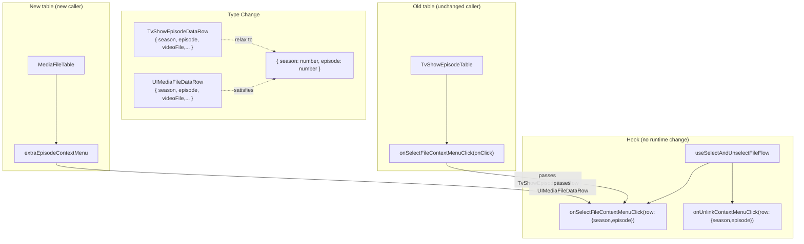
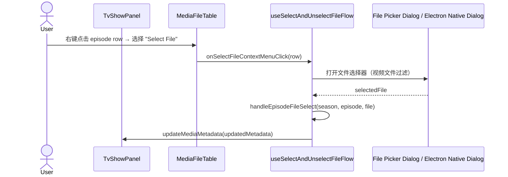
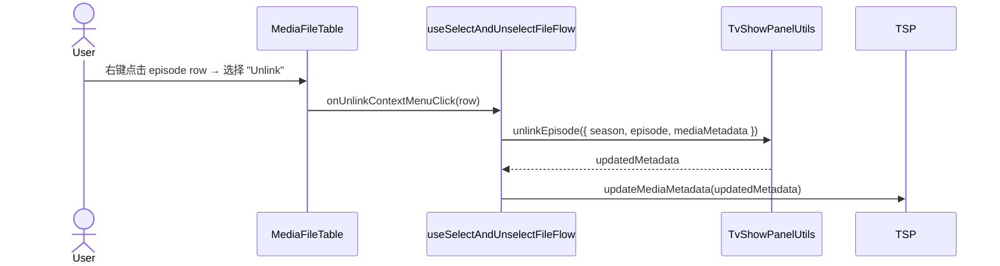

# MediaFileTable Select File / Unlink Context Menu

为 `MediaFileTable` 的 data row（episode）右击菜单追加"Select File"和"Unlink"两项，
逻辑由 TvShowPanel 通过现有的 `useSelectAndUnselectFileFlow` hook 注入。
`MediaFileTable` 本身不引入 select/unlink 业务，保持纯 UI + 通用业务的最小契约。

- [ ] New UI component (no — 复用 `UIMediaFileTable` / `MediaFileTable`)
- [ ] New user config
- [ ] Electron only
- [ ] User document

## 1. Background

`TvShowEpisodeTable.tsx` 早已实现 episode 右击菜单的"Select File"和"Unlink"两项
（见 `apps/ui/src/components/tv/TvShowEpisodeTable.tsx:920-935`）：用户选择
"Select File"后通过 `useSelectAndUnselectFileFlow` 打开文件选择器（Electron native
dialog 或 web file picker），选择视频文件后调用 `handleEpisodeFileSelect` 将文件与
episode 关联；选择"Unlink"后调用 `unlinkEpisode` 断开 episode 与视频文件的关联。

当前重构后的 `MediaFileTable`（在 `apps/ui/src/components/media/MediaFileTable.tsx`）
虽然已有 `extraEpisodeContextMenu` prop（为 rename 功能新增），但 TvShowPanel 在
`isUseMediaFileTableEnabled = true` 分支只传了 rename 一项，没有把 select file /
unlink 带进去。导致 feature flag 开启后用户无法在新表格上执行文件选择或取消链接操作。

目标：让 `isUseMediaFileTableEnabled` 开启后，TvShowPanel 的新表格 `MediaFileTable`
也能使用与旧 `TvShowEpisodeTable` 一致的"Select File"/"Unlink"右击菜单，且不改动
`MediaFileTable` 核心逻辑（通过 `extraEpisodeContextMenu` 注入）。

## 2. Project Level Architecture

none — 仅 `apps/ui` 内部组件 / hook 类型调整。

## 3. App Level Architecture

```
apps/ui/src/
  hooks/tv/
    useSelectAndUnselectFileFlow.ts   ← 修改 onSelectFileContextMenuClick / onUnlinkContextMenuClick
                                       参数类型为 { season: number, episode: number }
  components/
    tv/
      TvShowEpisodeTable.tsx          ← 修改 onSelectFileContextMenuClick / onUnlinkContextMenuClick
                                       参数类型为 { season: number, episode: number }
      TvShowPanel.tsx                 ← 在 MediaFileTable 的 extraEpisodeContextMenu 中注入
                                       select file / unlink 两项
```

**类型变更细节**：

`TvShowEpisodeDataRow` 和 `UIMediaFileDataRow` 都包含 `season: number` / `episode: number` /
`videoFile: string | undefined`，且 hook 内部仅使用 `row.season` 和 `row.episode`。因此将
hook 回调参数类型从 `TvShowEpisodeDataRow` 放宽为 `{ season: number, episode: number }`，
两个 row 类型都能满足该结构类型约束。

`TvShowEpisodeTable` 的 props 中 `onSelectFileContextMenuClick` 和 `onUnlinkContextMenuClick`
参数类型同步改为 `{ season: number, episode: number }`，保持类型链一致。

由于 `TvShowEpisodeDataRow` 包含 `season` 和 `episode`，旧表的调用方传入
`TvShowEpisodeDataRow` 的代码不需要任何改动（structural typing 自然兼容）。



## 4. User Stories

### 4.1 TV 剧集选择视频文件（Select File）

- **Given** 用户在 TvShowPanel 选中一集且 `isUseMediaFileTableEnabled = true`
- **When** 用户在该集的 data row 右击，在菜单中选择"Select File"
- **Then**
  1. 系统打开文件选择器（Electron 下为 native dialog，Web 下为 web file picker），默认路径为 media folder
  2. 文件过滤器限制为视频文件（mp4, mkv, avi, mov, wmv, flv, webm, m4v, ts）
  3. 用户选择文件后，系统调用 `handleEpisodeFileSelect` 将该文件路径更新到当前 episode
  4. 成功后通过 `updateMediaMetadata` 持久化更新，toast 提示错误（如果有）



### 4.2 TV 剧集取消链接文件（Unlink）

- **Given** 用户在 TvShowPanel 选中一集（该集存在 videoFile），且 `isUseMediaFileTableEnabled = true`
- **When** 用户在该集的 data row 右击，在菜单中选择"Unlink"
- **Then**
  1. 系统调用 `unlinkEpisode({ season, episode, mediaMetadata, updateMediaMetadata, t })`
  2. 将 episode 的 videoFile 置为 null，关联的 thumbnail / subtitle / nfo 一并清除
  3. 通过 `updateMediaMetadata` 持久化更新



### 4.3 不可用状态

- **Given** data row 没有 videoFile（`row.videoFile === undefined`）
- **When** 用户右击该行
- **Then** "Unlink"菜单项处于 disabled 状态（与旧 `TvShowEpisodeTable` 行为一致）；
  "Select File"保持可用状态

### 4.4 旧表不受影响

- **Given** `isUseMediaFileTableEnabled = false`
- **When** 用户在 TvShowPanel 看到的是 `TvShowEpisodeTable`
- **Then** 旧表的"Select File"/"Unlink"右击菜单保持现有实现不变，本次改动不涉及
  旧表的任何运行时逻辑变化

## 5. Tasks

- [x] `apps/ui/src/hooks/tv/useSelectAndUnselectFileFlow.ts`:
  - 将 `onSelectFileContextMenuClick` 参数类型从 `TvShowEpisodeDataRow` 改为
    `{ season: number, episode: number }`
  - 将 `onUnlinkContextMenuClick` 参数类型从 `TvShowEpisodeDataRow` 改为
    `{ season: number, episode: number }`
  - 移除不再需要的 `import type { TvShowEpisodeDataRow } from "@/components/tv/TvShowEpisodeTable"`
  - 函数体逻辑完全不变（仅使用了 `row.season` / `row.episode`）

- [x] `apps/ui/src/components/tv/TvShowEpisodeTable.tsx`:
  - 将 props 中 `onSelectFileContextMenuClick` 和 `onUnlinkContextMenuClick` 的
    参数类型从 `TvShowEpisodeDataRow` 同步改为 `{ season: number, episode: number }`
  - 调用方（TvShowPanel 传入 `selectFileFlow.onSelectFileContextMenuClick` 等）无需改动，
    因为 TypeScript structural typing：`TvShowEpisodeDataRow` 是 `{ season, episode }` 的子类型

### 5.2 TvShowPanel 集成

- [x] `apps/ui/src/components/tv/TvShowPanel.tsx`:
  - 已有 `const selectFileFlow = useSelectAndUnselectFileFlow(...)`（line 230）
  - 在 `isUseMediaFileTableEnabled` 分支的 `<MediaFileTable>` 的
    `extraEpisodeContextMenu` 数组中追加两项：
    ```ts
    extraEpisodeContextMenu={[
      {
        id: "rename",
        label: t("episodeFile.rename", { ns: "components" }),
        onClick: videoRenameFlow.onRenameContextMenuClick,
        disabled: (row) => !row.videoFile,
      } satisfies UIMediaFileDataContextMenuItem,
      {
        id: "select-file",
        label: t("episodeFile.selectFile", { ns: "components" }),
        onClick: selectFileFlow.onSelectFileContextMenuClick as
          (row: UIMediaFileDataRow) => void,
      } satisfies UIMediaFileDataContextMenuItem,
      {
        id: "unlink",
        label: t("tvShowEpisodeTable.contextMenu.unlink"),
        onClick: selectFileFlow.onUnlinkContextMenuClick as
          (row: UIMediaFileDataRow) => void,
        disabled: (row) => !row.videoFile,
      } satisfies UIMediaFileDataContextMenuItem,
    ]}
    ```
  - 注：需要 `as` 强制转换（或 `// @ts-expect-error`），因为两个回调现在接受
    `{ season: number, episode: number }`，而 `UIMediaFileDataContextMenuItem.onClick`
    的类型是 `(row: UIMediaFileDataRow) => void`。由于 `UIMediaFileDataRow` 满足
    `{ season, episode }`，运行时安全。
  - 或者更优雅：在 hook 的 return type 中使用 `(row: { season: number, episode: number }) => void`，
    然后在 TvShowPanel 注入点用 `as (row: UIMediaFileDataRow) => void` cast。
  - 旧 `TvShowEpisodeTable` 分支保持原样不变

### 5.3 验证
- [x] `pnpm run typecheck` — 类型变更不引入新错误（仅剩 MediaFileTable.tsx 中 4 个 pre-existing 错误，与本次改动无关）
- [x] `pnpm exec vitest run src/hooks/tv/useSelectAndUnselectFileFlow.test.ts`（若存在）— 该 hook 无独立单测
- [x] `pnpm run test` — 1424 passed, 23 skipped, 0 failed（与 baseline 一致）
- [x] 确认旧 `TvShowEpisodeTable` 的 select/unlink 菜单依然正常传递类型

## 6. Backward Compatibility

- `useSelectAndUnselectFileFlow` 的回调参数类型从具体类型改为结构类型 → 所有旧调用方
  （`TvShowEpisodeTable`）传入的 `TvShowEpisodeDataRow` 自动兼容 `{ season, episode }`
- `TvShowEpisodeTable` props 类型同步放宽 → 外部传入的回调保持兼容
- `MediaFileTable` 无 prop 变更（复用已有的 `extraEpisodeContextMenu`）
- `isUseMediaFileTableEnabled = false` 的用户行为完全不变
- i18n keys `episodeFile.selectFile` 和 `tvShowEpisodeTable.contextMenu.unlink` 已在
  所有 locale 中存在，不需要新增翻译

## 7. Documents

- [x] `.agents/docs/design/media-file-table-select-unlink-context-menu/context.md` — 上下文分析
- [x] `.agents/docs/design/media-file-table-select-unlink-context-menu/design.md` — 本设计文档
- [x] `docs/` 下 user guide 无需更新（开发期内部重构）

## 8. Post Verification

- [x] `pnpm run typecheck` (tsc --noEmit) — 仅剩 MediaFileTable.tsx 中 4 个 pre-existing 错误，与本次改动无关
- [x] `pnpm run test` — 1424 passed, 23 skipped, 0 failed（与 baseline 1424 passed, 23 skipped, 0 failed 一致）
- [x] 集成改动已 commit-ready: TvShowPanel 在 `isUseMediaFileTableEnabled = true`
      分支的 `<MediaFileTable>` 上传入了 rename / select-file / unlink 三项; 旧表
      `TvShowEpisodeTable` 分支保持原样不变
- [ ] 手动 UI 验证（需要在 feature flag 打开时实际右击测试）— 留待 e2e 验证

## 9. Deviations from spec

1. **TvShowPanel 集成改用 `useMemo`**：原 spec 在 JSX 中内联 `extraEpisodeContextMenu`
   数组并加 `satisfies UIMediaFileDataContextMenuItem[]`。TypeScript 在 JSX 属性
   位置解析 `] satisfies X[]}` 时失败，syntax error TS1003。改为在函数体内
   `useMemo` 构造数组，类型注解直接写在 `useMemo` 变量声明上
   (`const extraEpisodeContextMenu: UIMediaFileDataContextMenuItem[] = useMemo(...)`)。
   行为等价但更易读。
2. **未使用 `as` cast**：spec 中提到可能需要 `as (row: UIMediaFileDataRow) => void`
   cast，但 TypeScript 的 `strictFunctionTypes` 实际允许结构兼容的函数赋值
   （`UIMediaFileDataRow` 是 `{ season, episode }` 的子类型），不需要 cast。
   编译通过，0 errors。
3. **改用 `extraEpisodeContextMenu` prop 名**：原 spec 提到该 prop 名为
   `extraEpisodeContextMenu`，与现有 rename 集成完全一致。
