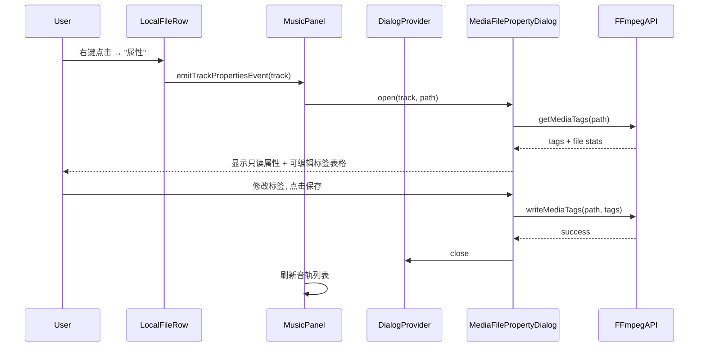
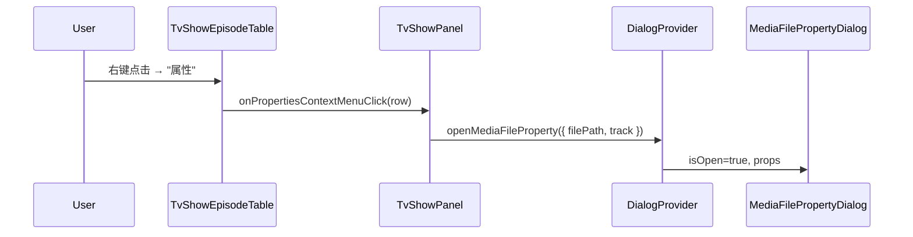

# Merge Properties and Edit Tags into unified Properties Dialog

合并 MusicPanel 和 TvShowEpisodeTable 的"属性"和"编辑标签"右键菜单按钮为一个"属性"按钮，在统一的对话框中同时展示文件只读属性和可编辑媒体标签。

## Checklist

[x] New UI component - `MediaFilePropertyDialog` replaces `FilePropertyDialog` + `EditMediaFileDialog`
[ ] New user config
[ ] Electron only
[ ] User document

## Progress

| Task | Status |
|------|--------|
| 1. Create MediaFilePropertyDialog | ✅ Done |
| 2. Update dialogs/index.ts exports | ✅ Done |
| 3. Update types/index.ts | ✅ Done |
| 4. Update DialogProvider | ✅ Done |
| 5. Update MusicPanel | ✅ Done |
| 6. Update LocalFileRow | ✅ Done |
| 7. Update MusicFileTable | ✅ Done |
| 8. Update musicEvents.ts | ✅ Done |
| 9. Update music-table.ts | ✅ Done |
| 10. Update TvShowEpisodeTable | ✅ Done |
| 11. Update TvShowPanel | ✅ Done |
| 12. Update i18n components.json | ✅ Done |
| 13. Update i18n dialogs.json | ✅ Done |
| 14. Update MusicPanel.co.ts | ✅ Done |
| 15. Update MediaFileProperties.e2e.ts | ✅ Done |
| 16. Update ConvertVideoFormat.e2e.ts | ✅ Done |
| 17. Update MusicPanel.test.tsx | ✅ Done |
| 18. Update MusicPanel.downloadJobs.test.tsx | ✅ Done |
| 19. Delete old dialog files | ✅ Done |
| 20. Verify no remnants | ✅ Done |

## 1. Background

当前 MusicPanel 右键菜单同时包含"属性"和"编辑标签"两个独立按钮，分别打开 `FilePropertyDialog`（只读属性）和 `EditMediaFileDialog`（可编辑标签）。两个对话框功能重叠（标题、艺术家在两个对话框都有），操作繁琐。

TvShowEpisodeTable 右键菜单仅有"编辑标签"，缺少"属性"功能。

本改动将两个对话框合并为一个统一的 `MediaFilePropertyDialog`，以桌面风格表格编辑组件展示所有信息，精简程序逻辑并优化用户体验。

## 2. Project Level Architecture

none — 不涉及跨应用架构变更。

## 3. App Level Architecture

### 3.1 对话框系统变更

- **移除** `FilePropertyDialog` — 被 `MediaFilePropertyDialog` 替代
- **移除** `EditMediaFileDialog` — 被 `MediaFilePropertyDialog` 替代
- **新增** `MediaFilePropertyDialog` — 合并属性和标签编辑的统一对话框
- **更新** `DialogProvider` — 替换对话框注册

### 3.2 事件系统变更

- **移除** `track:editTags` 事件类型 (musicEvents.ts)
- MusicPanel 不再监听 `track:editTags` 事件

### 3.3 MusicPanel 右键菜单变更

合并两个菜单项：
- ~~属性 (track:properties)~~ → 统一属性（打开 `MediaFilePropertyDialog`）
- ~~编辑标签 (track:editTags)~~ → 移除

### 3.4 TvShowEpisodeTable 右键菜单变更

- "编辑标签" → "属性"（打开 `MediaFilePropertyDialog`，传入视频文件路径）

## 4. User Stories

### 4.1 查看和编辑音乐文件属性

* **Given** 用户在 MusicPanel 中选择了一个音乐文件夹
* **When** 用户右键点击音轨行并选择"属性"
* **Then** 打开一个统一对话框，同时显示：
  - 只读文件属性：文件路径、文件大小、时长、修改日期、预览
  - 可编辑媒体标签：标题、艺术家、评论、日期（以输入框形式显示在表格行中）
  - "保存"按钮用于批量保存修改的标签
* **And** 点击"保存"后，通过 FFmpeg 写入标签到文件，成功后关闭对话框并刷新

### 4.2 查看和编辑电视剧视频文件属性

* **Given** 用户在 TvShowPanel 中选择了已识别的电视剧文件夹
* **When** 用户右键点击剧集行并选择"属性"
* **Then** 打开统一 `MediaFilePropertyDialog`，显示该视频文件的可读属性和可编辑标签
* **And** 操作方式与音乐文件一致

## 5. Tasks

### 5.1 新建 `MediaFilePropertyDialog` 组件

[ ] Task 1 — 创建 `apps/ui/src/components/dialogs/media-file-property-dialog.tsx`
  - Props: `{ isOpen: boolean, onClose: () => void, filePath: string, track?: TrackProperties }`
  - 打开时加载：
    - 文件 stats（大小、修改时间）—— 通过现有 API 或 Path 模块
    - FFmpeg 标签（title, artist, comment, date）—— 通过 `getMediaTags`
  - UI 布局：表格形式，两列（标签 | 值）
    - 只读行：文件路径、文件大小、时长、修改日期（纯文本显示）
    - 预览行：图片直接展示 / 视频显示 FFmpeg 截图缩略图（复用 FilePropertyDialog 的预览逻辑）
    - 可编辑行：标题、艺术家、评论、日期（Input 组件，桌面风格紧凑样式）
  - Footer：保存按钮（调用 `writeMediaTags`）+ 取消按钮
  - data-testid: `media-file-property-dialog`

[ ] Task 2 — 在 `apps/ui/src/components/dialogs/index.ts` 中导出新组件和类型

[ ] Task 3 — 在 `apps/ui/src/components/dialogs/types/index.ts` 中定义新类型
  - 新增 `MediaFilePropertyDialogProps`
  - 移除 `EditMediaFileDialogProps`, `OpenEditMediaFileOptions`（保留旧类型以避免破坏性变更，或用新类型替换）

### 5.2 更新 `DialogProvider`

[ ] Task 4 — 更新 `apps/ui/src/providers/dialog-provider.tsx`
  - 替换 `FilePropertyDialog` → `MediaFilePropertyDialog`
  - 移除 `EditMediaFileDialog`
  - 更新 state：合并 `filePropertyTrack` + `editMediaFilePath` 为 `mediaFilePropertyPath` + `mediaFilePropertyTrack`
  - 更新 Context 接口：`filePropertyDialog` → `mediaFilePropertyDialog`，移除 `editMediaFileDialog`
  - 新接口签名：`openMediaFileProperty: (options: { filePath: string, track?: TrackProperties }) => void`

### 5.3 更新 MusicPanel 及其子组件

[ ] Task 5 — 更新 `apps/ui/src/components/MusicPanel.tsx`
  - 移除 `editMediaFileDialog` from `useDialogs()`
  - 使用新的 `mediaFilePropertyDialog`
  - 移除 `handleTrackEditTags`
  - 移除 `track:editTags` 事件监听器注册
  - `handleTrackProperties` 改为调用 `openMediaFileProperty({ filePath: track.path!, track })`

[ ] Task 6 — 更新 `apps/ui/src/components/LocalFileRow.tsx`
  - 移除 "编辑标签" / "Edit tags" 菜单项
  - 移除 Tag 图标导入（如无其他使用）
  - `fileMenu` 接口移除 `onEditTags`

[ ] Task 7 — 更新 `apps/ui/src/components/MusicFileTable.tsx`
  - 移除 `fileMenuForRow` 中的 `onEditTags`
  - 移除 `emitTrackEditTagsEvent` 导入

### 5.4 更新 musicEvents

[ ] Task 8 — 更新 `apps/ui/src/lib/musicEvents.ts`
  - 移除 `track:editTags` 事件类型
  - 移除 `TrackEditTagsEventDetail` 接口
  - 移除 `createTrackEditTagsEvent`, `emitTrackEditTagsEvent` 函数
  - 移除 `addMusicEventListener` 中相关引用

### 5.5 更新类型定义

[ ] Task 9 — 更新 `apps/ui/src/types/music-table.ts`
  - 从 `LocalFileTableRowFileMenu` 移除 `onEditTags`

### 5.6 更新 TvShowPanel 和 TvShowEpisodeTable

[ ] Task 10 — 更新 `apps/ui/src/components/TvShowEpisodeTable.tsx`
  - 重命名 prop: `onEditTagsContextMenuClick` → `onPropertiesContextMenuClick`
  - 菜单项 i18n key: `tvShowEpisodeTable.contextMenu.editTags` → `tvShowEpisodeTable.contextMenu.properties`
  - 菜单项改为始终可用（不依赖 videoFile 存在）

[ ] Task 11 — 更新 `apps/ui/src/components/TvShowPanel.tsx`
  - 替换 `editMediaFileDialog` → `mediaFilePropertyDialog`
  - 重命名 `handleEditTagsForRow` → `handlePropertiesForRow`
  - 新 handler 构建 TrackProperties 并调用 `openMediaFileProperty`

### 5.7 更新国际化文件

[ ] Task 12 — 更新 `apps/ui/public/locales/*/components.json`
  - 移除 `mediaPlayer.trackContextMenu.editTags`（4 个语言文件）
  - 新增或更新 `tvShowEpisodeTable.contextMenu.properties`（如果之前不存在）

[ ] Task 13 — 更新 `apps/ui/public/locales/*/dialogs.json`
  - 移除 `fileProperty` 段（4 个语言）
  - 移除 `editMediaFile` 段（4 个语言）
  - 新增 `mediaFileProperty` 段，包含：
    - `title`: "File Properties" / "文件属性"
    - `filePath`: "File Path" / "文件路径"
    - `fileSize`: "File Size" / "文件大小"
    - `duration`: "Duration" / "时长"
    - `modifiedDate`: "Modified Date" / "修改日期"
    - `preview`: "Preview" / "预览"
    - `tags.title`: "Title" / "标题"
    - `tags.artist`: "Artist" / "艺术家"
    - `tags.comment`: "Comment" / "评论"
    - `tags.date`: "Date" / "日期"
    - `loadFailed`: "Failed to load" / "加载失败"
    - `save`: "Save" / "保存"
    - `saving`: "Saving…" / "保存中…"
    - `saveSuccess`: "Tags saved" / "标签已保存"
    - `saveFailed`: "Failed to save tags" / "保存标签失败"

### 5.8 更新端到端测试

[ ] Task 14 — 更新 `apps/e2e/test/componentobjects/MusicPanel.co.ts`
  - 从 `MusicTrackContextMenuItem` 类型中移除 `editTags`
  - 从 `MUSIC_TRACK_CONTEXT_MENU_LABELS` 中移除 `editTags`

[ ] Task 15 — 更新 `apps/e2e/test/specs/other/MediaFileProperties.e2e.ts`
  - 将 `data-testid="file-property-dialog"` 更新为 `data-testid="media-file-property-dialog"`
  - 由于新对话框合并了属性和标签编辑，更新测试流程：
    - 打开对话框后直接编辑标签字段（无需单独的 Edit Tags 对话框）
    - 保存后验证标题/艺术家更新
  - 移除独立的 Edit Tags 对话框引用

[ ] Task 16 — 更新 `apps/e2e/test/specs/other/ConvertVideoFormat.e2e.ts`
  - 将 `data-testid="file-property-dialog"` → `data-testid="media-file-property-dialog"`

### 5.9 更新单元测试

[ ] Task 17 — 更新 `apps/ui/src/components/MusicPanel.test.tsx`
  - 移除 `editMediaFileDialog` mock
  - 添加 `mediaFilePropertyDialog` mock
  - 移除 `track:editTags` 事件监听断言
  - 更新 `track:properties` 事件处理测试

[ ] Task 18 — 更新 `apps/ui/src/components/MusicPanel.downloadJobs.test.tsx`
  - 移除 `editMediaFileDialog` mock

### 5.10 清理

[ ] Task 19 — 删除旧组件文件
  - 删除 `apps/ui/src/components/dialogs/file-property-dialog.tsx`
  - 删除 `apps/ui/src/components/dialogs/edit-media-file-dialog.tsx`

[ ] Task 20 — 确认没有残留引用
  - 搜索全项目 `edit-media-file-dialog`, `file-property-dialog`, `EditMediaFileDialog`, `FilePropertyDialog`, `editMediaFile`, `track:editTags` 确保无残留

## 6. Backward Compatibility

- `DialogContextValue` 中的 `editMediaFileDialog` 和 `filePropertyDialog` 将被 `mediaFilePropertyDialog` 替代 —— 破坏性变更，所有引用方都需要更新
- `FilePropertyDialog` 组件被删除 —— 如果有其他模块直接引用（非 DialogProvider 方式），需要一并更新
- `EditMediaFileDialog` 组件被删除 —— 同上
- i18n keys 变化 —— 多语言文件需要同步更新

## 7. Documents

[ ] `docs/api/index.md` — 无变更（API 层不变）
[ ] `docs/user-guide.md` — 如有用户文档，更新截图和说明

## 8. Post Verification

[ ] Unit tests — `pnpm run test:ui` 中所有 MusicPanel、dialog-provider 相关测试通过
[ ] Typecheck — `pnpm run typecheck` 无错误
[ ] Build — `pnpm run build` 成功
[ ] E2E tests — `pnpm run test:e2e` 中 MediaFileProperties 和 ConvertVideoFormat 测试通过
