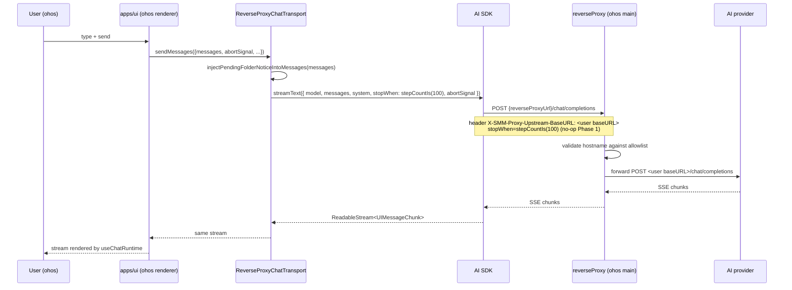
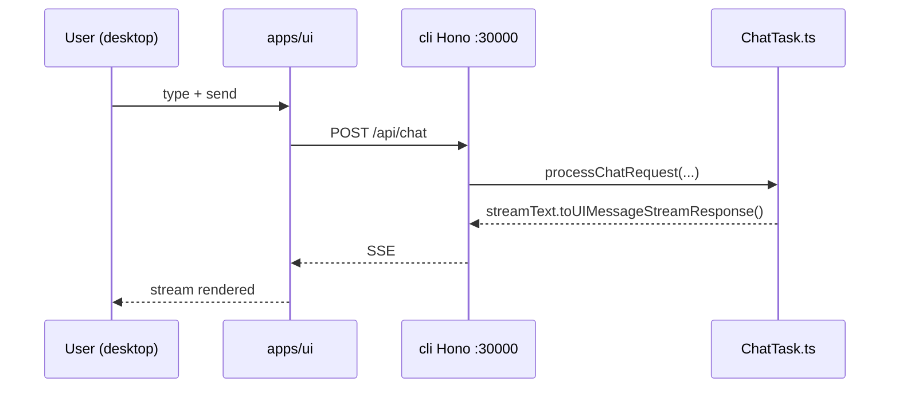

# Migrate AI Assistant to reverse proxy on HarmonyOS (Phase 1: chat-only)

[brief the change here.]

Add a HarmonyOS-only code path in `apps/ui/src/ai/Assistant.tsx`
that swaps the existing `AssistantChatTransport` (which talks to
`/api/chat` on the CLI Hono server) for a new in-process
`ReverseProxyChatTransport` that calls AI SDK's `streamText` directly
in the renderer, with the request routed through the existing
backend reverse proxy. **Tools are not migrated in this phase** —
the in-process transport sends `messages` and `system` only.

The desktop / Electron build is **unchanged** — it keeps using
`/api/chat` as today.

[Complete the checklist below]  
[ ] New UI component - check this if new UI component added
[ ] New user config - check this if new user config introduced
[ ] Electron only - check this if new feature only work in Electron env.
[ ] User document - check this if this change requires to add/update/delete user documents in `docs` folder

## 1. Background

The SMM AI Assistant (`apps/ui/src/ai/Assistant.tsx`) currently
posts to `POST /api/chat` (handled by
`apps/cli/src/route/ChatTask.ts`). That handler runs an
AI SDK `streamText` agent with 14 server-side tools, holds the
user's API key, and uses `toUIMessageStreamResponse()` to stream
back to the renderer.

For desktop (CLI + Electron) this works. For HarmonyOS it does not,
because the ohos Electron main process does not expose `/api/chat`
(grep for `handleChatRequest` in `apps/ohos/` returns zero matches),
and the CLI-internal toolchain (Bun.file, Socket.IO acknowledge,
in-memory `RenameTask` / `RecognizeTask` lifecycle) is not portable
to the ohos runtime.

`packages/core-routes/src/reverseProxy.ts` + `reverseProxyNode.ts`
already provide a universal AI reverse proxy. It is started on
`apps/cli` and `apps/ohos` alike, and the URL is exposed via
`HelloResponseBody.reverseProxyUrl`. The browser can call it
directly. `apps/ui/src/lib/summarizeVideo.ts` and the recently
migrated `apps/ui/src/api/checkAiConnection.ts` already use this
pattern.

The new `ReverseProxyChatTransport` is the same idea — except
where `checkAiConnection` makes a single ping, the assistant needs
a **streaming** `streamText` call with a system prompt and
multi-turn messages. AI SDK v6 exposes the right tool for that:
`streamText(...).toUIMessageStream()` returns a
`ReadableStream<UIMessageChunk>` that is byte-compatible with what
`useChatRuntime` / `AssistantChatTransport` already expect.

This is **Phase 1: chat-only**. Tools and the agent loop (the
14 server-side tools, `stepCountIs(100)`, the user-confirmation
`acknowledge` round-trip, the broadcast events) are explicitly
deferred. The in-process transport does **not** call any tools
and does **not** read the `frontendTools` registry from
`assistant-ui`. This is a deliberate scope cut to deliver a
working AI Assistant on ohos without dragging in the Bun /
Socket.IO dependencies that the server tools require.

A future phase (Phase 2) may add client-side tools to the
in-process transport by reusing the existing
`apps/ui/src/ai/tools/*` implementations (which already
run in the renderer) and routing them through the existing
core-routes file APIs (`/api/listFiles`, `/api/readFile`,
`/api/writeFile`). That is out of scope here.

## 2. Project Level Architecture

```
Before (desktop, Electron, ohos — same path):       After:

┌────────────────────────┐                            ┌────────────────────────┐
│ apps/ui                │                            │ apps/ui                │
│ Assistant.tsx          │                            │ Assistant.tsx          │
│  useChatRuntime        │                            │  useChatRuntime        │
│   AssistantChatTrans.. │                            │   transport:           │
│     api: "/api/chat"   │                            │    isHarmonyOS()       │
└──────────┬─────────────┘                            │      ? ReverseProxy-   │
           │                                          │          ChatTransport│
┌──────────▼─────────────┐                            │      : AssistantChat- │
│ apps/cli Hono          │                            │          Transport     │
│ POST /api/chat         │                            └──┬──────────────────┬──┘
│   createOpenAICompat + │                               │                  │
│   streamText + 14 tools│                       desktop/Elec            ohos
│   frontendTools(tools) │                       (no change)         (new path)
└──────────┬─────────────┘                               │                  │
           │                                             │ POST /api/chat  │ direct AI SDK
           │                                             │                 │ + reverse proxy
           │                                             ▼                 ▼
           │                              ┌──────────────────┐  ┌──────────────────────┐
           │                              │ apps/cli Hono    │  │ reverseProxyManager  │
           │                              │ (unchanged)      │  │ (30000-31000)        │
           │                              └──────────────────┘  └──────────┬───────────┘
           │                                                                │
           ▼                                                                ▼
   api.deepseek.com /                                       api.deepseek.com /
   api.openai.com / ...                                      api.openai.com / ...
```

No new packages, no new apps. The single `@smm/core-routes`
package already hosts the proxy implementation, and the UI package
already has `ai` + `@ai-sdk/openai-compatible`.

## 3. App Level Architecture

### apps/ui

```
components/ui/settings/AiSettings.tsx (no change — uses useConfig().userConfig)

  useConfig() ─► userConfig.aiProviders
              └► userConfig.selectedAIProvider
              └► appConfig.reverseProxyUrl

ai/Assistant.tsx (modified)
   │
   │ useMemo transport:
   │   if (isHarmonyOS()) → new ReverseProxyChatTransport({...})
   │   else               → new AssistantChatTransport({ api: "/api/chat", ... })
   │
   ▼
useChatRuntime({ transport })
   │
   ▼ (chat submit / regenerate)
   transport.sendMessages({messages, abortSignal, ...})
   │
   ├── desktop/Electron: POST /api/chat (unchanged)
   │
   └── ohos: in-process streamText
       │
       ▼
       createOpenAICompatible({
         baseURL: appConfig.reverseProxyUrl,
         apiKey: provider.apiKey,
         headers: { 'X-SMM-Proxy-Upstream-BaseURL': provider.baseURL }
       })
       streamText({
         model: provider.chatModel(provider.model),
         messages: convertToModelMessages(messages),
         system: prompts.system,
         stopWhen: stepCountIs(100),  // no-op Phase 1, ready for Phase 2 tools
         abortSignal,
       })
       .toUIMessageStream()  →  ReadableStream<UIMessageChunk>
```

- New file: `apps/ui/src/ai/transport/reverseProxyChatTransport.ts`.
  Exports a `ReverseProxyChatTransport` class that implements
  `ai`'s `ChatTransport<UIMessage>` interface (the same contract
  that `AssistantChatTransport` / `DefaultChatTransport`
  implement). `sendMessages` calls AI SDK `streamText` and returns
  `result.toUIMessageStream()`. `reconnectToStream` returns `null`
  (no persistent server-side stream to reconnect to — same as
  `DirectChatTransport`).
- `apps/ui/src/ai/Assistant.tsx` picks the transport based on
  `isHarmonyOS()` (existing helper from
  `apps/ui/src/lib/isHarmonyOS.ts`, which checks
  `navigator.appVersion.includes("OHOS" | "OpenHarmony")`).
- The folder-switch notice injection
  (`injectPendingFolderNoticeIntoMessages` from
  `apps/ui/src/ai/pendingFolderSwitch.ts`) currently lives in
  `AssistantChatTransport`'s `prepareSendMessagesRequest`. The new
  transport applies the same injection inside `sendMessages` for
  the `submit-message` trigger so the chat history seen by the LLM
  is identical between the two paths.
- `<ModelContext />` and `<GetFilesInMediaFolderTool />` keep
  rendering on both platforms. They are no-ops on the HarmonyOS
  path (the in-process transport imports `prompts.system` directly
  and does not call any tools), but they are cheap and removing
  them would only add risk to the desktop regression surface.

### apps/cli

- **No code changes.** `/api/chat` and `ChatTask.ts` stay
  untouched. The desktop regression surface is unaffected.

### apps/ohos

- **No code changes.** The reverse proxy is already started
  (`apps/ohos/src/http/server.ts:79-87`) and the URL is already
  exposed via `core-routes` `/api/hello`
  (`HelloResponseBody.reverseProxyUrl`).

### packages/core-routes

- **No changes.**

### packages/core

- **No changes.**

## 4. User Stories

### 4.1 HarmonyOS Electron user runs the AI Assistant

* **Given** the HarmonyOS Electron app is running, the user has
  configured an AI provider in Settings (model + baseURL + API
  key), and `HelloResponseBody.reverseProxyUrl` is non-null
* **When** the user opens the AI Assistant overlay, types a
  question, and hits send
* **Then** the renderer-side `ReverseProxyChatTransport.sendMessages`
  builds an OpenAI-compatible provider with
  `baseURL: reverseProxyUrl` and
  `X-SMM-Proxy-Upstream-BaseURL: <user baseURL>`, runs
  `streamText` in the renderer, and streams the response back
  through `useChatRuntime`. The model + API key come from
  `userConfig.aiProviders` (resolved by
  `userConfig.selectedAIProvider`).



### 4.2 Desktop / Electron AI Assistant keeps working unchanged

* **Given** the user is on the desktop (CLI behind Hono) or
  Electron build
* **When** the user opens the AI Assistant
* **Then** `isHarmonyOS()` returns false, the existing
  `AssistantChatTransport` is used, and the path to `/api/chat`
  is exactly as today. All 11 existing e2e tests
  (`apps/e2e/test/specs/ai/`) keep passing with zero changes.



### 4.3 Incomplete config shows a clear error (no white screen)

* **Given** the user is on HarmonyOS but the AI provider is not
  configured (`selectedAIProvider === ''` / provider missing
  `baseURL` / `model`) or the reverse proxy URL is null
* **When** the user opens the AI Assistant
* **Then** the in-process transport throws synchronously with a
  descriptive message ("AI provider 'X' is missing baseURL" or
  "Reverse proxy is not available. Please restart the backend.")
  and `useChatRuntime` surfaces the error to the AssistantModal.
  No network request is made.

### 4.4 Folder-switch notice still gets injected

* **Given** the user has selected a different media folder
  between submits
* **When** the user submits the next message
* **Then** the new in-process `sendMessages` applies
  `injectPendingFolderNoticeIntoMessages(messages)` exactly the
  way the current `prepareSendMessagesRequest` does, so the LLM
  sees the same `[Folder changed to: ...]` system-reminder.

## 5. Tasks

### 5.1 apps/ui — new transport

[x] **Task 1: Add `apps/ui/src/ai/transport/reverseProxyChatTransport.ts`**
  - Export a class `ReverseProxyChatTransport` that implements
    `ChatTransport<UIMessage>` from `ai`.
  - Constructor takes a frozen config:
    ```ts
    export interface ReverseProxyChatTransportConfig {
      model: string
      apiKey: string
      /** User-provided AI baseURL (e.g. "https://api.deepseek.com/v1"). */
      baseURL: string
      /** Backend reverse proxy URL (HelloResponseBody.reverseProxyUrl). */
      reverseProxyUrl: string
    }
    ```
  - Imports from `ai`: `streamText`, `convertToModelMessages`,
    `stepCountIs`, plus the `ChatTransport` / `UIMessage` /
    `UIMessageChunk` types.
  - Imports `prompts` from `../prompts` (uses `prompts.system`).
  - Imports `injectPendingFolderNoticeIntoMessages` from
    `../pendingFolderSwitch`.
  - `sendMessages({ messages, abortSignal, trigger })`:
    - Apply `injectPendingFolderNoticeIntoMessages(messages)` when
      `trigger === 'submit-message'` (mirror the current
      `prepareSendMessagesRequest` semantics).
    - Build provider with `createOpenAICompatible({ name: 'assistant',
      baseURL: config.reverseProxyUrl, apiKey: config.apiKey,
      headers: { 'X-SMM-Proxy-Upstream-BaseURL': config.baseURL } })`.
    - Call `streamText({ model: provider.chatModel(config.model),
      messages: convertToModelMessages(messages), system:
      prompts.system, stopWhen: stepCountIs(100), abortSignal })`.
      The `stopWhen: stepCountIs(100)` is a no-op in Phase 1
      (no tools → no agent loop) but is included now so the
      Phase 2 tool migration cannot accidentally omit it. AI SDK
      `streamText` defaults to `stepCountIs(1)` (see
      `ai@6.0.98/dist/index.d.ts:2794`); explicitly passing
      `stepCountIs(100)` is a single-line forward-compat shim
      that costs nothing today and prevents a future foot-gun.
    - Return `result.toUIMessageStream()` (NOT
      `.toUIMessageStreamResponse()` — that returns a `Response`,
      we want the stream).
  - `reconnectToStream()` returns `null` (no persistent server
    stream). Document this in a JSDoc.

[x] **Task 2: Wire up the transport in `Assistant.tsx`**
  - Read `isHarmonyOS()` at component mount (memoized `useMemo`).
  - In the existing `useMemo(() => new AssistantChatTransport(...))`,
    branch on `isHarmony`:
    - If `isHarmony`:
      - Resolve provider from
        `userConfig.aiProviders.find(p => p.name === userConfig.selectedAIProvider)`.
      - Validate `provider.baseURL`, `provider.model`,
        `appConfig.reverseProxyUrl` non-empty / non-null. If any
        is missing, throw a descriptive `Error` (the AssistantModal
        surfaces it).
      - Construct `new ReverseProxyChatTransport({ model, apiKey,
        baseURL, reverseProxyUrl })`.
    - Else: keep the existing `new AssistantChatTransport({ api:
      "/api/chat", body: { clientId: getOrCreateClientId() },
      prepareSendMessagesRequest: ... })`.
  - Memo deps: `[isHarmony, userConfig.aiProviders,
    userConfig.selectedAIProvider, appConfig.reverseProxyUrl]`.
    `isHarmony` is itself memoized from `isHarmonyOS()` so it
    does not change between renders; the other three only change
    when user saves config or `/api/hello` resolves.
  - `useConfig()` already returns `appConfig` and `userConfig` —
    the existing `useConfig` destructure just needs the extra
    `appConfig` field (it is already exposed, see
    `apps/ui/src/hooks/userConfig/useConfig.ts:42-48`).
  - Keep `<ModelContext />`, `<SelectedFolderSwitchNotifier />`,
    `<GetFilesInMediaFolderTool />` rendered unchanged. They are
    harmless on the in-process path (no-op) and removing them
    would only risk the desktop regression.

### 5.2 No-op

- `apps/cli` — no changes.
- `apps/ohos/src/http/server.ts` — no changes. The reverse proxy
  is already started; the URL is already exposed via
  `core-routes` `/api/hello`.
- `packages/core-routes` — no changes.
- `packages/core` — no changes.
- `apps/ui/src/lib/isHarmonyOS.ts` — no changes (reuse existing
  helper).
- `apps/ui/src/ai/prompts.ts` — no changes (transport imports
  `prompts.system`).
- `apps/ui/src/ai/pendingFolderSwitch.ts` — no changes (transport
  imports `injectPendingFolderNoticeIntoMessages`).

### 5.3 Tests

- No new unit tests (per user decision). The transport is a thin
  wrapper around AI SDK `streamText` which is itself heavily
  tested; the wiring logic is exercised by manual smoke and the
  existing 11 e2e tests (which all run on desktop and continue to
  hit `/api/chat` unchanged).
- Existing e2e tests under `apps/e2e/test/specs/ai/` must still
  pass without modification (they run on desktop, never on
  HarmonyOS).

## 6. Backward Compatibility

- **Desktop / Electron**: zero behavioral change. The `useMemo`
  branch for `isHarmonyOS() === false` produces the same
  `AssistantChatTransport` with the same options.
- **HarmonyOS**: the existing `ModelContext` and tool components
  keep rendering but become no-ops (the in-process transport
  reads `prompts.system` directly and does not call any tools).
  The AssistantModal already handles transport errors via
  `useChatRuntime.onFinish({ isError })` — no UI plumbing
  changes.
- **`HelloResponseBody.reverseProxyUrl === null` edge case**:
  the transport throws synchronously. The AssistantModal surfaces
  the error. Same pattern as
  `apps/ui/src/api/checkAiConnection.ts:38-40`.
- **Incomplete AI provider config on HarmonyOS**: the transport
  throws with a clear message naming the missing field. No
  network call is made.
- **No public API surface change**: `/api/chat` is unchanged.
  `appConfig.reverseProxyUrl` already exists in `AppConfig`.
  `userConfig.aiProviders` / `selectedAIProvider` already exist in
  `UserConfig`. No new types exported from `@smm/core`.

## 7. Documents

- [ ] `.agents/docs/design/migrate-ai-check-to-reverse-proxy.md` —
  no change.
- [ ] `docs/api/index.md` — no change (no new endpoint).
- [ ] `.agents/docs/design/architecture.md` — no change (the
  `apps/ui → /api/chat` flow is unchanged for desktop).

## 8. Post Verification

- [x] `pnpm --filter ui typecheck` — clean.
- [x] `pnpm --filter ui test` — 1307 passed, 23 skipped (no
  regressions, no new tests added per user decision).
- [x] `pnpm --filter ui build` — succeeded. Bundle size delta:
  2,118.17 kB → 2,156.98 kB (+38.81 kB / +1.8%), accounted for by
  the new transport + minor extra `ai` SDK surface paths.
- [ ] **Manual smoke (desktop)**: `pnpm dev`, open the AI
  Assistant, send "hello" → response streams in. With invalid
  `selectedAIProvider` config, error shown in modal. With
  `pnpm dev:cli` stopped, `/api/hello` returns
  `reverseProxyUrl: null`; assistant still works (CLI handles
  `/api/chat` directly, not via reverse proxy).
- [ ] **Manual smoke (ohos)**: build the HarmonyOS Electron app,
  configure an AI provider, open the AI Assistant, send a
  question → response streams. With a wrong API key → AI SDK
  error surfaces in modal. With `reverseProxyUrl === null` →
  Assistant shows clear error message from
  `ReverseProxyChatTransport`.
- [ ] **Regression check**: `pnpm --filter e2e ... --spec
  ./test/specs/ai/*.e2e.ts` — all 11 e2e tests pass
  unchanged.
