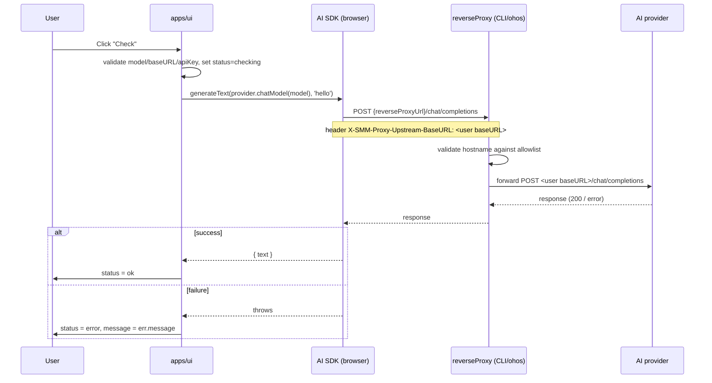
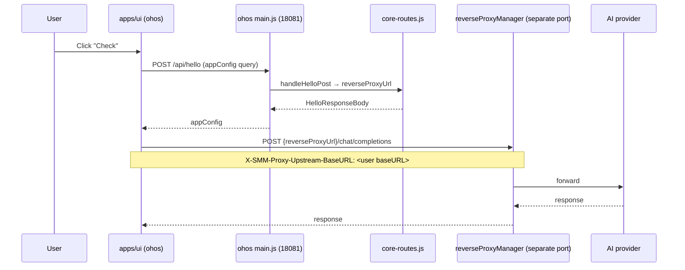

# Migrate AI check to UI-side reverse proxy

[brief the change here.]

Remove the server-side `POST /api/ai/check` endpoint and its Hono
handler, and refactor the **"Check"** button in `AiSettings.tsx` to
verify AI connectivity **from the browser**, by pointing an
OpenAI-compatible provider at the existing CLI/ohos reverse proxy (the
same mechanism `summarizeVideo.ts` already uses).

[Complete the checklist below]  
[ ] New UI component - check this if new UI component added
[ ] New user config - check this if new user config introduced
[ ] Electron only - check this if new feature only work in Electron env.
[ ] User document - check this if this change requires to add/update/delete user documents in `docs` folder

## 1. Background

Today `AiSettings.tsx` "Check" button calls
`POST /api/ai/check` (`apps/cli/src/route/AICheck.ts`) which
runs `createOpenAICompatible` + `generateText` on the **server**,
using the user's `model` / `apiKey` / `baseURL` posted from the UI.
The server has to keep the AI SDK as a runtime dependency just for
this one ping endpoint, and the API key has to round-trip through the
Hono body.

Meanwhile, both `apps/cli` and `apps/ohos` already run a **universal
reverse proxy** (`packages/core-routes/src/reverseProxy.ts` +
`reverseProxyNode.ts`) on a free port in `30000-31000` (CLI) /
shared main-process port (ohos). The reverse proxy URL is exposed via
`HelloResponseBody.reverseProxyUrl`, and the existing
`apps/ui/src/lib/summarizeVideo.ts` already uses it to make AI
requests directly from the browser via the
`X-SMM-Proxy-Upstream-BaseURL` header.

The "Check" button is the only remaining AI endpoint that requires
server-side code. By moving it to the same UI-side reverse-proxy
mechanism, we:

- Drop the `ai` and `@ai-sdk/openai-compatible` server-side runtime
  dep usage in `apps/cli` (still a devDep for the chat
  orchestrator, but no longer on the request hot path for a UI ping).
- Remove the API key round-trip through Hono.
- Make the AI check work uniformly on desktop (CLI behind Hono),
  Electron (CLI behind Electron Main), and HarmonyOS (ohos Electron
  main), because all three expose the same reverse proxy URL via
  `/api/hello`.
- Confirms the reverse proxy's UI-direct AI use is the canonical
  pattern going forward (mirrors `summarizeVideo`).

The reverse proxy itself is **unchanged**. This refactor only removes
the server-side ping endpoint and rewires the UI button.

## 2. Project Level Architecture

```
Before:                                  After:

┌────────────────────────┐               ┌────────────────────────┐
│ apps/ui                │               │ apps/ui                │
│                        │               │                        │
│ AiSettings ─►          │               │ AiSettings ─►          │
│ checkAiConnection      │               │ checkAiConnection      │
│   │                    │               │   (new)                │
│   ▼ fetch              │               │   │                    │
│  /api/ai/check         │               │   ▼ createOpenAI-     │
└──────────┬─────────────┘               │     Compatible         │
           │                             │     (baseURL=proxy)   │
           │                             └──────────┬─────────────┘
┌──────────▼─────────────┐                          │ X-SMM-Proxy-
│ apps/cli Hono          │                          │   Upstream-BaseURL
│ handleAICheck          │               ┌──────────▼─────────────┐
│   createOpenAICompat + │               │ reverseProxyManager   │
│   generateText         │               │ (CLI 30000-31000,     │
└──────────┬─────────────┘               │  ohos shared port)    │
           │                             └──────────┬─────────────┘
           ▼                                        ▼
   api.deepseek.com /                      api.deepseek.com /
   api.openai.com / ...                     api.openai.com / ...
```

No new packages, no new apps. The single `@smm/core-routes` package
already hosts the proxy implementation, and the UI package already
has `ai` + `@ai-sdk/openai-compatible` (used by `summarizeVideo`).

## 3. App Level Architecture

### apps/ui

```
components/ui/settings/AiSettings.tsx
        │
        ▼
api/checkAiConnection.ts (rewritten)
        │ uses @ai-sdk/openai-compatible + ai
        │   createOpenAICompatible({
        │     baseURL: reverseProxyUrl,
        │     apiKey,
        │     headers: { 'X-SMM-Proxy-Upstream-BaseURL': baseURL }
        │   })
        │   generateText({ model, prompt: 'hello' })
        │
        ▼
proxy-manager @ 127.0.0.1:<proxyPort>
        │
        ▼
real AI provider (api.deepseek.com, etc.)
```

- `appConfig.reverseProxyUrl` is already exposed via
  `useConfig()` (sourced from `HelloResponseBody.reverseProxyUrl`).
  No new app config.
- The new `checkAiConnection` is a single-arg function
  `(input: CheckAiConnectionInput)` mirroring the
  `OpenAICompatibleConfig` shape plus `reverseProxyUrl`. It throws
  on any error (network, auth, validation); the UI catches and
  surfaces the error message.
- `apps/ui/src/api/checkAiConnection.ts` is the **only** client of
  `ai` / `@ai-sdk/openai-compatible` outside `summarizeVideo` and
  the existing AI SDK / Assistant UI.

### apps/cli

- Delete `apps/cli/src/route/AICheck.ts` entirely.
- Remove `import { handleAICheck } from './src/route/AICheck';` and
  `handleAICheck(this.app);` from `apps/cli/server.ts`.
- The CLI's `ai` and `@ai-sdk/openai-compatible` deps stay —
  they are still required by `tasks/ChatTask.ts`
  (`streamText` + `createOpenAICompatible` for the AI Assistant).
  The Hono route registration list in `server.ts` shrinks by one
  entry.

### apps/ohos

- **No code changes.** The reverse proxy is already started in
  `apps/ohos/src/http/server.ts` (lines 79-87) and its URL is
  exposed via `core-routes` `/api/hello` (consumed by
  `buildHelloConfig`). The `X-SMM-Proxy-Upstream-BaseURL` header is
  already handled by the bundled `core-routes.js`. AI ping works
  the same way as the existing `summarizeVideo` will (once that
  feature is enabled on ohos).

### packages/core-routes

- **No changes.** The reverse proxy implementation is unchanged.

## 4. User Stories

### 4.1 Desktop Electron UI "Check" still verifies AI connectivity

* **Given** the desktop app is running (CLI port 30000) and the
  user opens Settings → AI and presses "Check"
* **When** the request reaches the UI handler
* **Then** the UI creates an OpenAI-compatible provider with
  `baseURL: appConfig.reverseProxyUrl` and
  `X-SMM-Proxy-Upstream-BaseURL: <user baseURL>`, calls
  `generateText({ model, prompt: 'hello' })`, and on success sets
  the per-card status to `ok`. On error the catch block surfaces
  the error message and sets `error`.



### 4.2 HarmonyOS UI "Check" works through the same path

* **Given** the HarmonyOS Electron app is running and the user
  opens Settings → AI and presses "Check"
* **When** the request reaches the UI handler
* **Then** the UI uses the same `appConfig.reverseProxyUrl` (this
  time sourced from ohos Electron Main's bundled `core-routes.js`
  `/api/hello`). The bundled reverse proxy forwards to the
  upstream AI provider through the same `X-SMM-Proxy-Upstream-BaseURL`
  header path. The success / error UI flow is identical to desktop.



### 4.3 `POST /api/ai/check` is gone (breaking change)

* **Given** a future caller that still POSTs to
  `POST /api/ai/check` (no in-tree consumer — see
  `pnpm grep "/api/ai/check"`)
* **When** the request reaches the CLI Hono
* **Then** the route is no longer registered. The fallback
  `app.notFound` handler returns 404 with the standard
  `{ error: "Not Found" }` JSON.

## 5. Tasks

### 5.1 apps/ui — rewrite `checkAiConnection` to use reverse proxy

[x] **Task 1: Replace `apps/ui/src/api/checkAiConnection.ts`**
  - Drop `fetch('/api/ai/check', ...)` entirely.
  - Export a new function
    `checkAiConnection(input: CheckAiConnectionInput): Promise<{ status: 'ok'; model: string }>`.
  - Input shape (mirrors `OpenAICompatibleConfig` + extra):
    ```ts
    export interface CheckAiConnectionInput {
      model: string
      apiKey: string
      baseURL: string
      reverseProxyUrl: string | null
    }
    ```
  - Implementation:
    - Validate `model`, `apiKey`, `baseURL` non-empty (throw with
      descriptive message on failure).
    - Throw if `reverseProxyUrl === null` with message
      `"Reverse proxy is not available. Please restart the backend."`.
    - Build provider:
      ```ts
      const provider = createOpenAICompatible({
        name: 'ai-check',
        baseURL: reverseProxyUrl,
        apiKey,
        headers: {
          'X-SMM-Proxy-Upstream-BaseURL': baseURL,
        },
      })
      ```
    - Call
      `await generateText({ model: provider.chatModel(model), prompt: 'hello' })`.
    - Return `{ status: 'ok', model }` on success.
  - All errors (validation, network, AI SDK errors) bubble up via
    `throw`; the caller in `AiSettings.tsx` catches and surfaces
    `err.message`.

[x] **Task 2: Update `apps/ui/src/components/ui/settings/AiSettings.tsx`**
  - Replace import:
    `import { checkAiConnection } from "@/api/checkAiConnection"`
    with the new function name and input type.
  - In `handleCheck(index)`, fetch `reverseProxyUrl` from
    `appConfig.reverseProxyUrl` (already returned by
    `useConfig()`).
  - Replace the call site:
    ```ts
    const result = await checkAiConnection({
      model: model!,
      apiKey: apiKey || '',
      baseURL,
      reverseProxyUrl: appConfig.reverseProxyUrl,
    })
    setCheckStates(prev => ({
      ...prev,
      [index]: { status: 'ok', message: '' },
    }))
    ```
  - The error branch already catches `Error` and stores
    `err.message` in the `message` field, so no UI changes are
    needed there.

### 5.2 apps/cli — drop the Hono endpoint

[x] **Task 3: Delete `apps/cli/src/route/AICheck.ts`**
  - Remove the file entirely. No replacements.

[x] **Task 4: Remove from `apps/cli/server.ts`**
  - Delete
    `import { handleAICheck } from './src/route/AICheck';`.
  - Delete the `handleAICheck(this.app);` line in `setupRoutes()`.

### 5.3 Unit tests

[x] **Task 5: Add `apps/ui/src/api/checkAiConnection.test.ts`**
  - Use `vi.mock('ai', ...)` and
    `vi.mock('@ai-sdk/openai-compatible', ...)` to stub the
    provider / `generateText` (the same pattern used in
    `apps/ui/src/api/tmdb.test.ts` for `fetch`).
  - Cases:
    - **happy path**: returns `{ status: 'ok', model }` when
      `generateText` resolves.
    - **throws when `reverseProxyUrl === null`**.
    - **throws when `baseURL` empty / `apiKey` empty / `model`
      empty** with field-specific message.
    - **propagates `generateText` errors** as-is (the UI will
      catch and surface them).
  - Verify that the provider config is built with the right
    `baseURL` (the proxy URL), `apiKey`, and the
    `X-SMM-Proxy-Upstream-BaseURL` header set to the user-provided
    `baseURL`.

### 5.4 No-op

- `apps/ohos/src/http/server.ts` — unchanged. The reverse proxy is
  already started; the URL is already exposed via
  `core-routes` `/api/hello`.
- `packages/core-routes` — unchanged.
- `apps/ui/src/lib/summarizeVideo.ts` — unchanged. It is the model
  implementation we are mirroring.
- `apps/cli/lib/ai-provider.ts` — unchanged. The CLI still uses
  `createOpenAICompatible` for `ChatTask.ts` and elsewhere.
- `docs/api/index.md` — no entry to remove (the original
  `/api/ai/check` was never documented).
- e2e tests — no entry to update (no e2e spec covers
  `/api/ai/check`).

## 6. Backward Compatibility

- **`POST /api/ai/check` is removed** (no in-tree callers, per
  `pnpm grep "/api/ai/check"`). External callers (if any) will
  receive a 404 with the existing
  `app.notFound` `{ error: "Not Found" }` JSON body. Documented as
  breaking in the design doc; no deprecation period.
- The `apps/cli/package.json` keeps `ai` and
  `@ai-sdk/openai-compatible` as dependencies because
  `tasks/ChatTask.ts` still uses them. No manifest churn from this
  refactor.
- The `appConfig.reverseProxyUrl === null` edge case is new for the
  "Check" button. The UI surfaces a clear error message instead of
  silently failing; same pattern as `summarizeVideo.ts` already
  uses.

## 7. Documents

- [ ] `.agents/docs/design/core-routes.md` — no change (the route
  table does not list `/api/ai/check`; the proxy entry already
  documents the AI upstream forwarding behavior).
- [ ] `.agents/docs/design/split-hello-from-execute-api.md` — no
  change.
- [ ] `.agents/docs/design/summarize-video.md` — no change
  (this refactor mirrors that feature; no new behavior).

## 8. Post Verification

- [x] `pnpm --filter ui test` — 1307 passed, 23 skipped;
  `checkAiConnection.test.ts` adds 12 new cases (all pass).
- [x] `pnpm --filter cli test` — 256 passed, 13 skipped;
  no test referenced `handleAICheck` (confirmed via grep).
- [x] `pnpm --filter ui typecheck` — clean.
- [x] `pnpm --filter cli typecheck` — 7 pre-existing errors
  unrelated to this change (`VideoCaptioner.ts`, `HelloTask.ts`,
  `nodeHttpFetch.ts`, `reverseProxy.ts` — all present on
  `origin/main` before this refactor).
- [x] `pnpm --filter @smm/core-routes typecheck` — 2 pre-existing
  errors unrelated to this change (same files as above).
- [x] `pnpm --filter ui build` — succeeds.
- [x] `grep -rn "handleAICheck\|/api/ai/check\|AICheck" apps/ packages/`
  — zero matches in source tree.
- [ ] Manual smoke (desktop): `pnpm dev`, open Settings → AI,
  press "Check" with a real DeepSeek/OpenAI key + model → status
  flips to `ok`. With an invalid key, status flips to `error` and
  the AI SDK error message is shown.
- [ ] Manual smoke (cli only): `pnpm dev:cli`,
  `curl -X POST http://localhost:30000/api/ai/check -d
  '{"model":"x","apiKey":"y","baseURL":"z"}' -H 'Content-Type:
  application/json'` → 404 with `{ "error": "Not Found" }`.
- [ ] Manual smoke (ohos): launch the HarmonyOS Electron build,
  open Settings → AI, press "Check" with a valid provider →
  status flips to `ok` (proves the bundled `core-routes.js` proxy
  on the ohos main process is reachable from the renderer).
