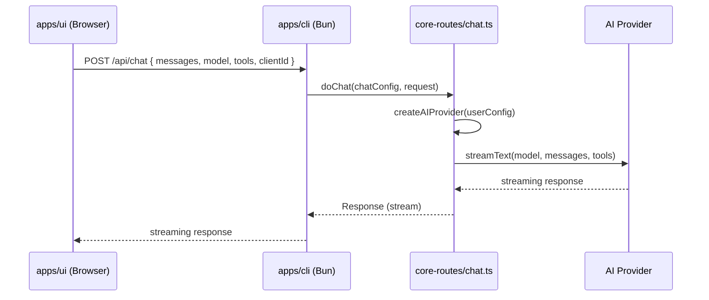
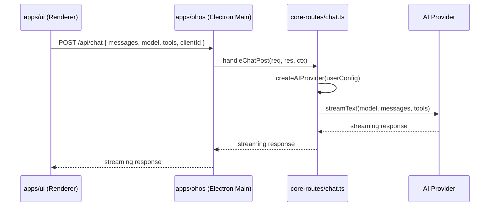

# Migrate /api/chat to core-routes

将 `/api/chat` 从 `apps/cli/tasks/ChatTask.ts` 迁移到 `packages/core-routes`，使 `apps/cli`、`apps/ohos` 都能复用该 API。

[x] New HTTP interface — `/api/chat` handler 移入 core-routes

## 1. Background

当前 `/api/chat` 仅存在于 `apps/cli/tasks/ChatTask.ts`，使用 Hono 注册路由。HarmonyOS（`apps/ohos`）目前通过 `ReverseProxyChatTransport` 在浏览器端运行 `streamText`（不依赖 `/api/chat`）。但服务端 AI 模式（LLM + 工具在 Electron Main Process 中运行）需要 `/api/chat` 端点，且代码应共享以避免双份维护。

### 当前状态

| 运行时 | AI 聊天方式 | 工具执行位置 |
|--------|------------|------------|
| 桌面 (Electron + CLI) | `POST /api/chat` → `ChatTask.ts` (Bun) | CLI 进程 (Bun) |
| HarmonyOS | `ReverseProxyChatTransport` (in-browser `streamText`) | 浏览器 (Renderer) |
| Docker / Browser | `POST /api/chat` → `ChatTask.ts` (Bun) | CLI 进程 (Bun) |

### 目标状态

| 运行时 | AI 聊天方式 | 工具执行位置 |
|--------|------------|------------|
| 桌面 (Electron + CLI) | `POST /api/chat` → `core-routes` (Hono shell 保留) | CLI 进程 (Bun) |
| HarmonyOS | 可选: `POST /api/chat` → `core-routes` (Node) | Electron Main 进程 (Node) |
| Docker / Browser | `POST /api/chat` → `core-routes` (Hono shell 保留) | CLI 进程 (Bun) |

## 2. Project Level Architecture

**变化**: `packages/core-routes` 新增 chat 模块，包含:
- `src/chat.ts` — `doChat` 核心逻辑 + `createChatHandler` node:http handler
- `src/chatTypes.ts` — ChatConfig 类型定义
- `src/tools/` — 将 `apps/cli/src/tools/` 中 13 个 agent tools 迁移到此，用注入依赖替代直接 import

`CoreRoutesConfig` 新增可选字段 `chat?: ChatConfig`。当 `chat` 存在时，`coreRouteHandlers` 中包含 `handleChatPost`。

```
packages/core-routes/src/
├── chat.ts                        # doChat + handleChatPost (NEW)
├── chatTypes.ts                   # ChatConfig, ChatToolsConfig (NEW)
├── tools/                         # (NEW) Agent tools from apps/cli/src/tools/
│   ├── index.ts
│   ├── getApplicationContext.ts
│   ├── isFolderExist.ts
│   ├── getMediaFolders.ts
│   ├── getMediaMetadata.ts
│   ├── getEpisodes.ts
│   ├── listFilesInMediaFolder.ts
│   ├── renameFolder.ts
│   ├── renameFilesTask.ts
│   └── recognizeMediaFilesTask.ts
└── register.ts                    # 新增 handleChatPost 到 coreRouteHandlers
```

**新增依赖**: `packages/core-routes/package.json` 增加:
- `ai` — `streamText`, `convertToModelMessages`, `stepCountIs`
- `@ai-sdk/openai-compatible` — `createOpenAICompatible`
- `@assistant-ui/react-ai-sdk` — `frontendTools`
- `@smm/core` (已有) — `@core/ai-tool/*`, `@core/types/ai-tools/*`, `@core/plan/*`

## 3. App Level Architecture

### 3.1 apps/cli

`apps/cli/server.ts` 的 `setupRoutes()` 中从:
```ts
import { handleChatRequest } from './tasks/ChatTask';
handleChatRequest(this.app);
```
改为:
```ts
import { doChat } from '@smm/core-routes';
// Hono shell:
this.app.post('/api/chat', async (c) => {
  const response = await doChat(chatConfig, c.req.raw);
  return response;
});
```

`apps/cli` 构造 `ChatConfig`，注入其实际依赖:
- `createAIProvider` (来自 `lib/ai-provider.ts`)
- `getUserConfig` (来自 `src/utils/config.ts`)
- `acknowledge` / `broadcast` (来自 `src/utils/socketIO.ts`)
- `appDataDir` (来自 `CoreRoutesConfig`)

`apps/cli/src/tools/` 中的 agent tool 实现迁移到 `core-routes` 后，`apps/cli/src/tools/index.ts` 中的 `agentTools` 导出可以简化或删除。

**向后兼容**: 旧的 `ChatTask.ts` / `handleChatRequest` 保留但标记 `@deprecated`，确保现有测试和导入不立即断裂。后续清理。

### 3.2 apps/ohos

`apps/ohos/src/http/server.ts` 中 `coreRoutesConfig` 新增 `chat` 字段，注入 OHOS 环境的依赖:
- `createAIProvider`: 从 `userConfig` 创建 AI provider（同 `apps/cli` 逻辑，但运行在 Electron Main / Node）
- `getUserConfig`: 读取 OHOS 的 `smm.json`
- `acknowledge` / `broadcast`: 通过 `socketManager`
- `appDataDir`: 通过 `app.getPath('userData')`

当 `chat` 配置存在时，`coreRouteHandlers` 自动包含 `/api/chat` handler。

### 3.3 apps/ui (不变)

UI 层无需修改。`AssistantChatTransport` 仍然 `POST /api/chat`，无论后端是 Bun 还是 OHOS Electron Main。

## 4. User Stories

### 4.1 Desktop 用户发送 AI 聊天消息

* **Given** - 用户在桌面端打开 AI Assistant
* **When** - 用户发送消息 "重命名 G:\TV\Westworld 中的所有文件"
* **Then** - UI 通过 `AssistantChatTransport` 发送 `POST /api/chat` → `apps/cli` Hono shell → `doChat()` (core-routes) → `streamText` 调用 LLM → 工具执行 → 流式返回结果



### 4.2 HarmonyOS 用户通过服务端模式发送 AI 消息

* **Given** - HarmonyOS Electron Main Process 中配置了 `/api/chat` 路由
* **When** - UI 发送 `POST /api/chat`
* **Then** - Electron Main 的 `core-routes` handler 处理请求，工具在 Main Process 中执行（通过 Socket.IO 与 Renderer 通信）



## 5. Tasks

### 5.1 core-routes: 基础设施

[x] Task 1: 在 `packages/core-routes/package.json` 添加依赖 (`ai`, `@ai-sdk/openai-compatible`, `@assistant-ui/react-ai-sdk`)
[x] Task 2: 创建 `packages/core-routes/src/chatTypes.ts` — 定义 `ChatConfig`、`ChatToolsConfig` 接口
[x] Task 3: 创建 `packages/core-routes/src/chat.ts` — 实现 `doChat(config, request): Promise<Response>`
[x] Task 4: 创建 `handleChatPost` node:http handler
[x] Task 5: 扩展 `CoreRoutesConfig` 添加 `chat?: ChatConfig` 字段
[x] Task 6: 在 `register.ts` 中注册 `handleChatPost` 到 `coreRouteHandlers`

### 5.2 core-routes: 工具迁移

[x] Task 7: 创建 `packages/core-routes/src/tools/index.ts` — 统一导出所有 agent tools
[x] Task 8: 迁移 `getApplicationContext` — 需要 `acknowledge` + `getUserConfig`
[x] Task 9: 迁移 `isFolderExist` — 需要 `resolveFolderExistence` (已有)
[x] Task 10: 迁移 `getMediaFolders` — 需要 `getUserConfig`
[x] Task 11: 迁移 `listFilesInMediaFolder` — 需要 `getUserConfig` + `doListFiles`
[x] Task 12: 迁移 `getMediaMetadata` — 需要 metadata cache
[x] Task 13: 迁移 `getEpisodes` — 需要 metadata cache + `doGetEpisodes`
[x] Task 14: 迁移 `renameFolder` — 需要 `acknowledge` + `doRenameFolder`
[x] Task 15: 迁移 `renameFilesTask` (begin/add/end) — 需要 plan storage + metadata cache
[x] Task 16: 迁移 `recognizeMediaFilesTask` (begin/add/end) — 需要 plan storage + metadata cache

### 5.3 apps/cli: 适配

[x] Task 17: 在 `apps/cli/server.ts` 中构造 `ChatConfig`，改用 `doChat` 替换 `handleChatRequest`
[x] Task 18: 删除 `tasks/ChatTask.ts` (新代码在 `@smm/core-routes`)
[x] Task 19: 添加 `apps/cli/src/route/chatRoute.ts` 作为 Hono shell
[x] Task 20: 更新 `apps/cli/src/test/ai-tool-registry.test.ts` 指向新的 source of truth

### 5.4 apps/ohos: 适配

[x] Task 21: 在 `apps/ohos/src/http/server.ts` 中构造 `ChatConfig`，注入 OHOS 环境依赖
[x] Task 22: 更新 `apps/ohos/src/core-routes-loader.ts` 中的类型定义

### 5.5 测试

[x] Task 23: 为 `doChat` 编写单元测试（mock AI provider）
[x] Task 24: 运行 `pnpm test` 确保现有测试通过
[x] Task 25: 运行 `pnpm typecheck` 确保类型检查通过
[x] Task 26: 运行 `pnpm build` 确保构建成功

## 6. Backward Compatibility

- `apps/cli` 旧的 `POST /api/chat` 行为不变 — 仅实现从 `ChatTask.ts` 迁移到 `core-routes`
- `tasks/ChatTask.ts` 文件保留，`handleChatRequest` 标记 `@deprecated`，内部实现改为调用 `doChat`
- `apps/cli/src/tools/` 中的 agent tool 文件保留（标记 deprecated），最终由 `core-routes/src/tools/` 替代
- 前端 `AssistantChatTransport` 无需修改
- OHOS 的 `ReverseProxyChatTransport` 不受影响（独立路径）

## 7. Documents

[ ] `docs/api/index.md` — 更新 `/api/chat` 描述（如存在）
[x] `.agents/docs/design/ai-assistant.md` — 更新 transport、Plan 存储、task tools 单路径执行、core-routes 路径

## 8. Post Verification

[ ] Unit tests — `pnpm run test` 全部通过
[ ] Build — `pnpm run build` 构建成功
[ ] Typecheck — `pnpm run typecheck` 类型检查通过
