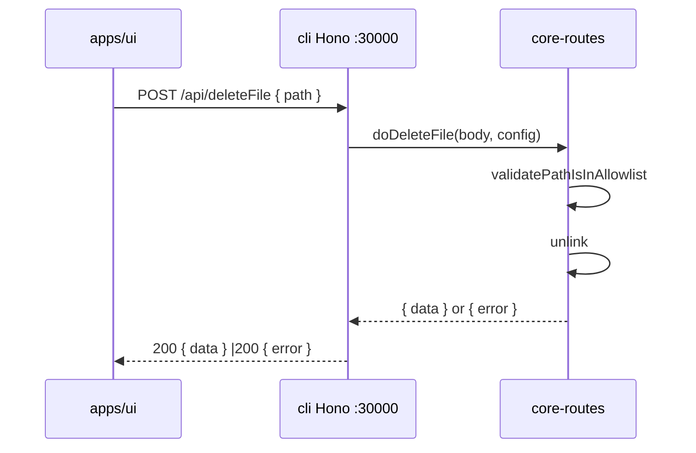
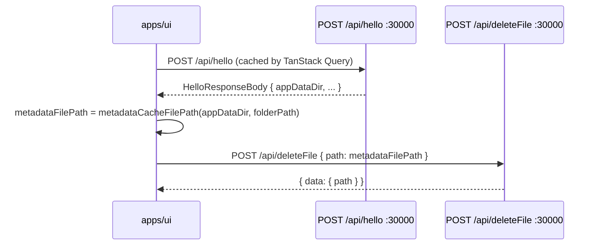

# Migrate `deleteFile` API to `packages/core-routes` (and deprecate `/api/deleteMediaMetadata`)

[brief the change here.]

Migrate `POST /api/deleteFile` from `apps/cli` to `packages/core-routes`
following the **ReadFile/WriteFile pattern**: framework-agnostic pure
function (`doDeleteFile`) + Node `http` route handler
(`handleDeleteFile`), with a thin Hono shell retained in `apps/cli` so
the UI's existing `/api/deleteFile` fetch keeps working unchanged. The
restrictive `isManagedYtdlpCookiesPath` predicate is replaced by the
existing allowlist-based validation (`validatePathIsInAllowlist`) so
the same API can also delete media metadata cache files (which live
under `{appDataDir}/metadata/`).

In parallel, **deprecate `/api/deleteMediaMetadata`**: the UI's
`deleteMediaMetadata()` helper is updated to compute the metadata cache
file path itself (using `HelloResponseBody.appDataDir` + the existing
`metadataCacheFilePath` helper from `readMediaMetadataV2.ts`) and call
the now-generic `deleteFile()` API. The Hono route at
`apps/cli/src/route/mediaMetadata/delete.ts` is deleted.

The `appDataDir` is also added to `CoreRoutesConfig` (mirroring the
existing `hello` field). It is informational in this iteration — the
allowlist already covers `appDataDir` via `buildAllowlist` — but the
field is available for future APIs that need explicit `appDataDir`
access (e.g. a route that needs to enumerate or inspect media metadata
files).

[] New UI component
[] New user config
[] Electron only
[x] User document - update `docs/api/index.md` DeleteFile entry and
       add a deprecation note for `/api/deleteMediaMetadata`.

## 1. Background

`POST /api/deleteFile` currently lives as a Hono route in
`apps/cli/src/route/DeleteFile.ts`. It validates the path with the
restrictive `isManagedYtdlpCookiesPath` predicate (only allows
`{userDataDir}/temp/ytdlp-cookies-*.txt`) and uses `cli/src/utils/files`'s
`permanentlyDeleteFile` helper to `unlink` the file. The UI consumes it
from `apps/ui/src/api/deleteFile.ts` (used by
`apps/ui/src/lib/ytdlpCookiesFile.ts` for yt-dlp cookie cleanup).

A separate, sibling API — `POST /api/deleteMediaMetadata` in
`apps/cli/src/route/mediaMetadata/delete.ts` — does the same operation
(permanently `unlink` a single file) but for media metadata cache files
(`{appDataDir}/metadata/{sanitized-folderName}.json`). The UI consumes
it from `apps/ui/src/api/deleteMediaMetadata.ts`, which is invoked via
`MediaMetadataRepository.delete` (used by the sidebar's "remove folder"
flow).

This is the same profile as `WriteFile.ts` and `ReadFile.ts` — both
have already been moved to `packages/core-routes` following the
"pure function + Node `http` handler + thin Hono shell" pattern. The
deleteFile route was left behind because:

1. It uses `cli/src/utils/files.permanentlyDeleteFile` (a cli-internal
 helper).
2. Its path validation (`isManagedYtdlpCookiesPath`) is cli-internal
 (`packages/core/whitelistedCmd/ytdlpCookies.ts` — the package is
 framework-agnostic but the function isn't a perfect fit for the
 core-routes' allowlist model).
3. The MCP `writeMediaMetadata` tool (`apps/cli/src/mcp/tools/writeMediaMetadataTool.ts`)
 calls `metadataCacheFilePath` (defined in `apps/cli/src/route/mediaMetadata/utils.ts`)
 which still depends on `getAppDataDir()` — that helper stays in
 cli/utils (it's not a route, just a path utility).

Meanwhile, the existing `/api/deleteMediaMetadata` route is a thin
wrapper around the same `unlink` operation. Folding it into
`/api/deleteFile` keeps the backend surface small (one unified
"delete a managed file" API instead of two near-duplicates) and lets
the UI compute the cache file path the same way it already does for
the V2 `read`/`write` flow (`hello()` → `appDataDir` → `metadataCacheFilePath`).

This change completes the picture for the small filesystem-mutating
routes:

- `apps/cli` no longer hosts the deletion logic; both APIs go through
 the same `doDeleteFile` in `@smm/core-routes`.
- `apps/ohos` automatically gains a working `POST /api/deleteFile` (it
 already registers `coreRouteHandlers` on port 18081). The media
 metadata cache deletion also works on ohos.
- The UI calls the unified `deleteFile()` API for both yt-dlp cookies
 cleanup and media metadata removal.

## 2. Project Level Architecture

`none` (refactor within the existing `cli ↔ core-routes ↔ core`
layering).

## 3. App Level Architecture

```
Before (current):                           After:

┌──────────────────────────┐                ┌──────────────────────────┐
│        apps/cli          │                │        apps/cli          │
│  ┌────────────────────┐  │                │  ┌────────────────────┐  │
│  │ Hono :30000        │  │                │  │ Hono :30000        │  │
│  │ POST /api/deleteFile│ │                │  │ POST /api/deleteFile┼──┼──┐
│  │ (cli-internal      │  │                │  │  (thin adapter,    │  │  │
│  │  isManagedYtdlp-   │  │                │  │   calls            │  │  │
│  │  CookiesPath +     │  │                │  │   doDeleteFile)    │  │  │
│  │  permanently-      │  │                │  │ POST /api/delete-  │  │  │
│  │  DeleteFile)       │  │                │  │ MediaMetadata      │  │  │
│  └────────────────────┘  │                │  │  (REMOVED)         │  │  │
│  ┌────────────────────┐  │                │  └────────────────────┘  │  │
│  │ Node http :30001   │  │                │  ┌────────────────────┐  │  │
│  │ (core-routes;      │  │                │  │ Node http :30001   │  │  │
│  │  no deleteFile)    │  │                │  │ (core-routes;      │  │  │
│  └────────────────────┘  │                │  │  auto-serves       │◀─┼──┤
└──────────────────────────┘                │  │  /api/deleteFile)  │  │  │
                                            │  └────────────────────┘  │  │
                                            └──────────────────────────┘  │
                                                                           │
┌──────────────────────────┐                ┌──────────────────────────┐   │
│  apps/cli/mcp/           │                │  apps/cli/mcp/           │   │
│  deleteMediaMetadata-    │                │  deleteMediaMetadata-    │   │
│  Tool.ts                 │                │  Tool.ts                 │   │
│  (still uses in-process  │                │  (unchanged; uses        │   │
│   metadataCacheFilePath  │                │   utils.metadata-        │   │
│   + Bun.file.unlink)     │                │   CacheFilePath)         │   │
└──────────────────────────┘                └──────────────────────────┘   │
                                                                           │
┌──────────────────────────┐                                                   │
│      apps/ui             │                                                   │
│  ┌────────────────────┐  │                                                   │
│  │ deleteFile()       │  │  ────── unchanged (calls /api/deleteFile)        │
│  │ deleteMedia-       │  │  ────── refactored:                             │
│  │ Metadata()         │  │         1. hello() → appDataDir                  │
│  │ (calls /api/delete- │  │         2. metadataCacheFilePath(appDataDir,     │
│  │  MediaMetadata)    │  │            folderPosix)                          │
│  │                    │  │         3. deleteFile(metadataFilePath)          │
│  └────────────────────┘  │                                                   │
└──────────────────────────┘                                                   │
                                                                               │
                                                                               │
                          ┌────────────────────────────────────────────────────┘
                          ▼
              ┌────────────────────────┐
              │ packages/core-routes   │
              │ • doDeleteFile()      │  ◀── new (allowlist-based)
              │ • handleDeleteFile-   │  ◀── new (Node http)
              │   Post()              │
              │ • CoreRoutesConfig.   │  ◀── adds appDataDir field
              │   appDataDir          │
              │ • doReadFile, doWrite-│
              │   File, doHello, ...  │
              └────────────────────────┘
                          │
                          ▼
              ┌────────────────────────┐
              │    packages/core       │
              │ • metadataCache-       │  (utility; consider moving to
              │   FilePath()           │   core for reuse, but not
              │   (currently in cli)   │   strictly required)
              └────────────────────────┘
```

`apps/ui` and `packages/test` need **targeted** changes: the UI's
`deleteMediaMetadata` helper is rewritten to compute the cache file
path and call `deleteFile()`. The `deleteFile()` helper itself is
unchanged.

## 4. User Stories

### 4.1 Desktop Electron UI still deletes yt-dlp cookies

* **Given** the Electron desktop app is running (cli port 30000) and
 the user is clearing cookies (e.g. via `lib/ytdlpCookiesFile.ts`).
* **When** the UI calls `POST /api/deleteFile` with
 `{ path: "{userDataDir}/temp/ytdlp-cookies-job-1.txt" }`.
* **Then** the Hono adapter in `apps/cli/src/route/DeleteFile.ts` calls
 `doDeleteFile` from `@smm/core-routes`, which:
 - validates the body via zod (`path` non-empty);
 - resolves the path to a POSIX absolute path;
 - asserts the path is in the allowlist (the path is under
 `{userDataDir}/temp/`, which is already in the allowlist via
 `buildAllowlist`'s `Path.posix(getUserDataDir())` entry);
 - `stat`s the file (ENOENT → success, since deletion is
 idempotent);
 - `unlink`s the file (the `permanentlyDeleteFile` logic is
 inlined into `doDeleteFile`);
 - returns `{ data: { path } }` on success or `{ error }` on
 failure (same error semantics as today).
 The Hono adapter writes the response. The UI does not change.



### 4.2 Desktop Electron UI deletes media metadata via the same API

* **Given** the Electron desktop app is running and the user removes a
 media folder from the sidebar (which triggers
 `MediaMetadataRepository.delete(folderPath)` →
 `deleteMediaMetadata(folderPath)`).
* **When** the UI calls `deleteMediaMetadata(folderPath)`.
* **Then** the helper:
 1. Calls `hello()` to fetch `HelloResponseBody.appDataDir` (already
 fetched and cached by TanStack Query).
 2. Computes `metadataFilePath = metadataCacheFilePath(appDataDir,
 folderPath)` — the same helper used by `readMediaMetadataV2`.
 3. Calls `deleteFile(metadataFilePath)` which fetches
 `POST /api/deleteFile` with `{ path: metadataFilePath }`.
 4. The Hono adapter validates the path is in the allowlist (it is,
 under `{appDataDir}/metadata/`), `unlink`s the file, and returns
 `{ data }`. ENOENT is treated as success (idempotent).



### 4.3 `/api/deleteMediaMetadata` is removed

* **Given** the desktop CLI is running after this change.
* **When** any client sends `POST /api/deleteMediaMetadata` (e.g. a
 stale integration).
* **Then** the route returns HTTP 404 from the Hono 404 handler. The
 UI no longer calls this endpoint.

### 4.4 HarmonyOS Electron main process auto-serves `/api/deleteFile`

* **Given** the ohos Electron main process is running on port 18081
 (its existing core-routes Node `http` server).
* **When** the core-routes Node server boots.
* **Then** `handleDeleteFilePost` is part of `coreRouteHandlers`, so
 `POST /api/deleteFile` is auto-registered on port 18081 (alongside
 `readFile`, `writeFile`, `hello`, `isFolderAvailable`, `listFiles`).
 The media metadata cache deletion also works on ohos via the same
 unified `deleteFile` endpoint.

## 5. Tasks

### 5.1 New logic in `packages/core-routes`

[x] **Task 1: Add `deleteFile.ts` pure module**
 - File: `packages/core-routes/src/deleteFile.ts`.
 - Export:
 ```ts
 export async function doDeleteFile(
   body: DeleteFileRequestBody,
   config: Pick<CoreRoutesConfig, "allowlist" | "logger">,
 ): Promise<DeleteFileResponseBody>;
 ```
 - Re-export `DeleteFileRequestBody` / `DeleteFileResponseBody`
 type aliases from `@smm/core/types` (mirror the `doReadFile`
 pattern).
 - Implementation:
 1. Validate the body via zod
 (`z.object({ path: z.string().min(1, "Path is required") })`).
 On validation failure, return
 `{ error: \`Validation Failed: ${issues.join(", ")}\` }`.
 2. Resolve `filePath = path.resolve(filePath)` and convert to
 POSIX via `Path.posix(resolvedPath)`.
 3. Assert the path is in the allowlist via
 `validatePathIsInAllowlist(posixPath, allowlist)`. On rejection,
 return
 `{ error: \`Path "${filePath}" is not in the allowlist\` }`.
 4. Resolve to platform-specific absolute path via
 `Path.toPlatformPath(posixPath)`.
 5. `stat` the file:
 - On `ENOENT`, return `{ data: { path: platformPath } }`
 (idempotent success, mirroring `permanentlyDeleteFile`'s
 ENOENT-as-success semantics).
 - On non-`ENOENT` I/O error, return
 `{ error: \`Cannot access file: ${msg}\` }`.
 - On non-file (directory), return
 `{ error: \`Path Is Directory: ${filePath} is a directory, not a file\` }`.
 6. `unlink` the file via
 `node:fs/promises.unlink(platformPath)`:
 - On `ENOENT`, treat as success.
 - On `EACCES`/`EPERM`, return
 `{ error: \`Permission denied: Cannot delete file ${filePath}\` }`.
 - On other errors, return
 `{ error: \`Failed to delete file ${filePath}: ${msg}\` }`.
 7. On success, return `{ data: { path: platformPath } }`.
 8. Outer try/catch returns
 `{ error: \`Unexpected Error: ${msg}\` }`.
 - Replace `permanentlyDeleteFile` import with inline `unlink` +
 try/catch in `doDeleteFile` (the helper is a thin wrapper that
 fits in a few lines — easier than moving it across the package
 boundary). The existing
 `apps/cli/src/utils/files.permanentlyDeleteFile` continues to
 exist for any other in-process cli callers (none today per
 grep, but kept to avoid breaking unrelated code).

[x] **Task 2: Add `deleteFileRoute.ts` Node `http` handler**
 - File: `packages/core-routes/src/routes/deleteFileRoute.ts`.
 - Reads JSON body via `readJsonBody`, calls
 `doDeleteFile(rawBody, ctx.config)`, writes the JSON response
 with `sendJson(res, 200, result)`.
 - Returns `400 { error: "Invalid JSON body", details: ... }` if
 `readJsonBody` throws.
 - Returns `false` for any request other than
 `POST /api/deleteFile`.
 - Export `handleDeleteFilePost` from the new file.

[x] **Task 3: Add `appDataDir` to `CoreRoutesConfig`**
 - File: `packages/core-routes/src/types.ts`.
 - Add an optional `appDataDir?: string` field to
 `CoreRoutesConfig`. Doc comment:
 "POSIX or platform-specific app-data directory where media
 metadata cache files live. Currently informational (the
 allowlist already covers appDataDir via `buildAllowlist`),
 available for future APIs that need explicit access (e.g.
 a route that enumerates media metadata files)."
 - Rationale (per user request): symmetry with the existing
 `hello` field; future-proofing.

[x] **Task 4: Register `handleDeleteFilePost` in `coreRouteHandlers`**
 - File: `packages/core-routes/src/register.ts`.
 - Append `handleDeleteFilePost` to the `coreRouteHandlers` array
 (so it is served by both cli port 30001 and ohos port 18081).
 - Re-export `handleDeleteFilePost` from `register.ts` (mirror the
 `handleListFilesGet` / `handleWriteFilePost` pattern).

[x] **Task 5: Re-export new symbols from `packages/core-routes`**
 - File: `packages/core-routes/src/index.ts`.
 - Re-export `doDeleteFile` from `./deleteFile.ts`.
 - Re-export `handleDeleteFilePost` from `./register.ts`.
 - Re-export `DeleteFileRequestBody`, `DeleteFileResponseBody`
 type aliases from `./deleteFile.ts`.

[x] **Task 6: Unit tests for `doDeleteFile`**
 - File: `packages/core-routes/src/deleteFile.test.ts`:
 - `doDeleteFile` returns `{ data: { path } }` for a path under
 the allowlist when the file exists.
 - `doDeleteFile` returns `{ data: { path } }` for a missing
 path (ENOENT treated as success).
 - `doDeleteFile` returns
 `{ error: 'Path "..." is not in the allowlist' }` for a path
 outside the allowlist.
 - `doDeleteFile` returns
 `{ error: 'Validation Failed: Path is required' }` for a
 missing `path` field.
 - `doDeleteFile` returns
 `{ error: 'Path Is Directory: ...' }` when `stat` succeeds but
 the entry is a directory.
 - `doDeleteFile` returns
 `{ error: 'Failed to delete file ...' }` on a non-ENOENT,
 non-EACCES unlink error.
 - `doDeleteFile` returns
 `{ error: 'Permission denied: Cannot delete file ...' }` on
 `EACCES`/`EPERM`.
 - `doDeleteFile` returns
 `{ error: 'Cannot access file: ...' }` on a non-ENOENT
 `stat` error.

[x] **Task 7: Extend `core-routes.test.ts` with `POST /api/deleteFile` cases**
 - Add `requestCoreRoute`-based tests:
 - `POST /api/deleteFile` returns `200 { data: { path } }` for a
 path in the allowlist.
 - `POST /api/deleteFile` returns `200 { error }` for a path
 outside the allowlist.
 - `POST /api/deleteFile` returns `200 { error: 'Validation
 Failed: ...' }` for a missing `path`.
 - `POST /api/deleteFile` returns `400` for invalid JSON.

### 5.2 `apps/cli` Hono adapter for deleteFile

[x] **Task 8: Rewrite `apps/cli/src/route/DeleteFile.ts` as a thin Hono adapter**
 - Replace the `doDeleteFile` / `handleDeleteFile` body so that
 the file becomes:
 ```ts
 import type { Hono } from "hono";
 import {
   doDeleteFile as doDeleteFileCore,
   type DeleteFileRequestBody,
   type DeleteFileResponseBody,
 } from "@smm/core-routes";
 import { logger, logHttpReqIn, logHttpRespOut } from '../../lib/logger';
 import { buildAllowlist } from '@/utils/buildAllowlist';

 const coreRoutesLogger = {
   debug: (obj, msg) => logger.debug(obj, msg),
   info: (obj, msg) => logger.info(obj, msg),
   warn: (obj, msg) => logger.warn(obj, msg),
   error: (obj, msg) => logger.error(obj, msg),
 };

 export async function processDeleteFile(
   body: DeleteFileRequestBody,
 ): Promise<DeleteFileResponseBody> {
   const allowlist = await buildAllowlist();
   return doDeleteFileCore(body, { allowlist, logger: coreRoutesLogger });
 }

 export function handleDeleteFile(app: Hono) {
   app.post('/api/deleteFile', async (c) => {
     try {
       const rawBody = await c.req.json();
       logHttpReqIn(c, rawBody);
       const result = await processDeleteFile(rawBody);
       logHttpRespOut(c, result, 200);
       return c.json(result, 200);
     } catch (error) {
       const respBody = {
         error: 'Unexpected Error',
         details: error instanceof Error ? error.message : 'Failed to process delete file request',
       };
       logHttpRespOut(c, respBody, 200);
       return c.json(respBody, 200);
     }
   });
 }
 ```
 - Drop the now-unused imports
 (`getUserDataDir`, `isManagedYtdlpCookiesPath`,
 `permanentlyDeleteFile`, `stat`, `path`, `zod`).
 - The exported `processDeleteFile` function keeps its existing
 signature for any cli-in-process callers (none today per grep;
 kept for parity with the rest of the route handlers).

[x] **Task 9: Update `apps/cli/src/route/DeleteFile.test.ts`**
 - The existing tests assert
 `isManagedYtdlpCookiesPath`-style behavior ("rejects paths
 outside managed cookies allowlist"). After the migration,
 `doDeleteFile` is **allowlist-based**, not predicate-based.
 - Rewrite the file as an integration test of the Hono adapter:
 mock `buildAllowlist`, mock
 `node:fs/promises.stat` / `node:fs/promises.unlink`, mock
 `@smm/core-routes`'s `doDeleteFile` (or rely on the real
 implementation with a temp dir).
 - Or, **preferred**: delete `DeleteFile.test.ts` from
 `apps/cli/src/route/` (the logic is tested in core-routes per
 Task 6/7). No cli-specific behavior remains to test at this
 layer.

[x] **Task 10: No `server.ts` change for deleteFile**
 - `server.ts` already imports `handleDeleteFile` and calls it
 in `setupRoutes()`. No edit needed for deleteFile.

### 5.3 `apps/cli` deleteMediaMetadata removal

[x] **Task 11: Delete `apps/cli/src/route/mediaMetadata/delete.ts`**
 - Delete the file. No cli-in-process callers exist (verified via
 grep — the only consumer was the Hono route itself and the UI
 which is updated in Task 15/16).

[x] **Task 12: Update `apps/cli/server.ts`**
 - Remove the `import { handleDeleteMediaMetadata } from
 '@/route/mediaMetadata/delete';` line.
 - Remove the `handleDeleteMediaMetadata(this.app);` call in
 `setupRoutes()`.

[x] **Task 13: Verify `mediaMetadata/utils.ts` stays**
 - `apps/cli/src/route/mediaMetadata/utils.ts` is **not deleted**.
 It is still used by:
 - `apps/cli/src/route/mediaMetadata/write.ts` (active Hono
 route, not in scope for this change).
 - `apps/cli/src/route/mediaMetadata/read.ts` (active Hono
 route, not in scope for this change).
 - `apps/cli/src/mcp/tools/writeMediaMetadataTool.ts` (in-process
 MCP tool, not in scope for this change).
 - `apps/cli/src/mcp/tools/deleteMediaMetadataTool.ts` (in-process
 MCP tool, not in scope for this change).
 - `apps/cli/src/route/Debug.ts` (debug API).
 - The UI's `readMediaMetadataV2.ts` (already imports a local
 `metadataCacheFilePath` helper — see Task 16).

### 5.4 `apps/cli` core-routes server passes `appDataDir`

[x] **Task 14: cli `coreRoutesServer.ts` reports `appDataDir`**
 - File: `apps/cli/src/coreRoutesServer.ts`.
 - After `const port = parseInt(...)`, build the
 `CoreRoutesConfig`:
 ```ts
 const appDataDir = getAppDataDir();
 const config = {
   allowlist,
   logger: createCoreRoutesLogger(),
   hello: { ...buildHelloOptions(null), coreRoutesPort: port },
   appDataDir,
 };
 ```
 - Import `getAppDataDir` from `@/utils/config`. The field is
 currently unused by `doDeleteFile` (allowlist covers it) but is
 available for future use.

[x] **Task 15: ohos `main.js` reports `appDataDir`**
 - File:
 `apps/ohos/web_engine/src/main/resources/resfile/resources/app/main.js`.
 - In the `CoreRoutesConfig` object passed to
 `createCoreRoutesRequestHandler`, add
 `appDataDir: app.getPath('userData')` (same as the existing
 `userDataDir` value — ohos uses Electron's `userData` path for
 both, mirroring the Windows/macOS behavior in
 `getAppDataDir`).

### 5.5 `apps/ui` updates

[x] **Task 16: Rewrite `apps/ui/src/api/deleteMediaMetadata.ts`**
 - File: `apps/ui/src/api/deleteMediaMetadata.ts`.
 - Replace file content with:
 ```ts
 import { hello } from "./hello";
 import { deleteFile } from "./deleteFile";
 import { metadataCacheFilePath } from "./readMediaMetadataV2";

 /**
  * Delete the media metadata cache file for a media folder.
  *
  * Computes the cache file path from the bootstrap `appDataDir`
  * (fetched via `hello()`) and the folder's POSIX path, then
  * calls the unified `deleteFile()` API. Replaces the deprecated
  * `/api/deleteMediaMetadata` route.
  */
 export async function deleteMediaMetadata(path: string): Promise<void> {
   const systemConfig = await hello();
   const metadataFilePath = metadataCacheFilePath(
     systemConfig.appDataDir,
     path,
   );
   const result = await deleteFile(metadataFilePath);
   if (result.error) {
     throw new Error(`Failed to delete media metadata: ${result.error}`);
   }
 }
 ```
 - The `if (data.error.startsWith('Metadata Not Found'))` branch
 from the old implementation is dropped: the new flow treats
 ENOENT as success (the file is already absent, no need to
 warn).
 - The function signature `(path: string) => Promise<void>` is
 unchanged, so `MediaMetadataRepository.delete` and any other
 callers do not change.

[x] **Task 17: No `mediaMetadataRepository.ts` change**
 - `apps/ui/src/api/mediaMetadataRepository.ts` calls
 `deleteMediaMetadata(path)` with the same signature. No edit
 needed.

[x] **Task 18: No `mediaMetadataRepository.test.ts` change**
 - The existing mock for `./deleteMediaMetadata` keeps the
 single-arg `(path)` signature. No edit needed.

### 5.6 No-op

- `apps/cli/src/mcp/tools/deleteMediaMetadataTool.ts` is **not
 modified**. The MCP layer is a separate in-process API surface
 (calls `metadataCacheFilePath` + `Bun.file.unlink` directly).
- `packages/test` is **not modified** (it has no `deleteFile` or
 `deleteMediaMetadata` helper).
- `apps/electron` main process is **not modified** (it spawns cli
 and routes via the webContents; nothing in main.ts/ipc touches
 `deleteFile`).

## 6. Backward Compatibility

- `POST /api/deleteFile` keeps the same request body
 (`{ path: string }`) and response shape
 (`{ data?: { path: string }, error?: string }`). HTTP status codes
 match: `200` for valid bodies, `400` for invalid JSON or missing
 `path` (validation failure, via the Hono shell).
- The path-validation behavior changes:
 - **Before**: only `{userDataDir}/temp/ytdlp-cookies-*.txt` is
 accepted (via `isManagedYtdlpCookiesPath`).
 - **After**: any path inside the allowlist is accepted (userDataDir,
 appDataDir, tmpDir, configured media folders). This is a
 **broadening** of the API surface. The allowlist is built by
 `buildAllowlist()` and is already trusted to scope writeFile /
 readFile operations, so the security model is consistent with
 the rest of the file-mutating APIs. No caller's
 `deleteFile(cookiesPath)` is affected.
- `/api/deleteMediaMetadata` is removed from the Hono server. There
 are **no remaining callers** on the Hono port (the only consumer
 was the UI, which is updated in Task 16 to call `/api/deleteFile`
 instead). The MCP `deleteMediaMetadata` tool is in-process and
 unaffected.
- `HelloResponseBody.appDataDir` already exists in
 `packages/core/types.ts` (added as part of the original `hello`
 migration). No type change needed.
- `MediaMetadataRepository.delete` signature is unchanged.
- `apps/ui/src/api/deleteFile.ts` is unchanged.
- The `metadataCacheFilePath` helper in
 `apps/ui/src/api/readMediaMetadataV2.ts` already has the
 signature `(appDataDir, folderPathInPosix)`. No change needed.
- `permanentlyDeleteFile` (cli-internal helper) is no longer used
 by the route handler but kept in `apps/cli/src/utils/files.ts`
 (no harm — it has no callers after this change but might be
 reused in the future).

## 7. Documents

[x] `docs/api/index.md` — update the existing `DeleteFile` entry:
 - Change `Source Code` from
 `apps/cli/src/route/DeleteFile.ts` to
 `packages/core-routes/src/deleteFile.ts` (Hono shell at
 `apps/cli/src/route/DeleteFile.ts` delegates).
 - Note that the route is now served by both the Hono Bun server
 (apps/cli port 30000) and the core-routes Node `http` server
 (port from `HelloResponseBody.coreRoutesPort`, default 3001 on
 the desktop CLI, 18081 on HarmonyOS).
 - Mention that the API is now allowlist-based (any path in the
 allowlist is deletable; previously restricted to yt-dlp
 cookies).
[x] `docs/api/index.md` — add a "Deprecation" entry for
 `/api/deleteMediaMetadata`: "Removed in favor of
 `/api/deleteFile`. The UI now computes the metadata cache file
 path (`metadataCacheFilePath(appDataDir, folderPath)`) and calls
 `/api/deleteFile` directly. The MCP
 `deleteMediaMetadata` tool continues to work in-process and is
 not affected."
[x] `.agents/docs/design/core-routes.md` — extend the route table
 with `POST /api/deleteFile → handleDeleteFilePost` and note that
 `appDataDir` was added to `CoreRoutesConfig`.
[x] `.agents/docs/design/migrate-readFile-to-core-routes.md` —
 optional follow-up note at the top: "`POST /api/deleteFile`
 and `/api/deleteMediaMetadata` were subsequently migrated to
 `packages/core-routes`; see
 `.agents/docs/design/migrate-deleteFile-to-core-routes.md`."

## 8. Post Verification

[x] `pnpm --filter @smm/core-routes test` — new deleteFile tests
 pass; existing tests still pass. **88 tests pass (12 new for
 `doDeleteFile`, 6 new for `POST /api/deleteFile`).**
[x] `pnpm --filter cli test` — `DeleteFile.test.ts` is deleted
 (Task 9); remaining cli tests pass. **256 tests pass.**
[x] `pnpm --filter ui test` — `mediaMetadataRepository.test.ts`
 and `deleteMediaMetadata.test.ts` (if any) still pass after the
 rewrite. **1295 tests pass.**
[x] `pnpm --filter @smm/core-routes typecheck`,
 `pnpm --filter cli typecheck`, `pnpm --filter ui typecheck` —
 all clean for our changes (only pre-existing `nodeHttpFetch.ts`
 errors remain, unrelated to this refactor).
[ ] `pnpm typecheck` (root) — not run; root typecheck script
 failed due to the same pre-existing `nodeHttpFetch.ts` errors.
[x] `pnpm --filter @smm/core-routes build` — produces
 `dist/core-routes.js` with the new deleteFile code; the ohos
 prebuild (`build:ohos`) also picks it up.
[ ] Manual smoke (cli): `pnpm dev:cli` then
 `curl -X POST http://localhost:30000/api/deleteFile -H
 "Content-Type: application/json" -d '{"path":"<cookies-file>"}'`
 → `{ "data": { "path": "..." } }`.
 `curl -X POST http://localhost:30001/api/deleteFile` →
 same response (served by core-routes Node server).
 `curl -X POST http://localhost:30000/api/deleteMediaMetadata`
 → `404` (confirming the Hono route is gone).
[ ] Manual smoke (ui): load the desktop app, remove a media
 folder from the sidebar. The folder disappears without console
 errors. The metadata cache file is removed from
 `{appDataDir}/metadata/`.
[ ] Manual smoke (ohos): build ohos app, launch, devtools; in the
 renderer console, run
 `await fetch('http://127.0.0.1:18081/api/deleteFile', { method: 'POST', headers: { 'Content-Type': 'application/json' }, body: JSON.stringify({ path: '<temp file>' }) })`.
 Should resolve to `{ "data": { "path": "..." } }`.