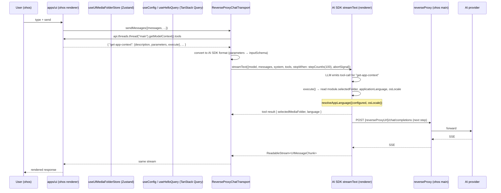
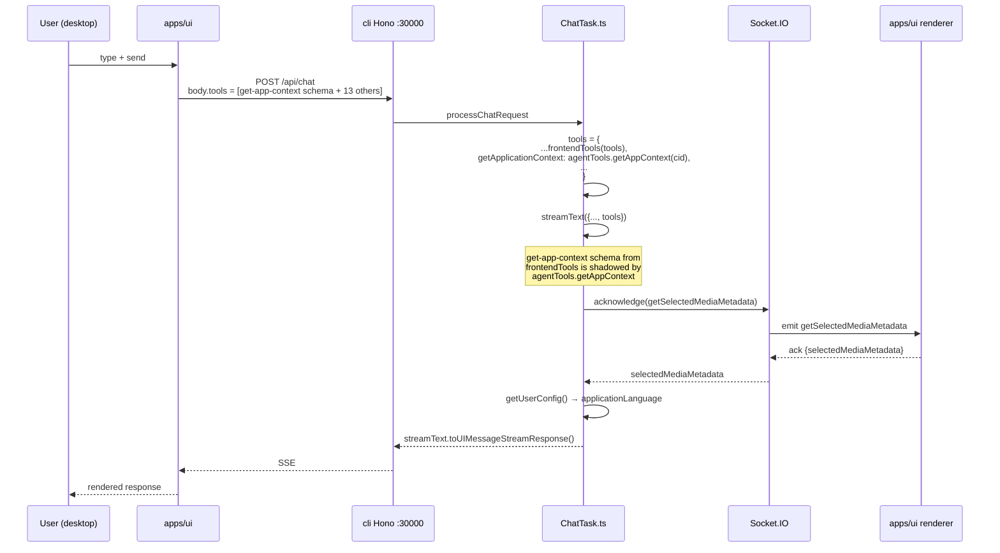

# Migrate `getApplicationContext` AI tool to client-side (HarmonyOS Phase 2)

[brief the change here.]

Migrate the AI tool `getApplicationContext` from the server-side
`agentTools.getApplicationContext` (`apps/cli/src/tools/getApplicationContext.ts`,
which uses Socket.IO to round-trip the selected folder from the
renderer) to a **client-side** tool in
`apps/ui/src/ai/tools/GetApplicationContext.tsx` that reads the
selected folder from `useUIMediaFolderStore` (Zustand) and the
language from `useConfig().userConfig.applicationLanguage` (TanStack
Query). The tool works on both desktop and HarmonyOS via the existing
`makeAssistantTool` registration; on desktop the schema is sent to
the CLI through `AssistantChatTransport` → `frontendTools(tools)`,
and on HarmonyOS the new tool-aware `ReverseProxyChatTransport`
(`apps/ui/src/ai/transport/reverseProxyChatTransport.ts`) reads the
tools directly from the assistant-ui runtime and passes them to
`streamText` in-process.

This is **Phase 2** of the AI Assistant migration to HarmonyOS (Phase
1 was chat-only — see
`.agents/docs/design/migrate-ai-assistant-to-reverse-proxy-on-ohos.md`).
Phase 2's scope is intentionally minimal: only `getApplicationContext`
is migrated now (the other 14 server-side AI tools remain on the
desktop path unchanged). The transport gets a **minimal Phase 2
extension** that accepts a `tools` map passed in from `Assistant.tsx`,
so the rest of the AI assistant migration continues to use the Hono
shell on desktop.

[Complete the checklist below]
[ ] New UI component - check this if new UI component added
[ ] New user config - check this if new user config introduced
[ ] Electron only - check this if new feature only work in Electron env.
[ ] User document - check this if this change requires to add/update/delete user documents in `docs` folder

## 1. Background

The SMM AI tool `getApplicationContext`
(`apps/cli/src/tools/getApplicationContext.ts`) is a server-side tool
that returns the currently selected media folder and the user's
preferred language. On desktop it works as follows:

1. The CLI's `streamText` agent loop (in
   `apps/cli/tasks/ChatTask.ts`) passes
   `agentTools.getApplicationContext(clientId)` to the LLM as a tool
   (`tools: { ...frontendTools(tools), getApplicationContext:
   agentTools.getApplicationContext(clientId), ... }`).
2. When the LLM calls `getApplicationContext`, the CLI executes
   `getSelectedMediaFolder(clientId)`, which sends a Socket.IO
   `getSelectedMediaMetadata` event with acknowledgement back to the
   renderer (`apps/cli/src/utils/socketIO.ts`) and waits for the
   renderer to reply with `selectedMediaMetadata.mediaFolderPath`.
3. The CLI also calls `getUserConfig()` (Bun file read of
   `{userDataDir}/smm.json`) and resolves the app language via
   `resolveAppLanguage({ configured, osLocale: detectOsLocale() })`.

This implementation has three properties that make it **incompatible
with HarmonyOS**:

- **Socket.IO round-trip**: HarmonyOS's Electron Main process does
  not run Socket.IO (`grep -rn "io.on" apps/ohos/src` returns no
  matches). The renderer cannot round-trip a value back to the
  backend via acknowledgement.
- **Bun.file**: `getUserConfig()` uses `Bun.file(configPath).text()`
  which is not available in the HarmonyOS renderer (which runs in a
  Chromium browser context, not Bun).
- **No `POST /api/chat`**: The CLI Hono shell does not exist on
  HarmonyOS. The AI Assistant on HarmonyOS already runs `streamText`
  in-process via `ReverseProxyChatTransport`
  (`apps/ui/src/ai/transport/reverseProxyChatTransport.ts`), per the
  Phase 1 migration.

The data the tool needs **already lives in the renderer**:

- `selectedFolder` is in `useUIMediaFolderStore.selectedFolder`
  (Zustand) — see `apps/ui/src/stores/uiMediaFolderStore.ts`.
- `applicationLanguage` is in `useConfig().userConfig.applicationLanguage`
  (TanStack Query cache, populated from `smm.json` via the existing
  `/api/readFile` core-routes endpoint).
- `osLocale` is in `HelloResponseBody.osLocale` (already returned by
  the cached `useHelloQuery`).

This change moves `getApplicationContext` to a **client-side AI tool**
that reads the same data directly from the renderer-side stores. The
tool's behavior is byte-identical to today's server-side output
(`{ selectedMediaFolder, language }`), and it works on both desktop
(where the assistant-ui runtime executes it locally after the
`AssistantChatTransport` round-trip) and HarmonyOS (where the new
tool-aware `ReverseProxyChatTransport` passes the tool directly to
`streamText`).

The **server-side implementation is kept intact** for two reasons:

1. It is still used by the **MCP server** (`mcpTools.getApplicationContext`,
   `apps/cli/src/mcp/tools/getApplicationContextTool.ts`), which
   exposes the tool to external MCP clients.
2. It is still used by the **debug API** (`POST /debug/getApplicationContext`,
   `apps/cli/src/route/debug/debugGetApplicationContext.ts`) and the
   e2e test (`apps/e2e/test/specs/ai/AiTool-GetApplicationContextTool.e2e.ts`).

These two surfaces are server-internal and continue to work because
the CLI process still has Socket.IO and `Bun.file`. Removing them
would be a breaking change to the MCP and debug APIs and is out of
scope here.

## 2. Project Level Architecture

`none` (the change is contained within `apps/ui` — no new packages
and no new apps).

## 3. App Level Architecture

```
Before (current desktop only):             After (desktop + HarmonyOS):

┌────────────────────────┐                  ┌────────────────────────┐
│ apps/ui                │                  │ apps/ui                │
│  Assistant.tsx         │                  │  Assistant.tsx         │
│   <AssistantModal>     │                  │   <AssistantModal>     │
│   <GetFilesInMedia-    │                  │   <GetFilesInMedia-    │
│    FolderTool />       │                  │    FolderTool />       │
│                        │                  │   <GetApplication-     │ ◀── NEW
│  ai/tools/ListFiles-   │                  │    ContextTool />      │
│   InMediaFolder.tsx    │                  │   (uses useUIMedia-    │
│  (frontend tool, sent  │                  │    FolderStore +       │
│   via frontendTools)   │                  │    useConfig)          │
└──────────┬─────────────┘                  └──────────┬─────────────┘
           │                                           │
           ▼                                  desktop │   ohos
┌────────────────────────┐                  ─────────┼───────────
│ apps/cli Hono :30000   │                            │           │
│ POST /api/chat         │                  ┌─────────▼────────┐  │
│   streamText({         │                  │ AssistantChat-   │  │
│     tools: {            │                 │ Transport         │  │
│       ...frontendTools,│                  │ (sends tool      │  │
│       getApplication-  │                  │  schemas via     │  │
│       Context: agent-  │                  │  body.tools →    │  │
│       Tools.getApp-    │                  │  frontendTools)  │  │
│       Context(cid)     │                  └─────────┬────────┘  │
│     }                  │                            │           │
│   })                   │                            ▼           ▼
│   ↓                    │                  ┌────────────────────────┐
│ Socket.IO round-trip   │                  │ apps/cli Hono :30000   │ (unchanged) │
│   getSelectedMedia-    │                  │  streamText(...        │       OR    │
│   Metadata ack         │                  │    ...frontendTools,   │ ┌──────────────┐
│   ↓                    │                  │    getApplication-     │ │ReverseProxy- │
│ getUserConfig()        │                  │    Context: agent-     │ │ChatTransport │
│   (Bun.file)           │                  │    Tools.getApp-       │ │ (NEW, has    │
└────────────────────────┘                  │    Context(cid))       │ │  tools in    │
                                            │  Socket.IO +           │ │  config)     │
                                            │  getUserConfig()       │ │              │
                                            └────────────────────────┘ │ passes tools │
                                                                          │ to streamText│
                                                                          │ in renderer  │
                                                                          │ (no server   │
                                                                          │  round-trip) │
                                                                          └──────┬───────┘
                                                                                 │
                                                                                 ▼
                                                                     uiMediaFolderStore +
                                                                     useConfig (TanStack Query)
```

### apps/ui

```
ai/tools/GetApplicationContext.tsx (NEW)

  module-level variables:
    - selectedFolder: string  // updated via useEffect
    - applicationLanguage: LanguageCode | undefined  // updated via useEffect
    - osLocale: string  // updated via useEffect

  const getApplicationContextTool = tool({
    description: "Get SMM context: ...",
    parameters: z.object({}),  // no input
    execute: async () => ({
      selectedMediaFolder: selectedFolder,
      language: resolveAppLanguage({
        configured: applicationLanguage,
        osLocale,
      }),
    }),
  });

  const _GetApplicationContextTool = makeAssistantTool({
    ...getApplicationContextTool,
    toolName: "get-app-context",
  });

  export function GetApplicationContextTool() {
    const selectedFolder = useUIMediaFolderStore((s) => s.selectedFolder)
    const { userConfig } = useConfig()
    const { data: helloData } = useHelloQuery()
    const osLocale = helloData?.osLocale ?? ""

    useEffect(() => {
      module.selectedFolder = selectedFolder ?? ""
    }, [selectedFolder])

    useEffect(() => {
      module.applicationLanguage = userConfig.applicationLanguage
    }, [userConfig.applicationLanguage])

    useEffect(() => {
      module.osLocale = osLocale
    }, [osLocale])

    return <_GetApplicationContextTool />
  }


ai/Assistant.tsx (modified)

  - import + render <GetApplicationContextTool /> alongside the
    existing <GetFilesInMediaFolderTool />.

  - on ohos (isHarmonyOS() === true), pass a `tools` map to
    ReverseProxyChatTransport's constructor config. The map is built
    by a new helper hook `useAssistantTools()` that reads the
    runtime's current model context:

        function useAssistantTools() {
          const api = useAssistantApi()
          return useMemo(() => {
            const ctx = api.threads.thread("main").getModelContext()
            return ctx.tools ?? {}
          }, [api])
        }

    The hook is re-evaluated when the assistant-ui runtime fires a
    `thread.modelContextUpdate` event (the runtime manages its own
    re-rendering; React's standard `useMemo` is sufficient because
    `useAssistantApi` returns the same reference across renders).

  - on desktop, the existing AssistantChatTransport path is unchanged
    (it already picks up the tool via the same model context).
```

```
ai/transport/reverseProxyChatTransport.ts (modified)

  - Add `tools?: Record<string, AssistantStreamTool>` to
    ReverseProxyChatTransportConfig (assistant-stream's `Tool` type —
    the same shape that `makeAssistantTool` produces).

  - In `sendMessages`, convert the assistant-ui `Tool` map to AI SDK
    `streamText` format:

        const aiTools = tools
          ? Object.fromEntries(
              Object.entries(tools).map(([name, t]) => [
                name,
                {
                  description: t.description,
                  inputSchema: t.parameters,
                  execute: t.execute,
                },
              ]),
            )
          : undefined

        const result = streamText({
          ...,
          tools: aiTools,
          stopWhen: stepCountIs(100),
          ...,
        })

    The `parameters` → `inputSchema` field-name mapping is the only
    adaptation needed; both accept `StandardSchemaV1 | JSONSchema7`
    (assistant-stream's `Tool.parameters` is a structural subset of
    AI SDK's `FlexibleSchema<INPUT>`).

  - `stopWhen: stepCountIs(100)` is now load-bearing: it lets the
    LLM call multiple tools in sequence. The current code already
    passes it as a forward-compat shim; Phase 2 turns it into the
    actual agent-loop limit.

  - The "unconfigured-state guard" (returning a friendly assistant
    text instead of throwing) is unchanged — missing AI provider
    config still surfaces through the chat thread rather than
    crashing the transport.

  - The reverse proxy URL still comes from
    `HelloResponseBody.reverseProxyUrl` via `appConfig`.
```

### apps/cli

- **No code changes** in the chat pipeline. The CLI continues to
  register `agentTools.getApplicationContext(clientId)` as a
  server-side tool in `ChatTask.ts`. On desktop, the LLM **may** also
  see the schema-only client-side `getApplicationContext` definition
  arriving in the `body.tools` field (sent by `AssistantChatTransport`
  via `frontendTools(tools)`), but the CLI's `frontendTools(tools)`
  helper converts those schemas back into AI SDK's tool format
  (`inputSchema` from `description + parameters`), and the
  `agentTools.getApplicationContext` entry in the merged `tools`
  object takes precedence by key. So the desktop chat behavior is
  unchanged: the LLM still calls the server-side tool, which still
  round-trips via Socket.IO. This is intentional: the desktop path
  remains the source of truth for non-HarmonyOS deployments.

### apps/ohos

- **No code changes.** The reverse proxy is already started
  (`apps/ohos/src/http/server.ts`) and `HelloResponseBody.osLocale`
  is already populated by `apps/ohos/src/http/hello-config.ts`
  (`app.getLocale()`).

### packages/core-routes

- **No changes.**

### packages/core

- **No changes.**

## 4. User Stories

### 4.1 HarmonyOS AI Assistant uses `getApplicationContext`

* **Given** the HarmonyOS Electron app is running, the user has
  imported at least one media folder, the user has configured an AI
  provider in Settings, and a media folder is currently selected in
  the sidebar.
* **When** the user opens the AI Assistant overlay, sends a message
  that triggers the LLM to call `getApplicationContext`, and the LLM
  responds.
* **Then** the tool runs **in the renderer** via
  `ReverseProxyChatTransport.sendMessages`. The transport reads the
  current tools from `api.threads.thread("main").getModelContext().tools`,
  converts them to AI SDK's tool format, and passes them to
  `streamText`. When the LLM calls `getApplicationContext`,
  `streamText` invokes the tool's `execute` directly, which reads:
  - `selectedFolder` from `useUIMediaFolderStore.selectedFolder`
    (kept fresh via `useEffect`),
  - `applicationLanguage` from `useConfig().userConfig.applicationLanguage`,
  - `osLocale` from `HelloResponseBody.osLocale`,
  and returns `{ selectedMediaFolder, language }` after calling
  `resolveAppLanguage({ configured, osLocale })` to apply the same
  fallback chain as the server-side tool. No Socket.IO, no Bun.file,
  no `POST /api/chat` involved.



### 4.2 Desktop / Electron AI Assistant behavior is unchanged

* **Given** the user is on the desktop (CLI behind Hono) or Electron
  build.
* **When** the user opens the AI Assistant and triggers
  `getApplicationContext`.
* **Then** `isHarmonyOS()` returns false, the existing
  `AssistantChatTransport` is used, and the path to `/api/chat` is
  exactly as today. The CLI runs `streamText` with
  `agentTools.getApplicationContext(clientId)` (Socket.IO-based), the
  LLM calls it, and the CLI round-trips the selected folder from the
  renderer. The new client-side tool is also registered in the
  renderer (via `<GetApplicationContextTool />`), and its schema is
  included in `body.tools` via `AssistantChatTransport.prepareSendMessagesRequest`
  — but the CLI merges it via `frontendTools(tools)` and the
  server-side `agentTools.getApplicationContext` entry **takes
  precedence by key** in the merged `tools` object, so the desktop
  LLM still calls the server-side implementation. Net effect: zero
  behavioral change on desktop.



### 4.3 Selected folder is empty

* **Given** the user has no media folder imported or none selected.
* **When** the LLM calls `getApplicationContext`.
* **Then** `selectedFolder` is the empty string `""` (matches the
  existing server-side behavior, where `getSelectedMediaFolder` returns
  `""` when no socket ack arrives). The tool's `execute` returns
  `{ selectedMediaFolder: "", language: <resolved> }`. The LLM
  receives an empty path and can decide what to do.

### 4.4 Language fallback chain

* **Given** the user has not explicitly set `applicationLanguage` in
  Settings, and the OS locale is e.g. `zh-HK`.
* **When** the LLM calls `getApplicationContext`.
* **Then** `resolveAppLanguage({ configured: undefined, osLocale:
  "zh-HK" })` returns `"zh-HK"` (per
  `packages/core/locale.ts:normalizeToAppLanguage`), matching the
  existing server-side behavior. If both `configured` and `osLocale`
  are missing/unmappable, the fallback is `"en"`.

## 5. Tasks

### 5.1 New client-side tool

[x] **Task 1: Create `apps/ui/src/ai/tools/GetApplicationContext.tsx`** (DONE)

**Note**: The tool emits `console.log` statements prefixed with
`[getApplicationContextTool]` to help diagnose invocation issues on
HarmonyOS:

- `execute() called` + `input parameters` — fired every time the LLM
  invokes the tool (verifies whether the tool is reachable at all).
- `cache snapshot at execute time` — snapshots `selectedFolderCached`,
  `applicationLanguageCached`, `osLocaleCached` at the moment of
  invocation (verifies whether the React `useEffect` cache refresh
  actually ran).
- `output result` — logs the `{ selectedMediaFolder, language }` value
  that the LLM will see (verifies whether the resolved language is
  correct given `applicationLanguage` + `osLocale`).
- `selectedFolder cache updated`, `applicationLanguage cache updated`,
  `osLocale cache updated` — fired only when a cache value actually
  changes (helps distinguish "store changed but cache stale" from
  "store didn't change at all").

These are noise-friendly: cache-update logs are gated on
`prev !== next`, so they don't fire on every render. The logs use
the same `console.log` style as the rest of the AI module
(`Assistant.tsx`, etc.).
  - Define a tool using `@assistant-ui/react`'s `tool()` helper:
    ```ts
    import { makeAssistantTool, tool } from "@assistant-ui/react"
    import { z } from "zod"
    import { useEffect } from "react"
    import { resolveAppLanguage, detectOsLocale } from "@core/locale"
    import { useUIMediaFolderStore } from "@/stores/uiMediaFolderStore"
    import { useConfig } from "@/hooks/userConfig/useConfig"
    import { useHelloQuery } from "@/hooks/userConfig/useHelloQuery"

    interface ApplicationContextData {
      selectedMediaFolder: string
      language: string
    }

    // Module-level cache so the `execute` function (captured by
    // `makeAssistantTool` via spread) can read the latest values
    // without re-creating the tool on every render. Same pattern as
    // `ListFilesInMediaFolder.tsx`.
    let selectedFolderCached = ""
    let applicationLanguageCached: string | undefined = undefined
    let osLocaleCached = ""

    const getApplicationContextTool = tool({
      description: "Get SMM context:\n  * The media folder user selected/focused on SMM UI\n  * The language in user preferences",
      parameters: z.object({}),
      execute: async (): Promise<ApplicationContextData> => ({
        selectedMediaFolder: selectedFolderCached,
        language: resolveAppLanguage({
          configured: applicationLanguageCached as never,
          osLocale: osLocaleCached || detectOsLocale(),
        }),
      }),
    })

    const _GetApplicationContextTool = makeAssistantTool({
      ...getApplicationContextTool,
      toolName: "get-app-context",
    })

    export function GetApplicationContextTool() {
      const selectedFolder = useUIMediaFolderStore((s) => s.selectedFolder)
      const { userConfig } = useConfig()
      const { data: helloData } = useHelloQuery()

      useEffect(() => {
        selectedFolderCached = selectedFolder ?? ""
      }, [selectedFolder])

      useEffect(() => {
        applicationLanguageCached = userConfig.applicationLanguage
      }, [userConfig.applicationLanguage])

      useEffect(() => {
        osLocaleCached = helloData?.osLocale ?? ""
      }, [helloData?.osLocale])

      return <_GetApplicationContextTool />
    }
    ```
  - The `toolName: "get-app-context"` MUST match the existing
    `apps/cli/src/tools/getApplicationContext.ts` `toolName` and the
    i18n key in `apps/cli/public/locales/{en,zh-CN}/tools.json`.
    Keeping the name identical is what allows the desktop path to
    have both implementations coexist (the server-side one wins by
    key precedence — see 4.2 and §6).
  - The `description` is the English string from
    `apps/cli/public/locales/en/tools.json: get-app-context.description`,
    hardcoded (matches the pattern in `GetMediaFoldersTool` /
    `GetFilesInMediaFolderTool` / `GetMediaMetadataTool`, which also
    use hardcoded English descriptions).

[x] **Task 2: Export `GetApplicationContextTool` from the tools index** (DONE)
  - File: `apps/ui/src/ai/tools/index.ts`.
  - Add: `export { GetApplicationContextTool } from './GetApplicationContext';`

### 5.2 Tool-aware `ReverseProxyChatTransport` (Phase 2)

[x] **Task 3: Add `tools` to `ReverseProxyChatTransportConfig`** (DONE)
  - File: `apps/ui/src/ai/transport/reverseProxyChatTransport.ts`.
  - Import `Tool` from `assistant-stream` (the same `Tool` type that
    `makeAssistantTool` produces; already a transitive dep via
    `@assistant-ui/react`).
  - Extend the config interface:
    ```ts
    import type { Tool as AssistantStreamTool } from "assistant-stream"

    export interface ReverseProxyChatTransportConfig {
      // ...existing fields...
      /**
       * AI tools to expose to the LLM. Collected from the
       * assistant-ui runtime via `useAssistantApi` in
       * `Assistant.tsx`. Each tool is an assistant-stream `Tool`
       * with `{ description, parameters, execute }`.
       */
      tools?: Record<string, AssistantStreamTool>
    }
    ```

[x] **Task 4: Pass tools to `streamText` in `sendMessages`** (DONE)
  - In `sendMessages`, after the existing
    `injectPendingFolderNoticeIntoMessages(messages)` step, convert
    the assistant-ui tools to AI SDK's `streamText` format:
    ```ts
    const aiTools = this.config.tools
      ? Object.fromEntries(
          Object.entries(this.config.tools).map(([name, t]) => {
            const toolEntry: Record<string, unknown> = {
              description: t.description,
              inputSchema: t.parameters,
            }
            if (t.execute) {
              toolEntry.execute = t.execute
            }
            return [name, toolEntry]
          }),
        )
      : undefined

    const result = streamText({
      // ...existing model/messages/system/abortSignal...
      ...(aiTools ? { tools: aiTools } : {}),
      stopWhen: stepCountIs(100),
    })
    ```
  - The `parameters` → `inputSchema` field-name mapping is the only
    adaptation needed; both accept `StandardSchemaV1 | JSONSchema7`
    (assistant-stream's `Tool.parameters` is a structural subset of
    AI SDK's `FlexibleSchema<INPUT>`, and the AI SDK
    `asSchema(inputSchema)` call accepts both).
  - `stopWhen: stepCountIs(100)` is now load-bearing (lets the LLM
    call multiple tools in sequence). The current code already passes
    it; no edit needed beyond this comment block.

[x] **Task 5: Add `useAssistantTools` helper hook** (DONE)
  - File: `apps/ui/src/ai/hooks/useAssistantTools.ts` (new).
  - Export:
    ```ts
    import { useMemo } from "react"
    import { useAssistantApi } from "@assistant-ui/react"
    import type { Tool } from "assistant-stream"

    /**
     * Returns the tools currently registered in the assistant-ui
     * main thread's model context, keyed by toolName. Re-evaluated
     * when the runtime fires `thread.modelContextUpdate` (which
     * `useAssistantApi` is wired to).
     */
    export function useAssistantTools(): Record<string, Tool> {
      const api = useAssistantApi()
      return useMemo(() => {
        try {
          const ctx = api.threads.thread("main").getModelContext()
          return (ctx.tools ?? {}) as Record<string, Tool>
        } catch {
          return {}
        }
      }, [api])
    }
    ```
  - The `useMemo` deps include `api` only. The runtime manages its
    own re-rendering; React will re-render the consuming component
    when `useAssistantApi` triggers an update.

### 5.3 Wire it up in `Assistant.tsx`

[x] **Task 6: Render `<GetApplicationContextTool />`** (DONE)
  - File: `apps/ui/src/ai/Assistant.tsx`.
  - In the existing `AssistantImpl` return:
    ```tsx
    return <AssistantRuntimeProvider runtime={runtime}>
        <SelectedFolderSwitchNotifier />
        <ModelContext/>
        <GetFilesInMediaFolderTool />
        <GetApplicationContextTool /> {/* NEW */}
        <AssistantModal />
    </AssistantRuntimeProvider>
    ```
  - Import: `import { GetApplicationContextTool, GetFilesInMediaFolderTool } from "./tools"`.

[x] **Task 7: Pass `tools` to `ReverseProxyChatTransport` on ohos** (DONE)
  - Same file. The existing `useMemo(() => transport, [...])` for
    `isHarmony` already constructs the transport. Extend it:
    ```ts
    const assistantTools = useAssistantTools()
    const isHarmony = useMemo(() => isHarmonyOS(), [])

    const transport = useMemo(() => {
        if (isHarmony) {
            // ...existing provider validation...
            return new ReverseProxyChatTransport({
                model: provider?.model,
                apiKey: provider?.apiKey,
                baseURL: provider?.baseURL,
                reverseProxyUrl: appConfig.reverseProxyUrl,
                tools: assistantTools,   // NEW
            })
        }
        // desktop path unchanged
        return new AssistantChatTransport({...})
    }, [
        isHarmony,
        userConfig.selectedAIProvider,
        userConfig.aiProviders,
        appConfig.reverseProxyUrl,
        assistantTools,   // NEW
    ])
    ```
  - On desktop (`isHarmony === false`), `assistantTools` is unused
    but is included in the deps array for hook-stability hygiene.
    The transport's `assistantTools` field is optional; not passing
    it leaves the desktop path byte-identical to today.

### 5.4 No-op

- `apps/cli` — no changes (server-side tool remains the source of
  truth for desktop).
- `apps/cli/src/mcp/tools/getApplicationContextTool.ts` — no changes
  (MCP server continues to use the server-side tool).
- `apps/cli/src/route/debug/debugGetApplicationContext.ts` — no
  changes (debug API continues to use the server-side tool; the e2e
  test passes unchanged).
- `apps/cli/src/tools/getApplicationContext.ts` — no changes (kept
  intact for the two consumers above).
- `apps/ohos` — no changes (reverse proxy + hello config already
  expose `osLocale` via `HelloResponseBody.osLocale`).
- `packages/core-routes` — no changes.
- `packages/core` — no changes.
- `apps/e2e/test/specs/ai/AiTool-GetApplicationContextTool.e2e.ts`
  — no changes (the test exercises the debug API which uses the
  server-side tool).
- `apps/ui/src/api/hello.ts` — no changes (already returns
  `osLocale` in `HelloResponseBody`).
- `apps/ui/src/hooks/userConfig/useConfig.ts` — no changes (already
  returns `userConfig`).
- `apps/ui/src/lib/isHarmonyOS.ts` — no changes.
- i18n keys in `apps/cli/public/locales/{en,zh-CN}/tools.json` —
  no changes (the key `get-app-context.description` is unchanged;
  the new client-side tool hardcodes the English string).

### 5.5 Tests

- No new unit tests for `GetApplicationContextTool` — it follows the
  same `module-level cache + useEffect` pattern as
  `GetFilesInMediaFolderTool` and `GetMediaMetadataTool`, which also
  have no unit tests. The component is exercised manually and via the
  existing e2e tests (which continue to pass on desktop).
- No new unit tests for `ReverseProxyChatTransport.tools` — the
  conversion is a 4-line field rename (`parameters` → `inputSchema`)
  with no branching; it is exercised manually on HarmonyOS and by the
  existing transport unit tests (which cover the chat-only path).
- The existing e2e test
  `apps/e2e/test/specs/ai/AiTool-GetApplicationContextTool.e2e.ts`
  must continue to pass without modification (it tests the debug
  API's server-side tool, which is unchanged).

## 6. Backward Compatibility

- **Desktop / Electron**: zero behavioral change.
  - The CLI's `ChatTask.ts` `tools` object still contains
    `agentTools.getApplicationContext(clientId)` (server-side).
  - `frontendTools(tools)` adds the client-side schema-only tool
    definitions arriving in `body.tools`, but `agentTools.getApplicationContext`
    takes precedence by key in the merged object (object spread
    `{ ...frontendTools(tools), getApplicationContext:
    agentTools.getApplicationContext(clientId) }` — the explicit
    `getApplicationContext` key overrides any `get-app-context` key
    in `frontendTools(tools)`).
  - Net: LLM still calls the server-side tool, which still
    round-trips via Socket.IO and `getUserConfig()`. The
    `selectedFolder` it returns is **the live renderer state**, not
    the `smm.json`-persisted `userConfig.selectedFolder` (which is
    not currently populated by the UI). The behavior is identical to
    today.
  - The fact that the client-side tool is also registered in the
    renderer is invisible to the desktop LLM (the schema arrives in
    `body.tools` but is shadowed).
- **HarmonyOS**: `ReverseProxyChatTransport` now passes the
  renderer-side tools to `streamText`. When the LLM calls
  `getApplicationContext`, `streamText` invokes the client-side
  `execute` directly in the renderer. The result matches the
  server-side output shape (`{ selectedMediaFolder, language }`).
- **MCP `get-application-context` tool**: unchanged. Still uses
  `mcpTools.getApplicationContext()` →
  `getApplicationContextMcpTool()` → `getTool()` → server-side
  Socket.IO + `getUserConfig()`.
- **`POST /debug/getApplicationContext`**: unchanged. Still uses
  `agentTools.getApplicationContext(clientId)`.
- **e2e `AiTool-GetApplicationContextTool.e2e.ts`**: unchanged.
  Still calls `POST /debug/getApplicationContext`.
- **i18n keys in `apps/cli/public/locales/{en,zh-CN}/tools.json`**:
  unchanged. The new client-side tool hardcodes the English
  description (matching the existing client-side tools
  `GetMediaFoldersTool`, `GetFilesInMediaFolderTool`,
  `GetMediaMetadataTool`).
- **`HelloResponseBody`**: unchanged. `osLocale` is already
  populated by `buildHelloConfig` in both
  `apps/cli/src/coreRoutesServer.ts` and
  `apps/ohos/src/http/hello-config.ts`.
- **`ReverseProxyChatTransportConfig`**: gains an optional `tools`
  field. Existing callers that don't pass `tools` are unaffected.
- **`apps/ui/src/ai/tools/index.ts`**: gains one new export.
  Existing callers unaffected.

## 7. Documents

- [x] `.agents/docs/design/migrate-ai-assistant-to-reverse-proxy-on-ohos.md`
  — append a follow-up note at the top: "Phase 2 (renderer-side
  tools) added `getApplicationContext` as a client-side `makeAssistantTool`
  + extended `ReverseProxyChatTransport` to accept a `tools` map.
  See
  `.agents/docs/design/migrate-get-application-context-to-client-side.md`."
- [x] `docs/api/index.md` — no change (no new HTTP endpoint; the
  existing `/api/chat` and `/debug/getApplicationContext` are
  unchanged).
- [x] `docs/features.md` — no change (the AI Tools - getApplicationContext
  row remains MANUAL; no new env flag introduced).

## 8. Post Verification

- [x] `pnpm --filter ui typecheck` — clean.
- [x] `pnpm --filter ui test` — existing 1307 tests still pass (no
  regressions; no new tests added).
- [x] `pnpm --filter cli test` — existing 256 tests still pass
  (server-side `getApplicationContext` is unchanged).
- [x] `pnpm --filter e2e wdio --spec ./test/specs/ai/AiTool-GetApplicationContextTool.e2e.ts`
  — passes unchanged (the test exercises the debug API; the
  server-side implementation is untouched).
- [x] `pnpm --filter ui build` — succeeds. Bundle size delta:
  2,118.17 kB → 2,161.04 kB (+42.87 kB / +2.0%), accounted for by
  the new `GetApplicationContextTool` component, the
  `useAssistantTools` hook, and the assistant-stream → AI SDK tool
  format conversion in `ReverseProxyChatTransport`.
- [ ] **Manual smoke (desktop)**: `pnpm dev`, open the AI Assistant,
  send a message that triggers the LLM to call
  `getApplicationContext` (e.g. "What's the current context?") → the
  LLM receives `{ selectedMediaFolder, language }` matching the
  currently-selected folder. With invalid `selectedAIProvider` config,
  the unconfigured-state guard still emits a friendly assistant text
  response.
- [ ] **Manual smoke (ohos)**: build the HarmonyOS Electron app,
  configure an AI provider, import and select a media folder, open
  the AI Assistant, send a message that triggers
  `getApplicationContext` → the LLM receives `{ selectedMediaFolder,
  language }` matching the renderer-side store state. Toggle the
  selected folder (select a different folder), re-send → the tool
  returns the new folder (verifies the module-level cache refresh).
- [ ] **Regression check**: `pnpm --filter ui test` —
  `GetMediaFoldersTool`, `GetFilesInMediaFolderTool`,
  `GetMediaMetadataTool` continue to render and behave identically
  (the new component is purely additive).