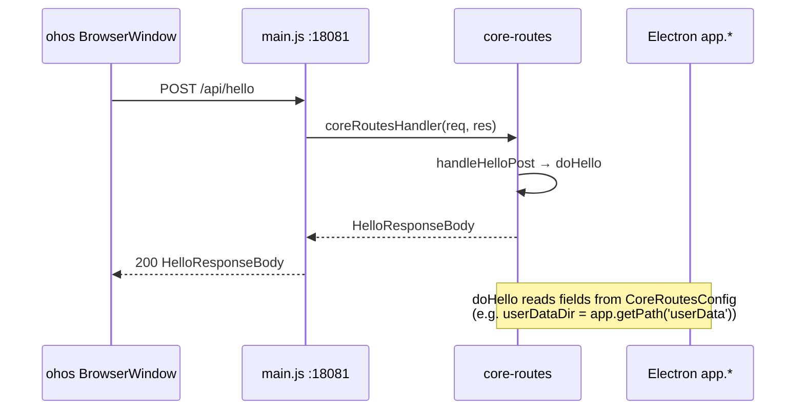

# Migrate `hello` API to `packages/core-routes`

[brief the change here.]

Move the application bootstrap handshake (`POST /api/hello`) from
`apps/cli` to `packages/core-routes` as a framework-agnostic pure
function plus a Node `http` handler. The Hono wrapper in `apps/cli` is
retained so the UI's existing fetch on port 30000 keeps working, but
its underlying call is delegated to the new `doHello` in
`@smm/core-routes`. `apps/ohos` (which already runs the core-routes
Node `http` handler in its main process) only needs to pass the new
config fields to start serving `/api/hello` automatically.

> Follow-up: the hello response now also includes `coreRoutesPort` so
> the UI can call non-hello endpoints on the core-routes Node server
> directly (e.g. `POST /api/isFolderAvailable`). See
> `.agents/docs/design/migrate-isFolderAvailable-to-core-routes.md`.

[Complete the checklist below]  
[ ] New UI component - check this if new UI component added
[ ] New user config - check this if new user config introduced
[ ] Electron only - check this if new feature only work in Electron env.
[ ] User document - check this if this change requires to add/update/delete user documents in `docs` folder

## 1. Background

`POST /api/hello` was split out of the generic `/api/execute`
orchestrator in the previous refactor
(`.agents/docs/design/split-hello-from-execute-api.md`) and lives as a
Hono route in `apps/cli/src/route/execute.ts`. The actual business
logic still lives in `apps/cli/tasks/HelloTask.ts` and depends on cli
internals: `apps/cli/src/utils/config.ts` (`getUserDataDir`,
`getAppDataDir`, `getLogDir`, `getTmpDir`), the bun-only
`process.uptime()`, and the cli-internal `APP_VERSION` constant.

Meanwhile, `packages/core-routes` was set up exactly to host
framework-agnostic HTTP route logic so that non-cli runtimes (e.g.
`apps/ohos` HarmonyOS) can reuse it without taking on a Bun/Hono
dependency. It already exposes `listFiles` and `writeFile` through the
same "pure function + Node `http` handler" pattern (see
`.agents/docs/design/core-routes.md`).

This change completes the picture: the bootstrap handshake belongs in
`@smm/core-routes` for the same reasons. Once it is migrated:

- `apps/ohos` automatically gains a working `POST /api/hello` simply by
  extending the `CoreRoutesConfig` it already passes to
  `createCoreRoutesRequestHandler`.
- The cli-side Hono wrapper shrinks to a thin Hono adapter that calls
  the shared `doHello`.
- `HelloTask.ts` becomes a thin shim that wires cli-internal state
  (`getUserDataDir`/...) into the shared `doHello` invocation. This
  keeps `getMediaFolders` and other in-process cli consumers
  (`apps/cli/src/tools/getMediaFolders.ts`) working without churn.

## 2. Project Level Architecture

`none`.

This is a refactor within the existing `cli ↔ core-routes ↔ core`
layering. The split between Electron shell, Bun/Hono server, and the
shared core-routes package is preserved.

## 3. App Level Architecture

```
Before (current):                         After:

┌──────────────────────────┐             ┌──────────────────────────┐
│        apps/cli          │             │        apps/cli          │
│  ┌────────────────────┐  │             │  ┌────────────────────┐  │
│  │ Hono 30000         │  │             │  │ Hono 30000         │  │
│  │  POST /api/hello   │  │             │  │  POST /api/hello   │──┼──┐
│  │    (calls          │  │             │  │   (thin wrapper,   │  │  │
│  │     executeHello-  │  │             │  │    calls doHello)  │  │  │
│  │     Task)          │  │             │  └────────────────────┘  │  │
│  └────────────────────┘  │             │  ┌────────────────────┐  │  │
│  ┌────────────────────┐  │             │  │ Node http 30001    │  │  │
│  │ Node http 30001    │  │             │  │  (core-routes)     │  │  │
│  │  (core-routes; no  │  │             │  │   auto-registered  │  │  │
│  │   hello)           │  │             │  │   /api/hello from  │◀┼──┤
│  └────────────────────┘  │             │  │   doHello)         │  │  │
└──────────────────────────┘             └──────────────────────┬───┘  │
                                                              │      │
┌──────────────────────────┐                                    │      │
│  apps/cli/tasks/         │                                    │      │
│   HelloTask.ts           │────── delegates to doHello ────────┼──────┤
│  (cli-internal glue)     │                                    │      │
└──────────────────────────┘                                    │      │
                                                               │      │
┌──────────────────────────┐             ┌──────────────────────▼───┐  │
│     apps/ohos            │             │     apps/ohos            │  │
│  main.js (18081)         │             │  main.js (18081)         │  │
│   /api/* → core-routes   │             │   /api/* → core-routes   │  │
│  (no hello yet)          │             │  (hello auto-available)  │  │
└──────────────────────────┘             └──────────────────────────┘  │
                                                                   │
                                                                   │
                              ┌────────────────────────────────────┘
                              ▼
                  ┌────────────────────────┐
                  │ packages/core-routes   │
                  │  • doHello()           │  ◀── new
                  │  • handleHelloPost()   │  ◀── new (Node http)
                  │  • doListFiles         │
                  │  • doWriteFile         │
                  │  • ...                 │
                  └────────────────────────┘
                              │
                              ▼
                  ┌────────────────────────┐
                  │    packages/core       │
                  │  • HelloResponseBody   │
                  │  • detectOsLocale      │
                  │  • ...                 │
                  └────────────────────────┘
```

`apps/ui` and `packages/test` are **unchanged**: they keep calling
`POST /api/hello` exactly as they do today.

## 4. User Stories

### 4.1 CLI UI bootstrap handshake still works

* **Given** the CLI server is running on port 30000 and the UI is
  loaded
* **When** the UI calls `useReloadAppConfig.reload()`, which fetches
  `POST /api/hello`
* **Then** the cli Hono wrapper at `/api/hello` returns the same
  `HelloResponseBody` payload as before. The handler body now calls
  `doHello` from `@smm/core-routes` instead of `executeHelloTask` in
  `apps/cli/tasks/HelloTask.ts`.

```mermaid
sequenceDiagram
  participant UI as apps/ui
  participant Hono as cli Hono :30000
  participant CR as core-routes
  participant Hello as apps/cli/tasks/HelloTask
  participant Proxy as cli reverseProxy

  UI->>Hono: POST /api/hello
  Hono->>CR: doHello(options, config)
  CR-->>Hono: HelloResponseBody
  Hono-->>UI: 200 HelloResponseBody
  Note over Hello,Proxy: HelloTask is a thin shim that calls doHello;<br/>it is still used by getMediaFolders etc.
```

### 4.2 ohos main process auto-serves `/api/hello`

* **Given** `apps/ohos/web_engine/src/main/resources/resfile/resources/app/main.js`
  configures `createCoreRoutesRequestHandler` with the new
  `CoreRoutesConfig` fields
* **When** a `POST /api/hello` request reaches the main process HTTP
  server on 18081
* **Then** core-routes' new `handleHelloPost` (registered in
  `coreRouteHandlers`) returns the same `HelloResponseBody` payload
  shape as the CLI does.



### 4.3 Stale `POST /api/execute { name: "hello" }` continues to be rejected

* **Given** a client that still sends the old
  `POST /api/execute { name: "hello" }` from before the previous split
* **When** the request reaches the CLI
* **Then** the Zod validation in `/api/execute` rejects with HTTP 400
  listing `"system", "GetSelectedMediaMetadata"`. This is unchanged by
  this refactor.

## 5. Tasks

### 5.1 New logic in `packages/core-routes`

[ ] **Task 1: Add `HelloOptions` and `doHello` pure function**
   - File: `packages/core-routes/src/hello.ts`.
   - Export:
     ```ts
     export interface HelloOptions {
       /** CLI/ohos app version, e.g. "1.3.8". */
       version: string;
       /** POSIX or platform-specific user-data dir. */
       userDataDir: string;
       appDataDir: string;
       logDir: string;
       tmpDir: string;
       /** Reverse proxy base URL or null when not yet started. */
       reverseProxyUrl: string | null;
       /** OS locale, e.g. "en-US", "zh-CN". */
       osLocale: string;
     }

     export function doHello(options: HelloOptions): HelloResponseBody
     ```
   - Implementation: returns
     `{ uptime: process.uptime(), ...options }`. `uptime` uses Node's
     built-in `process.uptime()` (Node global, available in core-routes
     because core-routes is a Node module). The function is **synchronous**
     in shape (no I/O), so it is plain `function` rather than
     `async function`, matching `doListFiles` style for the no-I/O
     case.

[ ] **Task 2: Add `handleHelloPost` Node `http` handler**
   - File: `packages/core-routes/src/routes/helloRoute.ts`.
   - Reads `HelloOptions` from `ctx.config` (see Task 3 below), calls
     `doHello`, and writes the JSON response with `sendJson(res, 200,
     result)`. Reject anything other than `POST /api/hello` by
     returning `false`.
   - Export `handleHelloPost` from the new file.

[ ] **Task 3: Extend `CoreRoutesConfig` with `hello` field**
   - File: `packages/core-routes/src/types.ts`.
   - Add an optional `hello?: HelloOptions` to `CoreRoutesConfig`. If
     `ctx.config.hello` is `undefined`, `handleHelloPost` still
     returns a response (200 with a clear `error: "hello not
     configured"`), so the route is always safe to register.
   - Rationale: not all callers want to expose `/api/hello`. Keeping
     the field optional preserves backward compatibility for existing
     `createCoreRoutesRequestHandler` callers that do not care.

[ ] **Task 4: Register `handleHelloPost` in `coreRouteHandlers`**
   - File: `packages/core-routes/src/register.ts`.
   - Append `handleHelloPost` to the `coreRouteHandlers` array.
   - Re-export `handleHelloPost` from `register.ts` (mirror the
     `handleListFilesGet` / `handleWriteFilePost` pattern).
   - Re-export `doHello`, `HelloOptions`, and `handleHelloPost` from
     `packages/core-routes/src/index.ts`.

[ ] **Task 5: Tests for the new hello logic**
   - Add `packages/core-routes/src/hello.test.ts`:
     - `doHello` returns the expected shape including
       `process.uptime()` (assert `>= 0`).
     - `doHello` forwards all options fields untouched.
   - Extend `packages/core-routes/src/core-routes.test.ts` with:
     - `handleCoreRoutesRequest` returns 200 + `HelloResponseBody`
       when `config.hello` is provided.
     - Returns 200 + `{ error: "hello not configured" }` when
       `config.hello` is undefined (regression: existing callers that
       don't pass hello do not break).

### 5.2 `apps/cli` integration

[ ] **Task 6: `executeHelloTask` becomes a thin shim around `doHello`**
   - File: `apps/cli/tasks/HelloTask.ts`.
   - Replace the existing body with a call to `doHello` from
     `@smm/core-routes`, passing
     `{ version: APP_VERSION, userDataDir: getUserDataDir(), ...,
       osLocale: detectOsLocale() }`.
   - Keep the `logger.warn` when `reverseProxyUrl === null` (cli has
     a Pino logger; core-routes does not).
   - Keep the function signature
     `executeHelloTask(reverseProxyUrl: string | null = null)` so
     `getMediaFolders` and any other in-process callers (Task 9)
     continue to work unchanged.

[ ] **Task 7: Hono `/api/hello` wrapper delegates to `doHello`**
   - File: `apps/cli/src/route/execute.ts` (the file from the
     previous split refactor).
   - Replace the direct call to `executeHelloTask(proxyManager.url)`
     with a call to `doHello` from `@smm/core-routes`, passing the
     same fields as Task 6. The Hono route is kept so the UI's
     fetch on port 30000 keeps working.
   - The `registerExecuteRoutes(app, proxyManager)` signature does not
     change.

[ ] **Task 8: cli `core-routes` server passes `hello` config**
   - File: `apps/cli/src/coreRoutesServer.ts`.
   - Build a `CoreRoutesConfig` that includes
     `hello: { version: APP_VERSION, userDataDir, appDataDir, logDir,
       tmpDir, reverseProxyUrl: ???, osLocale: detectOsLocale() }`.
   - `reverseProxyUrl` is not available when the core-routes server
     starts (the proxy manager starts later). Two viable options:
     - (a) Read it lazily: pass a getter object (changes the
       `HelloOptions` type to allow a function). **Rejected** -
       unnecessary complexity; the cli UI uses the Hono port, not the
       core-routes port.
     - (b) Pass `null` for `reverseProxyUrl` in the core-routes
       config. The UI never calls the core-routes port directly for
       hello, so the value is informational. **Chosen.**
   - The Hono wrapper (Task 7) keeps the live `proxyManager.url`,
     which is what the UI actually consumes.

### 5.3 `apps/ohos` integration

[ ] **Task 9: ohos main.js exposes hello via core-routes**
   - File: `apps/ohos/web_engine/src/main/resources/resfile/resources/app/main.js`.
   - Build a `HelloOptions` from `app.getPath('userData')`,
     `app.getPath('temp')`, etc., and pass it as `config.hello` to
     `createCoreRoutesRequestHandler`.
   - No new code in ohos is needed beyond this config update;
     core-routes auto-registers `POST /api/hello`.
   - `reverseProxyUrl` is set to `null` in ohos (the cli reverse
     proxy is not relevant on ohos).
   - `osLocale` is detected via the Node process or
     `app.getLocale()`. Use `app.getLocale()` from Electron so the
     same locale the user sees in the app shell is reported.

### 5.4 No-op

- `apps/ui/src/api/hello.ts` is **not modified**. It still calls
  `POST /api/hello` and gets back the same shape.
- `packages/test/src/index.ts` is **not modified**. Its `hello()`
  helper still calls `POST /api/hello`.

## 6. Backward Compatibility

- `POST /api/hello` keeps the same request/response shape
  (`HelloResponseBody`) and HTTP status. Existing UI clients
  (`apps/ui`) and test helpers (`packages/test`) are unaffected.
- The `CoreRoutesConfig` change is purely additive: existing callers
  that omit `hello` get a graceful `{ error: "hello not configured" }`
  response on `POST /api/hello` instead of crashing.
- `executeHelloTask` keeps the same signature. In-process cli
  consumers (`getMediaFolders`) are unaffected.
- Hono `/api/hello` keeps the same path and response. UI calls are
  unchanged.

## 7. Documents

- [ ] `.agents/docs/design/split-hello-from-execute-api.md` -
      add a one-line note at the top pointing to this doc as the
      follow-up: "The hello business logic has since been moved to
      `packages/core-routes`; see
      `.agents/docs/design/migrate-hello-to-core-routes.md`."
- [ ] `.agents/docs/design/core-routes.md` - extend the route table
      with `POST /api/hello → handleHelloPost` and note that the
      `hello` field is added to `CoreRoutesConfig`.

## 8. Post Verification

- [ ] `pnpm --filter @smm/core-routes test` - new hello tests pass,
      existing tests still pass.
- [ ] `pnpm --filter cli test` - execute route tests still pass; the
      Hono `/api/hello` route still returns 200.
- [ ] `pnpm --filter @smm/core-routes typecheck`,
      `pnpm --filter cli typecheck`.
- [ ] `pnpm typecheck` (root) - no new errors.
- [ ] `pnpm --filter @smm/core-routes build` - produces
      `dist/core-routes.js` with the new hello code.
- [ ] Manual smoke (cli): `pnpm dev:cli` then
      `curl -X POST http://localhost:30000/api/hello` →
      `HelloResponseBody` JSON.
- [ ] Manual smoke (ohos): build ohos app, launch, devtools, run
      `fetch('/api/hello', { method: 'POST' })` from the renderer
      console. Should resolve to a `HelloResponseBody` JSON.
