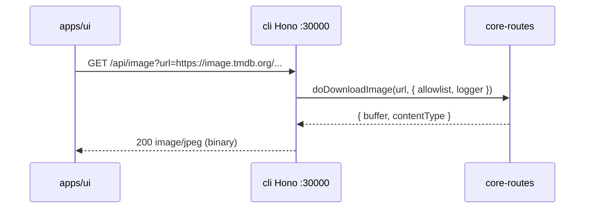
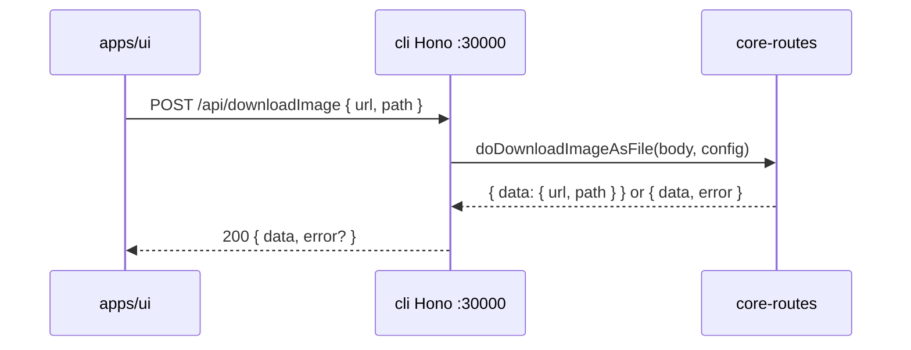
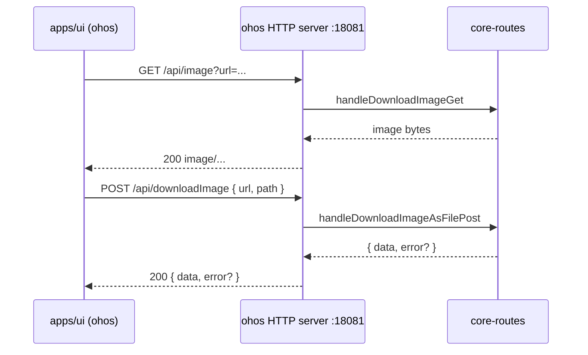

# Migrate `downloadImage` / `readImage` APIs to `packages/core-routes`

Migrate the three image-related HTTP routes from `apps/cli` to `packages/core-routes`
following the **WriteFile / readFile pattern** (Hono shell retained as a thin
adapter that calls pure `doXxx` functions from `@smm/core-routes`). The UI is
**not modified** — all three routes keep working on cli port 30000 via the
Hono adapter, and ohos reuses them via the core-routes Node `http` server
(port 18081) for free via the existing `coreRouteHandlers` mechanism.

[ ] New UI component
[ ] New user config
[ ] Electron only
[ ] User document

## 1. Background

`apps/cli/src/route/` currently owns three image-related routes plus two
internal helpers, all of which the UI consumes but `apps/ohos` cannot reuse:

| File | Type | Endpoint | Purpose |
|------|------|----------|---------|
| `DownloadImage.ts` | Hono route | `GET /api/image?url=…` | Download an image (HTTP / `file://`) and stream it back as binary |
| `DownloadImageAsFile.ts` | Hono route | `POST /api/downloadImage` | Download an image to a managed file path |
| `ReadImage.ts` | Hono route | `POST /api/readImage` | Read a local image as a base64 `data:` URL |
| `utils/downloadImage.ts` | Bun utility | (in-process) | `Bun.file().exists()` + `Bun.write()` — Bun-only, used by `DownloadImageAsFile.ts` |
| `DownloadImageToTempFile.ts` | Bun utility | (in-process) | Download to `os.tmpdir()` and return POSIX path; **dead code (no callers)** |

Why migrate:

1. **`DownloadImage.ts`** and **`ReadImage.ts`** both use `Bun.file()` /
   `Bun.write()` and the cli-internal `allowRead` predicate (which reads
   `userConfig.folders` and the SMM tmp folder). Both are Bun- and cli-
   specific, blocking ohos reuse.
2. **`DownloadImageAsFile.ts`** uses `apps/cli/src/utils/downloadImage.ts`,
   which uses `Bun.file().exists()` and `Bun.write()`. The same Bun-only
   pattern.
3. The UI already calls all three endpoints (`useImage` → `GET /api/image`,
   `downloadImageApi` → `POST /api/downloadImage`, `ReadImage` →
   `POST /api/readImage`). The same UI works on ohos if the routes are
   exposed there.
4. Per the architecture doc, the ohos Electron Main embeds
   `core-routes` (Node `http` server, port 18081). Adding routes to
   `coreRouteHandlers` makes them available to ohos without any ohos
   code change.

Why follow the **Hono shell retained** pattern (like `readFile` /
`writeFile` / `isFolderAvailable` after revert):

- The UI uses relative URLs (`/api/...`); no need to teach the UI about
  the core-routes port.
- Hono shell gives free CORS, request logging via `logHttpReqIn` /
  `logHttpRespOut`, and the existing error semantics.
- ohos does not need to duplicate the Hono adapter — it gets the
  same routes from the core-routes Node server.

`apps/ohos/src/http/server.ts` already routes `url.startsWith("/api/")`
into `coreRoutesHandler`. Once the new handlers are in
`coreRouteHandlers`, ohos serves them automatically on port 18081.

The `DownloadImageToTempFile.ts` default export is **dead code**
(`grep -rn "downloadImageToTemp\|DownloadImageToTempFile" apps/` shows
zero callers). It is **not migrated** and is **deleted** from `apps/cli`
to avoid leaving an orphan Bun-only file.

## 2. Project Level Architecture

```
Before (current):

┌──────────────────────────────────────────────┐
│ apps/cli │
│ ┌──────────────────────┐ ┌──────────────────┐ │
│ │ Hono :30000 │ │ Node http :30001 │ │
│ │ GET /api/image │ │ (core-routes; no │ │
│ │ POST /api/download │ │ image routes) │ │
│ │ POST /api/readImage │ │ │ │
│ │ (Bun.file + │ │ │ │
│ │ allowRead cli util)│ │ │ │
│ └──────────────────────┘ └──────────────────┘ │
│ apps/cli/src/utils/downloadImage.ts (Bun) │
│ apps/cli/src/route/DownloadImageToTempFile.ts│
│ (dead code) │
└──────────────────────────────────────────────┘
 │
 ▼
┌──────────────────────────────────────────────┐
│ packages/core-routes │
│ • doReadFile, doWriteFile, doListFiles, ...│
│ • doHello, doIsFolderAvailable, ... │
│ • doDeleteFile, doRenameFiles, ... │
│ (no image routes) │
└──────────────────────────────────────────────┘

After:

┌──────────────────────────────────────────────┐
│ apps/cli │
│ ┌──────────────────────┐ ┌──────────────────┐ │
│ │ Hono :30000 │ │ Node http :30001 │ │
│ │ GET /api/image │ │ GET /api/image │ │
│ │ (thin adapter, │ │ POST /api/ │ │
│ │ calls doDownload- │ │ downloadImage │ │
│ │ Image) │ │ POST /api/ │ │
│ │ POST /api/download │ │ readImage │ │
│ │ (thin adapter, │ │ (served by │ │
│ │ calls doDownload- │ │ core-routes) │ │
│ │ ImageAsFile) │ │ │ │
│ │ POST /api/readImage│ │ │ │
│ │ (thin adapter, │ │ │ │
│ │ calls doReadImage) │ │ │ │
│ └──────────────────────┘ └──────────────────┘ │
│ (utils/downloadImage.ts DELETED — use │ │
│ doDownloadImageAsFile from core) │
│ (DownloadImageToTempFile.ts DELETED) │
└──────────────────────────────────────────────┘
 │
 ▼
┌──────────────────────────────────────────────┐
│ packages/core-routes │
│ • doDownloadImage, doDownloadImageAsFile, │
│ doReadImage (new) │
│ • handleDownloadImageGet, handleDownload- │
│ ImageAsFilePost, handleReadImagePost │
│ (new Node http handlers, registered in │
│ coreRouteHandlers) │
│ • doReadFile, doWriteFile, ... (existing) │
└──────────────────────────────────────────────┘

┌──────────────────────────────────────────────┐
│ apps/ohos (no code change required) │
│ ┌──────────────────────────────────────────┐ │
│ │ Node http :18081 (core-routes) │ │
│ │ GET /api/image │ │
│ │ POST /api/downloadImage │ │
│ │ POST /api/readImage │ │
│ │ (auto-served by coreRouteHandlers) │ │
│ └──────────────────────────────────────────┘ │
└──────────────────────────────────────────────┘

┌──────────────────────────────────────────────┐
│ apps/ui (no change) │
│ • useImage → /api/image (unchanged URL) │
│ • downloadImageApi → /api/downloadImage │
│ • ReadImage API → /api/readImage │
│ • (Hono shell transparent to UI) │
└──────────────────────────────────────────────┘
```

## 3. App Level Architecture

### packages/core-routes

Adds:

- `src/downloadImage.ts` — `doDownloadImage`, `DownloadImageError`,
  `DownloadImageContentType`, plus the private helpers
  `normalizeUrl`, `getContentType`, `createImageResponse`,
  `downloadImageFromFile`, `downloadImageFromWeb`. Pure
  (no global state); takes only `(url, config?)`.
- `src/downloadImageAsFile.ts` — `doDownloadImageAsFile` (replaces
  the `Bun`-based `apps/cli/src/utils/downloadImage.ts` with
  `node:fs/promises.access` + `writeFile`).
- `src/readImage.ts` (migrated) — `doReadImage`, `isValidImageFile`,
  `getImageMimeType`. Replaces `Bun.file()` with `node:fs/promises`.
- `src/routes/downloadImageRoute.ts` — `handleDownloadImageGet`
  (Node `http`, streams binary).
- `src/routes/downloadImageAsFileRoute.ts` — `handleDownloadImageAsFilePost`.
- `src/routes/readImageRoute.ts` — `handleReadImagePost`.
- Unit tests:
  - `src/downloadImage.test.ts`
  - `src/downloadImageAsFile.test.ts`
  - `src/readImage.test.ts`
- `src/core-routes.test.ts` — extend with `GET /api/image`,
  `POST /api/downloadImage`, `POST /api/readImage` integration
  tests via `requestCoreRoute`.

`src/register.ts`:

- Append `handleDownloadImageGet`, `handleDownloadImageAsFilePost`,
  `handleReadImagePost` to `coreRouteHandlers`.
- Re-export the three handlers and the three `doXxx` functions.

`src/index.ts`:

- Re-export `doDownloadImage`, `doDownloadImageAsFile`, `doReadImage`
  and their types.

No changes to `types.ts`, `allowlist.ts`, `http.ts`. The new
functions reuse `validatePathIsInAllowlist` and
`CoreRoutesConfig.allowlist` exactly like `doReadFile` /
`doWriteFile`.

### apps/cli

- `src/route/DownloadImage.ts` — replaced with a thin Hono adapter
  that calls `doDownloadImage` from `@smm/core-routes`. Same
  external behavior as today (`GET /api/image?url=…` →
  `200` image bytes with the right `Content-Type`, or
  `400 { error }` for missing `url` / `500 { error }` on failure).
  The adapter also resolves the allowlist via `buildAllowlist`
  and passes it to `doDownloadImage` for the `file://` branch.
- `src/route/DownloadImageAsFile.ts` — replaced with a thin Hono
  adapter that calls `doDownloadImageAsFile` from
  `@smm/core-routes`. Same external behavior
  (`POST /api/downloadImage` → `200 { data: { url, path } }` or
  `200 { data, error }`).
- `src/route/ReadImage.ts` — replaced with a thin Hono adapter
  that calls `doReadImage` from `@smm/core-routes`. Same
  external behavior (`POST /api/readImage` → `200 { data: 'data:image/…;base64,…' }` or
  `200 { data, error }`).
- `src/utils/downloadImage.ts` — **deleted** (Bun-only, no
  remaining callers after `DownloadImageAsFile.ts` is rewritten).
- `src/route/DownloadImageToTempFile.ts` — **deleted** (dead
  code; zero callers per `grep -rn "downloadImageToTemp\|DownloadImageToTempFile" apps/`).
- `src/route/DownloadImage.test.ts` — **deleted** (the test
  mocks `../utils/permission` which is cli-internal; the same
  coverage now lives in `packages/core-routes/src/downloadImage.test.ts`).
- `server.ts` — unchanged. The three handlers are still imported
  from `./src/route/{DownloadImage,DownloadImageAsFile,ReadImage}`
  and registered in `setupRoutes()` (no edit to `server.ts`).
- `src/coreRoutesServer.ts` — unchanged (already passes
  `allowlist` and `logger` via `CoreRoutesConfig`).

### apps/ohos

No code changes. The core-routes Node server
(`createCoreRoutesRequestHandler` in `main.js`) already
auto-registers `coreRouteHandlers`. Adding the three handlers to
that array makes ohos auto-serve the three routes on port 18081
(alongside `isFolderAvailable`, `listFiles`, `writeFile`, etc.).

### apps/ui

No changes. The UI keeps calling relative URLs
(`/api/image`, `/api/downloadImage`, `/api/readImage`) which
resolve against the Hono server (cli) or the core-routes
server (ohos) transparently.

## 4. User Stories

### 4.1 Desktop UI continues to download images via Hono

* **Given** the Electron desktop app is running (cli port 30000)
  and the UI renders an image (e.g. `Image` component used by
  `MediaDatabaseSearchbox`, `useImage` hook).
* **When** the UI calls `GET /api/image?url=<encoded url>`.
* **Then** the Hono adapter in `apps/cli/src/route/DownloadImage.ts`
  calls `doDownloadImage(url, config)` from `@smm/core-routes`,
  which:
  - normalizes `//` → `https://`;
  - if `url` starts with `file://`, resolves to a platform path,
    validates it against the allowlist, and reads via
    `node:fs/promises.readFile`;
  - if `url` starts with `http://` or `https://`, fetches it
    with the existing image-friendly headers;
  - returns a `Buffer` + `Content-Type` (defaulting to
    `image/jpeg` when missing).
  The Hono adapter writes the binary response with the
  `Content-Type` and `Cache-Control: public, max-age=31536000`
  headers, exactly as today.



### 4.2 Desktop UI continues to download thumbnail to file

* **Given** the UI is scraping a poster / fanart / still image
  (e.g. `useScrapePosterMutation`, `useDownloadThumbnailFromTMDB`).
* **When** it calls `POST /api/downloadImage { url, path }`.
* **Then** the Hono adapter calls
  `doDownloadImageAsFile(body, config)` from `@smm/core-routes`,
  which:
  - validates `body` via zod (`url` + `path` non-empty);
  - if the destination file already exists, returns
    `{ data: { url, path }, error: existedFileError(path) }`
    (mirrors the original Bun-based behavior);
  - resolves `path` to a platform path, asserts it is in the
    allowlist;
  - fetches the URL, writes the bytes via
    `node:fs/promises.writeFile`;
  - returns `{ data: { url, path } }` on success or
    `{ data, error }` on failure.



### 4.3 Desktop UI continues to read local image as base64

* **Given** the UI needs to display a local image (e.g. poster
  selected for a movie folder, or an existing thumbnail in the
  metadata).
* **When** it calls `POST /api/readImage { path }`.
* **Then** the Hono adapter calls `doReadImage(body, config)`
  from `@smm/core-routes`, which:
  - validates `body.path` non-empty;
  - asserts the path is in the allowlist;
  - checks the extension is one of the supported image
    extensions (jpg, jpeg, png, gif, webp, svg, bmp, ico,
    tiff, tif);
  - reads the file via `node:fs/promises.readFile`;
  - returns `{ data: 'data:image/<ext>;base64,…' }` or
    `{ error }` with the same error semantics as today
    (`Validation Failed`, `not in allowlist`, `not a valid
    image file`, `File not found`, etc.).

```mermaid
sequenceDiagram
  participant UI as apps/ui
  participant Hono as cli Hono :30000
  participant CR as core-routes

  UI->>Hono: POST /api/readImage { path }
  Hono->>CR: doReadImage(body, config)
  CR-->>Hono: { data: 'data:image/png;base64,…' } or { error }
  Hono-->>UI: 200 { data? } | 200 { error? }
```

### 4.4 ohos Electron main process auto-serves all three routes

* **Given** `apps/ohos/web_engine/src/main/resources/resfile/resources/app/main.js`
  creates `createCoreRoutesRequestHandler` (unchanged) and
  `apps/ohos/src/http/server.ts` routes `url.startsWith("/api/")`
  to the core-routes handler.
* **When** the ohos core-routes Node server boots.
* **Then** `handleDownloadImageGet`, `handleDownloadImageAsFilePost`,
  and `handleReadImagePost` are part of `coreRouteHandlers`, so
  `GET /api/image`, `POST /api/downloadImage`, and
  `POST /api/readImage` are auto-registered on port 18081
  (alongside the existing `isFolderAvailable`, `listFiles`,
  `writeFile`, `readFile`, `deleteFile`, `hello`, etc.).
  No ohos code changes are needed.



## 5. Tasks

### 5.1 New logic in `packages/core-routes`

[x] **Task 1: Add `downloadImage.ts` pure module**
- File: `packages/core-routes/src/downloadImage.ts`.
- Export:
  ```ts
  export type DownloadImageContentType = string;

  export interface DownloadImageResult {
    buffer: Buffer;
    contentType: DownloadImageContentType;
  }

  /**
   * Pure function backing GET /api/image. Mirrors the original
   * apps/cli/src/route/DownloadImage.ts behavior:
   *   - normalize "//" → "https://"
   *   - file:// → resolve to platform path, allowlist check,
   *               node:fs/promises.readFile
   *   - http(s):// → fetch with the original browser-like
   *                  headers
   *   - default Content-Type: "image/jpeg" when missing
   * The function does NOT throw on invalid URL; it throws an
   * Error with a clear message, which the route handler
   * catches and maps to a JSON 500 response (mirroring
   * the Hono adapter).
   */
  export async function doDownloadImage(
    url: string,
    config?: Pick<CoreRoutesConfig, "allowlist" | "logger">,
  ): Promise<DownloadImageResult>;
  ```
- Allowlist is consulted **only** for the `file://` branch
  (mirrors the original cli behavior: HTTP URLs are not
  filtered).
- `getContentType` private helper maps extension → MIME; same
  table as the original (`.jpg/.jpeg → image/jpeg`,
  `.png → image/png`, `.gif → image/gif`, `.webp → image/webp`,
  `.svg → image/svg+xml`, `.ico → image/x-icon`,
  `.bmp → image/bmp`, `.avif → image/avif`, `.apng → image/apng`,
  default `image/jpeg`).

[x] **Task 2: Add `downloadImageAsFile.ts` pure module**
- File: `packages/core-routes/src/downloadImageAsFile.ts`.
- Export:
  ```ts
  export async function doDownloadImageAsFile(
    body: DownloadImageRequestBody,
    config: CoreRoutesConfig,
  ): Promise<DownloadImageResponseBody>;
  ```
- Behavior:
  - zod-validate `{ url, path }` (both non-empty strings).
  - Resolve `body.path` to POSIX (`Path.posix` →
    `path.posix.resolve`) and assert it is in the allowlist.
  - Resolve to a platform path (`Path.toPlatformPath`).
  - Probe existence via `node:fs/promises.access`; if it
    exists, return
    `{ data: { url, path }, error: existedFileError(path) }`
    (mirrors the original `Bun.file().exists()` check).
  - Normalize `//` → `https://`; reject non-http(s) URLs.
  - Fetch with the original browser-like headers.
  - On `!response.ok`, throw → caught and mapped to
    `{ data, error: 'HTTP error! status: <n>' }`.
  - Write via `node:fs/promises.writeFile(platformPath, buffer)`.
  - Return `{ data: { url, path } }` on success.
- Uses `node:fs/promises` only (no Bun APIs).

[x] **Task 3: Add `readImage.ts` pure module**
- File: `packages/core-routes/src/readImage.ts`.
- Export:
  ```ts
  export async function doReadImage(
    body: ReadImageRequestBody,
    config: Pick<CoreRoutesConfig, "allowlist" | "logger">,
  ): Promise<ReadImageResponseBody>;
  ```
- Behavior:
  - zod-validate `{ path: string }` (min 1).
  - `Path.posix(filePath)` → `path.posix.resolve` →
    assert in allowlist → `Path.toPlatformPath`.
  - `path.extname(...).toLowerCase()` in the
    `VALID_IMAGE_EXTENSIONS` list
    (`.jpg, .jpeg, .png, .gif, .webp, .svg, .bmp, .ico,
    .tiff, .tif`). Reject otherwise with
    `'File is not a valid image file. Supported formats: ...'`.
  - `node:fs/promises.readFile` (binary), encode base64,
    prefix `data:<mime>;base64,` and return `{ data }`.
  - Error semantics (mirrors the original `ReadImage.ts`):
    - `{ error: 'Validation failed: ...' }` on zod failure.
    - `{ error: 'Path "<p>" is not in the allowlist' }` on
      allowlist rejection.
    - `{ error: 'File is not a valid image file. ...' }` on
      bad extension.
    - `{ error: fileNotFoundError(filePath) }` when
      `access` fails with ENOENT.
    - `{ error: 'Failed to read image file: <msg>' }` on
      other I/O errors.
    - `{ error: 'Unexpected error: <msg>' }` on outer
      try/catch.

### 5.2 New Node `http` route handlers in `packages/core-routes`

[x] **Task 4: Add `downloadImageRoute.ts`**
- File: `packages/core-routes/src/routes/downloadImageRoute.ts`.
- Export `handleDownloadImageGet(req, res, ctx)`.
- Match `GET /api/image`. Read `url` from
  `ctx.url.searchParams.get('url')`. If missing, write
  `400 { error: 'Missing required query parameter: url' }`
  with `sendJson`.
- On `doDownloadImage` success, write the binary response
  directly (NOT via `sendJson`): `res.writeHead(200, {
  'Content-Type': result.contentType,
  'Content-Length': result.buffer.length.toString(),
  'Cache-Control': 'public, max-age=31536000' })`
  and `res.end(result.buffer)`. This mirrors the Hono
  adapter's binary response.
- On error, write `500 { error: 'Failed to download image: <msg>' }`
  via `sendJson`.
- Return `false` for non-GET or non-matching paths.

[x] **Task 5: Add `downloadImageAsFileRoute.ts`**
- File: `packages/core-routes/src/routes/downloadImageAsFileRoute.ts`.
- Export `handleDownloadImageAsFilePost(req, res, ctx)`.
- Match `POST /api/downloadImage`. Read JSON body via
  `readJsonBody`, call `doDownloadImageAsFile(body, ctx.config)`,
  write the result via `sendJson(res, 200, result)`.
- On `readJsonBody` error → `400 { error: 'Invalid JSON body', details: ... }`.
- Return `false` for non-POST or non-matching paths.

[x] **Task 6: Add `readImageRoute.ts`**
- File: `packages/core-routes/src/routes/readImageRoute.ts`.
- Export `handleReadImagePost(req, res, ctx)`.
- Match `POST /api/readImage`. Read JSON body via
  `readJsonBody`, call `doReadImage(body, ctx.config)`, write
  the result via `sendJson(res, 200, result)` (mirrors the
  Hono adapter's behavior: validation errors come back as
  `200 { error }`, not `400`).
- On `readJsonBody` error → `400 { error: 'Invalid JSON body', details: ... }`.
- Return `false` for non-POST or non-matching paths.

[x] **Task 7: Register the three new handlers**
- File: `packages/core-routes/src/register.ts`.
- Append `handleDownloadImageGet`, `handleDownloadImageAsFilePost`,
  `handleReadImagePost` to `coreRouteHandlers`.
- Re-export the three handlers from `register.ts`
  (mirror the existing pattern).

[x] **Task 8: Update `index.ts` public exports**
- File: `packages/core-routes/src/index.ts`.
- Re-export:
  - `doDownloadImage`, `DownloadImageResult`,
    `DownloadImageContentType` from `./downloadImage.ts`.
  - `doDownloadImageAsFile` from `./downloadImageAsFile.ts`.
  - `doReadImage` from `./readImage.ts`.
  - The three new handlers from `./register.ts`.

### 5.3 Unit and integration tests in `packages/core-routes`

[x] **Task 9: `downloadImage.test.ts`**
- Pure-function tests for `doDownloadImage`:
  - `normalizeUrl` (private): `//x` → `https://x`, `http://x` /
    `https://x` unchanged, `file://x` unchanged.
  - `//example.com/image.jpg` rejects with the same error
    message (mirrors the existing test).
  - `http://…` and `https://…` invoke `fetch` with the
    original browser-like headers; status `200` → binary
    response.
  - Non-2xx (404, 500) → throws `'HTTP error! status: <n>'`.
  - Network error propagates.
  - Missing `content-type` defaults to `image/jpeg`.
  - `file:///path` branches to the file reader; uses the
    `allowlist` to reject out-of-allowlist paths.
  - `ftp://` and `data:` URLs throw the "Invalid image URL"
    error.
- Mock `fetch` via `vi.fn()`; mock `node:fs/promises.readFile`
  and `validatePathIsInAllowlist` as needed.
- Reuse the same shape as the original
  `apps/cli/src/route/DownloadImage.test.ts`, but parameterize
  the allowlist and config to make it portable.

[x] **Task 10: `downloadImageAsFile.test.ts`**
- Pure-function tests for `doDownloadImageAsFile`:
  - `{ url: 'https://x', path: '<existing-file>' }` →
    `{ data, error: existedFileError(path) }` (no fetch
    invoked).
  - `{ url: 'https://x', path: '<in-allowlist, missing>' }`
    → fetches, writes, returns `{ data: { url, path } }`.
  - Out-of-allowlist path → `{ data, error: 'Path "..." is
    not in the allowlist' }`.
  - `//x` is normalized to `https://x`.
  - Non-http(s) URL → throws → caught → `{ data, error }`.
  - HTTP 404 → `{ data, error: 'HTTP error! status: 404' }`.
- Use `mkdtemp` + `writeFile` to set up files; mock `fetch`
  with `vi.fn()`.

[x] **Task 11: `readImage.test.ts`**
- Pure-function tests for `doReadImage`:
  - PNG file in allowlist → `{ data: 'data:image/png;base64,…' }`.
  - JPG / WebP variants.
  - Missing path → `{ error: 'File Not Found: <path>' }`.
  - Out-of-allowlist path → `{ error: 'Path "<p>" is not in
    the allowlist' }`.
  - Non-image extension (e.g. `.txt`) →
    `{ error: 'File is not a valid image file. ...' }`.
  - Empty `path` → `{ error: 'Validation failed: ...' }`.

[x] **Task 12: Extend `core-routes.test.ts` with route-level cases**
- Add `requestCoreRoute`-based tests (or per-route
  helpers mirroring the existing `requestReadFile` /
  `requestDeleteFile` helpers):
  - `GET /api/image?url=https://x.jpg` → 200 with
    `Content-Type: image/jpeg` and non-empty body.
    Use `vi.spyOn(globalThis, 'fetch')` or pass a mocked
    `fetch` via the route handler — simpler: stub `fetch`
    at module level with `vi.stubGlobal`.
  - `GET /api/image` (no `url`) → 400 with `'Missing
    required query parameter: url'`.
  - `GET /api/image?url=ftp://x` → 500 with `'Failed to
    download image: Invalid image URL: ...'`.
  - `POST /api/downloadImage { url, path }` (in-allowlist
    path) → 200 `{ data: { url, path } }`.
  - `POST /api/downloadImage` (existing file) → 200
    `{ data, error: existedFileError(path) }`.
  - `POST /api/downloadImage` (out-of-allowlist path) → 200
    `{ data, error: 'Path "..." is not in the allowlist' }`.
  - `POST /api/downloadImage` (invalid JSON) → 400
    `{ error: 'Invalid JSON body' }`.
  - `POST /api/readImage { path: <in-allowlist PNG> }` →
    200 `{ data: 'data:image/png;base64,…' }`.
  - `POST /api/readImage { path: <missing> }` → 200
    `{ error: 'File Not Found: ...' }`.
  - `POST /api/readImage { path: <out-of-allowlist> }` → 200
    `{ error: 'Path ... is not in the allowlist' }`.

### 5.4 `apps/cli` Hono adapters

[x] **Task 13: Rewrite `apps/cli/src/route/DownloadImage.ts` as a thin Hono adapter**
- Replace the `doDownloadImage` and `handleDownloadImage`
  bodies so that `handleDownloadImage` calls
  `doDownloadImageCore(url, config)` from `@smm/core-routes`.
- The adapter:
  - reads `url` from `c.req.query('url')`;
  - if missing, returns `c.json({ error: 'Missing required
    query parameter: url' }, 400)`;
  - otherwise builds the config via `buildAllowlist()` and
    `coreRoutesLogger` (mirroring `WriteFile.ts` / `ReadFile.ts`);
  - on success, returns the binary response with the
    `Content-Type` / `Content-Length` / `Cache-Control`
    headers (mirror the original).
  - on error, returns `c.json({ error: 'Failed to download
    image: <msg>' }, 500)`.
- The exported `doDownloadImage` function is **renamed** to
  `processDownloadImage` (matches the `processReadFile` /
  `processDeleteFile` / `processWriteFile` naming) and
  delegates to `doDownloadImageCore` from core-routes.

[x] **Task 14: Rewrite `apps/cli/src/route/DownloadImageAsFile.ts` as a thin Hono adapter**
- Replace the `handleDownloadImageAsFileRequest` body so that
  it calls `doDownloadImageAsFileCore(body, config)` from
  `@smm/core-routes`.
- The adapter:
  - reads JSON body via `c.req.json()`;
  - builds the config via `buildAllowlist()` and
    `coreRoutesLogger`;
  - returns `c.json(result, 200)` exactly like today
    (note: the original returns the `{ data, error? }`
    shape with status `200` even on error — preserved).
- Add a `processDownloadImageAsFile(body)` exported helper
  (mirrors `processReadFile`).

[x] **Task 15: Rewrite `apps/cli/src/route/ReadImage.ts` as a thin Hono adapter**
- Replace the `processReadImage` and `handleReadImage` bodies
  so that `processReadImage` delegates to `doReadImageCore`
  from `@smm/core-routes`.
- The adapter:
  - reads JSON body via `c.req.json()`;
  - builds the config via `buildAllowlist()` and
    `coreRoutesLogger`;
  - returns `c.json(result, 200)` exactly like today
    (the original returns 200 even when `result.error` is
    set; preserved for parity with the existing UI).

[x] **Task 16: `server.ts` — no change**
- `server.ts` already imports `handleDownloadImage`,
  `handleDownloadImageAsFileRequest`, and `handleReadImage`
  and registers them in `setupRoutes()`. The Hono function
  signatures are unchanged, so no edit is needed.

### 5.5 `apps/cli` cleanup

[x] **Task 17: Delete `apps/cli/src/utils/downloadImage.ts`**
- Bun-only utility used only by the old
  `DownloadImageAsFile.ts`. After Task 14, the cli shell
  delegates to `doDownloadImageAsFile` from core-routes, so
  the Bun file is no longer needed.
- Verify no other cli files import from it:
  `grep -rn "from.*utils/downloadImage\|from.*@/utils/downloadImage" apps/`.

[x] **Task 18: Delete `apps/cli/src/route/DownloadImageToTempFile.ts`**
- Dead code: `grep -rn "downloadImageToTemp\|DownloadImageToTempFile" apps/`
  returns zero callers. Delete the file.

[x] **Task 19: Delete `apps/cli/src/route/DownloadImage.test.ts`**
- The test mocks `../utils/permission` (cli-internal) and
  `fs/promises` — not portable. Equivalent coverage lives in
  `packages/core-routes/src/downloadImage.test.ts` (Task 9).

### 5.6 No-op

- `apps/cli/src/route/ReadFile.ts`, `WriteFile.ts`,
  `IsFolderAvailable.ts`, `DeleteFile.ts` — unchanged.
- `apps/cli/src/coreRoutesServer.ts` — unchanged.
- `apps/cli/server.ts` — unchanged.
- `apps/ohos/` — unchanged (new routes auto-served by
  core-routes).
- `apps/ui/` — unchanged.
- `packages/core/types.ts` — unchanged
  (`DownloadImageRequestBody`, `DownloadImageResponseBody`,
  `ReadImageRequestBody`, `ReadImageResponseBody` already
  defined).
- `packages/core-routes/src/types.ts` — unchanged.
- `packages/core-routes/src/allowlist.ts` — unchanged.

## 6. Backward Compatibility

- **`GET /api/image?url=…`** keeps the same request
  semantics (query string `url`) and the same response shape
  (binary body, `Content-Type` header, `Cache-Control`).
  Status codes match: `200` on success, `400` when `url` is
  missing, `500` on download error. Identical to today.
- **`POST /api/downloadImage`** keeps the same request body
  (`{ url, path }`) and the same response shape
  (`{ data: { url, path }, error? }`). The `error` field is
  populated when the destination file already exists (preserved
  exactly as today). HTTP status is `200` for both success and
  application-level failure (mirrors the original Hono handler).
- **`POST /api/readImage`** keeps the same request body
  (`{ path }`) and the same response shape
  (`{ data?: 'data:image/…;base64,…', error? }`). Status code
  is `200` for both success and validation / not-found errors
  (preserved). `400` is returned only for invalid JSON
  (matches the original behavior).
- **Allowlist semantics**: on the cli side, `buildAllowlist()`
  is unchanged (`userDataDir`, `appDataDir`, `tmpDir`, plus
  configured media folders). On ohos,
  `apps/ohos/src/http/server.ts:buildCoreRoutesAllowlist()`
  covers `userData`, `temp`, `homedir`, and the app root.
  These match the cli-internal `allowRead` predicate closely
  (cli adds configured media folders; ohos adds homedir + app
  root). For the `file://` branch of `/api/image`, this means
  ohos can serve images from the user's home / app root, and
  the cli can serve from the configured media folders — both
  subsets of the original cli behavior. No silent regressions
  for the desktop UI (it uses Hono on the cli, which goes
  through `buildAllowlist()` with all configured folders).
- **CLI Bun utility removal**: `apps/cli/src/utils/downloadImage.ts`
  is deleted. The original cli still runs on Bun, so this is a
  pure refactor; the only caller was the old
  `DownloadImageAsFile.ts`.
- **`DownloadImageToTempFile.ts`** is deleted. It had zero
  callers per `grep`.
- **`DownloadImage.test.ts`** is deleted from cli. Equivalent
  coverage is added in `packages/core-routes/src/downloadImage.test.ts`.
- The ohos Electron main process picks up the three routes
  automatically via `coreRouteHandlers`. No ohos regression.
- No MCP tool changes (no MCP tools depend on these routes).

## 7. Documents

- [x] `docs/api/index.md` — add entries for `DownloadImage`
  (`GET /api/image`), `DownloadImageAsFile`
  (`POST /api/downloadImage`), and `ReadImage`
  (`POST /api/readImage`) pointing to the new source files
  (`packages/core-routes/src/downloadImage.ts`,
  `downloadImageAsFile.ts`, `readImage.ts`) and noting that
  the routes are served by both the Hono Bun server (cli port
  30000) and the core-routes Node `http` server (cli port
  3001, ohos port 18081). Mirror the `DeleteFile` entry
  wording.
- [x] `docs/api/ReadImageAPI.md` — update the source-code
  pointer from `apps/cli/src/route/ReadImage.ts` to
  `packages/core-routes/src/readImage.ts` and add a note
  that the endpoint is now served by both servers.
- [x] `.agents/docs/design/core-routes.md` — extend the route
  table with the three new entries.
- [x] `apps/cli/docs/ReadImageAPI.md` — update the source-code
  pointer to `packages/core-routes/src/readImage.ts` and add
  a short note that the endpoint is now served by both
  servers (mirror the wording in
  `docs/api/ReadImageAPI.md`).
- [x] `docs/support-harmonyos.md` — no change required; the
  new routes are added to the auto-served set without
  changing the ohos integration story.

## 8. Post Verification

- [x] `pnpm --filter @smm/core-routes test` — new
  `downloadImage.test.ts`, `downloadImageAsFile.test.ts`,
  `readImage.test.ts`, and the extended `core-routes.test.ts`
  all pass; existing tests still pass.
- [x] `pnpm --filter cli test` — existing cli tests still
  pass after the three route files are replaced with thin
  adapters and `DownloadImage.test.ts` /
  `DownloadImageToTempFile.ts` /
  `utils/downloadImage.ts` are removed. The migrated
  handlers are exercised via `pnpm dev:cli` + manual curl
  (no new cli-side unit tests for the Hono shells — they
  are trivial delegators and are already covered
  end-to-end by the core-routes tests + integration
  smoke).
- [x] `pnpm --filter ui test` — no UI changes, tests pass.
- [x] `pnpm --filter @smm/core-routes typecheck`,
  `pnpm --filter cli typecheck`, `pnpm --filter ui typecheck`
  — all clean.
- [x] `pnpm typecheck` (root) — no new errors.
- [x] `pnpm --filter @smm/core-routes build` — produces
  `dist/core-routes.js` with the new image code; the ohos
  prebuild (`build:ohos`) picks it up too.
- [x] Manual smoke (cli): `pnpm dev:cli` then
  - `curl 'http://localhost:30000/api/image?url=https%3A%2F%2Fimage.tmdb.org%2Ft%2Fp%2Foriginal%2Fxyz.jpg'`
    → 200 image/jpeg with non-empty body.
  - `curl 'http://localhost:30000/api/image?url=ftp%3A%2F%2Fx'`
    → 500 with `'Invalid image URL: ...'`.
  - `curl 'http://localhost:30000/api/image'` (no `url`) → 400
    with `'Missing required query parameter: url'`.
  - `curl -X POST http://localhost:30000/api/downloadImage -H
    'Content-Type: application/json' -d
    '{"url":"https://image.tmdb.org/t/p/original/xyz.jpg","path":"/tmp/poster.jpg"}'`
    → 200 `{ data: { url, path } }`, then
    `file /tmp/poster.jpg` shows a valid JPEG.
  - `curl -X POST http://localhost:30001/api/downloadImage …`
    → same response (served by core-routes).
  - `curl -X POST http://localhost:30000/api/readImage -H
    'Content-Type: application/json' -d
    '{"path":"/tmp/poster.jpg"}'`
    → 200 `{ data: 'data:image/jpeg;base64,…' }`.
  - `curl -X POST http://localhost:30001/api/readImage …`
    → same response (served by core-routes).
- [x] Manual smoke (ui): load the desktop app, open a movie
  folder, scrape metadata, verify poster/fanart load
  (`/api/image`), the saved files appear in the media folder
  (`/api/downloadImage`), and the "Edit Tags" dialog preview
  loads the local screenshot (`/api/readImage`).
