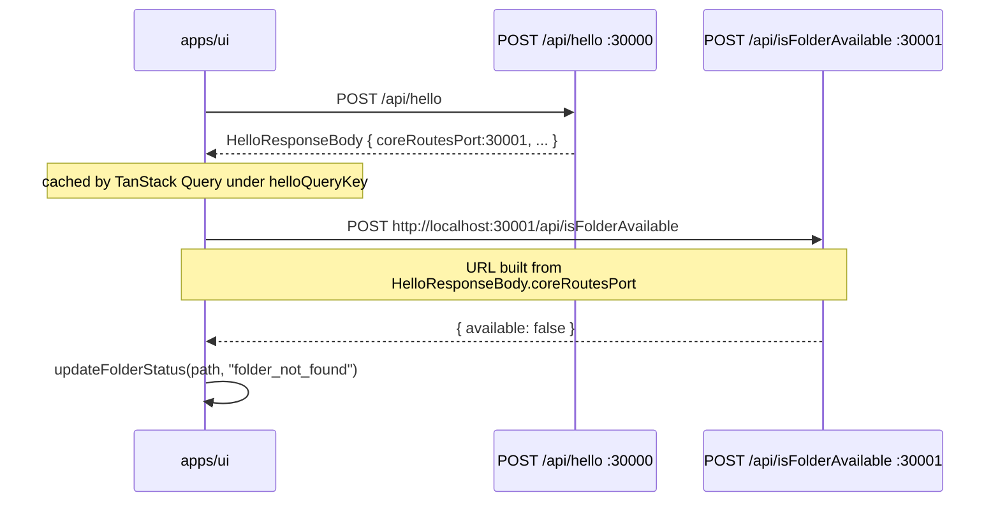
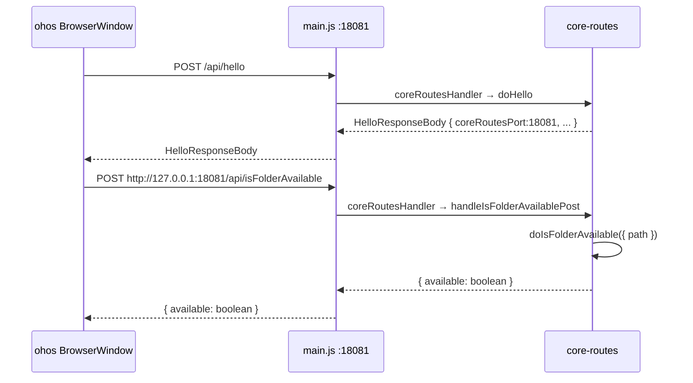

# Migrate `isFolderAvailable` API to `packages/core-routes`

Move the folder-availability check (`POST /api/isFolderAvailable`) from
`apps/cli` to `packages/core-routes` as a framework-agnostic pure
function plus a Node `http` handler. The Hono wrapper in `apps/cli`
is **removed**; the UI updates to call the core-routes port directly
using a new `coreRoutesPort` field on the hello response.

This mirrors the pattern set by the earlier hello migration
(`.agents/docs/design/migrate-hello-to-core-routes.md`), but **without**
a thin Hono shim because the route is exclusively called over HTTP and
no in-process cli consumer needs it.

[] New UI component
[] New user config
[] Electron only
[] User document

## 1. Background

`POST /api/isFolderAvailable` currently lives as a Hono route in
`apps/cli/src/route/IsFolderAvailable.ts`. It does a single `fs.stat`
call and returns `{ available: boolean }`. The UI consumes it from
`apps/ui/src/hooks/initialization/useRecheckSelectedFolderAvailability.ts`
to refresh the sidebar's `UIMediaFolder.status` when a folder is
selected (a folder that disappeared should become `folder_not_found`
rather than `ok`).

This is a perfect candidate for `packages/core-routes` because:

- The implementation is **pure Node** (`node:fs/promises.stat`) with
 no Bun/Hono dependency.
- It is needed on **every platform** that hosts the UI: the desktop
 Electron app (currently via cli port30000), the HarmonyOS Electron
 main process (currently does not expose it), and any future
 browser-only deployment.
- The logic is small (one `stat` call, no I/O orchestration) so a
 pure-function split is trivial.

`packages/core-routes` was set up exactly to host this kind of
framework-agnostic HTTP route logic. It already exposes `listFiles`,
`writeFile`, and `hello` through the "pure function + Node `http`
handler" pattern, and the Node http server on cli port30001 and ohos
port18081 auto-registers any handler appended to `coreRouteHandlers`.

This change completes the picture for the small filesystem probes:

- `apps/cli` no longer hosts the route.
- `apps/ohos` automatically gains a working `POST /api/isFolderAvailable`
 by extending the `CoreRoutesConfig` it already passes to
 `createCoreRoutesRequestHandler`.
- The UI calls the core-routes port directly using the
 `coreRoutesPort` field added to the hello response.

## 2. Project Level Architecture

`none` (refactor within the existing `cli ↔ core-routes ↔ core`
layering).

## 3. App Level Architecture

```
Before (current): After:

┌──────────────────────────┐ ┌──────────────────────────┐
│ apps/cli │ │ apps/cli │
│ ┌────────────────────┐ │ │ ┌────────────────────┐ │
│ │ Hono30000 │ │ │ │ Hono30000 │ │
│ │ POST /api/hello │ │ │ │ POST /api/hello │ │
│ │ POST /api/ │ │ │ │ (no /api/ │ │
│ │ isFolderAvailable│ │ │ │ isFolderAvailable│ │
│ │ (Hono handler) │ │ │ │ route anymore) │ │
│ └────────────────────┘ │ │ └────────────────────┘ │
│ ┌────────────────────┐ │ │ ┌────────────────────┐ │
│ │ Node http30001 │ │ │ │ Node http30001 │ │
│ │ (core-routes; │ │ │ │ (core-routes; │ │
│ │ no isFolderAvail)│ │ │ │ auto-serves /api/│ │
│ └────────────────────┘ │ │ │ isFolderAvailable│ │
└──────────────────────────┘ │ │ from doIsFolder- │ │
 │ │ Available) │ │
 │ └────────────────────┘ │
 │ coreRoutesServer passes │
 │ hello.coreRoutesPort │
 └──────────────────────────┘
 │
┌──────────────────────────┐ │
│ apps/ohos │ │
│ main.js (18081) │ ┌─────────────▼──────────────────┐
│ /api/* → core-routes │ │ apps/ohos │
│ (no isFolderAvailable │ │ main.js (18081) │
│ yet) │ │ /api/* → core-routes │
└──────────────────────────┘ │ (auto-serves /api/ │
 │ isFolderAvailable) │
 │ hello.coreRoutesPort =18081 │
 └────────────────────────────────┘
 │
 ┌────────────▼─────────────┐
 │ packages/core-routes │
 │ • doIsFolderAvailable() │ ◀── new
 │ • checkFolderPathAvail- │ ◀── new
 │ able() │
 │ • handleIsFolderAvail- │ ◀── new
 │ ablePost() │
 │ • doHello (now spreads │ ◀── adds
 │ coreRoutesPort) │ coreRoutesPort
 │ • doListFiles, etc. │
 └────────────┬─────────────┘
 │
 ┌────────────▼─────────────┐
 │ packages/core │
 │ • HelloResponseBody │ ◀── adds
 │ .coreRoutesPort │ coreRoutesPort
 │ • ... │
 └──────────────────────────┘
 │
 ┌────────────▼─────────────┐
 │ apps/ui │
 │ • hello() returns │
 │ coreRoutesPort │
 │ • isFolderAvailable() │ ◀── now reads
 │ uses coreRoutesPort │ coreRoutesPort
 │ from cached hello │
 └──────────────────────────┘
```

`apps/ui` and `packages/test` need **targeted** changes: the UI's
`isFolderAvailable` API now reads `coreRoutesPort` from the cached
hello response to build the absolute fetch URL.

## 4. User Stories

### 4.1 Desktop Electron sidebar still detects missing folders

* **Given** the Electron desktop app is running (cli port30000 +
 core-routes port30001) and the user has a media folder configured
* **When** the user selects a folder whose underlying path no longer
 exists on disk
* **Then** `useRecheckSelectedFolderAvailability` calls
 `isFolderAvailable`, which now hits
 `http://localhost:30001/api/isFolderAvailable` (the core-routes
 port, taken from the cached `HelloResponseBody.coreRoutesPort`). The
 server responds with `{ available: false }` and the UI marks the
 folder `folder_not_found`.



### 4.2 HarmonyOS Electron main process auto-serves `/api/isFolderAvailable`

* **Given** the ohos Electron main process is running on port18081
 and the renderer is loaded from the same origin
* **When** `useRecheckSelectedFolderAvailability` calls
 `isFolderAvailable(selectedFolder)`
* **Then** the UI builds an absolute URL
 `http://127.0.0.1:18081/api/isFolderAvailable` (using the
 `coreRoutesPort =18081` from the cached hello response) and
 receives the same `{ available }` shape as the desktop app does.
 No code changes beyond adding `coreRoutesPort` to the hello config
 are needed in ohos.



### 4.3 MCP `isFolderExist` tool keeps working unchanged

* **Given** the MCP server is started and a client calls the
 `isFolderExist` MCP tool
* **When** the tool executes
* **Then** it still uses `mcpTools.isFolderExist()` from
 `apps/cli/src/mcp/tools/isFolderExistTool.ts`. **This refactor does
 not touch the MCP tool.** (Out of scope; the MCP layer is a
 separate in-process API surface.)

## 5. Tasks

### 5.1 New logic in `packages/core-routes`

[x] **Task1: Add types and `doIsFolderAvailable` pure function**
 - File: `packages/core-routes/src/isFolderAvailable.ts`.
 - Export:
 ```ts
 export interface IsFolderAvailableRequestBody {
 path: string;
 }

 export interface IsFolderAvailableResponseBody {
 available: boolean;
 }

 export async function checkFolderPathAvailable(
 folderPath: string,
 ): Promise<boolean>;
 export async function doIsFolderAvailable(
 body: IsFolderAvailableRequestBody,
 ): Promise<IsFolderAvailableResponseBody>;
 ```
 - `checkFolderPathAvailable` is the raw `node:fs/promises.stat`
 helper: returns `true` iff `stat` succeeds **and** `isDirectory()`.
 Symlinks to directories count as available (Node's `stat` follows
 symlinks by default — matching the existing semantics).
 - `doIsFolderAvailable` validates the body via `zod/v3` (matching
 the cli route's existing schema: `z.object({ path: z.string().min(1) })`),
 returns `{ available: false }` on validation failure rather than
 throwing — mirrors the current cli behavior of always returning
 `{ available: boolean }` for valid JSON.
 - For **invalid JSON** the pure function throws (Node-style), and
 the Node `http` handler below maps it to a `400` response. This
 preserves the existing Hono behavior (see existing test
 `"returns400 for invalid JSON"`).

[x] **Task2: Add `handleIsFolderAvailablePost` Node `http` handler**
 - File: `packages/core-routes/src/routes/isFolderAvailableRoute.ts`.
 - Reads JSON body via `readJsonBody`, calls `doIsFolderAvailable`,
 writes the JSON response with `sendJson(res,200, result)`.
 Returns `400 { error: "Invalid JSON body" }` if JSON parsing
 fails (matches existing Hono behavior).
 - Returns `false` for any request other than `POST /api/isFolderAvailable`.
 - Export `handleIsFolderAvailablePost` from the new file.

[x] **Task3: Register `handleIsFolderAvailablePost` in `coreRouteHandlers`**
 - File: `packages/core-routes/src/register.ts`.
 - Append `handleIsFolderAvailablePost` to the `coreRouteHandlers`
 array (so it is served by both cli port30001 and ohos port18081).
 - Re-export `handleIsFolderAvailablePost` from `register.ts`
 (mirror the existing pattern).
 - Re-export `doIsFolderAvailable`, `checkFolderPathAvailable`,
 `IsFolderAvailableRequestBody`, `IsFolderAvailableResponseBody`,
 and `handleIsFolderAvailablePost` from
 `packages/core-routes/src/index.ts`.

[x] **Task4: Tests for `doIsFolderAvailable` and `checkFolderPathAvailable`**
 - File: `packages/core-routes/src/isFolderAvailable.test.ts`:
 - `checkFolderPathAvailable` returns `true` for an existing
 directory, `false` for a missing path, `false` for a regular
 file (mirrors the existing cli tests).
 - `doIsFolderAvailable` returns `{ available: true | false }` for
 the same cases and `{ available: false }` for a body missing
 `path`.
 - Extend `packages/core-routes/src/core-routes.test.ts` with a
 `requestCoreRoute` case:
 - `POST /api/isFolderAvailable` returns `200 { available: ... }`
 for an existing directory.
 - `POST /api/isFolderAvailable` returns `400` for invalid JSON.
 - `POST /api/isFolderAvailable` returns `400` for missing `path`.

### 5.2 Hello response gains `coreRoutesPort`

[x] **Task5: Extend `HelloOptions` with `coreRoutesPort`**
 - File: `packages/core-routes/src/hello.ts`.
 - Add `coreRoutesPort: number` to `HelloOptions`.
 - `doHello` already spreads options into the response, so no
 implementation change is needed beyond the type update.

[x] **Task6: Extend `HelloResponseBody` with `coreRoutesPort`**
 - File: `packages/core/types.ts`.
 - Add `coreRoutesPort: number` to the `HelloResponseBody` interface
 (with a doc comment noting: "Port that the core-routes Node `http`
 server is listening on. The UI uses this to call endpoints that
 live on core-routes (e.g. `isFolderAvailable`) when the UI's
 origin is the Hono Bun server.").

[x] **Task7: cli `coreRoutesServer.ts` reports the port**
 - File: `apps/cli/src/coreRoutesServer.ts`.
 - After `const port = parseInt(...)`, pass
 `coreRoutesPort: port` into the `HelloOptions` object built for
 `createCoreRoutesRequestHandler`.
 - No changes to `buildHelloOptions` itself — Task5 lets the
 caller pass the port inline. **Alternative**: extend
 `buildHelloOptions` to read from `process.env.CORE_ROUTES_PORT`;
 choose the inline approach to keep `buildHelloOptions` ignorant
 of transport-level concerns.

[x] **Task8: ohos `main.js` reports the port**
 - File: `apps/ohos/web_engine/src/main/resources/resfile/resources/app/main.js`.
 - In `buildHelloConfig()`, add
 `coreRoutesPort: MAIN_HTTP_PORT` (=18081).

### 5.3 `apps/cli` route removal

[x] **Task9: Delete `apps/cli/src/route/IsFolderAvailable.ts`**
 - Delete the file. No cli-in-process callers exist (verified via
 grep — the only consumer was the Hono route itself).

[x] **Task10: Delete `apps/cli/src/route/IsFolderAvailable.test.ts`**
 - Delete the file. The tests are replaced by the core-routes tests
 (Task4).

[x] **Task11: Update `apps/cli/server.ts`**
 - Remove the `import { handleIsFolderAvailable } from
 './src/route/IsFolderAvailable';` line.
 - Remove the `handleIsFolderAvailable(this.app);` call in
 `setupRoutes()`.

### 5.4 `apps/ui` updates

[x] **Task12: `isFolderAvailable` API builds absolute URL from hello data**
 - File: `apps/ui/src/api/isFolderAvailable.ts`.
 - Change the signature so the caller supplies the port (or
 alternatively, accept an optional `coreRoutesPort` argument).
 Implementation sketch:
 ```ts
 export async function isFolderAvailable(
 path: string,
 coreRoutesPort: number,
 signal?: AbortSignal,
 ): Promise<boolean> {
 const resp = await fetch(
 `http://localhost:${coreRoutesPort}/api/isFolderAvailable`,
 { method: "POST", headers: { "Content-Type": "application/json" },
 body: JSON.stringify({ path }), signal },
 );
 if (!resp.ok) {
 throw new Error(`isFolderAvailable: HTTP ${resp.status} ${resp.statusText}`);
 }
 const data = (await resp.json()) as IsFolderAvailableResponseBody;
 return data.available;
 }
 ```
 - On ohos the host is `127.0.0.1`, on desktop cli it is `localhost`.
 For simplicity, hardcode `http://localhost:${port}/...` — the
 Electron renderer resolves `localhost` on both hosts. (Verified
 by the existing reverse-proxy and `useTmdbQueries` flow which
 similarly uses `localhost` against the cli port.) If a
 difference surfaces during testing, parameterize on a `host`
 field of `HelloResponseBody` in a follow-up.

[x] **Task13: `useRecheckSelectedFolderAvailability` reads `coreRoutesPort` from cache**
 - File: `apps/ui/src/hooks/initialization/useRecheckSelectedFolderAvailability.ts`.
 - Use `queryClient.getQueryData<HelloResponseBody>(helloQueryKey)?.coreRoutesPort`
 (mirrors the existing pattern in `useTmdbQueries.ts` for
 `reverseProxyUrl`). If the port is missing (e.g. before hello
 has loaded), **do nothing** — `useHelloQuery` is `enabled: false`
 but is populated during bootstrap before
 `useRecheckSelectedFolderAvailability` first runs (verified by
 tracing `AppInitializer` → `useReloadAppConfig` → `hello()` →
 `queryClient.setQueryData(helloQueryKey, ...)`).

[x] **Task14: Update `UIMediaFolderStoreInitializer.test.tsx` mocks**
 - File: `apps/ui/src/components/initialization/UIMediaFolderStoreInitializer.test.tsx`.
 - Add `coreRoutesPort:3001` (or a stub) to the mocked
 `HelloResponseBody` in existing tests; if any test currently
 mocks `isFolderAvailable`, update its signature to pass the new
 port argument.

### 5.5 No-op

- `apps/cli/src/mcp/tools/isFolderExistTool.ts` and the underlying
 `mcpTools.isFolderExist` are **not modified**. The MCP layer is a
 separate in-process API surface.
- `packages/test` is **not modified** (it has no `isFolderAvailable`
 helper).
- `apps/electron` main process is **not modified** (it spawns cli and
 routes via the webContents; nothing in main.ts/ipc touches
 `isFolderAvailable`).

## 6. Backward Compatibility

- `POST /api/isFolderAvailable` keeps the same request body
 (`{ path: string }`) and response shape (`{ available: boolean }`).
 HTTP status codes match: `200` for valid bodies, `400` for invalid
 JSON or missing `path`.
- `HelloResponseBody` gains a new required field `coreRoutesPort`.
 Existing consumers that read individual fields (`userDataDir`,
 `reverseProxyUrl`, etc.) are unaffected because they use optional
 chaining on the fields they care about (`?.reverseProxyUrl`).
 TypeScript may surface a missing-field error if a test constructs
 a `HelloResponseBody` literal without `coreRoutesPort` — Task14
 fixes the only such test in this repo.
- The Hono `POST /api/isFolderAvailable` route on cli port30000 is
 removed. There are **no remaining callers** on port30000 because
 the only consumer was the UI (which is updated in Task12–13 to
 call port30001).
- The MCP `isFolderExist` tool is untouched and continues to work.

## 7. Documents

- [x] `docs/api/IsFolderAvailableAPI.md` — change "Implementation"
 from `apps/cli/src/route/IsFolderAvailable.ts` to
 `packages/core-routes/src/isFolderAvailable.ts` (and the Node
 `http` handler in `packages/core-routes/src/routes/isFolderAvailableRoute.ts`).
 Add a note that the route is now served by the core-routes
 Node `http` server (port30001 on cli,18081 on ohos), and the
 UI uses `HelloResponseBody.coreRoutesPort` to discover the
 port.
- [x] `docs/api/index.md` — change the "Source Code" line for
 `isFolderAvailable`.
- [x] `.agents/docs/design/core-routes.md` — extend the route table
 with `POST /api/isFolderAvailable → handleIsFolderAvailablePost`.
- [x] `.agents/docs/design/migrate-hello-to-core-routes.md` — add a
 follow-up note at the top:
 "The hello response now includes `coreRoutesPort` so the UI
 can call non-hello endpoints on the core-routes Node server
 directly. See
 `.agents/docs/design/migrate-isFolderAvailable-to-core-routes.md`."

## 8. Post Verification

- [x] `pnpm --filter @smm/core-routes test` — new isFolderAvailable
 tests pass; existing tests still pass.
- [x] `pnpm --filter cli test` — the cli route test is deleted;
 no other cli test references `isFolderAvailable`; remaining
 tests pass.
- [x] `pnpm --filter ui test` — `UIMediaFolderStoreInitializer.test.tsx`
 still passes after the `coreRoutesPort` mock update.
- [x] `pnpm --filter @smm/core-routes typecheck`,
 `pnpm --filter cli typecheck`, `pnpm --filter ui typecheck`.
- [ ] `pnpm typecheck` (root) — no new errors. *(Out of scope: pre-existing typecheck errors in `apps/cli` unrelated to this change; see the `run-cli-typecheck-changes.sh` filter output which is clean.)*
- [x] `pnpm --filter @smm/core-routes build` — produces
 `dist/core-routes.js` with the new isFolderAvailable code; the
 ohos prebuild (`build:ohos`) also picks it up.
- [ ] Manual smoke (cli): `pnpm dev:cli` then
 `curl -X POST http://localhost:30001/api/isFolderAvailable -H
 "Content-Type: application/json" -d '{"path":"/tmp"}'`
 → `{"available":true}`.
 Then `curl -X POST http://localhost:30000/api/isFolderAvailable`
 → `404` (confirming the Hono route is gone).
- [ ] Manual smoke (ui): load the desktop app, select a folder
 whose path was deleted from disk; sidebar status flips to
 `folder_not_found` (no console error from the fetch).
- [ ] Manual smoke (ohos): build ohos app, launch, devtools; in the
 renderer console, run `await fetch('http://127.0.0.1:18081/api/isFolderAvailable', { method: 'POST', headers: { 'Content-Type': 'application/json' }, body: JSON.stringify({ path: '/' }) })`.
 Should resolve to `{ available: true }`.
